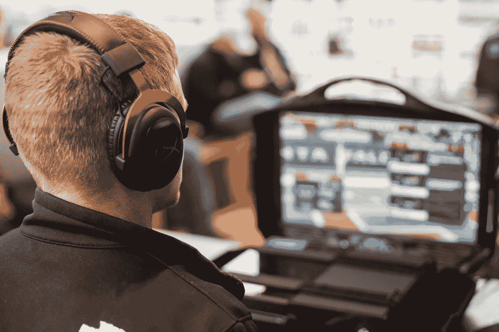

# 区块链如何带来电子竞技的新时代

> 原文：<https://medium.com/hackernoon/how-blockchain-is-bringing-in-the-new-era-of-esports-55ee78aed988>

image source: [Unsplash](https://unsplash.com/)

“你不觉得有趣吗？”在雷德利·斯科特 2000 年的电影《角斗士》中，由将军变身为角斗士的马克西姆斯问道。这个故事展示了自古以来游戏是如何为大众提供娱乐的。我们喜欢竞争，喜欢看别人竞争。

诚然，我们不再被我们的人类同胞自相残杀所娱乐，谢天谢地，这些日子以来，这种活动仅限于视频游戏的虚拟世界。

电脑游戏目前有 22 亿人受其控制，并且是游戏本身之外的创新前沿，T2 的电子竞技世界正以 T4 的爆炸性速度增长。

## **为什么电子竞技会蓬勃发展**

目前约有 10%的游戏玩家参与电子竞技，因此有很大的进一步增长空间，特别是在亚洲，电子竞技越来越受欢迎。事实上，电子竞技行业正以每年 33%的速度增长，预计电子竞技观众将在 2018 年观看 66 亿小时的视频，并且像 Twitch 这样的服务越来越受欢迎。

电子竞技迅速流行的最明显的原因是有钱可赚。根据 new zoo 2017 年关于该行业的报告，游戏行业创造了 1090 亿美元的收入，其中电子竞技占不到 1%。从百分比来看，1%可能看起来很小，但在一个新兴的场景中，玩家通常不期望在玩他们喜欢的游戏时获得奖励，这大约值 7.2 亿美元。随着越来越多的人听说电子竞技以及电子竞技可以赚到的钱，越来越多的人加入进来..

收入明细显示，大约有 4000 万美元用于玩家补偿，1 亿美元用于奖金，这对于狂热的游戏玩家来说是一个巨大的激励，让他们考虑如何从自己的技能中赚钱。

对于那些发现很难在你最喜欢的游戏排行榜上取得进展的人来说，为什么不通过成为观众来看看游戏的大师们是如何玩的呢？

从首尔到上海，以及在美国和欧洲越来越多的地方，竞技场和体育馆都挤满了观看最精彩对决的电玩迷。

即时战略(RTS)、第一人称射击游戏(FPS)和多人在线对战竞技场(MOBA)等领先的游戏类型都非常适合电子竞技，其中 MOBA 最受欢迎，占观看时间的 [58%。再往下钻，团队游戏正在赢得追随者，许多顶级游戏为协作游戏提供了完美的空间。](https://www.statista.com/statistics/533104/share-esports-viewing-time-twitch-worldwide-genre/)[英雄联盟](https://venturebeat.com/2018/04/14/riot-games-moves-to-establish-league-of-legends-as-a-lasting-esport/)，Dota2，守望先锋和反恐精英都是特别喜欢的。

最有远见的游戏工作室注意到了，上面提到的游戏现在包括了一个观众模式和支持。

## **建设基础设施，人群就会到来**

建立一个团队并管理它并不那么简单，因为这个行业太新了。

如何为一个团队找到球员，决定参加哪些比赛，聘请教练或组织练习赛？有很多要考虑的。

此外，一旦你组织了一个团队，现在必须对其进行管理。专业的运动需要专业的管理。就像棒球或任何其他职业运动一样，一个团队需要被指导，比赛需要被分解和分析，团队本身需要不断地用新的人才更新**，**这是甚至在开始这个行业的商业方面之前。

欺诈是一个持续的问题，没有统一的联赛，转会窗口，球员工会，以及很少的俱乐部，区块链科技提供了一种有效的方式来克服这些障碍。

## 区块链作为解决方案

区块链一家名为 [DreamTeam](https://token.dreamteam.gg/) 的初创公司旨在通过将团队可能需要的所有资源和工具以及赞助商和游戏开发商等行业的其他方面集中在一个屋檐下，建立一个分散的平台来管理团队的竞争需求，并首先启动这个平台。对于许多人来说，能够在一个地方管理奖金分配、球员转会、媒体权利管理、广告和赞助以及球队本身的管理无疑是一个吸引力。

梦之队的愿景是将该平台视为一个行业不同部门可以联系的地方，业余爱好者可以渴望并学习如何成为专业人士，使那些刚刚起步的人更容易进入下一个阶段。

从去年年底推出的测试版[的成功来看，这种方法似乎正在发挥作用。该平台已经拥有 25 万用户，并以每周 36%的速度增长。目前，大多数用户位于美国、欧洲和独立国家联合体(前苏联),其目标是进军亚洲。](https://dreamteam.gg/)

他们已经筹集了 600 万美元的预售资金，一家大型风险投资公司[红树林资本](https://www.accesswire.com/495911/Major-VC-Firm-Mangrove-Invests-In-eSports-Blockchain-Startup-DreamTeam)也对他们进行了投资。目前，他们正处于 tokensale 阶段，随着测试版产品的不断推出，DreamTeam 似乎已经做好了取得成功的准备。

由[金恩](https://enjincoin.io/)去年发起的另一个项目是部署区块链技术，专注于皮肤和其他虚拟物品的创建、购买和销售，这是游戏世界中越来越受欢迎的活动。

金恩还允许游戏玩家将他们最喜欢的游戏平台列为金恩智能钱包中的“可信平台”，在这里可以交易各种游戏代币。智能钱包与用户的以太坊地址同步，底层智能合约由金恩硬币(ENJ)支持。金恩智能钱包也可以导入该初创公司 1 月份发布的成熟的移动加密钱包，该钱包被混淆地称为数字智能钱包。手机钱包因其实施了双层加密方法而受到好评，并允许用户存储大量顶级硬币，包括比特币、莱特币和所有 ERC-20 代币。

另一个电子竞技项目是 [Unikrn](https://unikrn.com/) ，它早在 2014 年就开始了它的使命，重点关注博彩，但此后一直在寻求扩大其足迹，以抓住更广泛的电子竞技生态系统中的机会。它最近与 ChallengeMe 签署了一项协议。GG 是一家总部位于德国的初创公司，提供配对服务，正如我们在 DreamTeam 中看到的那样，如果一家公司希望其游戏平台取得成功，这是一个关键因素。

毫无疑问，随着这项全新运动的发展，电子竞技将会有更多分散化的解决方案。

电子竞技依靠尖端技术生存，因此，鉴于这种血统，看到该行业处于区块链发展的前沿并不令人惊讶。这是一个令人兴奋的舞台，各种游戏作为发达经济体中首要的娱乐形式已经超过了电影业，并且还有许多令人兴奋的发展有待实现。