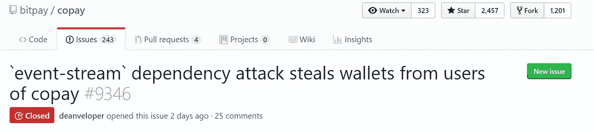
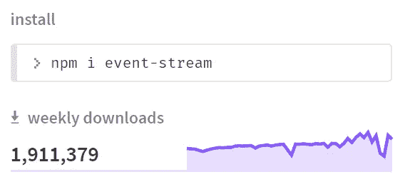
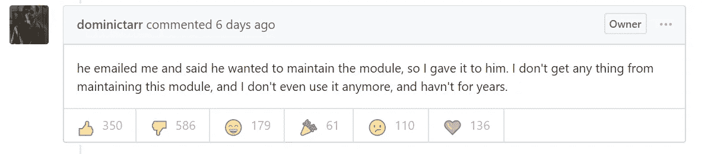
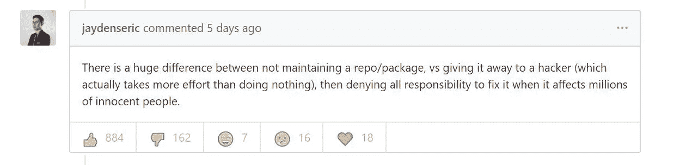
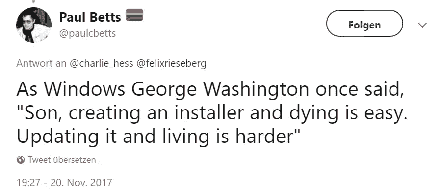
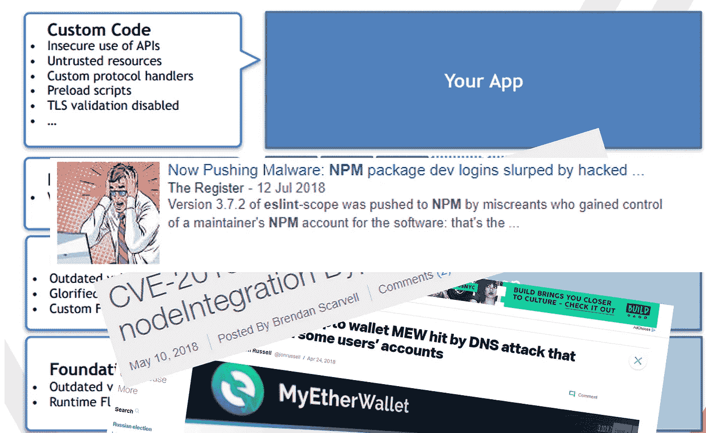
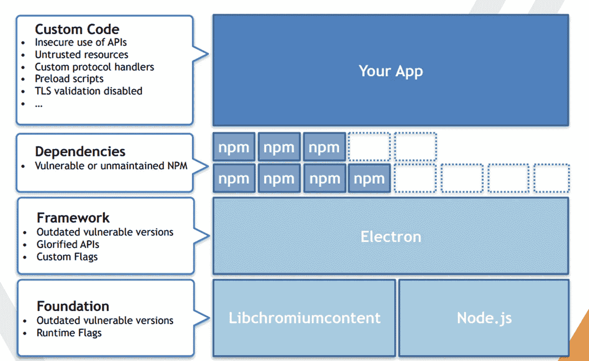

# 区块链如何修复 Node.js 生态系统

> 原文：<https://medium.com/hackernoon/how-blockchain-technology-could-fix-the-node-js-ecosystem-bccc60832900>

对于每个从事 Web 或节点应用程序工作的人来说，噩梦可能是这样的:

媒体很快发现了这个故事，现在有一个关于加密和安全以及 JavaScript 的巨大丑闻——完美的配方。不仅如此:这个丑闻从根本上质疑了我们用 Node.js 构建(开源)软件的方式。

> TL；速度三角形定位法(dead reckoning)
> 
> NPM 模块应该是多重签名的。证书和信任模型应该在区块链上处理。开源开发者签署软件包，并根据他们对付费软件的贡献获得分成。加密支付和智能合约使这成为可能并自动处理。新维护者=潜在黑客不授予发布权，只授予反签权。模块管理器中的自动签名验证检查可以确定未知/不可信的新签名，并根据规则和单个威胁模型接受或拒绝更新。这样的模块可以以更有针对性的方式进行审计。

免责声明:观点是我自己的，而不是我雇主的观点

# 那么到底发生了什么？

我们在 GitHub 和 NPM 的[事件流库中找到了答案:](https://github.com/dominictarr/event-stream)

7 年前，开发人员 dominictarr(出于好意)创建了一个名为“event-stream”的 NPM 模块，“这是一个使创建和使用流变得容易的工具包”。该模块非常成功，获得了《2M 周刊》的下载量:

82 版本之后或者两个月前最新版本 4.0.1 发布了。但是一个名叫 [@right9ctrl](https://github.com/right9ctrl) 的黑客代替了 dominictarr 发表了这篇文章。它的目的不是“让创建和使用流变得容易”，而是“窃取你的加密货币”。因为没有人会自愿使用这样的模块，所以他们加密了代码，劫持了事件流模块的信任和品牌，将恶意代码偷偷带入数百万个其他项目安装中。

那么他们是如何进入 NPM 官方事件流账户的呢？他们侵入账户了吗？他们有没有使用社会工程，他们有没有勒索 dominictarr，或者他甚至在枪口下被迫给出凭证？..

**没有，黑客只是通过电子邮件索要。这显然足以获得《2M 周刊》的全部出版权(或每年 1.12 亿部)!**

很多开发者都是 pi..因为他们被轻率地置于危险之中，他们的用户被置于危险之中，人们已经或将来会失去他们的钱而感到不安:

在外界的巨大压力下，最初的开发者[在两天前发布了一份官方声明](https://gist.github.com/dominictarr/9fd9c1024c94592bc7268d36b8d83b3a)，提出了一些非常有效的观点:

> 嘿各位——这不仅仅是一次性的事情，在你们的依赖树中可能有*许多*其他模块现在对它们的作者来说是一个负担。我并不是出于利他动机而编写这个代码，我编写它是为了好玩。[…]
> 
> 如果它不再有趣，你从维护一个流行的包中什么也得不到。[…]
> 
> 所以现在，我们处在一个奇怪的山谷中，你有一堆依赖，这些依赖是由失去兴趣的人“维持”的，或者甚至开始倦怠，*他们不再使用他们自己*。
> 
> 我认为这个问题有两个强有力的解决方案…
> 
> **1。)支付维护人员！！只依赖于你知道肯定被维护的模块！**
> 
> **2。)当你依赖某样东西时，你应该参与维护它。**

# 开放源码

我还没有看到一个行业像软件领域那样，免费工作和免费提供你的大量工作是如此普遍的做法。

开源开发者经常是为了“乐趣”或者他们想要“回馈”，因为他们知道如果没有开源软件，我们就不会有今天。然而，我们对这些项目的责任和期望与我们对付费软件的责任和期望是一样的。开发人员和维护人员经常因为没有“完成他们的工作”或者没有“及时”响应而受到骚扰。但是我们忘记了，这些开发人员中的大多数都按照他们自己的时间表工作，如果你有一份主要的工作，想要和家人一起生活，或者有一个不写代码的爱好，那么“及时”是不存在的。经常被遗忘的是，他们并不欠任何人任何东西:`npm install cat-ascii-faces --save`不包括以此“购买”要求终身维护服务的权利。

# (恶意)更新

维护是困难的，一旦使用统计数据或付款下降，就停止一个项目要比为一个垂死产品的最后成百上千的铁杆粉丝提供优质服务容易得多。现在每个人都应该清楚，这些中断的项目正在成为一个巨大的安全问题。

引用电子核心开发人员之一保罗·贝茨的话:

获得正确的更新是非常困难的，对于钱包使用的电子框架来说更是如此，在这种情况下受到攻击。

具有讽刺意味的是，Electron 本身也有一个严重的依赖问题，例如一年前的 Chromium，在 1.8 等早期版本中公开记录了漏洞。许多依赖这些旧电子版本的应用程序仅仅因为安装了而**没有更新它**就将数百万用户置于危险之中。

电子的另一个问题以及攻击如此有针对性的原因是，在电子中运行的恶意代码升级为完全远程代码执行攻击(RCE)。在这种情况下，代码拥有对文件系统的完全访问权限，可以读取密钥文件并将它们发送到吉隆坡的服务器(这在攻击中确实发生过)。使用 Node.js 和 Electron 可以进行`fs`和`net`访问，但在传统的沙盒 web 环境中会受到更多限制，因为恶意的 NPM 模块已经够糟糕了。在加密钱包的情况下，注入的代码拥有完整的主机系统，就好像黑客坐在它的前面，可以完全访问键盘、鼠标、文件系统、照相机，..如果我们考虑加密钱包，攻击不仅仅是有利可图的。我们看到的攻击场景不仅限于窃取密码。

因此，我们面临以下困境:我们需要频繁的更新来修补现有的安全漏洞，但过于频繁的更新无法得到有效的监控，并且每个更新都可能包含恶意代码。这意味着即使我们经常更新我们的软件(这是我们应该做的！)是什么阻止了恶意的 NPM 软件包潜入应用程序的代码库并控制我们的机器？

# NPM 模块安全性

本月早些时候，我在以太坊敌无双第四届会议上做了一个关于浏览器和钱包安全的报告。我的幻灯片中有一张讨论了基于电子应用的攻击媒介和以往成功的攻击。

这张幻灯片基于令人敬畏的 blackhat 演示[“电负性”](https://doyensec.com/resources/us-17-Carettoni-Electronegativity-A-Study-Of-Electron-Security.pdf)和 Luca Carettoni 的威胁模型:

NPM 模块打开了一个巨大的攻击面，我在 3 周前讨论并警告过观众，当时我并不知道另一个类似的攻击正在发生。NPM 或依赖安全性对于 Electron 或 Node.js 来说并不是一个特定的问题(尽管它在那里要糟糕得多)。这也不是新的或未知的，因为我从你的网站收集信用卡号码和密码。下面是方法”。但是我们将来可能会看到更多这样的攻击。

不幸的是，这些攻击不会被新的`audit`功能解决。这些问题不会因为 GitHub 上更好的反病毒集成、版本锁定、人工智能、漏洞检查和标记而得到解决。尽管这些事情是一个巨大的进步，表明我们终于觉醒了，并更加意识到我们的安全问题。

# 那么我们如何修复我们的生态系统呢？

多米尼克·塔尔在他发布的声明中写道:

> 开源是由共享驱动的！太棒了！在比特币流行起来之前，它确实运转得很好

有趣的是，我认为区块链技术不是问题，而是解决方案，我们需要两样东西来创造一个更好的生态系统:

1.)我们需要一种更简单的方式，根据某些规则自动向开源开发者分发支付(大声喊出来 [Gitcoin](https://gitcoin.co/)

2.)代码和模块需要多重签名，证书应该廉价且易于验证

这两样东西传统上都很难，但通过使用“区块链技术”的最新进展，我们几乎可以免费得到它们。

那么，我们该如何避免区块链**的上述情况呢？**

**比方说，我们有一个项目，使用开源模块，并有加密的应用内支付。**

**我们的一个依赖项可能会变成一个恶意的包，就像我们在事件流中看到的那样。但是，最初的开发人员并没有给新的合作者完全的维护或完全的发布权，而是给新的维护者或 CI 系统仅签名权。因此，他们会签署他们的新闻稿，并在仔细审查后，原作者会签声明，他检查并批准这些变化。**

**后来，如果我们的虚构项目收到了应用内付款，运行时环境中可能会有一些逻辑，根据这个开源模块对我们项目的影响或贡献，自动将每笔付款的几分钱分发给作者，作者可以根据证书来确定。每年有 1.12 亿次下载，这些美分可以累积成更大的数量，实际上激励了流行和有用项目的维护。**

**[随着每一次发布和额外的签名，新作者当然会对他们自己的签名获得更多的信任。如果某些东西被审计和标记，它可能会被罚款等等]**

**虽然这听起来有点未来派，但我们今天就可以拥有它，我们应该努力尽快实现。**

**其他项目已经建议基于 PGP 密钥的[签名模块](/redpoint/introducing-pkgsign-package-signing-and-verification-for-npm-5b833e0ec2d4)和模块级代码签名听起来像是合乎逻辑的下一步。我们应该采用在许多其他软件部门已经很普遍的做法。我们还看到，为加密钱包的安装程序签名并不能为包含的代码提供任何保证，因此是**几乎完全无用的。****

**我很肯定还有更多改进的想法，但是模块签名和自动处理的微支付有望很快成为一件常见的事情，并帮助生态系统创建更高质量的代码，并帮助激励更多的开源开发者做出贡献，因为我们非常需要它们。**

## ****根据我收到的一些反馈，我想为那些对这个话题感兴趣的人分享另一篇文章和一个伟大的项目:****

** [## Skantek:保护 Adyen 的节点

### Adyen 高级前端开发人员凯特·奇尔顿

medium.com](/adyen/skantek-securing-nodejs-at-adyen-f944283ce7c9)**