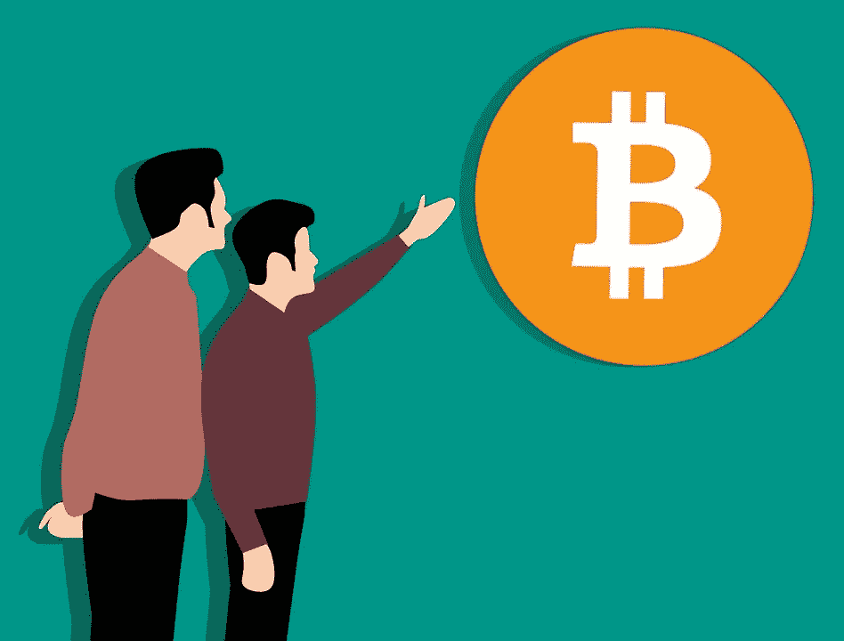

# 区块链技术将如何影响当前的移动趋势

> 原文：<https://medium.com/hackernoon/how-blockchain-technology-will-affect-current-mobile-trends-417c618ab9a5>

现在，移动应用程序开发已经与区块链技术和区块链开发交织在一起，对当前趋势的影响已经显而易见。移动运动将会改变未来的世界。区块链技术和区块链开发是这个等式的关键部分。

有些人可能认为区块链技术和区块链的发展与移动应用开发者的进步没有什么关系。这是一个普遍的观点，但这并不能改变它明显错误的事实。这两个领域的联系比大多数人意识到的更加紧密。

要想了解更多关于区块链技术和区块链发展将在未来影响移动应用的方式，一切都要从尽可能多地了解当前趋势开始。让我们仔细看看来自[区块链开发公司](https://www.hyperlinkinfosystem.com/blockchain-development.htm)的移动应用开发者和这些应用的用户的当前趋势。

## 移动应用发展趋势

移动应用开发者正被迫越来越努力地工作，以获得与他们习惯的投资回报相同的回报。有这么多公司争夺同样的一美元，很难找到一个真正有利可图的利基市场。应用程序开发人员社区已经注意到了这一趋势，并试图对他们的流程进行适当的更改。

**缺乏用户忠诚度**

随着可用选项数量的增加，用户保留量会减少。普通客户不再像以前那样感到忠诚，这导致了更快的决策过程。这些过程往往不利于移动应用开发者，而且在最初的热情消退后，很难找到让消费者保持兴趣的方法。

**赚钱机会正在消失**

希望通过更高的广告量来弥补收入损失的应用程序开发者和企业，将自己置于一个充满挑战的境地。在不损害用户体验的情况下，选择适当数量的广告来获得更大的赚钱机会并不容易。这是企业和应用程序开发者必须考虑的最困难的事情之一。

## 用户相关的趋势是什么？

**在 App 购买中**

既然应用程序用户在购买应用程序时已经形成了更多的“老派”心态，这是开发者需要考虑的事情。用户希望使用信用卡进行应用内购物，并对额外的选择有些担心。

**点对点交易**

这是区块链技术和区块链发展将发挥作用的主要领域之一。现代消费者需要进行对等交易的能力，无论他们是想在他们最喜欢的餐馆分享支票还是参与股票市场交易。

## 区块链技术和区块链发展将如何改变未来？

随着区块链技术变得越来越普遍，应用程序开发人员的机会也将继续增长。希望购买应用程序并进行点对点交易的用户必须能够无所畏惧地执行这些任务。

这也是区块链发展在未来几年变得越来越重要的地方。交易不再在传统的实体场所进行。有一天，我们所有的交易都可能通过电话或使用可穿戴技术配件进行。

## 区块链开发在工作中有哪些例子？

**社交应用激励计划**

社交应用可以将区块链作为回报用户的一种方式。让我们说，应用程序正在寻找方法，为他们的用户提供急需的激励，以分享和推广他们的业务。感谢区块链，他们现在有机会这样做，而不会将这些用户置于风险之中。

加密货币硬币在应用程序本身内奖励给用户，这使得用户在以后的应用程序购买中更容易。在某些情况下，硬币可以在其他应用程序中使用，或者用户可以将它们转换成法定货币。

**更好的游戏体验**

例如，当用户正在玩角色扮演游戏时，他们可能会使用应用程序来帮助他们。这些游戏可能很有趣，但也可能需要进行某些交易。正在寻找允许安全交易的游戏应用程序的玩家更有可能下载受区块链技术保护的应用程序。

玩家经常会从其他玩家那里购买游戏，这就是对等交易保护的重要性。随着区块链开发的使用，这些交易现在可以以一种对玩家和负责应用程序创建的企业同样有利的方式进行。

**品牌推广机会**

在一个企业不断寻找更好的品牌机会的世界里，区块链技术在数字广告方面只会发挥更大的作用。企业现在可以创造自己的货币，并以他们认为合适的方式奖励他们的客户。

这使得企业能够创造一些绝不能错过的品牌机会。品牌加密令牌可以作为继续与他们购物的激励，而不是等待客户购买一定数量的商品后再向他们提供奖励。

既然顾客不会像以前那样频繁地光顾实体店，像这样的计划就显得更加重要了。毕竟，像这样的品牌机会很少出现。