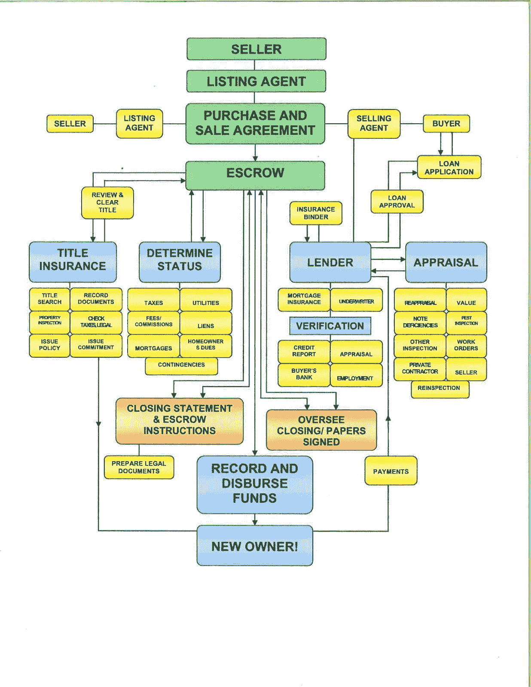
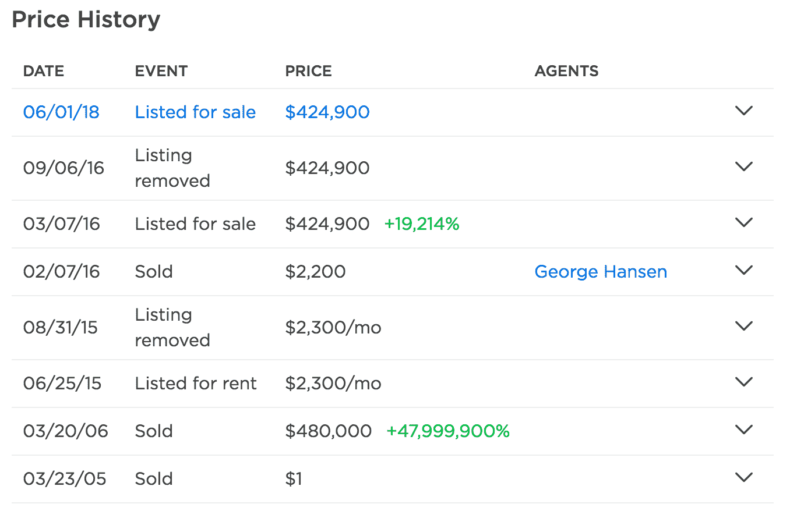

# 区块链将如何影响住房市场——更便捷的用户体验

> 原文：<https://medium.com/hackernoon/how-blockchain-will-affect-the-housing-market-easier-user-experience-4cac03c581d5>

房地产行业存在一些壁垒，迫使买卖双方都支付费用，这很快就会成为过去。整个数十亿美元的产业很快将被颠覆，并被迫接受一个新的房地产时代。

# 新时代

旧金山等美国地区正遭受住房危机。[这篇文章](https://www.paragon-re.com/trend/3-recessions-2-bubbles-and-a-baby)解释了湾区正在发生的一些问题。

> 主要问题是，与普通人的工资相比，房价正在飙升。

使得普通人越来越难拥有自己的房子。目前的房地产行业有多个行业，迫使消费者支付不公平的费用。

通过创造新的流程从根本上改变业务运作方式，可能会催生房地产行业最不可思议的牛市。区块链领域的新工具和发展将修复整个行业不太理想的方面。

我想感受一下专家对他们特定行业变化的看法。

## 米歇尔凭证:

全国排名前 1%的房地产经纪人。
Signature Realty 创始人。
“最具影响力的 100 家房产中介”。

这是[米歇尔·派斯](https://michellepaisgroup.com/)所说的话。

> “购买房产对任何人来说都是一件大事。人们想要一个可以称之为家的地方。每个房产都有一个故事，在公共账本上看到该房产的寿命将会改变房地产的游戏规则。”

# 买房对消费者来说并不友好

如果你想卖掉你的房子，有很多行业会吸取房地产交易方式的缺点。

在上图中，你可以看到这笔钱是托管的。托管通常是一种合同协议，允许第三方根据合同协议中给出的情况持有、接收和分配资金。

该图描述了一个称为“产权保险”的部分。这些冠名机构为每个人提供了糟糕的用户体验，并收取高昂的费用来完成简单的任务，这些任务将由于公共账本而自动化。

基本产权代理机构向其客户提供以下服务:

1.  初始请求—开始托管流程。这通常由买方律师完成。
2.  记录搜索—产权官员请求三次记录搜索，包括*姓名搜索*、*财产搜索*和*税务搜索。*
3.  产权审查——房屋产权和历史的详细报告。
4.  约束/承诺——这是关于保险金额的书面规范，确定了所有权转移期间的承保方、条款、条件和限制。
5.  侵犯许可——侵犯被定义为对一个人的领土的侵犯，在房地产中，这可能是对财产的无偿判决。
6.  交付保单——为了完成财产的交割，保险公司将向适当的各方，包括买方、贷款人和卖方，签发保单。

# 区块链房地产基础知识

为了让你理解为什么整个产权代理业务会被打乱，你需要对智能合同、公共分类账有一个基本的了解。

# 智能合同

智能合约可以应用于任何类型的交易，并允许在分配资金之前满足预先限定条件。

简单来说，你可以用 solidity 中的条件逻辑或另一种类似的 web3 语言编写自己的托管代码。

智能合约是未来的托管。智能合同中涉及唯一费用通常是网络费用。这些网络费用取决于正在使用的区块链，但很少，旨在支持不同的证明，避免网络垃圾邮件和类似 DDOS 的攻击。

# 公共分类账

在当前的房地产元中，只有某些人可以访问集中式分类账，而不是类似以太网的分散式公共分类账。

zillow 的价格历史部分就是一个例子。

对于顾客来说，跳上 zillow，感受他们家的历史，这是一个很好的体验。这个问题是 zillow 拥有这些数据，而这些数据应该属于拥有这些财产的人。

网上与你家有关的财产应该属于你。像 IPFS 这样的协议允许数据与特定的散列相关联。该散列是区块链联邦理工学院中的唯一标识符。

# 这一切对普通业主来说意味着什么？

对那些不了解区块链、房地产费用或这将如何帮助你的人来说。我们将进入一个新的房地产时代。一个更加用户友好的体验，允许人们拥有自己的家，并拥有它的所有方面。无论是线上还是线下。

区块链的未来将瓦解所有中介机构，比如产权公司和托管机构。去除买房过程中的这一环节将会简化一切，从而提升买卖体验。

# 解决方案

作为消费者，我们面临的主要问题是房地产交易中记录保存和托管过程中的不公平费用。智能合同和公共账本将很快解决这个问题，让这些产权公司以免费和更公开的方式做所有事情，让房主也可以拥有自己的数据。如果没有小企业从房地产行业中榨取利润，消费者将比以往任何时候都更有权力，并将使整个行业蓬勃发展。