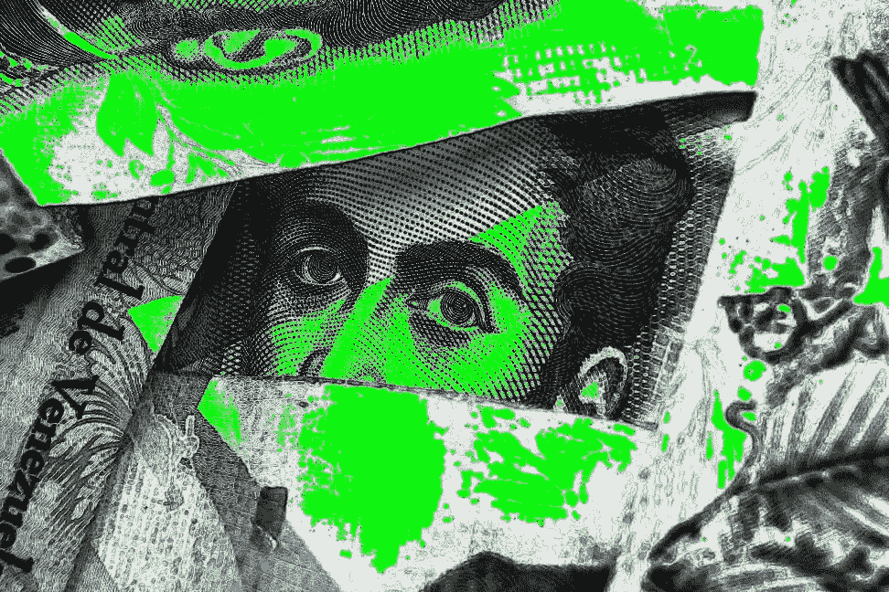

# 区块链将如何改变共享经济

> 原文：<https://medium.com/hackernoon/how-blockchain-will-change-the-sharing-economy-1ecbc77abb0>

> 由《编年史》(2015 年至今)的联合创始人萨曼莎·拉多奇亚撰写。[原载](https://www.quora.com/How-will-blockchain-change-the-economy/answer/Samantha-Radocchia)于 [Quora](http://quora.com/?ref=hackernoon) 。

想想过去十年共享经济是如何爆发的。如果你开着优步去机场，或者租了 Airbnb，你就已经是它的一部分了。

我们甚至已经到了出租个人物品是一种可行的商业模式的地步。例如，Omni Storage 就像普通的仓储公司一样储存你不用的物品，但他们也会将你的物品出租给别人。滑雪板，吉他，冬季夹克。这一切都可以通过一个应用程序出租(在所有者的许可下)。

我们都持有某些财产，因为我们计划最终使用它们。或者我们这样告诉自己。为什么不从我们的东西上赚点钱，而不是让它闲置着呢？

这个问题是共享经济的核心，在接下来的几年里，我们将会听到更多关于 Omni 这样的企业。

如果区块链参与进来，这可能会是什么样子。

# **改变数值**

只有考虑到其他许多因素，未来的共享概念才会起作用。

每一件物品都必须被记录在案，被证明是真实的，被赋予当前价值，甚至被保险。区块链在这里非常有用。

假设我在区块链注册了一把吉他。从理论上讲，我可以获得它在哪里的信息，以及它目前的价值和状况。

这并不像你想象的那样牵强。七年前，我的一个朋友给我发了一份商业计划书，内容是关于一个允许人们出租自己艺术作品的平台。现在回想起来很有趣，因为我们实际上已经到了这样一个概念成为可能的时候了。而租房或租赁只是其中的一部分。

想象一下在区块链之上的整个艺术经济，个人可以拥有作品的一部分。

我们有能力将微芯片贴在物品上，并在区块链上注册，这使得人们可以租用一件昂贵的艺术品，并在他们的办公室里保存几年。这仅仅意味着分配正确的值。更进一步，一旦我们在实物资产和艺术品的数字化表征之间建立了联系，买家和卖家就可以投资一小部分艺术品所有者。一个米开朗基罗。

# **推卸责任**

随着这种租赁系统而来的是一个不可避免的问题:如果你的东西出了什么问题怎么办？

出租一把你每年弹奏一次的吉他听起来是个不错的交易，但是如果它坏了或者丢失了呢？你需要先买保险才能安心。

几年前我们确实考虑过这个问题。我们和一些人交谈，他们为电影制作人搭建了一个出租电影设备的平台。但是电影设备非常昂贵——一个镜头可能要 10，000 美元。获得保险并不总是一个简单的过程。

因此，我们建立了一个概念验证，允许人们验证高价值资产，在它们上面放置一个微芯片，并在区块链上注册。这是其真实性记录和关于其状况的数据之间的联系。通过手机应用程序，你可以在上面快速购买保险。

要这么快地为一件商品购买保险，你需要有关于它是什么、它的成本以及它的状况的可用数据。但是，如果这些都被收集并存储在区块链的网络上，你可以建立一个平台来快速获取这些数据，并相应地增加保险。

# **放弃所有权**

如果这种激进的共享经济出现，它将构成我们看待所有权和物质财富方式的重大转变。

存储设施的概念是一个很好的模型，可以让人们轻松地进入思考过程。你已经迈出了第一步，你会说，“这不重要，我不能把它放在家里。”

当某物闲置很长一段时间后，它就变成了一种未被充分利用的资产。出租你所拥有的物品是有意义的，这些物品只是存放在仓库里，花费你金钱。

像这样的未来共享经济会让我们远离以消费者为基础的唯物主义思维模式吗？人们有没有可能如此习惯于分享，以至于改变了对所有权的态度？表征化和部分所有权的财产，艺术，房地产，由所说的表征化使能导致消费主义的新概念，这可能吗？

也许吧。西方社会并不真的是那样建立的，所以这将是我们如何看待财产的一个巨大变化。

但是做这样的调整也不是不可能的。

# **调整我们的态度**

有可能改变你对物质所有权的看法。

我有亲身经历。当我刚搬到旧金山时，我的公寓被一个维修工抢劫了。他拿走了我从祖母那里继承的珠宝。他们最终抓到了那个人，但我再也没拿回珠宝。那次抢劫之后，我再也没有任何我在乎的东西了。

这件事让我更容易接受共享经济的概念。我不介意将物品存放起来，让其他人出租，因为我不会对物品产生依恋感。

我肯定有些人不这么看，但是有很多人和我有同样的感受。

这就是为什么我有兴趣看看未来几年我们能把共享经济带到什么程度，以及区块链如何帮助它成为一个安全、无缝的系统。

> 由《编年史》(2015 年至今)的联合创始人萨曼莎·拉多奇亚撰写。[原载](https://www.quora.com/How-will-blockchain-change-the-economy/answer/Samantha-Radocchia)于 [Quora](http://quora.com/?ref=hackernoon) 。
> 
> 更多来自 Quora 的趋势科技答案，请访问[HackerNoon.com/quora](https://hackernoon.com/quora/home)。