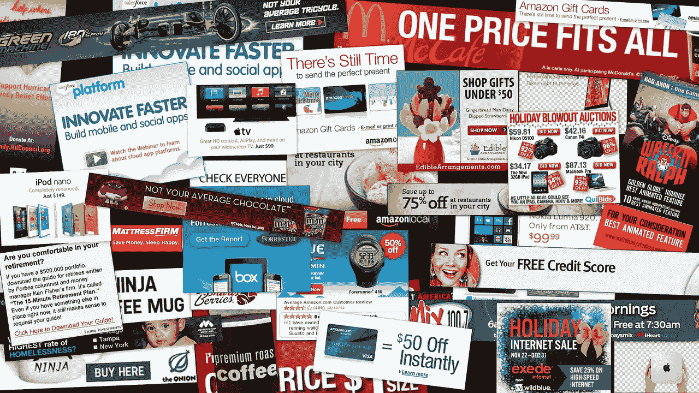

# 区块链将如何减少数字广告的侵扰

> 原文：<https://medium.com/hackernoon/how-blockchain-will-make-digital-ads-less-intrusive-7449ee05c02a>

image source: edgylabs.com

今年早些时候披露的剑桥分析公司丑闻只是一系列公司错误获取和滥用互联网用户数据事件中的最新一起。虽然丑闻本身与脸书不公平地分享用户信息有关，但随后的媒体风暴将公众的注意力带到了他们的个人数据及其在数字广告中的使用。

除了依赖窃取的数据，广告商还因用不相关和烦人的广告轰炸我们而臭名昭著。对于每一个我们从童年起就深情地记得的有趣的广告，有一百万个令人讨厌的垃圾广告，我们回过头来看，除了纯粹的蔑视什么也没有。

GIF source: giphy.com

难怪 [85%的互联网用户避开有弹出广告的网站](https://blog.umamimarketing.com/10-stats-that-sum-up-how-consumers-feel-about-advertising)，91%的人认为现在网络广告比过去更具侵扰性。对传统在线广告模式的负面情绪是一个明显的迹象，表明互联网用户正对传统广告感到厌倦，并对他们选择如何使用自己的数据以及他们所看到的广告类型的权利更加开明。

因此，广告商必须改变他们获取和使用互联网用户数据的方式，以及他们定位广告的方式。区块链技术通过将权力从大型广告中介转移到数据所有者和内容创作者，为这一挑战提供了解决方案。

## 集中广告模式的问题是

脸书和谷歌这样的公司在广告方面拥有巨大的影响力。

他们不仅控制着拥有巨大流量和影响力的平台，还能获得用户的隐私数据，这些数据可以提供关于如何定向广告的见解。除了对用户了如指掌之外，另一方面，需要这些数据来锁定受众的广告商别无选择，只能与大公司密切合作，按照他们的条件做广告。

通过依靠这些网站提供的数据来定向广告，这个想法是广告商可以将他们的广告定向到真正想看的人。举例来说，如果你花大量时间在脸书上发布关于钓鱼团体的信息，广告商就会知道向你投放钓鱼装备的广告。

问题是，这些广告往往针对性很差，互联网用户最终往往会看到与他们无关的广告。另一方面，广告商获得的结果很差，最终，唯一的真正赢家是连接广告商和数据所有者的第三方平台。这些中介最终赚取了数十亿的广告收入，而相比之下，其他人的收益微不足道。

通过将这些第三方排除在等式之外，广告商可以以更直接的方式与用户合作。这将允许他们更准确地定位广告，同时确保所有相关方都满意。

## 分散解决方案

区块链以去中心化和允许关系和网络存在而闻名，同时消除了对第三方的需要。这意味着权力从脸书和谷歌等中介转移到广告商和实际数据所有者手中。

在最前沿，有两个项目旨在让在线广告更好地服务于所有参与者。 [KindAds](https://kindads.io/) 希望建立一个区块链平台，让广告商、出版商和互联网用户直接互动，为彼此创造价值。该项目还旨在通过向他们提供选择何时以及如何使用他们的数据的选项，让互联网控制他们自己的数据。

有了 KindAds 解决方案，互联网用户在网上冲浪时对他们看到的广告类型也有了发言权。这意味着内容创作者将能够获得高度相关的流量，而不必向中介付费。传统上，内容创作者需要付费才能在其平台上获得流量。

KindAds 项目并不是唯一一个寻求让在线广告对内容创作者和数据所有者更少侵扰、更多回报的区块链解决方案。一个名为 [BAT](https://basicattentiontoken.org/) 的项目正在研究一种类似的模式，同样的目标是消除广告中介，将数据控制权归还给所有者。

为了实现这一目标，BAT 项目引入了自己的浏览器 Brave。与传统浏览器不同，Brave 允许用户选择是否要与广告商分享他们的数据，以及他们可以接收的广告类型。

随着区块链技术的不断进步，毫无疑问，更多面向广告商和用户的解决方案正在出现。像 KindAds 和 BAT 这样的项目只是一场革命的开始，这场革命必将颠覆这个行业，保护用户隐私，取消中间商，让广告成为一种更具成本效益、更愉快、更少侵扰的体验。