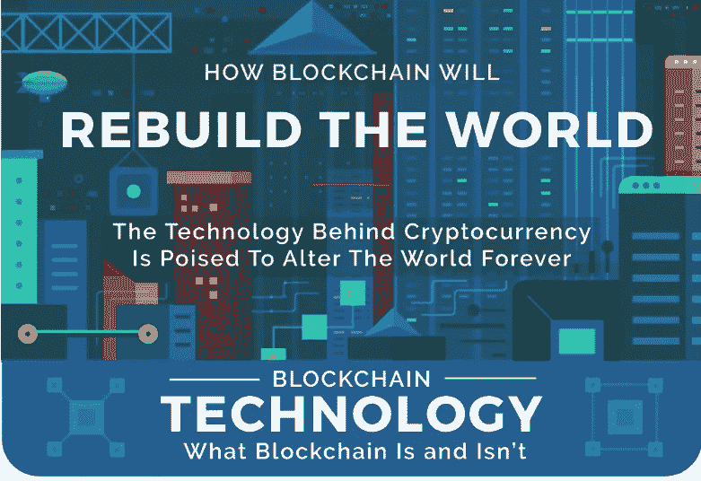
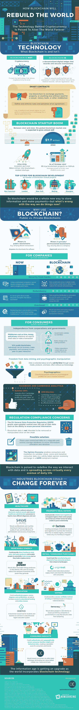

# 区块链将如何重建世界

> 原文：<https://medium.com/hackernoon/how-blockchain-will-rebuild-the-world-c103d457e885>

区块链技术仍然相当新，但它将如何改变世界的可能性是无限的。人们正在尝试许多不同的方法来最好地利用唾手可得的区块链技术，几乎每个新的应用程序都会衍生出另一个新的应用程序。理解这项惊人技术的第一步是理解它是什么，不是什么。

区块链技术是加密货币赖以建立的技术，但它不是加密货币。加密货币只是区块链技术的一个潜在应用。区块链是一个分类账系统，它以一种使数据块变得显而易见的方式连接数据块，使单点篡改变得不那么富有成效，也不太可能。每天都有这项技术的新应用被发现。

智能合约是利用区块链技术的最有趣的方式之一。个人之间可以签订合同，而不需要第三方干预或记录合同，因此，例如，房东和房客可以就租金达成一致，并以加密货币交换数字公寓钥匙。合同可以在法律范围内定义和执行协议的规则。

从这张信息图中了解更多关于区块链科技的[未来！](https://www.opinionblockchain.com/how-blockchain-will-rebuild-the-world/)

