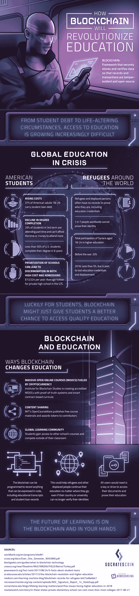

# 区块链将如何变革教育

> 原文：<https://medium.com/hackernoon/how-blockchain-will-revolutionize-education-b095276ab0f1>

教育可能是区块链改革的下一个行业。有了安全存储和验证数据的区块链网络，教育记录和交易将被安全存储和防篡改，所有人都可以更方便地学习。

在美国，高等教育正面临危机。随着成本上升，越来越多的成年人背负着学生贷款债务，但越来越少的学生能够完成他们的学位。与此同时，因战争或自然灾害而流离失所的人往往会丢失核实其身份、学历或证书所需的记录。

区块链将在一个分散的分类账中存储教育记录，使它们在灾难发生后不那么容易丢失。所有人需要验证他们的记录将是私人钥匙或 usb 驱动器，即使他们的国家或大学无法验证他们的身份。

区块链还可以让世界各地的教育更加普及，比如麻省理工学院的开放课件等内容共享，或者通过大规模开放在线课程(MOOCs)。利用区块链，MOOCs 可以通过智能合同认证课程和证书。区块链研究所(Institute for Blockchain Studies)已经在利用这一原则创建经认证的 MOOCs。

要了解更多关于[区块链将如何影响教育](http://www.socratescoin.io/education.html)的信息，请看这张信息图:

