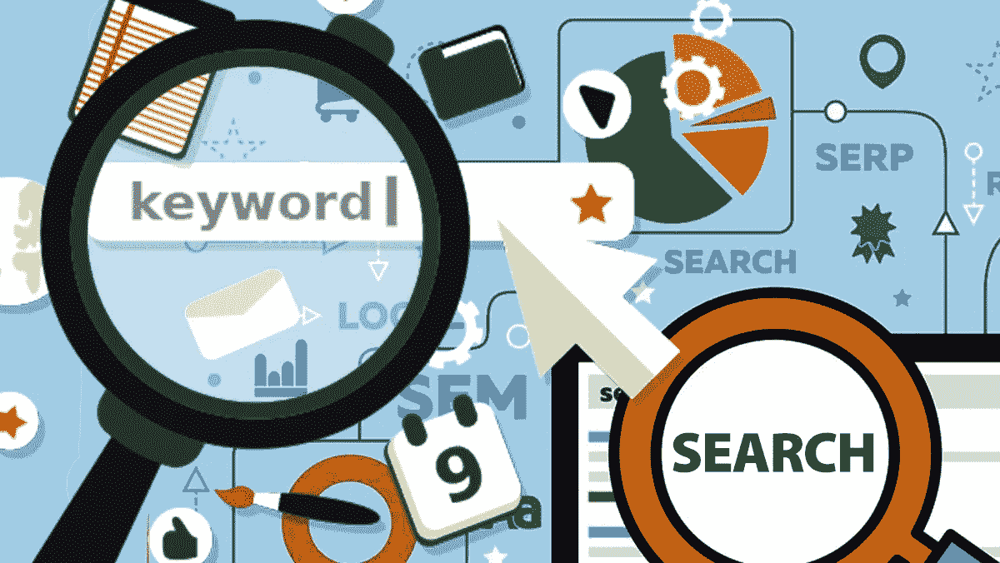

# 区块链将如何改变搜索引擎和网络

> 原文：<https://medium.com/hackernoon/how-blockchain-will-transform-the-search-engines-and-the-web-62ecb185d2f3>

在当今这个一切都在不断变化的互联世界中，对区块链的竞争对手进行理论化或分析是一个好主意，可以与当今的科技巨头进行斗争，主要焦点是一个人需要什么才能获胜。

**谷歌——世界上最大的搜索引擎**

谷歌是当今最复杂的组织之一，拥有众多部门和主导日常生活的产品。让我们跳过这些领域，转而关注广告，这是他们的主要商业模式。

**1。谷歌搜索**

谷歌拥有搜索引擎市场的最大份额，全球超过 77%的搜索是在谷歌上完成的。尽管有 13 亿人生活在中国的防火墙后，谷歌仍然拥有超过 10%的搜索引擎市场。正是这种主导地位推动了谷歌的历史性崛起。Alphabet 86.5%的收入来自广告，主要是搜索广告。

**2。YouTube**

YouTube 目前是全球第二大搜索引擎，也可能是世界上最大的用户生成视频平台。据估计，其用户每分钟上传 100 小时的内容。瑞士瑞信银行估计，Google Play 和 YouTube 在 2015 年约占谷歌收入的 15%，预计到 2020 年将达到 24%。如果你考虑到谷歌在 2006 年只花了 16.5 亿美元就收购了它们，这是一笔很大的交易。

**3。站长**

AdSense 是谷歌广告优势的另一部分。它允许网站通过谷歌的广告平台赚钱，而不必担心寻找广告商的后端。谷歌负责处理一切事务，并从广告收入中抽取 32%至 49%的份额，剩余部分归出版商所有。

Investopedia 估计，2016 年 AdSense 收入占谷歌总收入的 23%，约为 155 亿美元。不幸的是，广告往往更注重一个收视率，而不是质量，这导致了今天常见的退化和点击诱饵标题。广告模式短期内大幅改变的可能性极小，这意味着谷歌在 AdSense 上取得的巨大成功可能会持续下去。

**区块链如何打败谷歌？**

谷歌的主要焦点是收视率、关注度以及“所谓的透明度”。谷歌“不作恶”的口号和与世界公开分享信息的使命是冲突的。这创造了一个场景，谷歌是一个上帝，只有那些愿意遵守其规则的人才被允许进入。

但是，加密会让谷歌的事情变得复杂。谷歌的统治地位主要是由大数据以及人工智能(AI)的网络效应加上习惯的力量推动的，这是一场近乎完美的风暴。

然而，与此同时，科技行业的许多人对科技巨头在人们生活中扮演的角色表示担忧，特别是在出售个人数据方面。科技界已经开始针对用户和政界人士在 2016 年美国大选中扮演的角色进行抨击。

**1。搜索**

基于区块链的搜索引擎/浏览器可以帮助解决激励不一致的问题。

互联网用户已经开始使用 DuckDuckGo，这是一个专注于隐私的搜索引擎，此前他们意识到谷歌对他们生活的全部力量和影响。

DuckDuckGo 不是收集用户的个人信息来销售更好的广告，而是偶尔显示广告，这些广告完全基于搜索查询。

值得注意的是，DuckDuckGo 在全球的市场份额仅为 0.20%。它的方法为用户提供了许多好处，主要是个人数据的非中介价值，但仍然存在问题。

谷歌能够凭借其人工智能专业知识和数据占据主导地位。他们比自己更了解自己的用户，因此能够提供更好的体验。这就是为什么[移动营销的搜索引擎优化](https://www.hillwebcreations.com/mobile-advertising-checklist/)对企业很重要，因为它可以利用搜索引擎在大品牌面前开展业务。

这就是为什么[反垄断行动](https://en.wikipedia.org/wiki/United_States_antitrust_law)几乎肯定不会在美国发生的原因。毕竟，美国垄断的定义是基于糟糕的体验和消费者价格欺诈，这与当今顶级科技公司目前提供的完全相反。

你现在想要最好的结果，而谷歌在这方面做得很好。

一个基于区块链的搜索引擎(BBSE)理论上可以赢得这里。结合身份币，BBSE 可以使用消费者数据和偏好，而无需控制或拥有它们，从而为用户显示更好、更个性化的搜索结果。

如果加入广告，BBSEs 的用户也会受益，通过观看广告赚取象征性的“佣金”,从而消除目前普遍存在的敌对关系。

不幸的是，这似乎还有很长的路要走。如果你想改变用户行为，你必须提供比现有产品好 5 到 10 倍的解决方案。

BBSE 要超过谷歌的市场份额(目前在 77%到 80%之间)可能需要几年时间。

绝大多数人在没有阅读服务条款的情况下，就随意放弃了自己的信息和数据。

**2。视频**

与 T2、YouTube 和 T3 的竞争带来了与搜索竞争同样的挑战。然而，有一个主要的优势，那就是创造者创造了平台和价值。事实上，YouTube 的广告对大多数创作者来说不是很有效，这可能会很有趣。

据估计，YouTube 视频的平均 CPM(每 1000 次观看的成本)在 0.5 美元到 5 美元之间。这意味着一个视频每被观看 100 万次，你就能赚到 500 到 5000 美元。考虑到播客广告赚取 5 到 20 倍的 CPM，这实际上是非常糟糕的。

由于 YouTube 很有竞争力，但盈利潜力有限，因此创作者愿意交叉填充内容是合乎逻辑的。一个基于区块链的视频平台竞争会更少，因此会有更大的关注度。

一旦为内容创作者增加了创造内容和吸引观众的激励，回报很快就会变得更有趣。先发制人的好处创造了固有的网络效应和时间紧迫性——在其他 YouTubers 之前让你的订户过来。

然而，这仍然需要时间，特别是当它带来足够的收视率，以赚取丰厚的收入。幸运的是，有了高质量的内容和足够的象征性激励，可以肯定地说新闻会传播。

问题是多快。BBVPs 可能需要几年时间才能成熟。YouTube 每分钟上传超过 100 小时的视频内容，这是许多 SEO 丰富的常青内容。

由于 YouTube 受到谷歌的青睐，因此很难窃取他们的一些搜索流量。

注意:Dtube/Steemit 目前正致力于对 YouTube 造成严重威胁，但要想产生任何重大影响，它还有很长的路要走。尽管如此，Steemit 是最活跃的区块链项目之一，市值 14.9 亿美元，每天处理超过 100 万笔交易。

**3。站长**

广告摧毁了新闻业和互联网。一旦世界从订阅转向展示广告，质量就开始慢慢下降。

Clickbait 统治着当今的互联网。

更多的浏览量和眼球创造了一个奖励人工关注的世界。内容和新闻的质量已经下降——优先考虑华而不实的缩略图、挑衅性的标题，并意外地宣传一些不太好的领导人，如特朗普。

注意:特朗普实际上赢了，因为他成功地制造了争议，吸引了眼球，从而在世界范围内获得了评级/排名。人们的厌恶迫使他们像无法逃避的邪恶广告牌一样到处阅读他的强制信息。

理论上，区块链的出版模式可以解决这个问题。

媒体很好地说明了这一点，它允许用户为他们喜欢的文章鼓掌/投票多达 50 次。类似的模式可以帮助将资金重新分配给用户最欣赏的出版物和网站。

无论有没有区块链，其他组织和公司都在努力做到这一点。然而，这是一个困难的命题，因为大多数人不了解个人信息的风险和力量。

绝大多数人对“成为产品”和受益(即获得免费访问或内容)没有问题，因为他们对系统做出了贡献。

据信，一个基于区块链的对 AdSense 的回答可能有任何成功机会的唯一方式将是对早期采用 AdSense 广告附有 if/then 语句的系统使用令牌化激励。如果用户是 BBPM 的成员，没有广告，但如果不是，则显示广告。

为了参与基于区块链的出版模式，出版商可以合谋在市场上创造“垄断”，在所有网络资产上创造线性滑动的广告侵入规模，从而鼓励落后者转换，即随着时间的推移，由于广告数量的增加，互联网上的网站变得越来越不可用，直到读者选择加入 BBPM。

话虽如此，在不到一代人的时间里，不太可能形成“黑手党式”的方法，甚至不太可能发生变化。

希望这将有助于摆脱 clickbait。