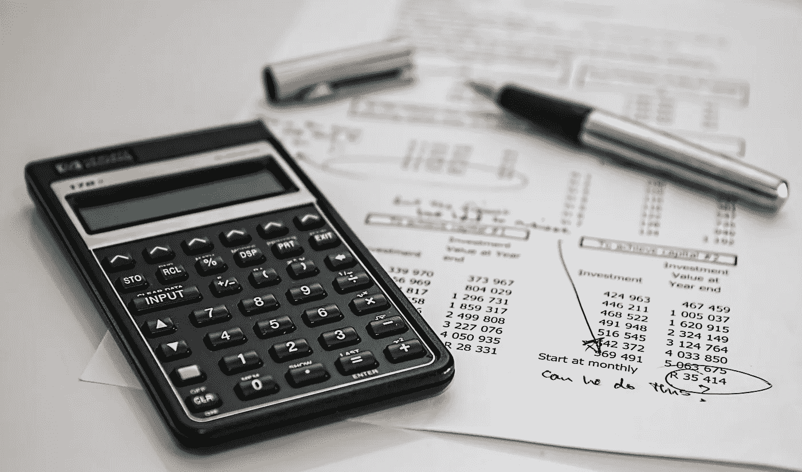

# 区块链将如何书写会计行业的新时代

> 原文：<https://medium.com/hackernoon/how-blockchain-will-write-a-new-era-for-accounting-industry-f8832bf24167>

区块链技术有可能彻底改变行业。区块链点燃了行业和部门的好奇心，特别是在金融领域。区块链经常被称为“金融服务基础设施的未来”。虽然金融部门在过去几年中占据了头条新闻，但其他行业也开始采用这项技术来实现市场民主化。

对于会计师来说，使用区块链可以明确资产的所有权和义务的存在，并可以极大地提高效率。

# 会计现状

一切都与商业自动化有关。如果有一项任务仍然是手动执行的，它会耗费公司的时间。为了实现其日常目标，该行业仍依赖于相互控制机制、制衡机制。这影响到每天的运营。除其他事项外，还有系统性的重复工作、大量的文件和定期控制。其中大部分都是手工劳动密集型任务，远远没有实现自动化。

**现代财务会计以复式记账系统为基础。**复式记账法解决了经理们知道是否可以信任他们自己的账簿的问题。然而，要获得外部人士的信任，独立的公共审计师必须核实公司的财务信息。每次审计都是一项成本高昂的工作，长时间束缚着公司的会计师。

# 区块链:救世主降临

区块链有可能通过降低维护和调节分类账的成本来进一步增强会计行业，并提供资产所有权和历史的绝对确定性。

在使用区块链时，公司可以将交易直接写入一个联合登记簿，而不是根据交易收据保存单独的记录，从而创建一个持久会计记录的连锁系统。由于所有的条目都是分布式的，并被加密密封，所以破坏或操纵它们来隐藏活动的可能性几乎是不可能的。这与由公证人验证交易完全相似——只是以电子方式。这将允许审计人员在短时间内核实大量数据。进行审计所需的费用和时间将大大减少。

# 区块链技术在会计中的优势

无论会计师事务所是大是小，区块链技术都会给他们带来很多好处。以下是一些好处:

*   **减少错误**:区块链在会计方面最大的优势之一就是能够犯几乎可以忽略不计的错误。一旦数据进入链中，智能合同将使许多会计功能自动化，减少人为错误。
*   **提升效率**:区块链是快速强大的数据库。使用区块链，可以比与传统会计软件应用程序交互更高效地将数据导入和导出系统。
*   **降低成本**:区块链将导致效率提高和错误减少，最终导致成本降低。在初始采用成本之后，会计师事务所可以期待看到比传统会计系统更快的成本节约。
*   **减少欺诈**:区块链的不可改变性使其极难实施和操纵。为了修改记录，必须同时对分布式分类帐的所有副本进行相同的更改，这是非常不可行的。
*   减少时间:区块链的一个关键特点是它减少审计时间的能力，会计师应该对此感到兴奋。随着智能合同的使用，许多审计功能可以自动化，这将减少审计员需要照看记录的时间。区块链固有的可追溯性使审计变得快速而简单。

区块链作为信任的来源，在当今的会计行业中也有极大的帮助。它可以逐渐与典型的会计程序集成:从保证记录的完整性开始，到完全可追踪的审计跟踪。这将使全自动审计成为现实。

# 四大公司如何使用区块链

安永是第一个开始接受比特币作为支付方式的人。2018 年 4 月，E & Y 推出了“区块链分析器”，这将有助于 EY 审计团队审查和分析区块链的交易。该试点将为区块链资产、负债、股权和智能合同的自动化审计测试奠定基础。

**毕马威**于 2016 年启动“数字账本服务”计划，帮助金融服务公司调查区块链应用。该公司还与微软合作创建了“区块链节点”计划，目标是为区块链技术确定新的应用和用例。毕马威也是华尔街区块链联盟的成员。

**普华永道**于 2017 年 12 月开始在其香港办公室接受比特币。2018 年 4 月，该公司宣布了其首个广泛发布的区块链审计服务，加密业务已经签约。该服务对区块链服务公司进行审计，确保他们正确有效地使用技术。

从 2014 年开始，德勤就一直在玩区块链游戏，当时他们推出了 Rubix，号称是“一站式区块链软件平台”从那以后，他们继续多样化他们的产品，探索最初的硬币产品(ico)。他们与 [Waves Platform](https://wavesplatform.com/) 的合作将使 ico 和加密交易变得前所未有的容易。

# 阻止区块链在会计领域大规模应用的两个因素

诚然，区块链技术提供了许多承诺，但将你的业务与区块链整合并不是一件容易的事。

*   如果我们从**的非技术**方面来看，阻止区块链进入会计行业的是这个行业的懒惰本性，它会等待太长时间来拥抱 DLT 的技术。虽然不能完全归咎于会计行业，但会计行业的企业级区块链解决方案还不容易获得，这也是事实。但随着创新者和投资者开始满足这个新兴市场，这个借口很快就会消失。
*   从**技术**方面来看，你会发现现在大部分的会计软件都与区块链技术不兼容。即使你想把你的会计公司放在区块链，你目前的软件可能也不友好。采用将需要购买基于云的会计服务，并可能雇佣一名区块链开发人员为你的公司创建定制的用户界面。但是，随着越来越多的会计师事务所开始采用区块链技术，许多经济高效的解决方案将在不久的将来出现。

# 会计行业应该如何准备

会计师是记账、应用复杂规则、商业逻辑和标准制定方面的专家。**会计师可以改变区块链在未来的使用方式，以及区块链主导的解决方案和服务的开发方式。**

几乎没有必要向外部来源确认区块链交易的准确性，但在如何在财务报表中记录和确认这些交易，以及如何确定估值等判断性因素方面，仍有许多工作要做。从长远来看，越来越多的记录可能会转移到区块链，有权限的审计人员和监管人员将能够实时检查交易。

随着越来越多的公司加入加密经济，为他们服务的**会计公司将很快被迫将加密货币交易纳入其会计流程。**此外，接受加密支付的会计师也将向寻找加密友好型公司做生意的千禧一代敞开大门。一些公司只接受比特币作为支付手段，这对精通区块链的会计师来说是一个抓住业务的机会。

随着区块链发展渗透到会计行业，监管机构、技术提供商和会计行业领导者必须共同努力，寻求使过渡对各方都有利的方法。会计师不是工程师，可能不了解区块链是如何运作的。但他们需要知道如何建议采用区块链，并考虑区块链对他们的业务和客户的影响。

# 结论

区块链是会计的一个新领域，仍有许多问题需要解决，仍有许多问题需要开发。区块链已经存在，而且只会越来越大。开始得早的人总是占上风。尽管前方障碍重重，但人们普遍认为，DLT 可以彻底改变全球会计行业的核心基础设施系统，从而带来更大的透明度和效率。看看这个行业在不久的将来如何发展会很有趣。

在 Linkedin 上联系我:【https://www.linkedin.com/in/gauravneuer/ 