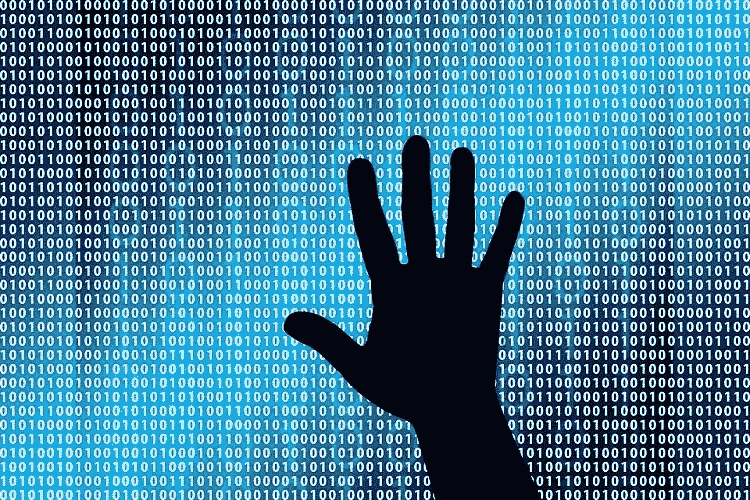

# How Blockchain Could Have Stopped the China Chip Hack and Other Acts by the Thugs of our Generation

> 原文：<https://medium.com/hackernoon/how-blockchain-would-have-stopped-the-china-chip-hack-and-other-acts-by-the-thugs-of-our-generation-41236530c3bc>

A crew of unknown men mosey into a chip manufacturer in China and say, “to hell with the blueprints, jam this pencil-tip size chip in the middle of everything; if you do, you get a bunch of money; if you don’t, you fail your next inspection and your factory is done.”

In Bloomberg Businessweek’s “[The Big Hack: How China Used a Tiny Chip to Infiltrate America’s Top Companies](https://www.bloomberg.com/news/features/2018-10-04/the-big-hack-how-china-used-a-tiny-chip-to-infiltrate-america-s-top-companies),” Jordan Robertson and Michael Riley identify the bad actors as “middlemen” and go on to describe how, through the implant, they likely infiltrated the backbone of 30 prominent US businesses, including Apple and Amazon, and those who do business with them.

It made its rounds — Apple and Amazon deny; Bloomberg doubles-down saying they spent a year conducting over “more than 100 interviews, including several current and former senior national security officials and insiders at Apple and Amazon. In all, 17 people confirmed the manipulation of Supermicro’s hardware and other elements of the attacks.”

And then nothing. It appears as if Americans are not concerned that a foreign government could have outfoxed Amazon, Google, and our own federal government and walked away with volts of information.

When it’s a foreign adversary perpetrating the heist against Americans, we call it espionage; when it’s citizen-on-citizen, we call it cybercrime. Our journalists call the perpetrators, “middlemen” and “hackers.” At this moment in time, our personal data is a resource as life-giving as it is lethal. I’d call anybody in the business of stealing it a thug.

Bloomberg recounts how in September 2015, President Barack Obama and Chinese President Xi Jinping met at the White House to announce a cybersecurity deal: China would no longer support hackers who stole intellectual property from US companies for the benefit of Chinese companies. In the weeks after the deal was touted, we learn, the Pentagon quickly and quietly ushered the country’s leading tech executives and investors to McClean, Virginia to see if anyone could create a product which would identify hardware implants.

Bloomberg concludes its article by proclaiming, “In the three years since the briefing in McLean, no commercially viable way to detect attacks like the one on [these] motherboards has emerged — or has looked likely to emerge.”

That’s fair — until now.

Distributed ledger technology, the technology behind blockchain, changes everything.

**There’s an Arms Race, and the Bad Guys Are Winning**

所谓的芯片植入允许中国人民解放军获得对他们被植入的系统的控制。然而，控制关键设备并不需要植入芯片。以 2016 年 10 月炸毁半个互联网的黑客攻击为例——来自宾夕法尼亚州和路易斯安那州的三名年龄在 19 至 20 岁之间的男子入侵了一批 DVR 和网络摄像头，然后指示他们攻击托管我们最喜欢的网站的服务器，因为他们告诉这些设备不再属于他们的所有者。

在一天结束时，在所有情况下，它归结为“传输控制”

TCP/IP 是传输控制协议/互联网协议的缩写，是 DARPA 在 1978-1983 年间开发的一系列协议，互联网就是从这些协议中诞生的。我们把 TCP/IP 比作信息高速公路；在架构上，它负责设备上软件进程之间的连接建立、管理和可靠的数据传输。

然而，问题是，正如我们所知，TCP/IP 并不管理在它所连接的硬件上运行的进程。如果一个中央服务器说，“嘿，我已经决定乔纳森·曼齐的 iPhone 不再属于他，而是属于埃隆·马斯克”，那么，很快，TCP/IP 就让它发生了。

**我们如何利用分布式账本技术一击致命**

当每一个设备被制造出来时，它都遵循一个配方——成分列表被称为 BOM，或材料清单。由于硅的特性，可能装载恶意软件的部件(例如微芯片)在细节上是独一无二的。换句话说，每个人都有独特的指纹。

在分布式账本框架中，每台设备——以我的 iPhone 为例——都会存储其相关部件的指纹——更妙的是，它还会存储宇宙中所有其他 iPhone 的所有相关部件的指纹。当一部新的 iPhone 被制造出来时，我的 iPhone 和宇宙中所有其他的 iPhone 都会添加新 iPhone 的指纹。

这样，如果通过 TCP/IP，一个危险的消息传来——曼兹的 iPhone 现在属于马斯克——曼兹的 iPhone 知道宇宙识别马斯克的 iPhone 被分配到指纹，而曼兹的手机没有指纹。它不允许黑客攻击发生。

明确地说，TCP/IP 不需要被取代，我们只需要引入一个基于分布式账本的协议来位于上面并协调决策到设备的通信。

**一个将会毁灭我们的现状；团结我们的突破口**

随着我们进入网络软件时代，每一个小工具和设备都是一个新的战场。

想象一下，如果对手控制了我们的交通网络和医院的产房。

就像我们围绕技术在全球范围内团结起来创建互联网一样，我们必须再次团结起来，通过在 TCP/IP 之上附加一个通用的节点到节点协调协议来防止网络犯罪。

Jonathan Manzi 是 Beyond Protocol，Inc .的联合创始人兼首席执行官，这是一家硅谷的分布式账本技术风险投资公司，致力于构建“新时代的互联网——机器的伦理语言”