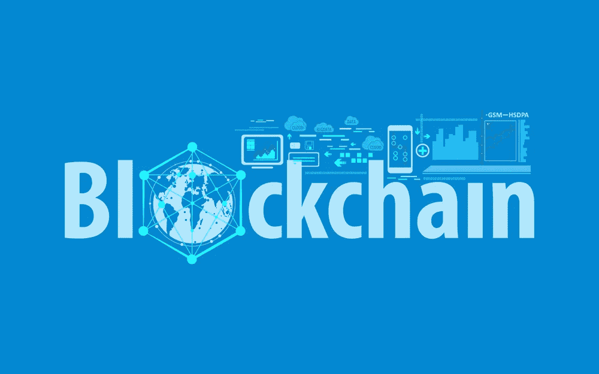

# 区块链将如何赋能全球供应链

> 原文：<https://medium.com/hackernoon/how-blockchains-will-empower-supply-chains-globally-578ddf4086ed>

Blockchain can redefine the Supply Chain

世界各地的密码爱好者和区块链专家都知道区块链网络是未来的 T2 技术，以及它如何以多种不同的方式为各个领域提供支持。区块链的分布式记录数据库维护记录数据的防篡改账户。虽然可以向链中添加更多的信息，但现有的块永远不会被删除。这确保了一切都是透明的，向公众开放以供核查，并将为子孙后代保持这种状态。

这为希望减少停机时间、提高效率和生产力水平的供应链提供了一个绝佳的机会。从材料采购到生产，一直到客户最终购买，该产品都将被永久跟踪和记录，同时还为反馈提供了链接到区块链的空间。

**区块链理工学院将派上用场的供应链中的一些关键领域包括:**

1.  **库存跟踪** —大多数企业都有大量的库存需要管理，手动、集中或离线记录可能无法做到万无一失。数据丢失或被篡改的风险总是存在的。然而，供应链的区块链解决方案，你总是领先一步，与破坏证明数据记录。
2.  **材料转移** —在这种分散技术的帮助下，您现在可以跟踪不同节点之间的材料转移，并实时记录。这确保了更大的责任性和更高的准确性。
3.  **仓库管理—** 有了区块链，管理进出仓库的物品变得更加容易。对数据进行持续的监控和验证，从而最大限度地减少欺诈的可能性或流程中的任何缺陷。
4.  **整理整个供应链—** 供应链的问题通常在于它从来就不是一个真正的链，大多数时候只有与前一接触点的链接。然而，区块链的情况有所不同。无论你处于供应周期的哪个阶段，你都可以追溯到源头。这在每个阶段都在利益相关者之间创造了一种团结和归属感。
5.  **信息传播—** 最重要的是，拥有供应链中发生的所有活动的公开记录，使公司能够以自由和透明的方式轻松发布/传播信息。

**为什么在供应链中采用区块链技术？**

1.  **责任—** 流程中的每个利益相关者都要对自己的行为负责，因为这是公开可见的
2.  **透明度—** 利益相关方需要的任何信息都可以很容易地获得，不会被任何实体掩盖或隐瞒。
3.  **可扩展性—** 区块链允许其账本上有无限个区块，因此无论公司最终变得多大，可扩展性都不是问题。
4.  **创新—** 在最新技术的支持下，供应链行业将在所有业务领域受益匪浅

**区块链技术有哪些实实在在的好处？**

**对供应商而言:**供应商将受益于卖方需求的实时数据。他们能够即时生成报告，说明哪些是必要的，哪些需要优先处理。

**对卖方而言:**卖方能够正确衡量材料供应的时间表。他们还能够以无缝的方式与供应商、合作伙伴和客户共享精确的信息。

**对于合作伙伴:**合作伙伴能够跟踪项目的健康状况，以及它是否被正确地实施和执行。这使他们能够在必要时提供额外的援助。

**对于顾客:**顾客能够追踪和追溯产品的来源，以及详细了解他们所购买的东西。卖方没有理由提出未经证实的索赔。

因此，很明显，区块链技术将成为供应链行业变革和赋权的驱动力。

Trimpo 是帮助全球商家整合在线平台的领先企业，只需轻轻一点。欲了解更多信息，请访问[www.trimpo.org](http://www.trimpo.org)

要了解更多关于我们如何帮助企业建立在线权威的信息，请在 Twitter 上联系我，电话: [harshil_lakhani](/@harshil_lakhani) 。