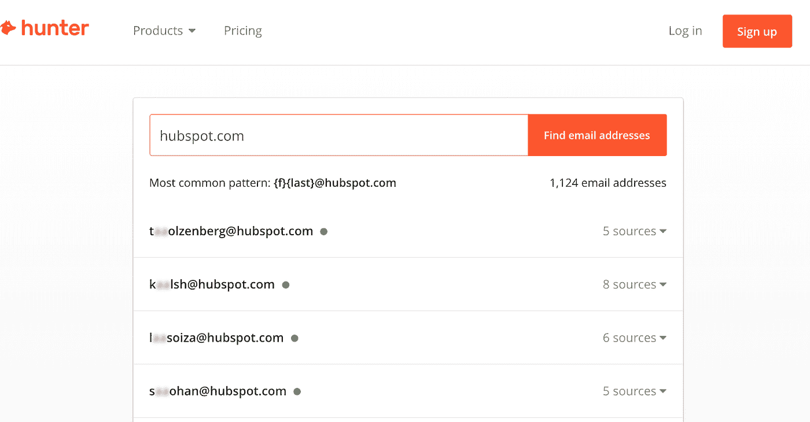
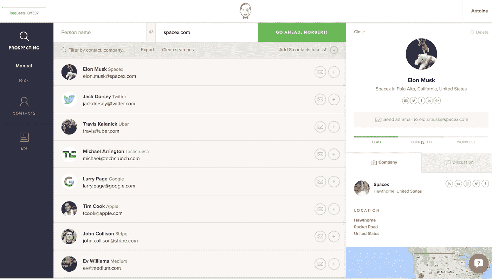
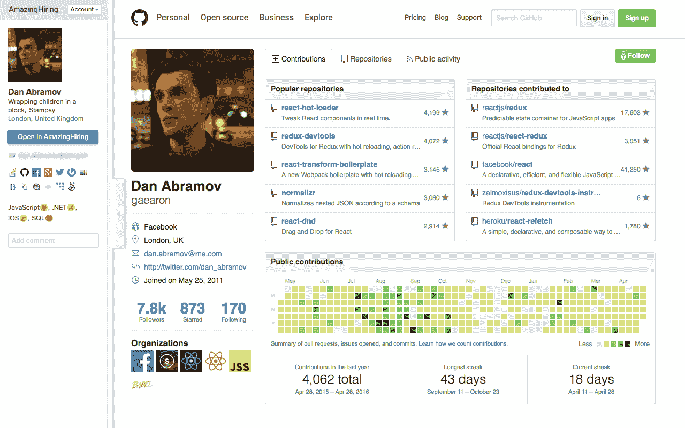

# 企业如何找到强有力的专业人士:3 种实用方法

> 原文：<https://medium.com/hackernoon/how-business-can-find-a-strong-professional-3-practical-ways-bf7b264032ea>

人们现在在网上分享大量的信息。尽管如此，找到可能被雇用的候选人的联系方式，并不是一件容易的事情。下面描述了解决这个问题的几种方法。

# **按公司域名搜索电子邮件**

为了找到并雇用候选人，您可能需要知道员工的工作电子邮件。手动搜索，从头开始，真的很费时间。所以，通过企业域名搜索的服务(比如众所周知的 [Hunter.io](http://hunter.io) )会帮你解决问题。只需将所需公司的域名输入搜索字符串，系统就会提供相关电子邮件的列表。

在这种情况下，将首先显示用户最常用的电子邮件。如果系统没有找到目标人物的联系方式，它就派上用场了。然而，如果你知道公司地址的模式，很容易手动匹配或在特殊的生成器中匹配，如 [Name2Emai](http://name2email.com/) 。

这里的替代方法是 [Snovio](https://snov.io/) ，它也能够根据特定公司的域名给出不同的电子邮件地址。

此外，在访问该公司网站时，只需点击图标，就可以使用 Chrome 扩展获取地址。

该服务帮助您找到与指定档案相匹配的公司员工的电子邮件地址。这种搜索不需要特定公司的名称。相反，用户需要指定目标领域、组织规模和位置。然后，招聘人员将收到一份符合公司描述的生成列表，并能够联系他们的员工。

Hunter 和 Snovio 都在预先生成的列表上进行大量电子邮件搜索。

另一个选择是 VoilaNorbert，通过名字、姓氏和域名在互联网上查找电子邮件。

同样的事情也适用于[AnyMailFinder.com](https://anymailfinder.com/)和[FindAnyEmail.net](https://findanyemail.net/)。后者链接到 Gravatar(社交资源)，如果结果匹配就显示用户的头像。

# **布尔搜索**

可以通过特定的操作符设置复杂的谷歌搜索查询，比如布尔搜索。这是一个非常强大的搜索工具，有助于找到完美的候选人的联系信息，搜索结果可以通过不同的参数进行筛选，例如技能和位置。但有一个问题:设置准确有效的搜索参数需要工具的工作知识，招聘人员并不总是有时间研究复杂的运算符。因此，Snovio 中的布尔搜索由链接器模块自动执行。

该系统有三个过滤器进行准确的搜索查询:职位，技能和位置。例如，如果你需要一个来自西雅图的网页设计师使用 Adobe Photoshop、Adobe Illustrator 和 Corel Draw，这个工具将真正帮助你。对了，Linker 可以排除有一定技能的候选人。如果你需要一个不是从程序员的位置挪到这个位置的项目经理，可以剔除编程技能。

# **社交媒体用户的电子邮件来源**

社交媒体可以成为候选人联系信息的重要来源。然而，数据量如此之大，以至于招聘人员往往无法手动处理。最好使用自动化工具，比如[amazing 招聘](https://amazinghiring.com/)。

该系统可以在多个社交媒体中搜索联系人。首先，在 LinkedIn，全世界所有招聘者最受欢迎的来源。系统自动查找相关用户的邮件:

该服务自动分析来自不同网站的候选人资料信息，并将它们合并为一个。它还包括联系信息。

此外，Snovio 还在 Twitter、LinkedIn 和脸书上自动搜索候选人。这项服务的优势是可以选择直接发送电子邮件。

# **结论**

通常，很难雇佣到一个强有力的专业人士。这里的第一步是找到合适的候选人，然后联系他们。这很耗时，有时也很困难，但是不同的自动化工具确实可以帮你节省时间。