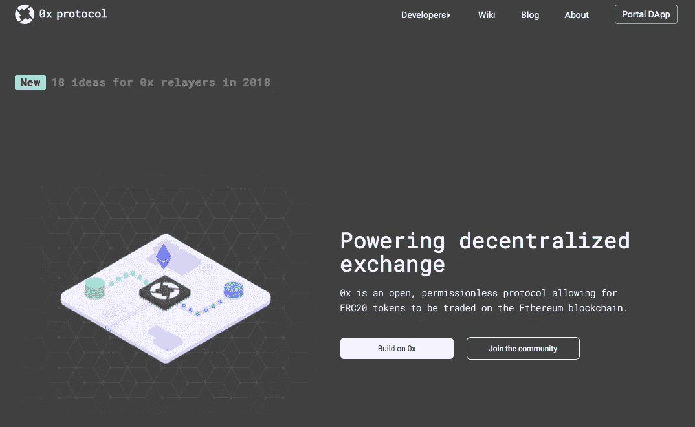
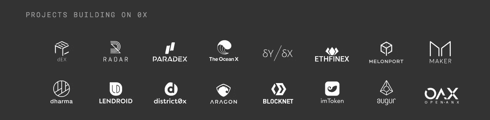
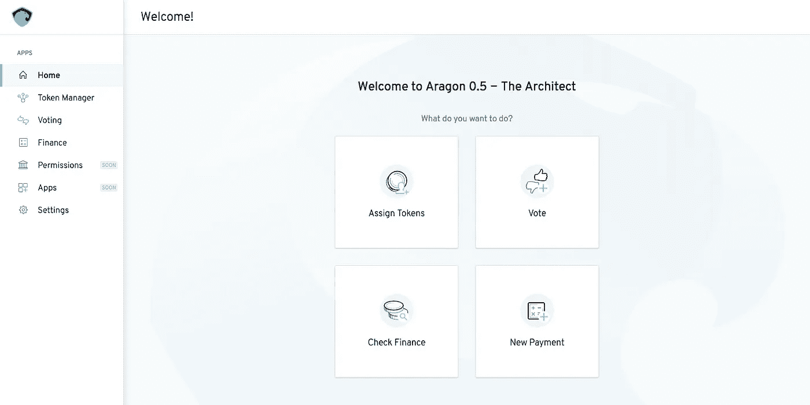
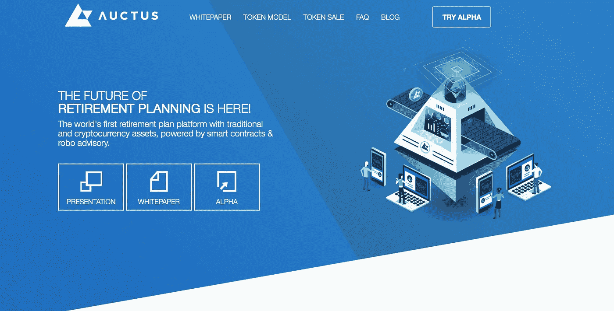

# 0x 如何帮助您构建分散的应用程序

> 原文：<https://medium.com/hackernoon/how-can-0x-help-you-build-decentralised-applications-de06b24d9292>

开放框架在我们今天看到的互联网上发挥了重要作用。如果你想从头开始构建一个 web 应用程序，你必须自己做很多事情(监听来自端口 80 的请求，编写一个与数据库交互的包装器，等等)。

但是，人们很难从头开始编码。而是使用 Laravel、CodeIgniter、Django、Flask 等 MVP 框架。您可以重用他们的代码，这些代码是由社区随着时间的推移而改进的。这个过程可以节省你的时间，帮助你更快地将你的想法推向市场。

从头开始构建能够促进以太坊交易的自治系统既困难又耗时。你的代码需要优化，因为你必须为所使用的计算能力付费。

0x 是一个开放的协议，为您提供了一个实现分散交易的架构。换句话说，你可以使用 0x APIs 建立一个分散的交换。

## 什么是分散式交换？

在分散的交易所中，交易直接发生在人们的钱包之间。去中心化的交易所不持有他们用户的资产。

交易者以他们想要购买或出售的价格创建订单，并预授权交易。订单通过网络传播出去，愿意对订单进行反击的交易者填写订单。

*如果 Sara 想要将 BAT 换成 ETH，她指定想要出售的价格，并在分散交易中创建订单。分散的交易所 pings 她的钱包以获得她的批准，从而对交易进行预授权。*

*在她批准后，订单对其他交易者可见，他们可以选择完成交易。马克选择完成交易，他通过他的钱包授权交易。*

交易发生了，Sara 的 BAT 令牌被转移到 Mark 的钱包，而他的 ETH 被发送到她的钱包。这种交易不需要中间人持有代币。

**在 0x 的帮助下，您可以专注于核心业务逻辑，减少对架构的担心。0x smart contracts 是免费的开源软件。它得到了一个强大社区的支持，这个社区不断完善和优化它的代码。**

您可以使用他们的 API 轻松地对资金进行编程，甚至构建一个分散的交换/中继站。我们已经有很多基于 0x 的项目了。[雷达继电器](http://Radarrelay.com)、 [ERC Dex](http://ercdex.com) 、 [DDEX](http://Ddex.io) 、 [Paradex](http://paradex.io) (被比特币基地收购)是基于 0x 打造的热门继电器。

它们被称为中继者，因为它们使用 0x 的基础设施来支持交易。这些中继站可以向用户收取服务费。这对于 0x 和 relayers 来说是一个双赢的局面，因为他们将单独营销和竞争，在 0x 的基础上建立优质的服务。

当继电器吸引更多用户时，0x 将作为一个开放平台开始增长。这也将增强 0x 架构，因为它是开源的，由社区贡献。中继站因此不必担心维护和系统升级，他们可以专注于核心业务模式。

## 0x 上的交易是怎么发生的？

为了进行交易，我们需要一个系统来创建、匹配和执行订单。正如在前面的示例中所讨论的，Sara 创建了订单，Mark 看到了订单并选择履行订单。

这些创建的订单不需要填写。在以太坊上频繁写数据，效率低，成本高。0x 采用了一种巧妙的方法，将订单创建、匹配和填充流程脱离链条。

0x 通过在网络上广播签名消息来匹配订单，只有当订单被执行时，交易才在区块链上执行。这种方法减轻了区块链的负担，实现了高效交易。

## 0x 协议的四个关键组成部分

0x 协议由四个关键部分组成。制造商、接受者、延期者和智能合同。让我们来看看这些组件如何一起实现分散交易。

Relayers 向用户提供界面(网络或移动应用程序)。使用 0x 平台是有费用的，需要使用 ZRX 支付。继电器为用户提供有竞争力的价格。

制作者是想要出售或购买代币的用户。在我们之前讨论的一个例子中，Sara 是一个想要交易她的蝙蝠代币的制造者。制造商使用继电器的接口(如雷达继电器)通过使用他们的私钥授权交易来创建订单。

订单将包含参数，如他们喜欢交易的令牌、他们想要购买或出售的价格、延期费以及如果订单未被履行将过期的时间。

继电器确认制造商的订单，并将其添加到他们的订单簿中。使用 relayer 的其他交易者也可以看到这些订单。当一个交易者选择完成庄家创建的订单时，他就成了接受者。有些继电器会自动撮合下相反订单的人。

一旦订单匹配，以太坊智能合约将执行订单链。代币在制造者和接受者的钱包之间直接交换。中继站收到约定的费用。

继电器只是 0x 的一个用例，0x 的潜在应用是无限的，让我们来看看其中的一些应用。

## 0x 的应用程序

在以太坊上创建一个去中心化的组织、发行令牌、开发通过投票管理治理的代码等过程需要技术资源。也很费时间，成本也很高。

Aragon 是一个去中心化的应用程序，它使用 0x 协议来帮助用户在以太坊上轻松建立去中心化的组织。

帮助人们有效投资的金融科技产品并不新鲜。然而，这些产品缺乏透明度。

Auctus 是一个退休规划平台，它利用了 0x 协议。你得到了人类和机器人的建议，以帮助你有效地管理你的资产。顾问根据他们的建议获得奖励。

很多做预测的专家，大多数预测都失败了。如果我们能让他们对自己的预测负责呢？

Augur 是一个使用 0x 协议的预测市场平台。一个专家拿着他们的钱就可以在平台上做预测。如果他们的预测成真，他们将受到激励，否则他们将血本无归。

可以在 0x 上构建的应用程序种类繁多。我们还没有看到它的真正潜力。可以看看 0x 团队[汤姆·施密特](https://medium.com/u/b7b7c70688fb?source=post_page-----de06b24d9292--------------------------------)写的故事[*《2018 年 0x 接力者的 18 个想法》*](https://blog.0xproject.com/18-ideas-for-0x-relayers-in-2018-80a1498b955f) 。

这个故事是我们“*深入探索 ERC20 生态系统*”系列的一部分。在第二个故事中，我们回顾了基于 0x 的继电器。

 [## 这是我们对建立在 0x 上的分散式交易所的回顾

### 在我们之前的故事中，我们介绍了 0x。在这个故事中，我们回顾了基于 0x 的流行继电器，这里是我们的…

medium.com](/onchainlabs/here-is-our-review-on-decentralised-exchanges-built-on-0x-5afc9b107aec) 

请鼓掌👏，谢谢你😊。F *关注我们 Hackernoon 和我(*[***Febin John James***](https://medium.com/u/75a616711f4e?source=post_page-----de06b24d9292--------------------------------)***)了解更多故事。***

> **我们还采取措施拉近在加密领域工作的人们的距离。如果你是密码空间** [**的开发者、设计师、营销人员、作家、商人、企业家等，请填写此表格**](https://goo.gl/forms/2DeOVlb9CS5qNiK02) **。我们将整理列表并与您分享，这可以帮助您建立您的网络。**