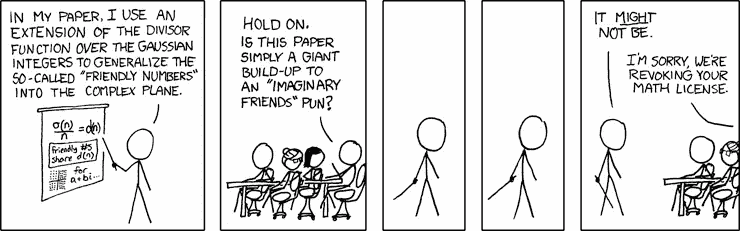
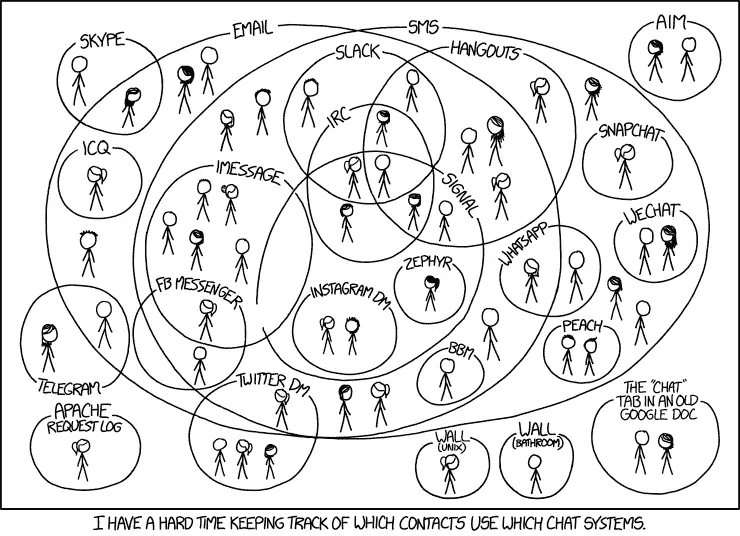

# 区块链技术如何革新你的教育

> 原文：<https://medium.com/hackernoon/how-can-blockchain-technology-innovate-your-education-d1cd80c26f08>

## 面向教育的区块链

## **什么是区块链？**

它只是可以公开访问的防篡改日志。如果你想了解更多，请阅读我之前的故事[区块链初学者指南](https://hackernoon.com/a-beginners-guide-to-blockchain-d04266844e7)。

Credits : [xkcd](https://xkcd.com/1296/)

# 赞助学生

**This post was sponsored by LiveEdu**

*奥利维亚是一个 13 岁的孤儿。她是班上最聪明的。一个非政府组织一直在支持她。由于一些内部政治，非政府组织决定支持弗兰克，而不是奥利维亚。*

好难过！问题是人类可能会有偏见，你不能指望他们总是道德行事。不道德的行为会导致系统腐败。我们不想要腐败。我们希望我们的系统是公平的。这只有在决策完全基于逻辑原因而非人类偏见的情况下才能实现。

这就是计算机发挥作用的地方。给他们指示。他们会完全按照命令行事。他们没有偏见，没有情绪。我们能利用这一特性吗？

这个非政府组织可以是区块链网络的一部分(换句话说，他们的计算机互相连接，共享日志)。网络中的每一笔交易都记录在防篡改系统中。当约翰赞助奥利维亚时，他将能够追踪他所花的钱。他可以放心，他的钱用得其所。他甚至可以要求电脑赞助，前提是奥利维亚的表演很好。这可以激励她取得好成绩。

# 技能简介

Credits : [xkcd](https://xkcd.com/1911/)

*奥利维亚有一个 EduBlock 个人资料(* ***这是另一个防篡改的个人教育成就日志*** *)。她可以攻读不同机构、MOOCs 等的课程。一切都会反映在她公开的区块链个人资料中。*

我们有很多在线 MOOC 可以帮助我们掌握行业技能。Coursera，EdX，CodeSchool，CodeAcademy 等。Edublocks 允许您在区块链上维护公共个人资料，而不是在这些网站上拥有个人资料。你可以从任何地方学习，你的成就会反映在你的公众档案中。雇主可以通过这些资料向你发送工作邀请。

# 需求技能

Credits : [xkcd](https://xkcd.com/1838/)

当雇主通过 EduBlocks 招聘时，它会被记录下来。因为这些日志是公开的，所以我们可以跟踪它们来找到哪些技能是需要的。我们获得实时的洞察力。目前，我们不得不依赖 LinkedIn 等公司提供的数据。这些是不可靠的，因为它可能被篡改。延迟数据不准确。

Olivia 可以从可靠的数据中获益，她提前知道哪门课程将保证她的成功。

# 发表研究论文

Credits : [xkcd](https://www.explainxkcd.com/wiki/images/7/76/it_begins.png)

奥利维亚将她的研究论文提交给一家期刊发表。已经六个月了，她对它的进展毫无头绪。

区块链可以使奥利维亚将她的作品发送给一小部分观众。实时获得他们的反馈。这些观众可以投票支持或反对他们的同行的作品。它获得的支持票越多，它就会被推向更多的观众(*中型故事会在掌声的基础上接触到更多的观众*)。

*奥利维亚关于加密货币的论文获得了很多关注。她获得了微软的实习机会。*

# 教育平台

Credits : [xkcd](https://xkcd.com/1810/)

[LiveEdu](https://tokensale.liveedu.tv/) 正在开发一个基于区块链的学习平台。它们连接不同的参与者，如内容创建者、学习者、API 开发者、版主等。你可以在他们的平台上注册，向行业专家学习。

您可以从 LiveEdu 购买 EDU 代币。这些令牌可用于各种目的，如下载课程材料、请求定制项目、从内容创建者处获得回复等。你学得越多，挣得越多。您可以通过观看项目视频、提交项目建议、邀请朋友等方式获得 EDU 代币。你还会因为成为社区版主而获得奖励。你会因为报告错误、内容审核等质量保证活动而获得奖励。

LiveEdu 激励其内容创作者。他们因创造内容而获得 EDU 硬币。学习者参与内容越多，创作者得到的回报就越多。

***我们仍处于区块链被颠覆的早期阶段。最好的用例还没有被想象出来。请鼓掌*** 👏 😬。我不会把我的内容放在付费墙后面。如果你喜欢我的内容，可以通过 [***请我喝咖啡***](https://www.buymeacoffee.com/febin) ***来支持我。***

> *关注*[*HackerNoon*](https://hackernoon.com)*和我(*[*Febin John James*](https://medium.com/u/75a616711f4e?source=post_page-----d1cd80c26f08--------------------------------)*)了解更多故事。我正在写一本关于区块链的书。如果您希望获得预发布版本* [*，请在此*](https://goo.gl/forms/jhkzLnsYm3yrLMlD2) *处注册。我还推荐一本书，里面有我写的每一个故事。对于这个故事，它是* [区块链革命:比特币背后的技术如何改变货币、商业和世界。](http://amzn.to/2EtascE) *读书无价。(如果没有时间阅读 check out*[*Mentorbox*](https://mentorbox.com/partners?affiliate_id=898086)*)。*