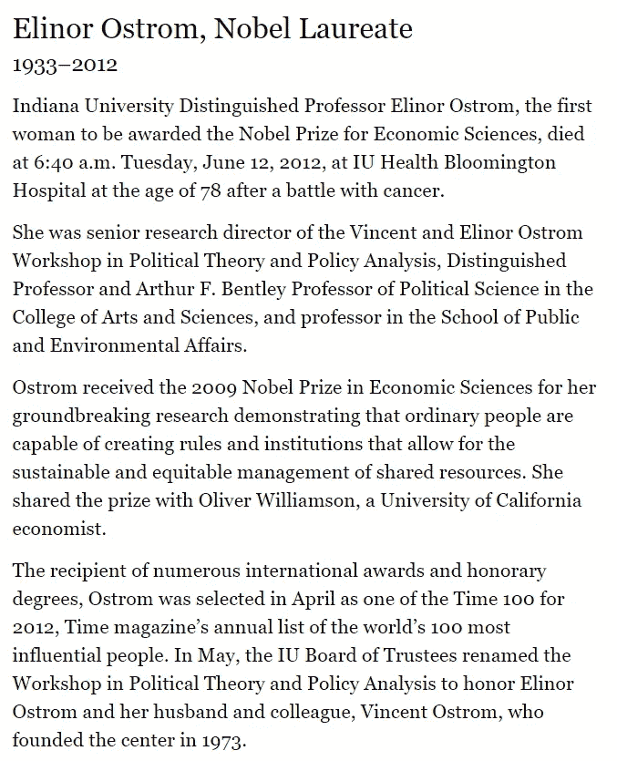

# 分散治理如何转向注重成果的方式？(第二部分:埃莉诺·奥斯特罗姆)

> 原文：<https://medium.com/hackernoon/how-can-decentralized-governance-shift-to-a-results-oriented-way-part-2-elinor-ostrom-86397556c9af>

从古代苏美尔人到今天分散治理机制的治理之旅，以及如何改善经济和社会成果。

2009 Nobel Prize Winner in Economics, Elinor Ostrom: who dedicated her life to researching governance of the finite resources by communities.

分权治理是个人哲学、伦理和非科学预测最常讨论的话题。

一些人认为财阀统治是分权治理的最佳方式，另一些人认为应该是民主，大多数创始人天生认为他们比任何人都知道正确的治理方式。

如果我们看看当前的区块链生态系统，我们还没有看到太多成功的分权治理模式。最有意义的尝试是 [**刀**](https://en.wikipedia.org/wiki/The_DAO_(organization)) ，这在当时是一个巨大的东西，但不幸的是，在黑客攻击后，它失去了光彩。

如果我们对自己诚实，目前“去中心化”主要发生在区块链的网络层。这些数字和统计数据表明，中国的环境是一个高谈阔论的环境，但当谈到现实时，却无法兑现承诺。([*https://arewedecentralizedyet.com/*](https://arewedecentralizedyet.com/))

也许我们认为权力下放本身就是一种风险，因为我们已经习惯了旧的方式。也许我们没有任何例子显示社区驱动的治理机制的真正力量。或者，也许已知是一种安慰，未知是可怕的。

作为人类，我们倾向于不喜欢未知。这让我们感到脆弱，当涉及到商业交易和巨大的风险时，我们不想犯愚蠢的错误。然而，到目前为止，这些趋势使我们无法体验真正的去中心化治理模式。

> **如果已经有一项科学研究可以阐明看起来相当混乱的分权治理，那会怎样？**

埃莉诺·克莱尔·奥斯特罗姆(Elinor Claire ost rom)1933 年出生于加利福尼亚州洛杉矶，她可能是最有文化的人，可以重塑我们所不知道的关于社区驱动的治理机制的一切，以及这些模式如何能够带来最令人兴奋的结果。

在她一生的研究中，她想了解社区如何分享有限的资源，在许多不同的现实生活中的例子，最重要的是，她对找到什么样的模式和原则导致更多的富足和幸福感到兴奋。

她对理解经济、政策和社区之间的相互联系的奉献和热情，为她赢得了一个人所能获得的最重要的荣誉奖；诺贝尔纪念奖。

a biography from Elinor Ostrom’s website

她的突破性研究表明，普通人能够创建规则和组织方法，允许对共享资源进行可持续和可扩展的管理。也许这可以提醒道。

传统的经济思想认为，当资源被共同拥有和共享时，通常会以一种被称为“公地悲剧”的现象告终

相反，**埃莉诺·奥斯特罗姆一生的研究带来了科学成果，揭穿了这种观念**。

她还设法认识到**背后的模式，是什么让社区管理自己和他们的共享资源，增加了成果的成功**。

# 被称为奥斯特罗姆管理公共资源原则的 8 项原则是:

1.  对于谁有权访问哪些资源，Commons 需要有明确定义的组边界。
2.  规则应该是定制的，以适应当地的需求和条件。
3.  受规则影响的社区可以参与规则的决策和修改。
4.  监控共享资源的使用是至关重要的。
5.  对那些滥用规则的人的制裁必须是渐进的。
6.  争议解决方法必须是可获得的、容易的和低成本的。
7.  更高级别的当局和监管者必须认识到既定的规则和治理方法。
8.  为了实现最佳的资源管理，公共资源应该具有从最低级别到互连系统的不同层次。

虽然公地悲剧是一个给分权治理带来恐惧的名称，但在这些核心原则下，有可能塑造真正的分权繁荣，并消除集中决策和公地悲剧。

当今的技术让我们有能力为上面提到的每个原则建立解决方案。

从设计上来说，设计分散治理方法的最有效的方面可能是使用技术和参与，因此独特和创新的想法可以继续发展治理模型。

区块链目前大多是在“富豪统治”模式下运行，富人对穷人拥有更大的权力。

最肯定的是，在这个空间中仍然有很大的空间来看到分散化的治理模型，这些模型可以转变社区、组织和结果之间的相互关系。

虽然我们还没有看到社区如何参与推动更好的结果的冰山一角，但如果我们想创造出比机器更人性化的技术，对变化的渴望是必要的。

在本系列的下一部分，我们将分析财阀统治，以及它是否是这个生态系统能够创造的最佳“去中心化”模式。

如果你喜欢这篇文章，你可以点击“鼓掌”按钮来帮助我们，这样我们就能接触到更多的读者。

对于本系列的下一篇文章，不要忘记从您喜欢的频道关注我们；

**推特**；【https://twitter.com/OrchestrumOS】
**中等**；[https://medium.com/@OrchestrumOS](/@OrchestrumOS)
**电报**；[https://t.me/OrchestrumOS/](https://t.me/OrchestrumOS/)