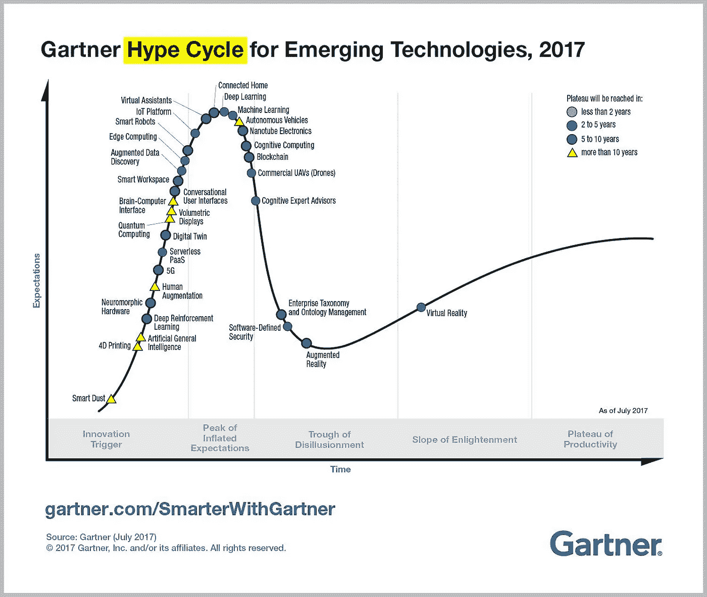
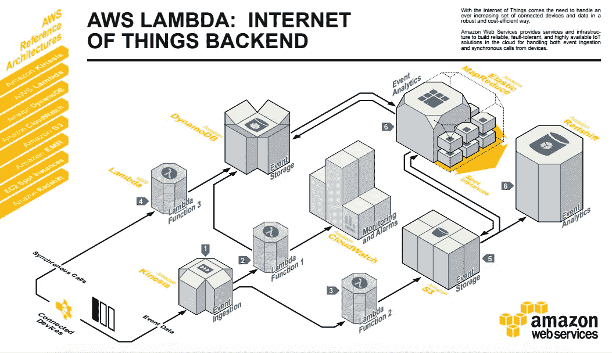
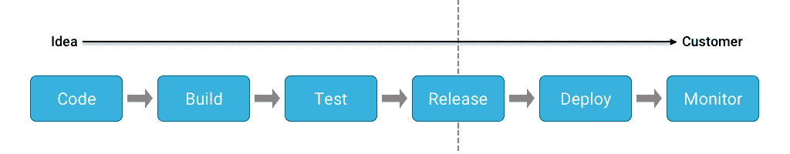
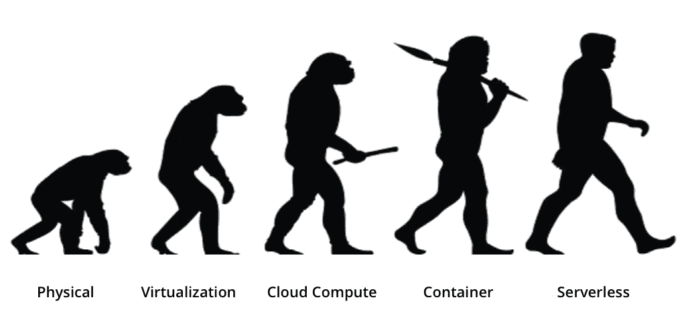

# 无服务器计算对你的创业有什么好处？

> 原文：<https://medium.com/hackernoon/how-can-serverless-computing-benefit-your-startup-67503e08f76e>

> 无限的独立性+成本效益+无限的灵活性=到处都是快乐的创业公司！
> 
> 之前曾与[初创公司](https://hackernoon.com/tagged/startup)合作过，我知道上面的等式可能看起来像一个梦想，但并非不可能实现！
> 
> **以下是方法！**

2017 年年中，Gartner 发布了一份关于新兴技术 的 [**炒作周期的报告，描绘了**](https://www.gartner.com/smarterwithgartner/top-trends-in-the-gartner-hype-cycle-for-emerging-technologies-2017/)**[无服务器](https://hackernoon.com/tagged/serverless)技术的美好未来。**

Source : [Top Trends in the Gartner Hype Cycle for Emerging Technologies, 2017](https://www.gartner.com/smarterwithgartner/top-trends-in-the-gartner-hype-cycle-for-emerging-technologies-2017/)

当时，无服务器是一个相对较新的术语，然而，它已经描绘出对于初创公司来说，它是比传统云如何**理想和高效的选择。**

但是，我还是不太相信！像我们大多数人一样！

giphy.com

但是由于炒作的原因，我还是忍不住参加了[**Serverlessconf NYC ' 17**](https://nyc.serverlessconf.io/)终结神话。那次近距离仔细观察无服务器世界的经历改变了我的想法！今天，我知道了像我们这样的人，你和我，无论大小，都可以从创业中受益。

对于科技创业公司来说，最困难的事情是在现金流进来之前获得足够的牵引力！此外，经营一家成功的初创公司是与时间赛跑:**速度和敏捷性是你必须不惜任何代价掌握的东西**！

> 唯一绝对确定的是，银行余额每天都在下降。越快越好。
> **–史蒂夫·布兰克&鲍勃·多夫**《初创企业所有者手册》

此外，开发团队来提供新产品和服务的压力也很大。为客户创造商业价值比忙于维护基础设施更重要。

初创公司有望迅速扩大规模，并提供出色的功能。随着它的发展，关注点转向可靠性、性能、成本效率、安全性和运营效率。

因此，为了**实现业务影响的可持续最短交付时间**(软件开发的主要目标)，越来越多的初创公司倾向于无服务器技术！

如果你还没有到时候，你应该考虑这个想法。你问为什么？让我们在这篇博文中简单讨论一下无服务器架构带来了什么。

# 什么是无服务器架构？

**无服务器不代表没有服务器！**我同意，术语“无服务器”很容易让人误解。肯定有服务器，但你不必担心它们的扩展、维护等。因为计算资源被用作服务。可以归类为继 monolith、微服务之后的第三代应用架构。

它基本上是一个**云模型，你只需为你的代码在云基础设施上执行的时间**付费。

换句话说，无服务器架构允许开发者以小功能包的形式部署他们的代码。代码运行的平台由云提供商管理。

这些功能在由第三方供应商管理的**服务器端无状态和事件触发容器**中执行。这些功能由各种外部资源调用，如容器、数据库、存储等。

使用 AWS Lambda 等产品，您不必管理服务发现、容器实例扩展和容器级日志记录，而这些在容器驱动的微服务架构中是必不可少的。

这对于在启动阶段工作的开发人员来说是非常好的，因为他们可以更专注于部署部分，而不是维护。

**了解更多关于无服务器架构的信息:**

1.  迈克·罗伯茨[无服务器架构](https://martinfowler.com/articles/serverless.html)
2.  [无服务器架构综合指南](https://www.simform.com/serverless-architecture-guide/)

> 在创业公司争夺市场份额的战斗中，你更愿意作为一个带着缓慢的裸机一战武器弹药的游牧民族，还是作为一个带着敏捷锋利的无服务器战士的战士？选择权在你！

# 创业公司为什么要注意？

## #1.初创公司和 MVP

鉴于无服务器带来高水平的敏捷性，它已经被初创公司广泛用于构建 [**最小可行产品(MVP)**](https://en.wikipedia.org/wiki/Minimum_viable_product)。

无服务器正在成为初创公司的一个重大转变，因为在软件/应用程序通过初始验证阶段之前，它不需要 it 资源。通过随时修改函数的灵活性，初创公司也可以利用这一点来修改他们的 MVP。

## #2.初创公司和物联网

现在已经是 2018 年了，毫无疑问，**物联网由于增加了灵活性而在转变业务运营方面发挥了关键作用**。由于物联网的实现是特定于任务的、海量的、精确的，尽管是短暂的，无服务器架构是你能想到的最合适的平台！

Source: [Serverless Reference Architecture for IoT Backend built on AWS platform](https://github.com/awslabs/lambda-refarch-iotbackend)

此外，它还提供了分布式系统架构的**优势，充分满足了物联网的需求。因此，如果以创新的方式使用，无服务器方法实际上可以帮助建立一个**稳定和高效的物联网系统。****

## #3.初创公司和各种无服务器技术

根据 [**商业资讯**](https://www.businesswire.com/news/home/20170227006262/en/7.72-Billion-Function-as-a-Service-Market-2017---Global) 的调查结果，到 2021 年，无服务器市场将达到 77.2 亿美元。对于创业公司来说，无服务器生态系统已经相当成熟，可以轻松制作应用。AWS Lambda、IBM Bluemix、裂变. io、Iron.io、Google Functions 和微软 Azure 提供了使用无服务器技术[和最小商业限制](https://www.simform.com/ecosystem-serverless-technologies/)的可用性。

听起来像是一个你可以探索更大和新的可能性的机会？绝对是。

# 无服务器架构的优势

## #1.几分钟内完成部署

**无服务器架构带来了更快部署的优势**。虽然 IaaS 可能需要几天甚至几个月的时间，但是**无服务器应用可以在几分钟内部署完毕**。此外，同一功能的并发使用可以在几毫秒内发生。

**这非常适合资金紧张的初创公司**，因为它提供了灵活的计算需求。部署的想法罢工，听起来令人兴奋！

## #2.基础设施成本节约

我认识的一个大型运输组织个人转向了无服务器架构，以解决数据库之间不可预测和缓慢响应时间的问题。这不仅实现了实时操作，还促进了实时报告和分析。

此外，这创造了一个集中的销售数据来源。由于缺乏一致性，他们的存储库中的冗余数据显著减少。结果，**该组织通过削减现有系统的维护和支持费用，每年节省 340，000 美元。**

## #3.按毫秒付费

而你的传统专用服务器可能会不停地运转并向你收取 24*7 的 T21 费用，不管是否有人使用它。然而，无服务器架构的情况并非如此。

比如我早上用我的服务器 2 分钟，下午用 4 分钟，晚上用 1 分钟，**它会正好给我充电 7 分钟或者 420000 毫秒，不多也不少**！

## #4.规模自由

我相信你同意这样一个事实:开发人员把大部分时间花在学习服务器如何工作上，而不是开发新产品，不是吗？

还有就是服务器需求，软件，CPU 资源什么的都有顾虑！然而，使用无服务器，所有这些事情都由提供商管理，包括横向扩展！**你所需要做的只是编写函数并点击部署！**

## #5.您选择的语言

为特定语言的服务器雇佣各种各样的开发人员对于创业公司来说不是一个可行的选择，不是吗？然而，这些都是过去的事情，在无服务器架构中使用多种语言是可行的。

你可以让 python 开发人员、node.js 开发人员和 C#开发人员、**一起为一个目标**工作，他们中的任何人都不需要学习一门新语言！

# 案例研究:HeavyWater Inc .如何使用无服务器架构将其 AWS 账单从 9 月的 3 万美元降至 12 月的 4 万美元

HeavyWater Inc. 是一家初创公司，专注于使用**基于人工智能的虚拟助理**来促进业务流程外包，其基础设施完全建立在 AWS 上。

在最初的时候，该产品涉及批处理文件处理，其编排基础设施是使用 24*7 被监视和执行的 **SWF** 和 **EC2** 实例构建的。然而，该架构存在一些缺陷。

## 史诗问题

当时，EC2 实例的大小为 [t2.micro](https://aws.amazon.com/ec2/instance-types/) ，但是，AWS 计费持续增加。在 4 个月内，运行了 1000 个 EC2 实例，成本从 1 万美元增加到 3 万美元。

即使花费了所有的钱，输出仍然是一个问题，24 小时内平均 4000 个文件。

他们最初认为失败与他们的代码库有关。然而，事实并非如此！经过 2 个月的试错时间，AWS 支持团队建议他们考虑 [**步骤功能**](https://aws.amazon.com/step-functions/)**[**λ服务**](https://aws.amazon.com/lambda/) **。****

**神奇就这样开始了！**

## **下一步是什么？**

**这是否有助于满足他们的要求，尤其是降低成本，这是一个很大的难题。此外，**[**无服务器性能**](https://www.simform.com/serverless-performance/) **能无缝满足他们的需求吗？******

****他们首先将所有微服务转换为 AWS Lambda 功能。与此同时，他们也开始将最小的工作流程转换成步骤功能。****

****在从微服务迁移到 AWS Lambda 的过程中出现了许多问题。然而，结果是相当积极的！****

## ****结果呢？****

****直接结果包括以下内容:****

*   ******计算成本的下降趋势。******
*   ******批处理时间从 24 小时减少到 16 小时，并且持续减少。******
*   ******EC2 实例数量减少到 211 个。******

****然而，最大的好处是由于最少的监控而节省了时间，因此他们有更多的时间来设计未来的服务。这难道不是所有创业公司都应该关注的吗？****

# ****结论****

****无服务器正在与日俱增，它比你想象的要广阔得多！****

****作为一家技术初创公司，您可以充分利用无服务器架构的潜力。开发团队可以专注于改进编码标准，而不是为他们的应用维护和提供计算资源。因此，您可以将所有的注意力集中在打造您的客户会喜欢的完美产品上！****

******想多谈谈无服务器？在 Twitter 上与我联系**[**@ RohitAkiwatkar**](https://twitter.com/RohitAkiwatkar)****