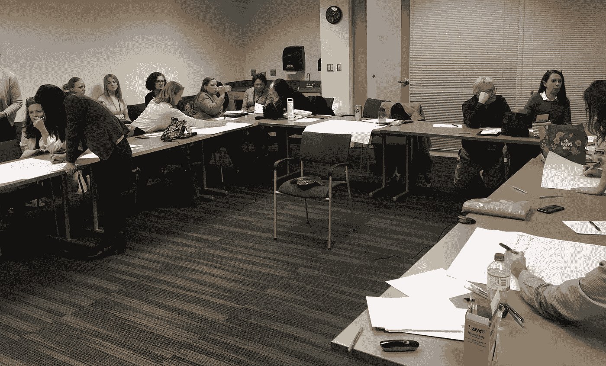
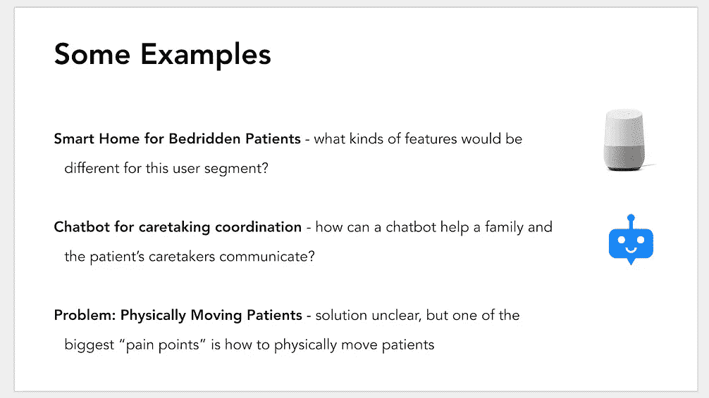

# 技术如何改善临终关怀和姑息治疗？

> 原文：<https://medium.com/hackernoon/how-can-technology-improve-end-of-life-and-palliative-care-c2828693f68f>

## 科罗拉多丹佛大学的医生、牧师和姑息治疗专家对技术+姑息治疗的经验进行了头脑风暴。

P**allialive care**在医学领域是一个相对较新的概念。历史上，医学的主要目标是治疗。然而，姑息治疗并不是专注于治愈晚期确诊患者，而是缓解症状、疼痛和相关的精神压力。

随着医疗保健的大多数趋势，包括姑息医学，我们看到技术的使用增加了对病人的护理。我们已经看到了令人难以置信的项目和想法，如智能药丸分配器、虚拟团体治疗等。但是姑息治疗和技术的交集呢？

为了进一步探索这一交汇点，我与科罗拉多大学丹佛医学院副教授 David Bekelman 博士合作举办了一场技术+姑息治疗头脑风暴会议。助理教授 Jenny Portz、Bekelman 博士和我在[姑息医学杂志](https://www.liebertpub.com/doi/abs/10.1089/jpm.2018.0126?url_ver=Z39.88-2003&rfr_id=ori%3Arid%3Acrossref.org&rfr_dat=cr_pub%3Dpubmed&)上发表了我们的发现。

A snapshot of the technology + palliative health care brainstorm session at CU Denver.

# 该会议

我们以一次独立的头脑风暴开始了一个小时的会议，然后转入小组讨论。参与者被给予一组初始的例子来让他们思考，但是他们被鼓励“大胆思考”

# 这些想法

这些想法大相径庭，从理解预先指令的更好方法(病人在丧失行为能力的情况下想要什么)，到鼓励绝症病人找到生活意义的方法。以下是我们在头脑风暴会议中注意到的四个主要趋势:

*   独立:自主是让病人快乐并感觉能掌控自己生活的重要部分。科技在这里扮演着重要的角色:智能家居、智能手表和其他设备如何让老年人感到舒适独立？
*   讲述他们的故事:在生命的尽头，让人们觉得他们有一个故事是很重要的，这是一个充实的故事，为他们的生活提供了意义。技术拥有各种新媒体，包括虚拟现实和语音辅助技术，使老年人能够记录和分享他们的个人故事。
*   **孤独**:在生命的尽头，很难感受到联系，很容易感到孤独。我们如何利用社交媒体和语音辅助技术来帮助患者减少孤独感？
*   **与护理人员的沟通**:有一个庞大的个人网络帮助一个特定的绝症患者的生活变得更容易忍受。技术可以帮助协调和联系各种护理人员(牧师、家庭成员、医生、护理人员等。).

# 走向

已经有学术和创业企业在探索技术和姑息治疗的交集。然而，仍然需要更多的创新和更深入的领域分析。

技术可以帮助姑息治疗的最优先方式是什么？或者说，姑息治疗有哪些领域不需要技术创新？查看我们在[发表的期刊文章](https://www.liebertpub.com/doi/abs/10.1089/jpm.2018.0126?url_ver=Z39.88-2003&rfr_id=ori%3Arid%3Acrossref.org&rfr_dat=cr_pub%3Dpubmed&)中的完整列表，或者直接联系我！

我希望这篇文章能启发你思考一些技术和临终关怀的含义，以及创新的机会。如果你觉得这篇文章有帮助，你可以鼓掌👏来支持。

以下是我写的一些你可能感兴趣的文章:

*   [运行世界上最大的精神健康黑客马拉松](https://hackernoon.com/hackmentalhealth-2018-the-movement-has-begun-effe82ea1932)
*   [我为什么要发送年度友谊反馈邮件](/@stervy/why-i-send-annual-friendship-feedback-emails-fa20bf513634)
*   [我在 Reddit 上听情感脆弱的陌生人说话](/@stervy/i-listened-to-emotionally-vulnerable-strangers-on-reddit-c1f70ae727ed)