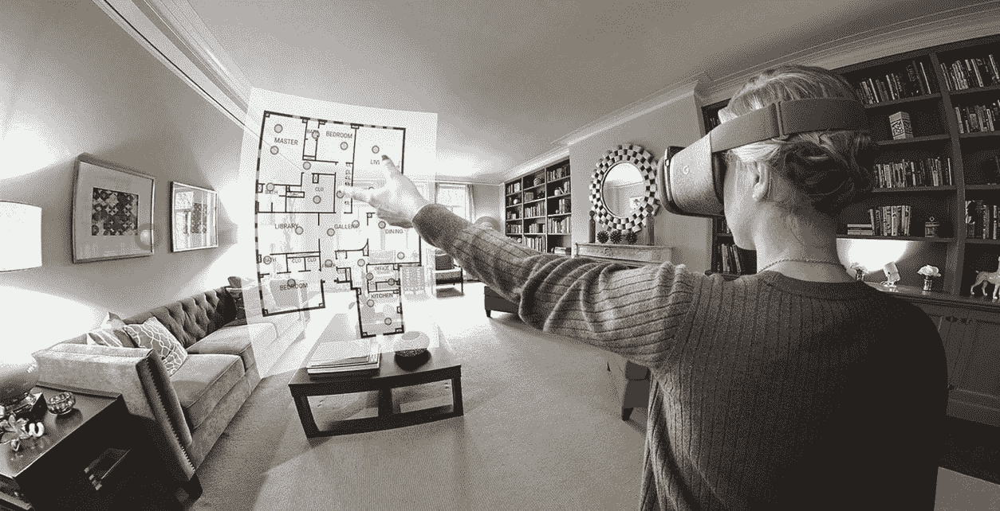
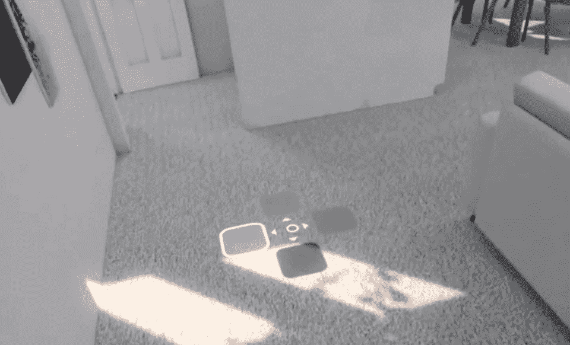
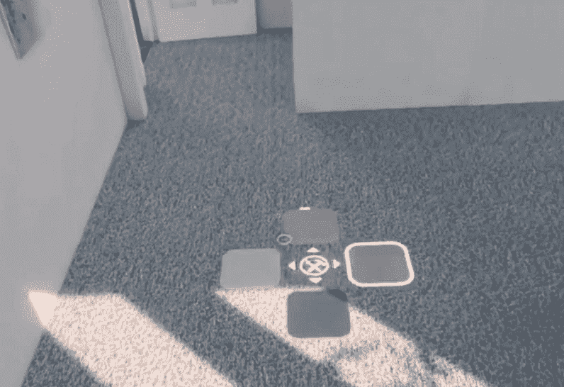
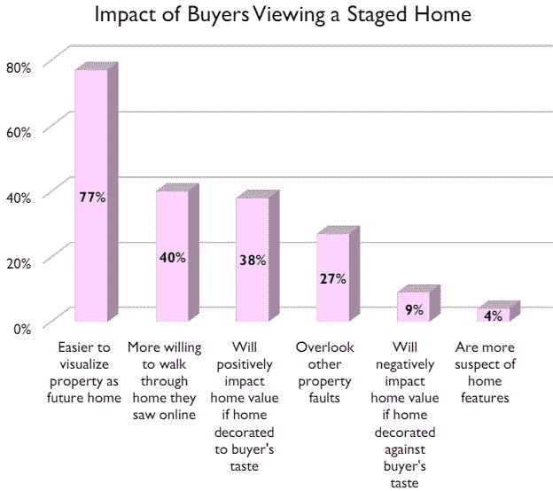
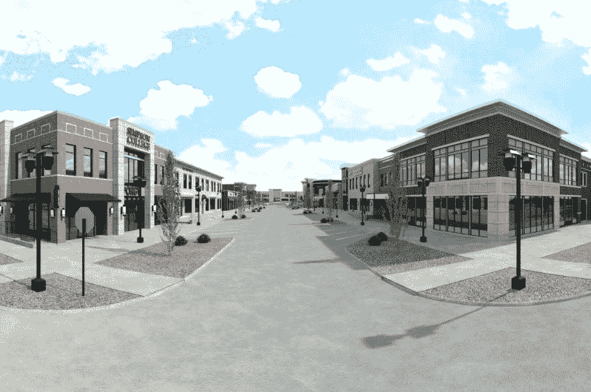
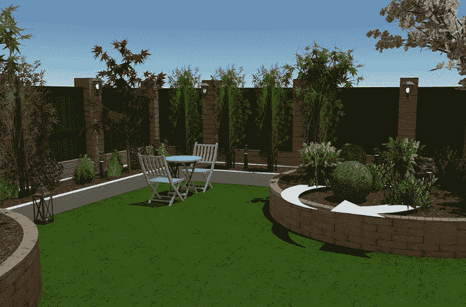

# VR 如何提升你的房地产生意？

> 原文：<https://medium.com/hackernoon/how-can-vr-improve-your-real-estate-business-dac076603fc8>

## 什么是房地产业务中的虚拟现实？

虚拟现实为人们提供了人工的逼真环境。需要它做什么？这将有助于人们虚拟参观他们感兴趣的房子。潜在客户不再需要离开他们自己的房子，而他们正在选择一个新的财产购买。此外，人们甚至可以在联系房地产经纪人之前进行虚拟旅游。它为房地产经纪人和客户都节省了时间。此外，顾客可以看到房间的大小比例，天花板高度和其他他们认为重要的东西。

为什么 VR 可以让一个房产经纪人的工作更有效果？因为他们有更多的时间与已经找到所需房产的买家合作。

## 表面可以定制

因此，客户不仅可以通过虚拟现实参观房产，还可以定制他们想要的任何表面。墙壁，地板，织物，家具模型，甚至柜台都可以根据自己的口味进行改变。

## 虚拟登台

根据全国房地产经纪人协会(NAR)的数据，77%的买家经纪人表示，分期付款可以让买家更容易将房产想象成未来的家。

55%的人认为客厅的布置更重要，51%的人认为主卧更重要，41%的人认为厨房更重要。

因此，在虚拟现实的帮助下，代理商可以为分期付款的财产进行惊人的旅行。

## 建筑可视化

房地产经纪人总是面临着如何销售尚未建造的房产的问题。你可以看到展示社区的 3D 模型。这些模型帮助买家想象建筑。

## 园林设计

根据国家园艺协会 Trendnomics 的调查，99%的房地产调节员认为好的景观设计更能吸引买家，增加销售额。

多亏了 VR，找公寓或房子住，变得更有趣，也不那么紧张了。人们可以自己选择，不必花钱在不同的房子上花大价钱。当然，这项新技术节省了时间，因为买家再也不用离开他们的房子了。所有的游览都可以通过 VR 来完成，并且在每个平台上都可以使用。

房地产经纪人可以更有效地工作，花更多的时间来制作令人惊叹的舞台，热点，并考虑表面定制的变体。

这就是 VR 如何改变房地产业务，当每一方都从中受益。