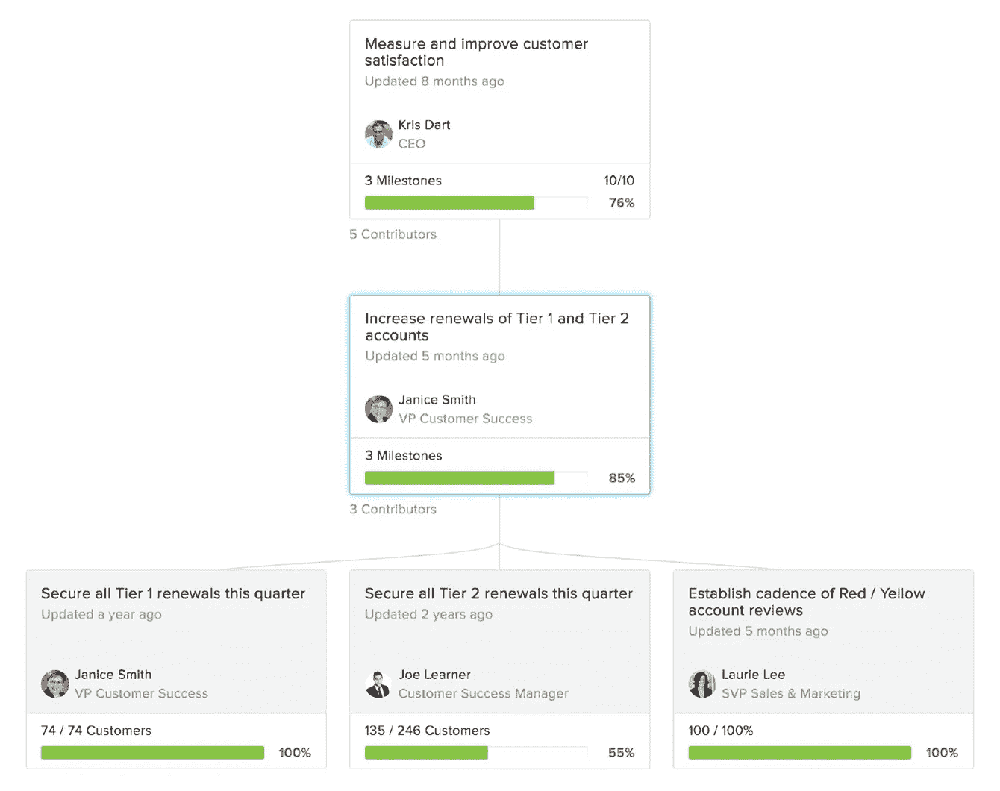

# 如何为新时代的员工敬业度建立绩效管理体系？

> 原文：<https://medium.com/hackernoon/how-can-you-build-a-performance-management-system-for-the-new-era-of-employee-engagement-d6a5bb070ad7>

为了检查员工的绩效，典型的做法是每年进行一次绩效评估。在这些评估中，员工评估自己的表现。他们还会收到来自经理的数字分数形式的评估。在听取同事和团队领导的反馈后，员工可能会得到加薪。或者如果他们的表现不令人满意，他们可能会被解雇。

绩效评估通常是每年一次的谈话。怪不得不相关，没意义，浪费时间。

事实上，只有 14%的企业对他们目前的绩效管理系统感到满意。这些系统中的大多数已经使用了 60 多年。但是今天的劳动力需求已经发生了变化。组织性质的改变创造了新的商业机会。

在本文中，我们将讨论如何构建下一代绩效管理解决方案，在满足当今员工的需求和期望的同时，提供对员工绩效的可衡量和有意义的见解。

# 绩效管理的新方法是什么？

千禧一代是美国劳动力中最大的一代。他们精通技术，富有创造力，对工作场所很挑剔。为了更好地留住他们，公司需要重新思考他们的绩效管理策略。

传统的绩效管理解决方案只为人力资源经理设计。他们擅长自动化绩效评估和存储员工数据。但是它们并没有帮助员工感觉到与他们的组织有更多的联系。

公司的战略目标之一是留住关键人才。然而，跟踪绩效评估不足以实现这一点。员工希望知道他们的公司重视并欣赏他们。对成就的频繁反馈和认可有助于提高员工的忠诚度。

从自上而下的层级和评级，我们正在转向自下而上和以反馈为中心的方法。以下是传统绩效管理方法和新方法之间的一些差异:

*来源:* [*BetterWorks*](https://www.betterworks.com/)

一些公司已经开始改变他们的绩效管理方法，用一种叫做员工敬业度的方法取代传统方法，因为员工对公司越投入，他们的工作表现就越好。

这些公司想要灵活、易用的工具，帮助人们对自己的工作更加满意。

# 现代绩效管理系统应该提供什么？

现代绩效管理解决方案是以员工为中心的。它们本质上是员工自助服务系统。这意味着所有团队成员都使用它们，而不仅仅是人力资源经理。这些系统提供:

*   实时、一致的反馈
*   目标共享和敏捷目标管理
*   认可最重要的人的成就
*   与人们日常使用的通信工具集成
*   移动接入

[反思型](https://www.reflektive.com/)、[改善型](https://www.betterworks.com/)和[小改进型](https://www.small-improvements.com/)是三种高效的绩效管理产品。他们的核心功能基于两大支柱:目标管理和持续反馈。

# 目标管理

为了取得成果和提高绩效，员工需要有明确的目标。有了明确的目标，工人们就确切地知道他们需要做什么，并从工作中获得更多的满足感。

在许多公司，目标设定每年只进行一次。当一年结束时，这些公司重新审视他们一年前设定的目标。但这些目标往往不再相关。

根据 Deloitte 的调查，每季度关注目标的公司比每年关注目标的公司绩效和保留率高 30%。

您的绩效管理系统需要帮助用户持续管理他们的工作目标。员工应该能够设定每周、每月和每季度的目标。他们还应该能够与经理分享他们的目标并跟踪进展。

要构建目标管理功能，最好依赖于一个经过验证的方法。

# OKR 管理方法论

目标和关键结果(OKR)是约翰·杜尔登于 1999 年为谷歌创立的一种管理方法。

OKR 的理念是将员工的工作与公司的战略目标联系起来。目标是整个组织都想实现的宏伟目标。关键结果是定义特定员工如何帮助实现目标的可衡量任务或里程碑。

重要的是要有数量有限的关键结果，这样员工才不会感到超负荷。在 OKR 框架中，每个里程碑都需要有一个截止日期。追踪目标的进展会让你更容易保持专注。

BetterWorks 将 OKR 系统用于其目标管理功能，设定自下而上、跨职能、对整个组织可见的目标。

*better works 的 OKR 目标。图片来源:*[*BetterWorks*](https://www.betterworks.com/)

如何为您的绩效管理解决方案开发目标管理功能？您的系统需要让用户:

**1。创建目标**

用户应该能够创建目标，并添加可测量的里程碑来达到这些目标。例如，产品经理的目标可能是这样的:

*   将产品的每日参与度提高 3%

此目标的可衡量里程碑可能包括:

1.  在 10 月 1 日前采访 100 名客户
2.  在 10 月 2 日前安排 10 次 A/B 测试

与 Reflektive 一样，您可以让用户将目标设置为公开的或私人的。

**2。更新目标进度**

用户应该能够跟踪他们的每个目标和里程碑的进展，并查看其他人正在做什么。他们也应该能够看到他们的目标和其他人的目标是如何交叉的。

应该方便员工更新状态。您可以将目标受众在日常工作中使用的工具集成到您的应用程序中。这些工具可以是项目管理工具，如 Trello、Asana 或吉拉，也可以是 CRM 系统，如 Pipedrive。例如，BetterWorks 整合了 Gmail、Slack 和 Salesforce。

**3。在目标上合作**

您可以添加备注，让员工、同事和经理讨论目标。这就是小改进的作用。当一名员工对小的改进发表评论时，他们的同事会通过电子邮件和 Slack 得到通知。

**4。安排签到**

签到是 Adobe 引入[的常规交流做法，而不是年度评审。签到的想法是让员工和经理就目标进行讨论。这个系统有助于把合适的人留在公司。它有助于管理早期工作不成功的员工。](http://fortune.com/2015/06/16/adobe-employee-retention/)

签到帮助 Adobe 提高了员工的工作效率。自从 Adobe 开始签到以来，他们的股票价格已经从大约 30 美元涨到 80 多美元。我不知道这是否与签到有直接关系。

Reflektive 和 BetterWorks 都提供签到服务——由员工完成并与经理分享的简短调查。在员工完成一项调查后，他们会与他们的经理一起深入讨论他们的进展。

*图像来源:* [*反射式*](https://www.reflektive.com/)

# 持续反馈

持续反馈是现代绩效管理系统的第二个支柱。

提供反馈对参与和保持至关重要。但是要想有效，反馈必须是定期的和即时的。千禧一代希望他们的努力能立即得到认可。他们不仅重视来自经理的反馈，也重视来自同事的反馈。

有很多方法可以将持续反馈功能放入您的应用程序中。让我们看看 Reflektive、小改进和 BetterWorks 提供的反馈功能。

# 实时反馈

在 Reflektive 中，用户可以随时向他们的经理或同事请求反馈。经理也可以代表他们的员工请求反馈。Gmail、Outlook 和 Slack 用于在有人要求反馈时通知员工。

# 一对一的会议

使用一对一的模块，小的改进用户可以建议谈话要点。这些是员工希望与经理讨论的问题。谈话要点有助于制定会议议程。在会议期间和会议结束后，一对一的用户可以在应用程序中做会议笔记，以确保他们不会忘记任何重要的事情。

# 承认

识别功能对于绩效管理系统非常重要。表扬员工可以激励他们更好地工作，提高他们的生产力。大多数现有的绩效管理系统包括识别功能。

例如，Reflektive 允许用户在应用程序的识别墙上张贴积极的反馈，让所有人都能看到。这些帖子也在 Outlook、Gmail 和 Slack 上分享。

小改进提供有趣的荣誉徽章。用户可以自定义它们，并与所有人分享。徽章给日常工作增加了游戏化。

*徽章。图片来源:* [*小改进*](https://www.small-improvements.com/)

# 360 度反馈

360 度评估让员工从同事那里获得反馈。在小的改进中，员工可以指出他们希望谁来审核他们。然后，审阅者会收到一封电子邮件通知，其中包含该审阅的链接。

评审者回答问题，并可以查看关于被评审者的历史反馈。这种反馈将评审放在上下文中，包括一对一谈话、表扬、签到和其他形式的反馈的记录。

# 绩效评估

绩效考核作为一个独立的功能对于绩效管理系统来说是不必要的。频繁的反馈可以替代绩效评估。

然而，人们仍然使用绩效评估这个术语。Reflektive 为用户提供了三种类型的绩效评估:自我评估和经理评估，360 度评估，以及签到或轻量级对话。

小改进绩效评估总结了用户收集的所有反馈。这包括来自同事的评估、与目标相关的反馈以及一对一会议的记录。

*同事反馈。图片来源:*[*BetterWorks*](https://www.betterworks.com/platform/peer-feedback/)

# 人力资源软件领域的竞争

人才管理软件市场竞争非常激烈。有很多小众玩家和具体的解决方案。例如， [BlackbookHR](http://www.blackbookhr.com/) 、 [tinyHR](http://www.tinyhr.com/) 和 [CultureAmp](http://www.cultureamp.com/) 只专注于获取员工的反馈。

主要的人力资源管理软件供应商包括 IBM、Oracle、Lumesse、Cornerstone on Demand 和 SAP SuccessFactors。他们提供完整的基于云的套件，涵盖招聘、学习、绩效管理、人才管理和分析。

图片来源: [SlideShare](https://www.slideshare.net/JeffMonk/hcm-overview-2015)

这些系统的核心特征通常是商品化的和复杂的，并且通常与企业资源规划软件集成。这使得用户的生活更加复杂。

小型供应商专注于创新和简单——这正是现代消费者想要的。

根据人力资本趋势的一项研究，易用性和集成的用户体验是客户购买人力资源软件的首要标准。

为了击败竞争对手，您的解决方案需要提供简单的用户界面，并且必须与员工日常使用的工具(如 Slack、Gmail 和 Outlook)相集成。你的绩效管理应用需要以员工为中心。因为你的大多数用户可能是千禧一代，所以它需要迎合他们的喜好和需求。

# 用 SteelKiwi 设计和开发您的人力资源软件

如果您希望构建一个创新的绩效管理解决方案，我们将非常乐意为您提供帮助。点击阅读更多关于我们服务的信息[。](https://steelkiwi.com/services/)

最初发表于[https://steelkiwi.com](https://steelkiwi.com)