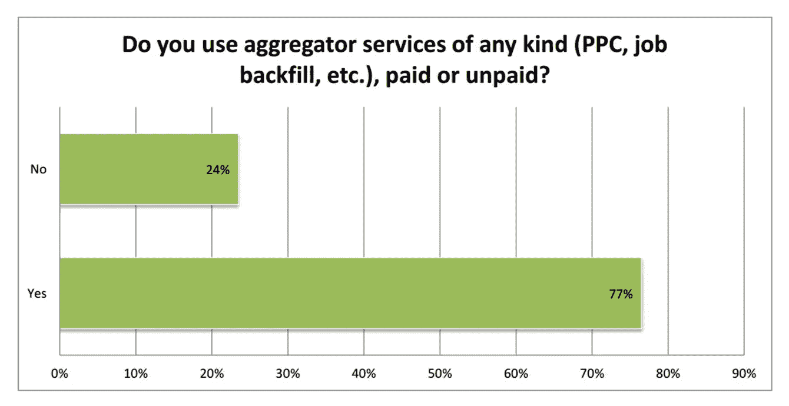
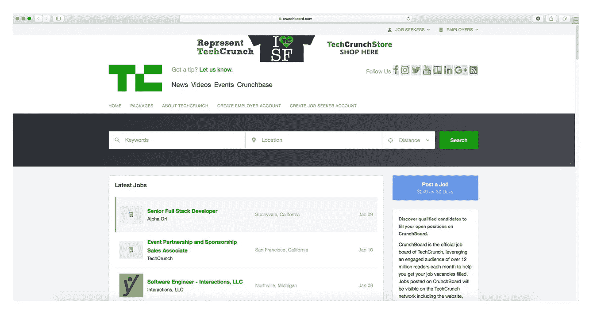
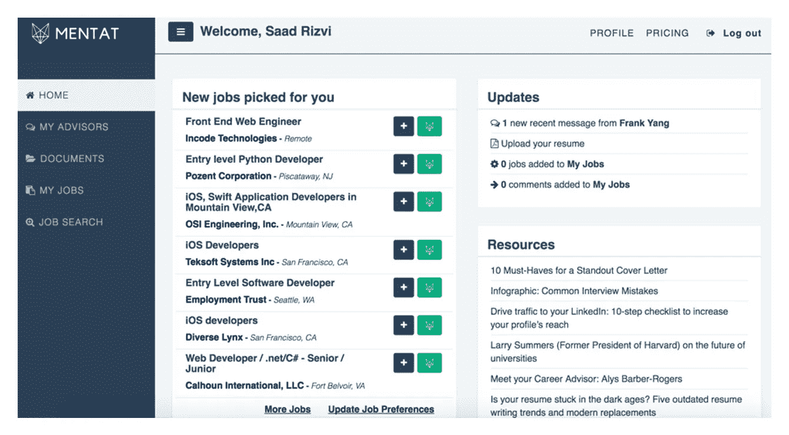
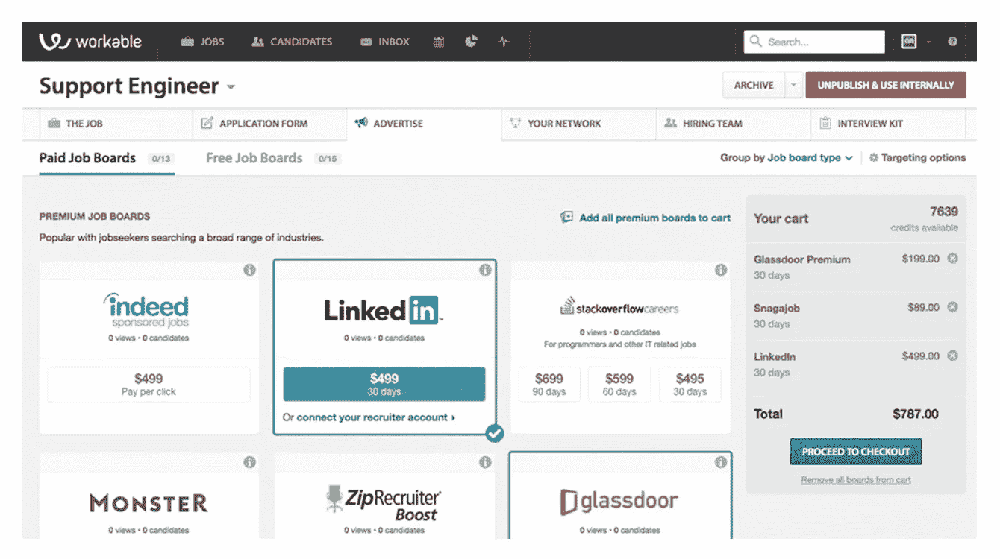

# 你如何建立和赚钱的工作聚合器？超越 PPC 的 7 种商业模式

> 原文：<https://medium.com/hackernoon/how-can-you-build-and-monetize-a-job-aggregator-7-business-models-beyond-ppc-c7f0c0f790e3>

求职工具和招聘软件市场受到选择的困扰。从工作公告板到工作聚合器，再到社交网络，再到雇主品牌和采购工具，有大量的解决方案来填补职位空缺。在本文中，我们将讨论作业聚合器的开发。

工作聚合器不是尖端技术。但它们在招聘行业被广泛使用。2000 年代中期，工作聚合器出现了，取代了在线工作平台。根据 Smartjobboard 的数据，今天，77%的求职网站使用聚合器来发布他们的工作。

*图片来源:Smartjobboard*

建立一个工作聚合器有很好的商业意义。但是为了盈利，你需要选择一个有竞争力的商业模式。

我们将讨论工作聚合器的七种可能的商业模式。但首先，让我们弄清楚工作聚合器是如何工作的，以及它们的弱点是什么。

# 工作聚合器是如何工作的？

类似于谷歌，工作聚合器是一个搜索引擎。它汇集了发布在各种工作公告板上的工作。任何聚合器的核心价值都是数据和高级搜索功能。

要获取职务聚合器的数据，您可以将职务从职业页面和职务公告板复制到数据库中。一些职位发布网站提供 XML feeds，可以更快地向聚合器发布职位。

为了建立一个搜索引擎， [SteelKiwi](https://steelkiwi.com/) 推荐 [Elasticsearch](https://www.elastic.co/products/elasticsearch) 和 [Algolia](https://www.algolia.com) 。Elasticsearch 是一个开源解决方案，用于在不同类型的数据结构上实现搜索操作。如果你想避免额外的费用，这是一个很好的选择。Algolia 是一项基于云的服务，起价为每月 35 美元。

# 工作整合者的问题

工作聚合器和其他工作搜索工具的主要目的是为合适的人匹配合适的工作。但这并不是工作聚合器所擅长的。虽然他们给雇主带来了很多候选人，但由于工作聚合器，实际雇佣的人数并不多。

工作聚合器向数百万寻找工作机会的人展示工作列表。这导致许多不合格的候选人申请工作。

找不到合适的候选人是求职聚合网站供应商面临的一个挑战。另一个是缺乏吸引求职者的功能。

许多聚合器使用点击付费模式赚钱，公司付费广告他们的工作。换句话说，工作聚合器被优化以满足雇主的需求。但是求职者的需求呢？

正在找工作的人经常会被招聘信息栏、聚合器和社交网络上的大量空缺职位弄得不知所措。机会那么多，求职者却不一定从数量上受益。

# 你如何建立一个能给求职者和雇主都带来价值的聚合器？

发现是招聘行业面临的主要挑战之一。如果你想建立一个成功的工作聚合器，你需要简化雇主和求职者的发现过程。

一个好的商业模式需要回答三个问题:**客户看重什么？你将如何赚钱？你将如何以适当的成本向客户提供价值？**

让我们讨论一下工作聚合器的七种可能的商业模式。

# 工作整合商的商业模式

## 1.利基工作聚合器

你的工作聚合器可以关注特定行业的工作机会。对雇主和求职者来说，针对性强的求职网站比一般的求职网站更有吸引力。

例如， [Oilwork](https://oilwork.io/) 汇集了石油和天然气行业的工作岗位，并提供高级搜索功能。用户可以输入“阿布扎比的电气工程师”,得到与特定查询相匹配的结果。

另一个想法是开发一个聚合器，专注于高管和专业人士的职位空缺。 [ExecThread](https://execthread.com/) 是一个由高管组成的点对点网络，他们彼此分享工作。这个聚合器利用了没有公开广告的职位空缺市场。ExecThread 帮助高管发现新的职业机会，并帮助招聘经理找到最佳候选人。

对于高流量的博客和社区来说，创建一个利基工作聚合器是一个好主意。CrunchBoard 和 Smashing Jobs 是软件开发公司的工作板的例子。TechCrunch 和 Smashing Magazine 在他们现有的社区基础上建立了他们。

*嘎吱嘎吱。图片来源:JobBoard*

你可以通过出售职位或出售求职者数据库来赚钱。或者你可以通过点击付费模式销售广告。

## 2.礼宾服务

增值服务是区分工作聚合器的有效方式。这些服务可能是什么？

根据 Jobvite 最近的一项研究，招聘人员倾向于雇佣他们认识的申请人。整整 72%的新员工来自员工推荐和内部申请人。如果招聘人员在内部招聘这么多人，那么让求职者在合适的人面前拿到简历或许是至关重要的？

Mentat 是一个将员工与决策者和招聘经理联系起来的工作聚合器。人际网络是获得工作的最佳途径，Mentat 帮助他们的用户做到了这一点——与招聘人员直接联系。

Mentat 有两种商业模式。他们通过每月 29.99 美元的订阅服务赚钱，还提供每月 249 美元的礼宾服务包。该公司有 50 名顾问，帮助求职者优化他们的 LinkedIn 个人资料和简历，撰写求职信，并代表申请人申请工作。

Mentat 对教育机构也有一个有趣的价值主张。在 Mentat 的帮助下，学校可以保证自己的毕业生毕业后得到面试。

*明塔。图片来源:TechCrunch*

提供礼宾服务的工作聚合器是一种具有挑战性的商业模式。要让它发挥作用，你需要有一个强大的招聘经理和招聘人员网络。你需要确保他们的招聘支出获得良好的投资回报。

对于提供招聘咨询服务的机构来说，在线礼宾服务是一个巨大的进步。

## 3.职业门户

你的工作聚合器可以成长为一个职业门户——一个提供有用资源帮助人们找到工作的网站。这些资源可能包括提供职业建议、课程和培训、网络研讨会、播客和视频的文章库。职业门户可以收集行业新闻，并提供事件和工作机会的目录。

[Paragon One](https://www.paragonone.com/) 是职业门户的一个例子。这是一个面向学生的在线辅导服务和导师市场，帮助他们在美国找到工作和实习机会。

职业门户网站有很多赚钱的方法。你可以从教育机构和职业服务机构发布的赞助内容中赚钱。您还可以收集有关门户用户的数据，以便为活动组织者、职业顾问和其他服务提供商创建有针对性的营销活动。

## 4.一键式职位发布服务

一键式发布服务让招聘人员可以同时在多个招聘板上发布职位，从而提高广告的可见性。一键式职位发布服务在免费和高级职位公告板上发布职位。免费工作板包括 Indeed 和 Glassdoor。高级职位包括通用的求职网站，如 CareerBuilder、LinkedIn 和 Monster，以及 GitHub 和 StackOverFlow 等小众职位。

除了在求职网站上发布职位，你还可以在社交网络上推广招聘广告，投放横幅广告，向求职者发送分段的电子邮件。

许多招聘工具——例如， [Recruitee](https://recruitee.com/post-job-online) 和[Workable](https://www.workable.com/post-jobs-get-applicants)——提供一键发布职位的服务，作为其主要服务的一部分。

*图片来源:可行*

要从自动职位发布服务中赚钱，你可以使用按职位付费、按点击付费或按申请人付费的模式(雇主为他们收到的申请付费)。

## 5.数据收集器

职位付费和点击付费并不是工作聚合器唯一的盈利模式。招聘信息对雇主来说是完全免费的。一旦你收集了足够多的求职者资料、申请和简历，你就可以通过出售用户数据来赚钱。

这种类型的商业模式需要用户帐户，求职者可以在其中注册、上传简历和填写个人信息。

## 6.程序化招聘平台

为了填补空缺职位，招聘人员使用营销策略。他们在工作聚合器和工作论坛上购买广告位置，以接触潜在的员工受众。这类似于营销人员在网站上购买空间的方式，受众在网站上消磨时间。

营销的程序化广告依赖于处理大规模数据集的算法，以确定哪些广告应该在什么时间出现在哪个网站上。

但由于传统广告的规模无法与招聘广告的规模相比，程序化招聘广告平台的功能有点不同。他们的软件是基于规则的，所以规则管理招聘广告预算。

例如， [Recruitics](https://recruitics.com/products/action.html) 用户设置的规则可能是这样的:

*   如果我在纽约的 Python 开发人员职位只有不到 10 个申请者，那么就把出价提高到 1.50 美元。
*   如果我的 Python 开发者工作有 20 个申请人，那么停止在这个工作上的花费。

Recruitics 的程序化广告套餐起价为每月 499 美元。

*图片来源:Recruitics*

[Appcast](http://www.appcast.io/) 又是一个程序化的广告平台。他们采用按申请人付费的定价模式，并在 10，000 多个网站上拥有超过 1.2 亿名候选人。

## 7.专业网络

我们列表中的最后一个商业模式是最难创建的。要实现这一目标，你首先需要解决先有鸡还是先有蛋的问题，并找到一个可以与其他社交网络竞争的价值主张。

专业的人脉是建立在人脉基础上的。它可以连接特定专业领域或某个国家的公司和个人。例如， [CreativePool](https://creativepool.com/) 是一个由创意行业的专业人士组成的网络。 [AngelList](https://angel.co/) 连接创业公司和投资者。而 [Xing](https://www.xing.com/) 是德国的一种 LinkedIn。

建立[招聘业务](https://steelkiwi.com/expertise/recruitment-software-development/)的方法有很多。你可以为你的工作聚合网站结合不同的商业模式。你可以一直使用经过验证的安全的点击付费广告模式。

# 用 SteelKiwi 构建一个工作聚合器

无论您选择什么样的商业模式，我们都乐意支持您的软件开发工作。我们拥有为网络和移动平台开发招聘软件的专业知识。点击阅读更多关于我们专业知识的信息[。](https://steelkiwi.com/expertise/recruitment-software-development/)

最初发表于[https://steelkiwi.com](https://steelkiwi.com)