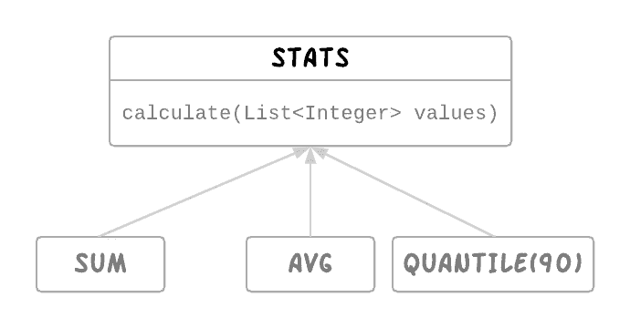

# 如何创建具有不同行为和相关值的灵活枚举？

> 原文：<https://medium.com/hackernoon/how-can-you-create-flexible-enums-with-different-behaviors-and-associated-values-ed42c69be02e>

## 科特林密封类的力量

枚举对于分组具有相似行为的对象非常有用。它们的效率也很高，因为只需要创建它们的一个实例。然而，很难为行为稍有不同的类实现枚举。我举个例子说明一下。

## 示例:统计计算器

假设我们想写一个统计计算器来计算数值列表的数理统计，例如`SUM`、`COUNT`、`AVG`、`QUANTILES`。让我们首先定义一个接口。

现在，我们可以很容易地将不同的统计数据表示为如下枚举:

我们可以这样使用它:

这很容易，但是一旦想要支持`QUANTILE` stat 就变得很难了，它需要存储*百分点*以便在 enum 实例中计算。对于例`QUANTILE(90).calculate(values)`应计算第 90 个*百分位值。*

# *用不同的行为实现枚举的问题*

*   *由于 Java 枚举必须有相同的字段，我们必须给所有枚举添加百分点字段，尽管这与`AVG`、`SUM`、`COUNT`无关。*
*   *我们事先不知道百分比值来静态创建分位数的实例。所以不能再枚举了。*
*   *一旦我们将它们转换成常规类，我们将失去它的默认单例行为。*

*我们基本上想要简单的统计数据`AVG`、`SUM`、`COUNT`作为单件，但是`QUANTILE`作为给定百分比值的动态创建的类。我们必须编写大量的 boiler plate 代码来支持这种行为上的差异，他就是这样做的一种方式。*

*那是许多工作。*

**

## *科特林的密封类拯救*

*Kotlin 有强大的密封类来轻松解决这类用例。*

*我们先来了解一下什么是密封类:*

> *密封类用于表示受限的类层次结构。在某种意义上，它们是 enum 类的扩展。
> 
> 一个密封的类可以有子类，但是所有的子类必须在同一个文件中声明。密封类的子类可以有多个包含状态的实例。
> 
> 你可以在密封类内部或者外部声明子类，但是它们必须在同一个文件中声明。*
> 
> *密封类本身是抽象的，它不能被直接实例化，并且可以有抽象成员。*
> 
> *密封类不允许有非私有构造函数(默认情况下，它们的构造函数是私有的)。*

*现在，我们知道了密封类，让我们看看如何使用密封类来实现 StatsCalculator*

*让我们像这样为每个属性创建一个密封的属性类和子类。*

*Kotlin 支持在单行中创建单例的对象声明。语言本身支持准确定义我们想要的东西:*

*   *简单的统计数据`AVG`、`COUNT`、`SUM`使用对象声明作为单例。*
*   *`QUANTILE`被定义为存储百分位值的常规类。*
*   *所有这些类都组合在一个密封基类`Stats`中。*

*现在，这种计算方法可以用简洁明了的方式实现了。*

*代码不仅简洁，当 表达式时 ***的美丽帮助我们避免运行时潜在的错误。****

*由于 ***当*** 表达式用于直接返回值时，如果我们添加一个新的 stats 比如说`MAX`扩展`Stats`但是忘记更新 calculate 方法，编译器就会抛出错误。*

> *“when”表达式必须是详尽的，请添加必要的“Max”分支或“else”分支。*

*这对于密封类是可能的，因为所有的子类都在同一个文件中声明，所以编译器知道所有可能的值。*

## *密封类什么时候有用？*

*密封类的概念并不新鲜。密封的类允许我们轻松地处理代数数据类型。类似的功能在其他语言中也可用，如*

*   *[Scala 中的案例类](https://docs.scala-lang.org/tour/case-classes.html)*
*   *[Swift 中带有关联值](https://developer.apple.com/library/content/documentation/Swift/Conceptual/Swift_Programming_Language/Enumerations.html)的枚举*
*   *[Haskell 中的数据类型](https://wiki.haskell.org/Algebraic_data_type)*

*所以我们可以使用 Kotlin 的密封类来解决那些需要代数数据类型的问题。*

*如果你没有足够的时间使用 Kotlin，你可以用普通的 Java 语言查看 Spotify 的数据清单。*

****2018 年 12 月 3 日更新:****

*代码示例更新为使用 [Doculet](https://doculet.net/) 。*