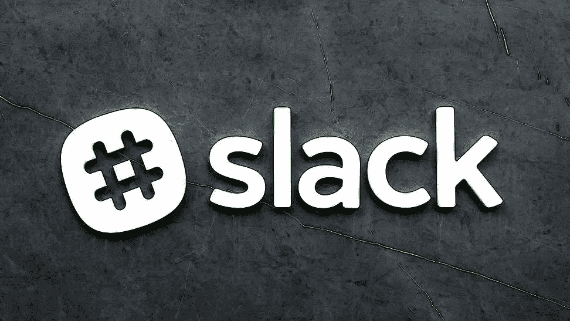

# 首席执行官如何让员工放松

> 原文：<https://medium.com/hackernoon/how-ceos-get-their-employees-on-slack-e18d1525523>

> 由[Morphic therapy Inc .【的首席执行官 Praveen Tipirneni](https://www.quora.com/How-can-I-get-my-team-to-adopt-Slack/answer/Praveen-Tipirneni) 在 [Quora](http://quora.com/?ref=hackernoon) 上最初发布。

我在 Morphic Therapeutic 的团队从公司成立的那一刻就开始使用 Slack 我们从未回头。

当你早上打开 Slack 的第一件事，你会看到一个令人鼓舞的小引言。当你想对团队成员的评论做出反应时，你有一大堆表情符号供你使用。Slack 尽力做到有趣。

这种乐趣最初让许多专业人士感到厌恶，尤其是在生物技术领域。他们不想使用表情符号。一个最初看起来和感觉上都像玩具的应用似乎是不必要的干扰。

但是在这些人开始使用 Slack 之后，有趣的事情发生了。慢慢地，但肯定地，他们重新思考他们最初的印象。是的，Slack 缺乏电子邮件那种严谨的商业作风，但是有越来越多的人开始转变——甚至是在生物技术领域。

那么，懈怠到底有什么好处呢？

*以下是我对寻求演示和实施建议的首席执行官们说的话:*

# **1。鼓励协作**

Slack 消除了透明度和协作的许多传统障碍。

项目频道允许领导者看到他们团队的思维过程，同时让他们自主操作。

这创造了一个更加协作和高效的环境。信息不再孤立，每个人都知道谁在做什么。

在大多数公司，你有核心项目——人们根据他们的知识、技能和能力被分配到这些项目。但你也有其他项目出现。网站应该是什么样的？我们的企业价值观是什么？我们如何制定社交媒体政策？

Slack 创造了一个真正的协作环境，对小项目感兴趣的人可以创建一个渠道，开始一起工作。他们可以自行选择，因为很容易看出谁真正参与了某个问题。

你确实能感受到组织的集体意识，这种意识贯穿于许多层级，从初级员工和职能主管到高级管理层。

# **2。减少电子邮件流量**

当其他生物技术公司的首席执行官问我关于使用 Slack 的问题时，电子邮件流量是他们最关心的问题。

在一家生物技术公司，你每天醒来都会收到数量惊人的电子邮件。一年下来，你的收件箱变成了旧通信和电子邮件的海洋。当你想找到几个月前的信息时，搜索效率很低，也很困难。

电子邮件对于某些交流来说非常有用。但是如果你只是想要一个快速的来回呢？Slack 是以电子邮件所没有的方式建立起来的。你可以在一个平台上共享文档、快速聊天、写文章或接听电话。

电子邮件的碎片化本质在很多情况下并不理想。例如，我要求我们的招聘人员使用我们的 Slack 频道进行个人交流。当你需要的所有东西都在一个地方时，事情就简单多了。

# **3。简化一对一**

Slack 为您提供了任何对话的历史记录。

它有助于以一种电子邮件几乎不可能做到的方式组织你的一对一会议。

你可以深入挖掘，一直追溯到对话的最开始。当有人说，“好的，让我来处理这件事，”或者“当然，我为什么不去调查那件事，”这样的对话相对容易找到。要在电子邮件中复制这一功能，你必须搜索你的收件箱，找到六个月前的那条电子邮件链。Slack 可以让你以非常直观的方式回顾过去，只需简单地滚动或搜索对话，类似于滚动的时间机器。

这确实简化了员工评估。你可以剪切并粘贴你谈论的内容，然后确定他们是否坚持到底。

# **4。代替一些会议**

在 Morphic Therapeutic，我们不是一家非常以会议为中心的公司。

我们想给人们充足的不受干扰的时间来做他们的工作。

松弛有助于释放时间。我们已经能够将会议中的许多对话转移到 Slack。例如，大多数会议的第一部分是状态更新，对吗？每个人都告诉对方发生了什么。

更新不需要亲自进行。这些对话是在空闲时进行的。每个人都知道项目的状态。

随着人们开始越来越多地利用这个平台，好处会越来越多。现在，我们的会议更少了，但交流一样多。

# **5。创造精英管理**

Slack 最吸引人的一点是它有助于创造精英管理的能力。

每个人都可以协作、贡献和提供反馈，这极大地简化了公司的层级结构。

员工有机会获得地位，与他们在组织结构图中的位置无关。在 Slack 上，你的贡献不受你职位的约束。你的想法总会被看到，可能会被公司里你甚至都没见过面的人讨论。真正的精英制度就是这样形成的。

事实是，实现 Slack 很容易。这不是一个高维护系统。进入的门槛很低。真正的挑战来自于让人们打破旧习惯，把他们的交流方式转变为松弛。

一开始可能会很困难，但如果我们的经验有所启示，好处会很快克服任何改变的阻力。

> 由[Morphic therapy Inc .【的首席执行官 Praveen Tipirneni](https://www.quora.com/How-can-I-get-my-team-to-adopt-Slack/answer/Praveen-Tipirneni) 在 [Quora](http://quora.com/?ref=hackernoon) 上最初发布。
> 
> 更多来自 Quora 的趋势科技答案，请访问[HackerNoon.com/quora](https://hackernoon.com/quora/home)。