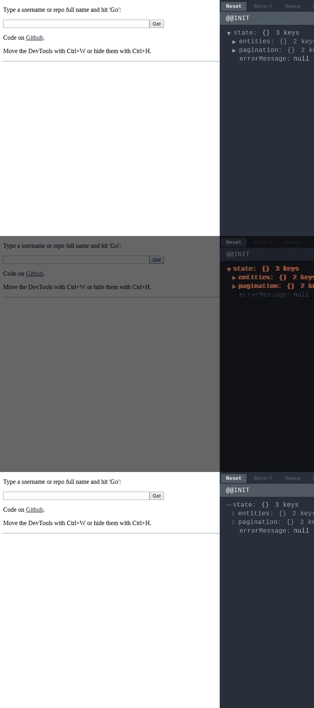

# CodeSandbox 如何使用 Puppeteer & Jest 测试沙盒功能

> 原文：<https://medium.com/hackernoon/how-codesandbox-uses-puppeteer-jest-to-test-sandbox-functionality-17068b3bd23b>

去年，[http://localhost:3001#vue)。请注意，我们将 id 设置为散列，这样我们就不会干扰沙箱的路由。](https://medium.com/u/3ccd3df9b3cf#:id</code>托管它(例如:<code class=)

[A generated screenshot of a todo redux example](https://medium.com/u/3ccd3df9b3cf#:id</code>托管它(例如:<code class=)

[完成这个设置后，构建其余部分就相当简单了。已经有一个比较截图的库叫](https://medium.com/u/3ccd3df9b3cf#:id</code>托管它(例如:<code class=)`[jest-image-snapshot](https://github.com/americanexpress/jest-image-snapshot)`。这个库在`expect`上暴露`toMatchImageSnapshot`，工作方式几乎和`toMatchSnapshot`一模一样。

最终的实现如下所示:

你可以在代码中看到我们公开了一个名为`window.__puppeteer__`的函数。捆绑器在完成后调用`window.__puppeteer__`，这个函数是由木偶师公开的，所以我们可以准确地知道什么时候可以截图。生成的截图然后保存在 GitHub repo 中。你可以在这里找到它们[。](https://github.com/CompuIves/codesandbox-client/blob/master/packages/app/integration-tests/tests/__image_snapshots__/)

我们使用 CircleCI 运行这些测试，但是我们需要在本地生成初始截图。为了确保我们生成与 CircleCI 相似的截图，我们使用 docker 容器来生成截图。我们有一个简单的脚本，我们只是运行它来生成新的截图:

我已经为 CircleCI 设置了一个简单的工作流来启动测试服务器并同时运行测试。这些测试在一个预装了木偶师的 docker 容器中运行。

The workflow of CodeSandbox, notice the test-integrations step

我们将所有差异保存为工件，因此我们可以轻松地比较截图。你可以在这里看到最近一次测试运行的工件列表:[https://circle ci . com/GH/compu Ives/code sandbox-client/4291 # artifacts/containers/0](https://circleci.com/gh/CompuIves/codesandbox-client/4291#artifacts/containers/0)。

A diff artifact: the arrows are different

# 结论

实现变得非常简单，但是已经节省了我很多时间。我们现在对每个提交和 PR 测试 20 多个沙箱。我还注意到，我更倾向于在测试套件中添加沙箱，这使得 bundler 总体上更加稳定。

在下一篇文章中，我将介绍我们如何使用 Puppeteer 和无服务器功能来为沙盒生成元数据和 oEmbed 标签。你可以关注我的推特 [@CompuIves](https://twitter.com/CompuIves) 或者 [@codesandboxapp](https://twitter.com/codesandboxapp) 来了解最新消息！

如果你对代码感兴趣。这里描述的所有代码(以及 CodeSandbox 的代码)在 GitHub 上都是开源的。您可以在此处找到主存储库:

 [## 强制/代码沙盒-客户端

### codesandbox-client -一个为 web 应用程序开发定制的在线代码编辑器🏖️

github.com](https://github.com/CompuIves/codesandbox-client) 

我希望你觉得这个帖子很有趣，不要犹豫，给木偶师更多的想法和用途！