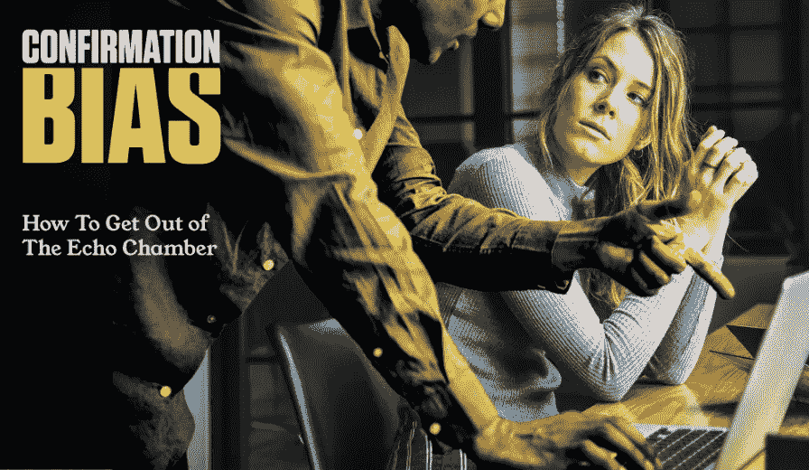
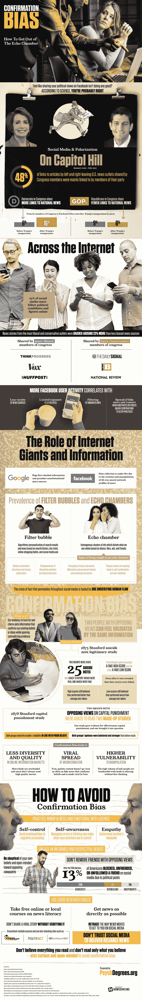

# 确认偏见如何攻击你的大脑

> 原文：<https://medium.com/hackernoon/how-confirmation-bias-hacks-your-brain-a506c00ce6a8>

无论一个人如何努力尝试回音室和过滤泡沫，社交媒体过滤我们和我们的信息不会去任何地方。脸书的数据收集可能被非法行为者用来针对选举，这只是问题的一部分。故意同意分享我们自己的信息、政治观点和精选的新闻来源是一个更大的问题，并导致了在线社区的大规模两极分化和部落主义。

两极分化、错误信息的传播和回音室都是确认偏差的结果。

确认偏差是人类固有的倾向，即寻求证明我们已有信念的信息，忽略证明相反的信息。自 20 世纪 70 年代初以来，心理学家一直在进行关于确认偏差的研究。研究表明，人们会相信任何事情，如果它证实了他们已经想到的，即使有确凿的证据证明他们是错的。

黑客确认偏差说起来容易做起来难，但也不是不可能。练习正念，表现出同理心，核实事实，寻找证据证明你自己的信念是战胜它的关键方法。

通过下面由 PsychDegrees.org 提供的信息图，了解更多关于[确认偏差](http://www.psychdegrees.org/confirmation-bias/)的信息。

