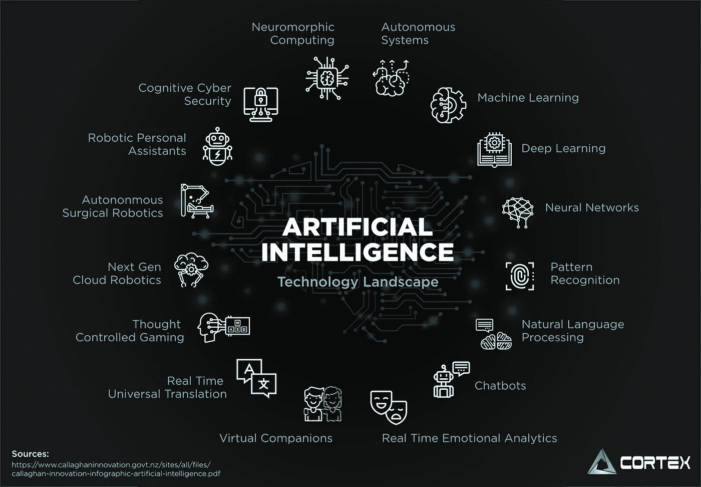
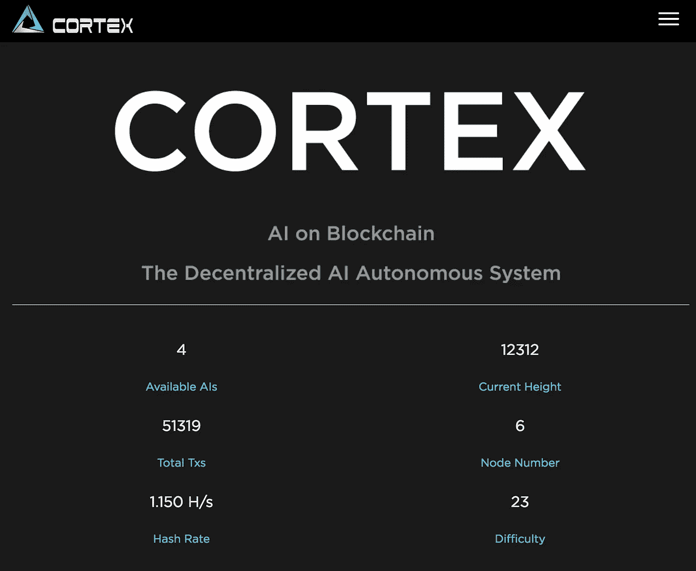

# 人工智能在区块链上——有什么问题？

> 原文：<https://medium.com/hackernoon/how-cortex-brings-ai-on-the-blockchain-86d08922bb2a>

## 本文是区块链生态系统人工智能系列文章的第一部分。在这些概述中，我将概述我们为什么需要它，它是如何实现的，以及它能提供什么。

## 文章系列:

- Part 1: [区块链上的 AI——有什么蹊跷？](http://bit.ly/ai-on-blockchain-part1)
-第二部分: [AI 智能合约——过去、现在、未来](http://bit.ly/ai-on-blockchain-part2-)
-第三部分:[在区块链上运行人工智能](http://bit.ly/ai-on-blockchain-part3)
-第四部分: [Cortex AI on Blockchain 生态系统](http://bit.ly/ai-on-blockchain-part4)
-第五部分:AI on Blockchain 用例

超市合同可能是对区块链热情背后的最大驱动力之一。其思想是以数字方式促进、验证和执行合同的协商和执行，这是以分布式方式在区块链的多个节点上同时进行的。然而，当前的智能合同协议远非完美，既受到有限的计算能力的影响，也受到治理缺陷的影响。

智能合约的简单性现在看起来可能不是一个大问题，但它的局限性可能会对区块链的应用程序构成威胁。如果不增强智能合约的功能，就很难在区块链上实现真正的分散式应用程序。

虽然有各种方法来解决这个问题，但在区块链上启用人工智能并将人工智能集成到智能合同中为我们提供了一个强大的解决方案。

[**Cortex (CTXC)**](https://www.cortexlabs.ai/) ，我工作的公司，是一个支持 **AI 智能合约**和 **AI 推理**的去中心化人工智能平台。人工智能开发者可以将他们的模型上传到区块链，智能合约，然后 DApp 开发者可以通过支付 CTXC(Cortex 原生令牌)来访问这些人工智能模型。

> Cortex 是第一个支持将人工智能模型添加到智能联系人并在区块链上执行人工智能算法的公共链。

皮层已经 [*发布了*](http://bit.ly/cortex-testnet) 其挖掘 TestNet，Bernard，以及 AI TestNet，Dolores。

Cortex Block Explorer — [**Cerebro**](https://cerebro.cortexlabs.ai)

# 什么是皮层求解？

## 人工智能垄断

迄今为止，人工智能已经变得无处不在，我们对人工智能的依赖与日俱增。比如亚马逊的推荐系统，根据之前的购买或活动为用户提供个性化的推荐；优步的人工智能模型可以确定到达时间、上车地点和票价；以及使用机器学习算法来检测和打击欺诈的 PayPal。

source: [https://www.redpixie.com/blog/examples-of-machine-learning](https://www.redpixie.com/blog/examples-of-machine-learning)

让少数几个公司*主导 AI 行业可能并不明智。大公司训练的人工智能模型经常把他们自己的利益放在顾客的隐私或需求之前。区块链技术可以通过分散和开源人工智能算法来改变现状，以确保人们可以从多个人工智能提供商中进行选择，并摆脱大公司的危险。*

*区块链皮层可以通过创造一个激励人工智能开发者与世界分享他们的模型的令牌模型来使人工智能民主化:每次一个模型被调用，模型的所有者就会得到 CTXC 的报酬。这将鼓励更多的开发者在链上发布更好的 AI 模型。随着越来越多更好的模型在链上提交，智能合同和 DApp 开发者将获得更多功能性的人工智能工具，以包括在他们的开发中。这为人工智能行业创造了一个新的健康的生态循环。*

## *有限的智能合约功能*

*智能合同是本世纪最好的发明之一。其思想是，契约可以被翻译成代码，然后在区块链中分发到多个节点进行验证。然而，目前的智能合同 [*实际上并不是“智能”*](https://www.upwork.com/hiring/for-clients/smart-contracts-using-ai/) 而是更像数字合同。如果不增强智能合约的功能，就很难在区块链上实现真正的分散式应用程序。真正的智能合约应该具有人工智能功能。*

*使用当前的智能联系技术，开发人员只能创建像 CryptoKitties 这样的应用程序，为用户提供没有交互的静态猫图片，或者 Fomo3D，使用数学计算来提供类似骗局的体验。借助 Cortex 的 **AI 智能合约**，开发人员可以创建更复杂的应用程序，如使用人脸识别模型的 KYC 应用程序，以提供更安全的流程并防止欺诈行为。*

**

*Source: [https://slideplayer.com/slide/14197503/](https://slideplayer.com/slide/14197503/)*

## ***无法在链上进行人工智能推理***

*目前智能合约和虚拟机在 CPU 上执行；然而，由于人工智能算法的复杂性，没有公共的区块链具有足够的计算能力来有效地执行人工智能算法。目前的解决方案限制公司在链外或侧链上执行人工智能，然后将结果带回主链，这仍然构成 [*黑箱问题*](https://hackernoon.com/running-artificial-intelligence-on-the-blockchain-77490d37e616) 。Cortex 公共区块链是从头开始构建的，在全节点上使用 **GPU/FPGA 来支持 AI 推理**。Cortex 虚拟机将使用 GPU/FPGA 来执行 AI 智能合约，这也创建了一个透明的审计跟踪，以提高结果的可信度。*

# *Cortex 是怎么做到的？*

*人工智能驱动的分散化应用预见了一个万亿美元的市场，Cortex 将成为第一个支持这一生态系统的基础设施区块链。*

## *AI 智能合约和 DApp*

*允许智能合约包含 AI 功能，创建真正智能的智能合约和增强的 DApps，具有更多样化的用例。AI DApps 将使用 GPU/FPGA 在每个完整节点上执行，并在链上达成共识。AI DApps 将具有增强的功能，例如分散式游戏中更生动的 NPC、AI 管理的稳定硬币、AI 模型比赛、自动驾驶、加密货币借贷、Ads 平台和推荐系统。*

## *人工智能推理*

*通过 Cortex 的独特方法将 AI 推理直接带到链上，推理结果不再来自第三方 Oracle，消除了信任问题。Cortex 提供了“Synapse”，这是一个整数推理引擎，通过 [***布谷鸟周期***](https://github.com/tromp/cuckoo) 共识机制进行确定性 AI 推理，这是最有前途的抗 ASIC 框架之一，由于其内存密集型算法，但具有即时验证功能。Cortex 还提出了 MRT(材料表示工具)，这是一个开放灵活的标准，使深度学习框架和工具能够互操作。MRT 保证部署在 Cortex 上的 AI 模型可以用相同的推理结果执行。*

## *人工智能模型平台*

*区块链上的一个人工智能模型平台，人工智能模型开发者和提供商可以在链上存储他们最先进的人工智能模型，并由智能合同开发者访问，他们在 CTXC 中支付这些模型。该平台可以推动人工智能应用程序、人工智能竞赛、模型动物园和数据存储等有助于人工智能开源的应用程序。*

## *皮层虚拟机*

*CVM 完全兼容 EVM，但整个基础设施运行在 GPU 上。以太坊开发者可以将他们的以太坊智能合约迁移到区块链皮层，并添加人工智能功能。开发者可以使用 Solidity 编写带有 infer 指令集的 AI 智能合约，直观且易于实现。*

# *关于皮质*

*Cortex 是有史以来第一项允许在区块链上执行人工智能算法的区块链技术。Cortex 提供了一个人工智能平台和堆栈，供开发人员在区块链上上传他们的模型，这些模型可以与智能合约集成。TestNet for mining 和 AI smart 合约出来了， [***点击这里***](http://bit.ly/cortex-testnet) 了解更多！*

## *测试网*

***|**|[Block Explorer—Cerebro](http://bit.ly/CortexCerebro_HN)**|**[矿池](http://bit.ly/CortexTestnetPool_HN)|**|**|[混音编辑](https://cerebro.cortexlabs.ai/remix/)|**|**[软件](http://bit.ly/CortexGithubTestNet_HN) **|***

## *社会化媒体*

***|**|[网站](http://bit.ly/Cortexlabs_HN)||[GitHub](http://bit.ly/CortexGithub_HN)||[推特](http://bit.ly/CortexTwitter_HN)**|**|[脸书](http://bit.ly/CortexFB_HN)|**|**|[Reddit](http://bit.ly/CortexReddit_HN)||[Kakao](http://bit.ly/CortexKakao)|**|**[邮件](mailto: testnet@cortexlabs.ai) **|***

## *电报*

***|**|[英文](http://bit.ly/CortexOfficialEN)||[韩文](http://bit.ly/CortexLabsKr)||[中文](http://bit.ly/CortexOfficialCN) **|***