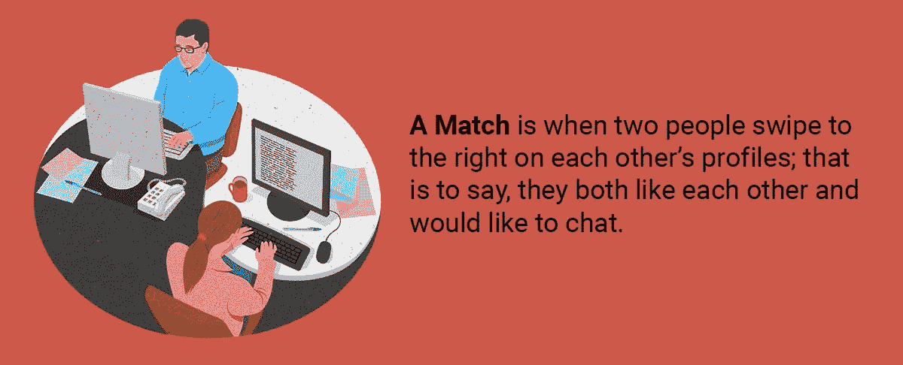
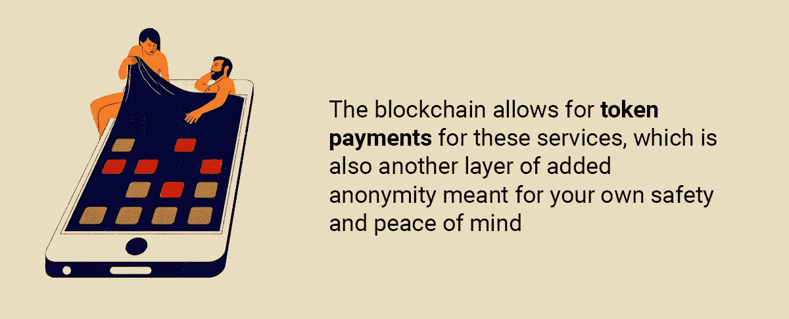

# 区块链技术如何扩展我们的性生活

> 原文：<https://medium.com/hackernoon/how-could-crypto-technologies-expand-your-sex-life-on-a-global-scale-49e21f1949fe>

自从人类诞生以来，男人和女人就一直生活在一起，并结合在一起，为了繁衍后代，让物种更进一步。但是性并不总是被用作繁衍后代的手段。有了被证实的健康益处，性甚至可以成为素不相识的人的一个 T2 社交工具，但是通过一起上床，他们可以看到他们是否是一个好伴侣。在应用程序的帮助下，来自世界各地的人可以在几天甚至几小时内约会并享受彼此的陪伴。但这是人们为了寻找亲密关系而使用技术的正确方式吗？

# 当今的全球约会应用

Tinder 是这个星球上最著名的约会和性爱应用。据 T4 估计，Tinder 拥有超过 5000 万活跃用户，打破了所有约会网站和应用程序的记录。据该公司报告，在过去的五年里，Tinder“火柴”的数量已经达到了惊人的 500 亿。匹配是指两个人在对方的个人资料上向右滑动；也就是说两个人都喜欢对方，都愿意聊天。

# 网恋是怎么进行的？

没有人真正知道 Tinder 是如何工作的。当然，我们知道最基本的:你在手机上安装应用程序，设置你的账户，放上你自己的漂亮照片，然后开始寻找你喜欢的人。如果你发现一个对你有吸引力的人，你向右滑动。如果不是，你向左滑动。尽管如此，该系统实际上是如何工作的仍不明朗，因为开发者将算法保密，试图拒绝抄袭应用。

赞成的意见

*   无限的机会与你下一个重要的人匹配。不管这次冒险是否有所收获，你仍然是赢家。
*   结交一些好朋友的能力，他们中的大多数都有好处。
*   让当地人免费带你参观他们的城镇，只需在应用程序中向右滑动即可。

骗局

*   不喜欢[你通过 app 认识的大部分人](https://www.theodysseyonline.com/various-pros-cons-tinder)的几率。
*   遇到潜在危险人物的风险，因为任何人都可以注册个人资料。
*   从不使用 Tinder 的有判断力的人总是对使用 Tinder 的人很苛刻。但这是你自己选择使用它，所以如果你是一个思想开放的人，这应该不是问题。

# 密码技术，通往美好性生活的大门？

加密技术可以改善我们生活的方方面面，包括我们做爱的方式。区块链上已经有很多与约会相关的平台。例如，有一个平台 [Hicky](https://hicky.io/) ，这个平台[承诺你的私人数据和个人事务的完全安全](https://hicky.io/)，而你可以在任何地方和任何你想约会的人约会，而不会被评判。还有 [Nocta](https://nocta.co) ，或“分散的性未来”，另一个为成年人组织高级休闲的平台[。由于缺乏更好的词，让我们更深入地看看这些平台与 Tinder 和其他非加密性应用相比是如何工作的。](https://icomarks.com/ico/nocta)

# 当今基于密码的性爱平台

这个平台专注于关系的基础货币:信任。这就是 Hicky 的工作方式。当前的平台接受了这个价值，并把它扔出了窗外。如今交友网站最大的问题之一是男女比例，因为男性总是占优势。当然，已经有许多平台试图解决这种差异，但没有一个成功。

然而，区块链是不同的，Hicky 已经证明了自己是一个可靠的结构，可以在其上构建下一级别的约会应用程序。 [Hicky 首先专注于拥有一款比男性更适合女性](https://icobench.com/ico/hicky)的 app，从而吸引更多女性注册账户。这是通过让应用程序看起来更适合女士来实现的。此外，由于用户都是经过验证的，女性可以更信任它，因此有更多的人注册。此外，由于该应用程序位于区块链，他们的个人数据永远不会被存储。安全的约会体验是由一种共识机制允许的，这种机制可以摆脱那些行为不尊重的人。

Hicky 和其他区块链性平台有利有弊。首先，有用户基础的问题，因为这些平台上的用户仍然太少。为了让这些平台变得更具可扩展性，区块链的整个想法必须首先成为一个国际性的东西，然后才能应用于性约会应用程序。从好的方面来看，已经有很多这样的应用了，其中一些实际上在传统媒体中得到了认可，这对可扩展性非常好。

你还可以在区块链上获得更私人的体验，这是传统约会应用程序不可能做到的，因为你在注册表格上输入的每一条信息都会以某种方式对你不利(你会看到很多广告，因为你天生渴望与他人联系)，让你后悔当初注册的决定。由于区块链是分散的，您的数据被加密并存储在整个系统中，但不只是由一个人访问。

# 区块链的约会和性平台前景如何？

到目前为止，我们已经讨论了普通的非加密约会应用程序和基于加密的应用程序之间的差异。他们都有各自的优点和缺点，他们都可以使用一些改进。但是我们仅仅触及了区块链性生活的表面。事实上，在区块链性爱应用开发的黄金时期，一个名为[的新平台](https://exolover.io/)显然是现在需要考察的。

# 区块链上全球性互动的生态系统

由于区块链及其匿名的可能性，ExoLover 不仅仅是一个普通的性爱应用程序。这项服务背后的人承诺更进一步，[实际上提供了性玩具](https://icomarks.com/ico/exolover)，这将使数万英里之外的情侣有可能进行性互动，在自己舒适的家中模仿性爱。这种创新将通过结合当今技术和区块链的一切能力而成为可能。

像人工智能，最先进的电子技术，机器学习，当然，还有密码技术，都在一起为用户提供终极的性体验。基本上，这就像和你在网上认识的人做爱，而不管你离他们有几千英里远。这种感觉，无论是情感上的还是生理上的，都会和你在现实生活中得到的几乎百分之百一样。

外部套件

ExoLover 是第一个通过区块链的点对点社交网络平台将用户与传输真实性感觉的创新设备联系起来的公司。ExoLover 想出了几个设备，整个阵列的玩具被称为 Exo 套件；其中一些是 ExoWand、ExoThrust、ExoTouch 和 ExoSuit。

这些性玩具具有感知触觉和身体功能，通过其特殊设计的产品模仿性来实现完整的性模拟。他们通过模仿不在同一房间的两个人之间的性爱来工作，这给了他们同样的肉体上的快乐，如果他们在一起的话。

# 这是区块链独有的解决方案吗？

当然，您可能想知道为什么这些设备是基于区块链的，而不是通过像传统互联网这样的普通媒介实现的。简单的回答是隐私。在这个世界上，你所做的一切几乎都是公开的，一个人最不愿意看到的就是他或她在公开场合进行虚拟的性互动。通过将整个事情放在区块链上，随之而来的匿名性实际上是不可渗透的，因为信息是通过一个分散的网络存储的，该网络从不允许最终用户访问你的数据。当然，这意味着你可以在完全匿名的情况下满足你最狂野和最古怪的性幻想。

区块链允许对这些服务进行[代币支付，这也是为了你自己的安全和安心而增加的另一层匿名性。当然，分布式网络在未来会有更多的容量，但这并不意味着用户不能像 ExoLovers 一样发展一个分散的网络，如果创造者真的兑现他们的承诺。](https://token.exolover.io/auth/sign-in)

# 结论

性和约会行业[的价值已经达到 306 亿美元。这意味着不断增长的行业有能力提供比现在更多的东西。随着像 Tinder 这样的应用程序中实现的技术，约会的世界已经永远地改变了。但是这些应用程序有它们的缺陷:没有隐私，不匹配，人们的](https://sexevangelist.me/what-is-sextech-and-how-is-the-industry-worth-30-6-billion-developing-d5f0a61e31d6)[可支配性](https://www.quora.com/What-are-the-disadvantages-of-using-Tinder)，这个清单可以一直列下去。

区块链正在扰乱世界各地的工业。它始于经济界，很久以前，一种不起眼的叫做比特币的虚拟货币被发明出来。从那以后，它革新了几个行业，接下来是性和约会。

主要的区别是隐私，因为区块链允许你有完全的隐私，你的性欲可以在你自己舒适的家里得到满足。你可以用代币支付一切，这意味着没有人会追踪到你的银行账户。如果这些加密解决方案是性和约会行业的未来，我们将不得不拭目以待，但这些承诺令人印象深刻，已经试用过这些产品的人将在未来很长一段时间内保持粉丝状态。

## 关于作者:

基里尔·希洛夫——geek forge . io 和 Howtotoken.com 的创始人。采访全球 10，000 名顶尖专家，他们揭示了通往技术奇点的道路上最大的问题。加入我的**# 10k QA challenge:**[geek forge 公式](https://formula.geekforge.io/)。