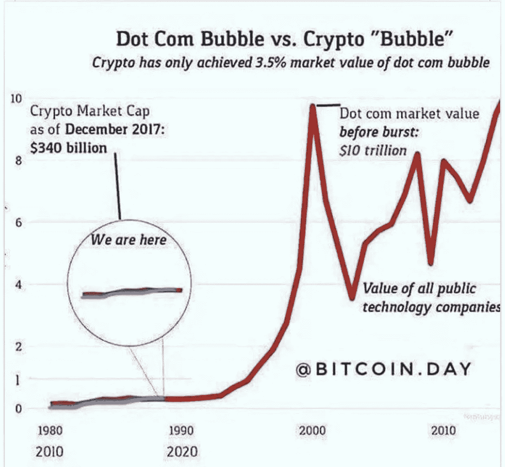
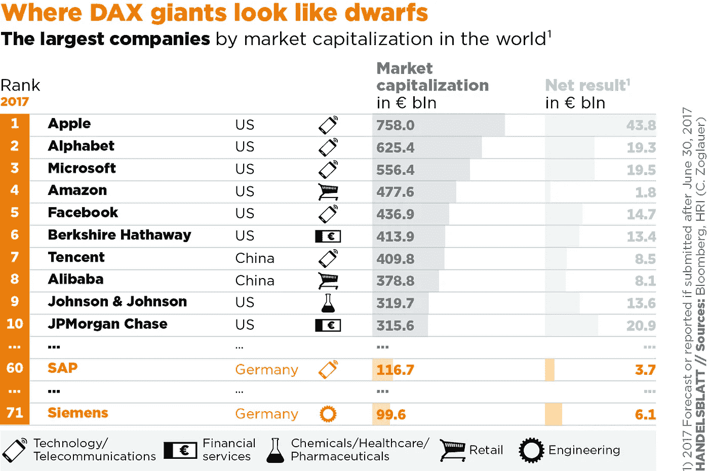
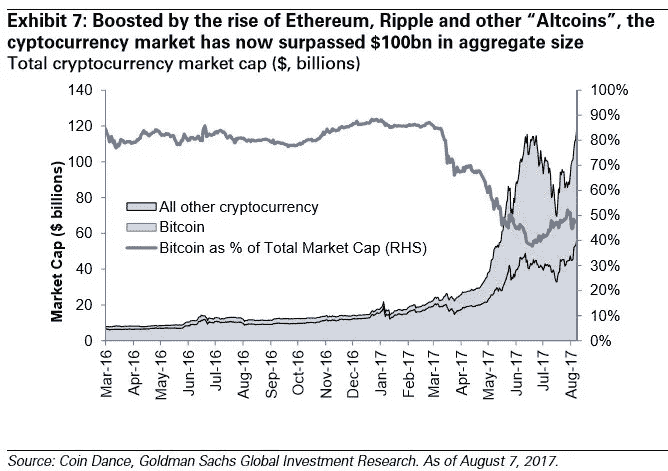
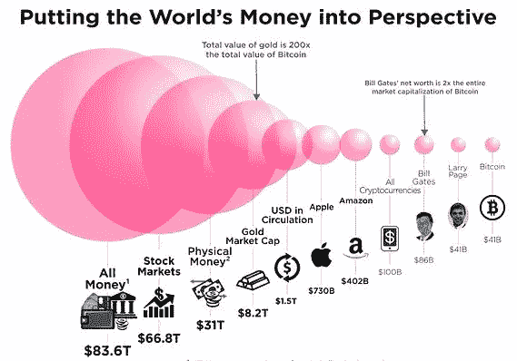
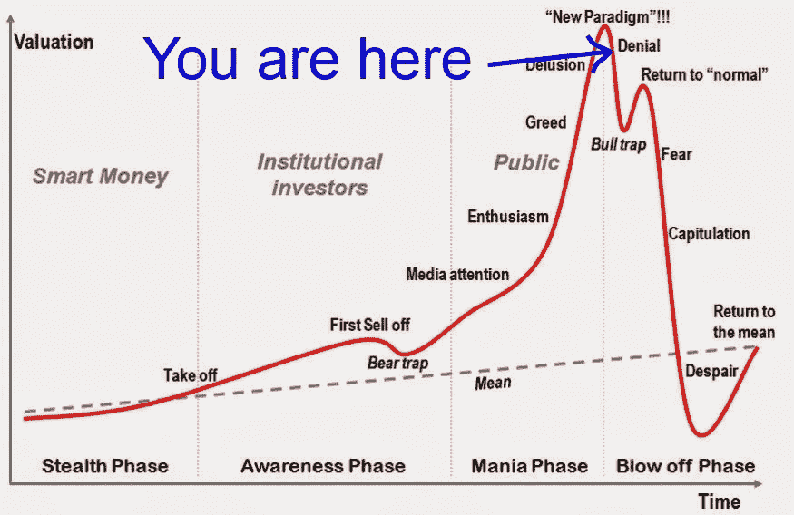

# 密码如何改变世界？

> 原文：<https://medium.com/hackernoon/how-could-cryptos-change-the-world-aa95e177f295>

## 你加入加密潮流了吗？只是一个泡沫，会不会不可避免地让世界变得更美好？

我将尽我所知，深入回答所有这些问题，用适当的引用来支持它，并努力减少废话，不管怎样，感情和庞氏骗局是存在的。

哦，我明白了，

抽水和倾倒，政府监管，大玩家称之为泡沫，你可能会持怀疑态度，不是吗？

我明白你的意思，但问题是，我们实际上在听谁的，大联盟中的球员，他们有成堆的现金投资在股票上，成堆的菲亚特，成堆的传统狗屎…以及接受新技术/经济转变的僵硬态度。

就像真的…..？不要听我的，不要听他们的，听并反思这些数字、事实和驱动这些疯狂事物的底层技术。

**前言**

这不是投资者指南或快速致富计划，我不会继续告诉你[比特币](https://hackernoon.com/tagged/bitcoin)总有一天会输给另一种硬币，因为它有所有的缺陷，我不会告诉你它可以被视为价值储存手段，就像黄金一样——固定供应，受经典供求定律支配。

**免责声明**

请注意，此处添加的陈述和视觉效果与参考时间点有关，由于这些市场的波动性，陈述可能不总是真实的。

**所以相应地学习、忘却和再学习。**

好了，说够了情绪，这里是事实和数字，再一次给那些悲观主义者和乐观主义者，他们根本不在乎，为你的纸上经济高兴吧。是的，你，我真的对你这么说。

看，到处都是一般化，我想让你注意到这一点——人们接触到这个概念的种类，他们被主流媒体洗脑的方式可能不同……

事情是这样的

1.西方世界的政府非常了解它给人们带来的权力下放，以及它如何真正搞乱货币体系，以及对等的性质，正在摸索着试图征税和实施严格的监管。

2.而极权政府和第三世界国家——他们只是统治人民，最不关心人民的关切，走过去实施禁令，称之为庞氏骗局，想方设法遏制所有通过[加密](https://hackernoon.com/tagged/crypto)获得的收入。

## 那么总的来说有什么变化吗？

通过这些技术提供的分散化宣传，人们的道德随着他们变得独立的能力而改变了吗？

可悲的是，当我们从全球层面来看时，这是一个很大的问题。

## 什么，你到底是什么意思？

你可能会问，到这个时候，假设我和那些试图用他们平庸的白纸和蓝纸卖狗屎技术的骗子一样。

不，我不会那样做的，等一下，你自己看看……

> "大多数反对自由市场的论点的基础是缺乏对自由本身的信仰。"米尔顿·弗里德曼

除非我们接受现实，即我们需要改变来改变那些还不正确的事情，否则任何事情都不会自行改变。或者我们可以说服自己事情会自己改变。

超级超级有钱人不会这么做，他们爱他们的纸和钱只是为了爱，正常意义上的钱和任何形式的投资对他们来说都像上帝。

> 错的不是财富的创造，而是对金钱本身的热爱。-玛格丽特·撒切尔

那么这种转变什么时候会真正发生呢？所谓的“T1”过程将在所有中产阶级介入时开始，大量的加密所有权将推动下一代转变，只有到那时我们才能考虑改变这个世界。

这里有一个有趣的案例研究，看看有着相似尘埃和命运的事物…

**案例分析【比较加密与。com 泡沫]**

创造。然后上市—

那时候，在互联网的早期，很容易买入。他们说并推测，这些股票不可能会崩盘。

> 引用——我会向他提出一个他无法拒绝的价值主张。

我卖了我的房子，我卖了我的车，我卖了我的东西，我卖了所有的东西，我买了每一次 IPO 的股票。如果你回到过去问业余投资者，仅仅因为当时是繁荣时期，他们就会告诉你这些..

嘭！破裂发生了，出现了大规模的 FUD，人们失去了希望，互相诅咒，这主要是因为他们投资的不一定是泡沫，而是大规模的炒作，技术是新生的，价格非常高。唯一幸存下来的方法是那些购买真正解决问题的东西的人。

人们不太重视这一点，实际上很少有公司幸存下来，他们活了下来，现在仍然做得很好。

## 那么，crypto 会消失得无影无踪，变得毫无价值吗？

绝对没有，至少在我看来没有

[source](https://steemitimages.com/0x0/https://cdn-images-1.medium.com/max/1242/1*CG3KIEpJUEh9o9KDyjUkRw.jpeg)

这张图表显示，cryptos 的市值在 2017 年 12 月达到了历史最高水平，看看今天(2018 年年中)发生了什么，在那个时间点上，没有人会想到他们最疯狂的梦想会出现这样的下跌。这让我的观点更加清晰，我想，你知道我在暗示什么。

cryptos 将遵循同样的命运，今天我们有一个充满投机投资者的市场，他们不是购买技术，而是炒作。

Bling Bling

那么是什么推动了所有这些几乎没有价值的狗屎硬币呢，嗯，同志们，这是先抽后卸，或者反之亦然，老实说，这听起来很残酷，但事实是，如果你买低卖高，有什么错吗？不完全是，这里没什么问题，但这纯粹是赌博，没有创新，也没有改变这里渴望的**世界。**

**是的，就这么简单。**

这将继续下去，直到市场不再是愚蠢的日间交易——机器人，而是更多的对技术抱有真正希望和信念的大规模投资。

## Famga(脸书，苹果微软，谷歌和亚马逊)的加密

我在这里的观点是，当这些科技巨头总是主宰图表时，他们在这些技术上没有留下创新的空间，这实际上可能会影响很多企业。对于前谷歌和脸书的数据管理和亚马逊的供应链创新。尽管这些公司中的一些已经公开接受了区块链，但他们最不关心互联网的货币价值或符号化。

以脸书为例，Facebook 在几个月前禁止了所有的 Ico 和加密广告，当我写这篇文章时，2018 年 6 月 27 日重新启用了该领域的广告发布，这些广告发布者将通过一个验证过程。

[source](https://i1.wp.com/www.zerohedge.com/sites/default/files/images/user3303/imageroot/2017/08/08/20170808_crypto3.jpg)

Cryptos 在和 famga 竞争吗？

仅仅因为你可以把一个现有的想法放到区块链上，并不意味着它会改变世界。权力下放是所有这些科技巨头面临的最大威胁。区块链很少有财产能保障人们的自由、隐私和安全，这是锦上添花。

[source](https://i1.wp.com/www.zerohedge.com/sites/default/files/images/user3303/imageroot/2017/08/08/20170808_crypto3.jpg)

不一定是密码，但互联网的技术和符号化将对这些公司构成威胁。ex——去中心化的应用令牌，如以太坊、具有适当治理的 Eos 等。

**还有**:很多人把 [blockchai](https://hackernoon.com/tagged/blockchain) n 和[比特币](https://hackernoon.com/tagged/bitcoin)搞混了。

**是不是很快就会发生**？

一点也不，这种转变需要很长时间才能发生，现在要解决的最大问题是任何区块链的内存和可扩展性，然后才能大规模采用 cryptos。

例如，比特币每秒只能处理 7 笔交易，是的，平均交易费用比在第三世界国家给一个孩子提供一顿平衡膳食的费用还要高。工作证明，狗屎证明？

当这种情况发生时，我肯定他们会神魂颠倒。

## 透视世界货币分工

[source](https://steemitimages.com/0x0/https://ei.marketwatch.com/Multimedia/2017/06/21/Photos/MG/MW-FO937_Bitcoi_20170621155338_MG.jpg)

## 吉芬斯悖论解释转储和泵

随着比特币继续上涨和下跌，我担心这种现象是否可以用吉芬悖论来解释。

这就是为什么任何 Xcoin 都可以被视为吉芬商品(随着价格的上涨，需求也会上升)，从而扭曲了传统的供求法则。

[Source](http://bobpattni.co.uk/wp-content/uploads/2018/05/image-result-for-pump-and-dump-crypto.jpeg)

著名经济学家彼得·切尔不得不说

> “我认为，就目前而言，更高的价格会吸引更多的兴趣。随着价格的上涨，越来越多质疑其有效性的人会决定值得一试投资。我目前认为行为是吉芬商品的工作方式，诋毁者会很快指出吉芬商品和泡沫是不存在的。批评者可能是对的(我仍然相信区块链从长远来看将是重要的——我不太相信比特币从长远来看是可行的——但这并不能阻止我尝试交易它。”

## 自由主义总结

我没有其他的 FOMO、FUD 或任何其他的观点可以呈现给你，没有其他的炒作和乐观的话可以说，没有其他的谣言可以买，没有其他的事实可以卖。

真诚的，密码狂热者