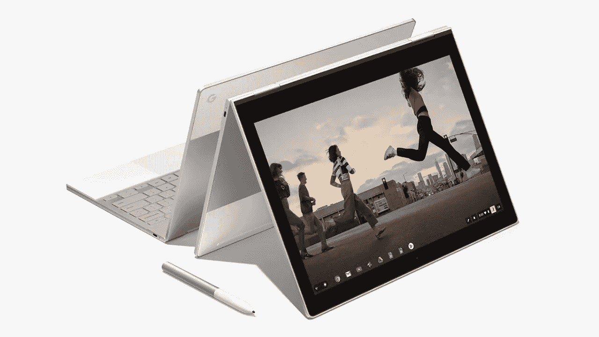

# 我们怎么会错得这么离谱？

> 原文：<https://medium.com/hackernoon/how-could-we-all-be-so-wrong-ce6173d75804>

## 我们对计算的定义需要重新思考，而且要快

Photo credit: [https://www.flickr.com/photos/instantvantage/](https://www.flickr.com/photos/instantvantage/)

我坐在咖啡店里，一边喝着拿铁咖啡，一边在 Pixelbook 上打字，pixel book 是谷歌(Google)的人推出的新款高端 Chromebook。如果你不知道 Chromebook 是什么或者曾经是什么，那就想想廉价而基本的笔记本电脑形式的美化浏览器，针对需要简单文字处理、电子邮件和网页浏览的学生。

然而，Pixelbook 既不便宜也不简单，事实上，它可能是我多年来使用过的最漂亮、性能最好的硬件。这里或那里的一个调整，比如说显示屏上更小的挡板，这个小美人将与过去十年中苹果发布的任何笔记本电脑相匹配。

The Google Pixelbook in all it's laptop and tablet glory.

太棒了，硬件终于比热垃圾上了一个台阶，但还是运行 Chrome OS，浏览器作为操作系统；一个动力不足，没有能力完成任何有价值的事情的基础层。没有 Photoshop，没有 Excel，没有 Final Cut，没有任何专业应用程序。

在过去的几年里，这些批评大多是正确的，有些严厉，但并非不公平。

不过，这款较新的 Chromebook 有一个新花招，增加了一个重要的新功能，改变了关于笔记本电脑或平板电脑生活的整个讨论。

Pixelbook 运行 Google Play 商店的 Android 应用程序。

等等，移动应用并不是最重要的。即使能够访问 Play store 提供的所有应用程序，也不能解决缺少 Adobe 套件(没有 Photoshop、Illustrator 或 Premiere)或 MS Office 完整版本(Word 和 Excel)的问题，当围绕计算机需要具备什么功能的讨论开始时，每个人都会提到这些应用程序。

这个“用户”需要什么的概念，贯穿了网上所有关于 Pixelbook 的评论；

> “尽管市场营销可能会告诉你关于 Pixelbook 的任何事情，但这里的卖点是硬件，而不是其他。”—9 到 5 谷歌—本·斯库恩
> 
> “谷歌似乎认为新的 Pixelbook 是 Chromebook 作为消费者笔记本电脑的主流时刻。那可能是一座太远的桥…— TechCrunch —布莱恩·加热器
> 
> "但是房间里的大象是它相当昂贵. "也许没有泄露的预期那么昂贵，但 Chrome OS 笔记本电脑将无法运行关键生产力软件的完整版本(至少目前是这样)，这将使它有点落后……”—9 to 5 Google—Stephen Hall
> 
> “在最近的谷歌硬件事件之后，更令人困惑的问题之一是一个显而易见的问题。为什么有人会花 1000 美元或更多的钱购买 Chromebook 呢？”——今日美国——鲍勃·安东内尔
> 
> “考虑到 Chrome 操作系统的应用限制，它会锁定你在 Chrome 商店中使用网络应用和服务，这使得 Pixelbook 对高级用户来说可能是一个很难销售的产品。”—可信的评论

在传统计算的世界里，上面的评论听起来像是对一千美元设备的合理批评，然而我越是使用 Pixelbook，我就越是暗自怀疑这些评论和整个行业可能完全没有抓住要点。

请花点时间为我想象一下你心目中典型的笔记本电脑或平板电脑用户。

那个幻象看起来像这样吗？

Screenshot from Apple's new commercial “What's a computer"

对于那些不想看视频的人来说，这是苹果公司为 iPad Pro 做的广告，展示了一个年轻女孩每天使用 iPad 写作、绘画、拍照和与朋友交流。在最后一个场景中，年轻女孩躺在她的后院，继续在 iPad 上工作，这时她的邻居靠过来问“你在你的电脑上做什么”年轻女孩回答“什么是电脑？”。现在，有些人可能会认为这是苹果公司在描绘他们希望看到成真的 iPad 主导的美好未来，但对我来说，广告中的年轻女孩更像是我们现在所处的位置，而不是我们将要去的地方。纵观北美市场内外，人们想要用他们的设备做的事情不是大台式机、传统笔记本电脑和传统软件的古老愿景，而是移动、互联和熟悉的。

用户在创造和消费之间、工作和娱乐之间花费了太多时间，我不知道谁会选择拥有一台可以运行 Photoshop 但不能使用 Snapchat、Instagram、Messenger 或我们在手机和平板电脑上使用的无数其他应用程序的设备。这些应用程序为我们与周围的世界联系、分享和互动提供了一个深刻的机会，当然，它们在任何时候都可以在任何设备上使用是有意义的。

# Pixelbook(像 iPad Pro 一样)标志着非移动计算的终结。

那么，移动计算的广义描述是什么呢？想想那些总是连接的设备，运行高度专业化的应用程序，无论我们走到哪里，它们都与我们在一起，体验一致，只受可以从中央资源下载的内容的限制。它是我们与现代世界、我们的朋友、我们的家庭、我们喜欢消费的内容以及两者之间的一切的纽带。移动计算不受国界或社会经济界限的限制；这是只有互联网才可能实现的最纯粹的形式。智能手机开创了这一局面，平板电脑强化了这一概念，如今，在 Pixelbook 这样的硬件中，笔记本电脑的形式将故事向前推进。

事实上，移动已经吃掉了世界上的*，而且只会越来越大。*

*20 亿人的年龄在 10 岁到 24 岁之间，这是地球上增长最快的人口统计，其中大多数(19 亿——相差不大)在美国以外。将这一庞大的年轻人群体与这样一个事实结合起来，即他们中的许多人生活在拥有一台电脑还不现实的国家，并且从来没有提供家庭宽带的基础设施，你就为一个全新的用户群播下了种子。再加上移动电话和智能手机的更高渗透率，这些设备在北美之外已经很容易获得，如果不是很普遍的话，那么你就有了现在计算领域的大规模转变。*

*所以我再问一次，当我们说像 Pixelbook 这样的设备不能做用户需要的事情时，我们在说谁？*

*世界上绝大多数用户不得不在不使用 Photoshop 或 Excel 的情况下勉强度日。除了运行单一服务移动应用程序或偶尔精心制作的网络应用程序的手机之外，他们不得不寻找创建、创作、制作和交流的方法。*

*我认为是时候我们重新评估一个“普通”用户的需求、样子和想要做什么了，当我们这样做的时候，我们结束关于 Chromebook 或 iPad 是否能完成工作的讨论，并接受他们已经是 T2 T3 的事实，怎么样？*

> *刚刚在 CES 上宣布的另一个不太优雅的结合体验的例子:[https://www . Bloomberg . com/news/articles/2018-01-09/new-Dell-PCs-to-sync-messages-calls-with-iphone-and-Android](https://www.bloomberg.com/news/articles/2018-01-09/new-dell-pcs-to-sync-messages-calls-with-iphone-and-android)*