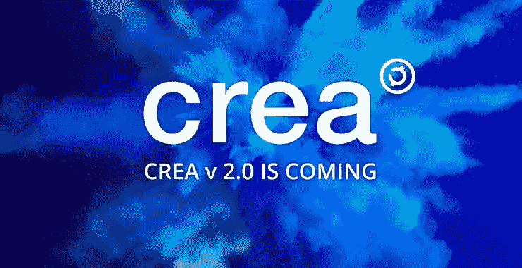
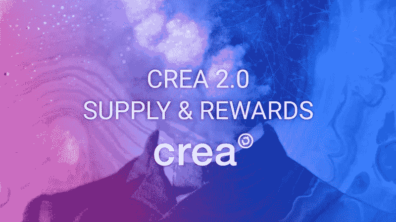
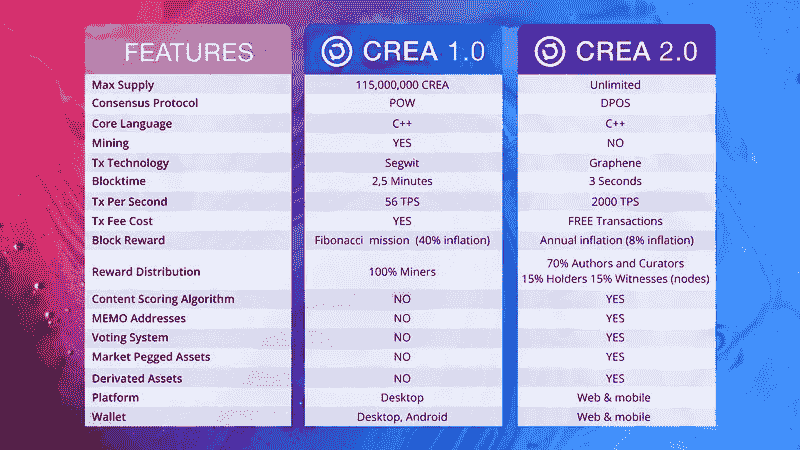
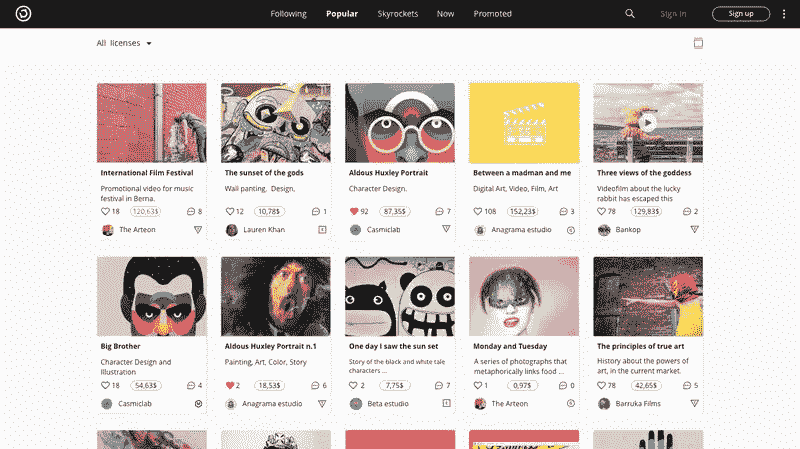

# CREA 2.0 如何改变创意生态系统

> 原文：<https://medium.com/hackernoon/how-crea-2-0-could-change-the-creative-ecosystem-5540a2add681>

CREA 是区块链的一个项目，作为一个社交网络，艺术家和创意人员可以发布他们的内容，受益于他们从其他用户那里收到的投票、互动和下载。

此外，它还提供了使用版权许可在区块链注册您的出版物的可能性。自其初始版本推出以来，该项目已经花了几个月的时间，在 CREA 2.0 中进行了一系列实施，主要旨在提高网络速度，使内容的作者和管理者以及参与其社交网络的硬币持有者受益。

## 新的共识算法:委托股权证明(DPoS)，新的令牌和石墨烯的实现。

当前的 1.0 版本使用被称为工作证明(PoW)的共识协议，并为 CREA 的每个开采区块分配高额奖励，导致每年约 40%的通货膨胀。这种高比例的每日硬币发行是为了在项目的第一年尽可能多地分发 CREA。这些通货膨胀参数正在对 CREA 价格造成压力，因为每天发行的货币数量很高，而且少数用户用专门的硬件或非常便宜的电力就可以负担得起。

在新的版本 2.0 中，将实施授权的利害关系证明(DPOS)，每轮大宗交易验证最多有 25 个见证人(节点)，新货币的发行将基于通货膨胀占当时现有总货币的百分比。

这一变化旨在让参与 CREA 生态系统的各方受益于这一奖励分配:

*   70% —内容的作者和管理者
*   15% —代币持有者
*   15% —网络的见证人

这种代币分发系统允许不了解该领域的用户以分散的方式获得加密货币，而无需通过 KYC 过程最终在交易所注册。消除这一障碍解决了尚不熟悉生态系统逻辑的新来者大量采用区块链项目的主要问题之一。

在这个奖励系统中，[来自 CREA 的新代币将被创造](https://www.creativechain.org/the-new-tokens-of-crea-2-0/) : CREA 能源(CGY)和 CREA 元(CBD)。它们在网络中具有特定的功能，将有助于加强生态系统中所有相关方的参与，并为作为市场挂钩资产的 CREA 价格提供更大的稳定性。

为了确保基于区块链的社交网络的成功运行，将实施[石墨烯技术](http://docs.bitshares.org/)。通过这种方式，区块链的速度将会提高，每 3 秒钟将会创建 1 个块(每天将会创建 28800 个块)，在分布式测试网络中每秒钟可以支持 1000 个以上的事务。如果我们与比特币的 6 TPS 或莱特币的 56 TPS 相比，这是一个很大的跳跃。这将使 CREA 的 TPS 水平相当于 VISA 或 MasterCard 等网络。

以新的实现为核心，CREA 2.0 区块链将朝着为数字创作部门开发新的 DAPPs 和去中心化社交网络奠定基础的场景发展。通过 CREA 2.0 的智能奖励分配系统，让活跃在其生态系统中的各方从执行优化中受益。

通过《DPOS 共识协议》,采矿及其行业专业化将被淘汰，随着 Keccak 算法专用集成电路的即将出现，这将最终导致网络集中化，同时对货币价格施加更大压力。

这一变化标志着社区在《守则》管理中的更大程度的权力下放和参与，这是新一代社交网络多功能性和创新性的显著标志。

## 版本网络平台:更多的功能，游戏化和改进的用户体验

CREA 项目的主要目标之一是使其社交网络可供所有类型的用户使用，包括那些不太熟悉区块链世界的人，他们在使用它所呈现的大多数“复杂”的当前解决方案时会迷路。

利用 CREA 向 2.0 版本迈出革命性一步的机会，我们将实施一些改变，以提高社交网络的可用性，让使用社交网络的创意人员能够享受最佳的用户体验。

CREA 2.0 的推出将包括该平台的在线版本(取代可下载版本)，该平台将允许执行社交网络的任何交互，包括从钱包进行的任何交易，钱包将被纳入并关联到每个用户的账户。这将有助于使内容更容易传播，并实现网络效应，使社区更容易发展。

为了在社交网络中产生更多的活力并分配上述奖励，将实施内容评分算法。通过这种方式，CREA 社区将能够对内容进行投票，一种算法将负责向作者和内容管理者分发个人奖励，作为对他们工作的奖励。

这些投票和平台内的任何其他类型的交互都将是免费的，因为在平台上进行的任何交易都是免费的，因为它们代表了用户不满意的体验，同时也是社交网络中所需的交互产生的障碍。你会想象每次发邮件或者在 Instagram 上给个赞都要支付佣金吗？

在 CREA 2.0 中，像给一个节点投票，甚至在用户的钱包之间转账这样的行为将比以往任何时候都更加免费和简单，因为用户不会躲在不可能记住的地址后面。该网络将为用户提供可记忆的地址，使得向@用户名或关键字发送交易成为可能。

所有这些只是已经在测试版本中实现的一些技术和开发。

开发小组计划在 8 月底开始一个 testnet 版本，并发布一个更广泛的文档，以便能够在接下来的几周内在主网络中推出该版本。

更详细的信息:[https://www.creativechain.org/crea-2-0-is-coming/](https://www.creativechain.org/crea-2-0-is-coming/)

# CREA 2.0 即将推出！