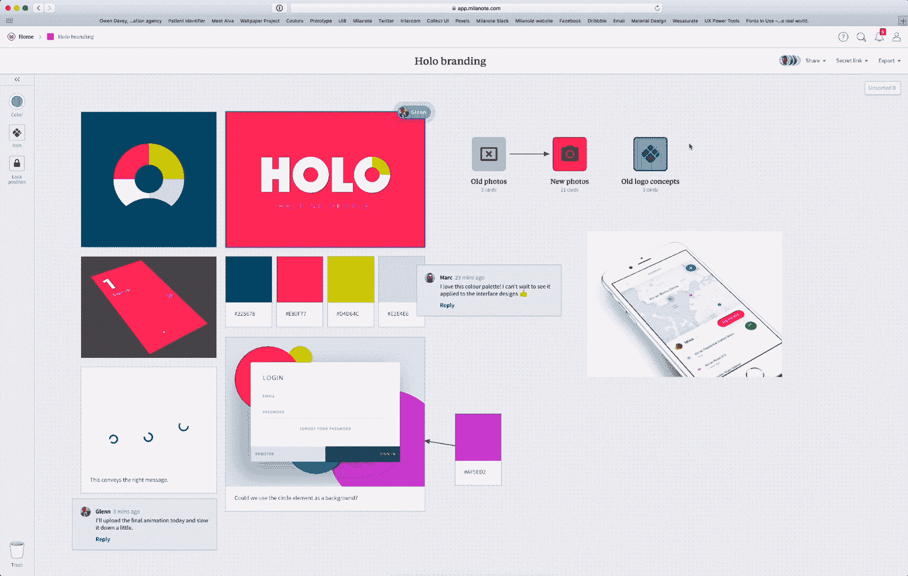
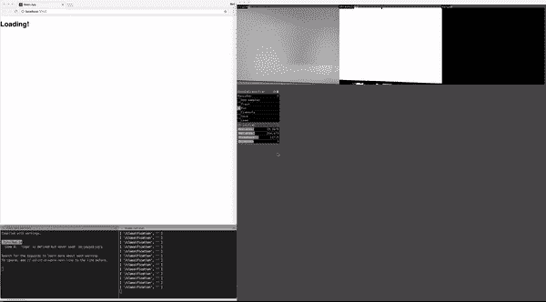

# 协作和人工智能如何在 2018 年改变创造性工作

> 原文：<https://medium.com/hackernoon/how-creative-jobs-will-change-in-2018-throwing-the-doors-open-to-a-i-869241659d84>

创意产业一直面临着快速变化的格局，但在 2018 年，我们面临着一些最大、最未知的挑战。人们与计算机互动的方式、我们如何开展工作以及“创造性工作”的基本性质都在以前所未有的速度发生变化。

这是对创意世界现状的一种审视，也是我认为它将从这里走向何方——这是对该行业下一个重大事件以及推动这些转变的力量的概述。

身处我们的行业，这是一个令人难以置信的激动人心的时刻，作为一名作家，我迫不及待地想看到我们接下来的发展方向，但同时也是一个焦虑的时期，因为我们面临着不断变化的现实和自动化的影响。

# 打开创意的大门

多年来，客户和经理们一直认为，创意工作本质上是在长达数月的项目结束时，你所交付的花哨网站或产品。这种误解已经无处不在，并且给了创造性等式的错误部分太多的权重:输出而不是你到达那里的方式。

由于创业行业的发展，现代创意流程，如敏捷、[谷歌的 Sprints](http://www.gv.com/sprint/) 和其他技术已经被广泛接受，我们从我们的客户那里看到了一个新的视角:双方都愿意在这个过程中合作。

Collaborating on a branding project in Milanote

构思阶段终于开始了。新工具打开了这个过程，包括了几乎每一个利益相关者，而不是在一个项目上达成一致，每一个学科都去他们自己的兔子洞工作。

与没完没了的会议、对优先事项的过度沟通和其他无意义的忙碌工作不同，创意人员能够在一个允许实验和迭代的结构中完成工作，方法是在整个项目中紧密合作，而不是在会议中任意检查。

*“在冲刺阶段一起工作，你可以缩短无休止的辩论周期，把几个月的时间压缩到一周。你不用等到推出一个最小的产品后才明白一个想法是否好，而是从一个现实的原型中获得清晰的数据。”*

**—冲刺(GV)**

# 从单用户工具的转变

这种转变得到了创新工作现代化工具的支持。

近二十年来，Adobe 和微软创造了让我们以线性方式工作的工具:一次一个任务，一次由一个人完成。像吉拉、Basecamp 和 Asana 等新的创意工具改进了这一过程，但过于关注任务管理、优先级和截止日期，而不是记下你的想法。

没有什么比开一张调整图标的罚单更能激发你的创造力了。

看来，创意人员注定要在很长一段时间内将他们的过程禁锢在那些方盒子里。然而，在过去的几年里，随着流程的改进和态度的改变，出现了应对这些挑战的新方法。设计师、客户、作家和这个过程中的每个人都意识到，他们需要一个地方来计划、构思和合作——而不是被迫接受票号、交付日期和优先事项。

新兴工具将这些概念带到了一个新的高度，使这些工作方式能够跨越各种规模的机构*和*初创公司。在高层次上，我相信这个过程始于[对数百万公司](https://www.theverge.com/2014/8/12/5991005/slack-is-killing-email-yes-really)的 Slack 查杀电子邮件，它打开了大门。这些工具为公司中最重要的人物建立了一条直线，而在此之前，通过电子邮件直接联系 CTO 似乎是不允许的——现在，他们在整个公司每天都在参与。这些相同的原则正迅速超越聊天。

这些新工具通过开放流程，以一种新的方式实现构思，改善了这种动态:

****，**摆脱了跟踪计费时间的方式，专注于完成工作，在消除时间跟踪问题上取得了长足的进步——它甚至拥有一个人工智能工具，可以为你计算出这些时间。**

**[**Figma**](http://figma.com) **，**将设计过程带到网络上，将设计师放在网络浏览器中，而不是像 Sketch 或 Photoshop 这样的桌面应用程序中。这使得设计可以与任何人分享，不需要安装，灌输一种我在其他地方没有见过的“定期测试想法”的方法。**

**[**Milanote**](https://milanote.com)**，**一个为你的创意团队提供创意的家，不会把你局限在一个文档或页面上。它有助于以您喜欢的方式组织想法、笔记和富媒体，通过拖放跨板，并随着时间的推移添加结构，因为它们都聚集在一起-但提供的自由不仅仅是一页。**

**对于那些特别努力向开放流程转变的机构来说，这些工具有望完全开放管道。通过这样做，这些“创意工厂”能够将时间花在为客户问题提出真正的解决方案上，并执行好的创造性工作，而不仅仅是中间的乏味工作。**

**协作工具和更开放的流程正在向过去对客户关闭的新工作方式敞开大门。利益相关者厌倦了冗长的项目、令人费解的时间表和紧闭的大门——现代工具鼓励他们在过程中更早地与创意人员接触，而不会显得令人生畏。**

**每个人的观点都很重要；没有一个“设计解决方案”是完美的。通过在过程的早期加入专家的背景，我们能够解决我们自己的盲点，并最终创建一个比以前更好的工作单元。**

# **创造力和自动化兼容吗？**

****

**From sketch, to wireframe, to usable product**

**多年来，我们一直听到人工智能的曙光，以及机器学习如何重新定义我们所知道的许多工作。在过去的几年里，机器学习已经从科学项目飙升到适用于日常生活:计算机现在能够听到我们，说话，看到这个世界，并开始理解它。**

**你可能看到这一革命的第一个地方是你的图片库。细致标记的日子已经一去不复返了:现在，一台电脑会筛选你相机胶卷中的所有东西，推断出它是什么，并添加适当的元数据，这样你就可以搜索“狗”或“海滩照片”等词，并调出你拍摄的每一张狗的照片。**

**神经网络最值得注意的一点是，没有人给计算机编写程序来完成上述任何一项特技。事实上，没有人能做到。**

***更确切地说，程序员给计算机输入了一种学习算法，让它接触万亿字节的数据——成千上万的图像或数年的语音样本——来训练它，然后让计算机自己找出如何识别想要的对象、单词或句子。* ***简而言之，这样的电脑现在可以自学了。*****

***—* [*为什么深度学习会突然改变你的生活*](http://fortune.com/ai-artificial-intelligence-deep-machine-learning/) *(财富)***

**这种态度的转变将是未来几年创意人员工作方式的核心变化。**

**通过将这一趋势与人工智能相结合，我们将获得大量的数据，这些数据在以前没有大量的研究、测试或探索是无法获得的。换句话说，我们可以访问的数据(和见解)的规模将呈指数级增长。**

**要想直接了解这将如何在不久的将来改变创作过程，看看 Airbnb 吧。2017 年，该公司的技术人员[透露，他们已经找到了](https://airbnb.design/sketching-interfaces/)如何在没有人工干预的情况下，将线框草图转化为代码和可用的界面。**

**用户需要做的只是通过摄像头向计算机显示一个粗略的草图，它就会实时输出它的解释——这项任务以前可能需要几个小时，现在缩短到几秒钟。**

**“我们已经尝试使用相同的技术对白板图纸中的原型进行现场编码，为我们的工程师将高保真模拟转换为组件规格，并将生产代码转换为设计文件供我们的设计师迭代。”**

***——*[*AirBnb 的设计技术人员*](https://airbnb.design/sketching-interfaces/)**

**从表面上看，这些变化似乎令人担忧，尤其是如果你正是做这些类型工作的人，但我相信这是一个令人兴奋的发展，它极大地解放了我们。计算机一直是增强人类智力的伟大工具，这些技术将允许创意人员将他们的注意力从繁忙的工作中转移到构思阶段本身，比如仅仅为了证明一个理论而手工创建耗时的原型。**

**有人称这种新的人机融合 [*增强创造力*](http://www.kierandkelly.com/the-coming-age-of-creativity/) *。*这是通过使用计算机来弥补我们自己的创意盲点，从而提高我们的产出，共同解决创意问题，而不是单独解决。我相信它为一个新水平的工作创造了条件，而这是我们不可能单独完成的。**

**[正如 Smashing 杂志所说](https://www.smashingmagazine.com/2017/01/algorithm-driven-design-how-artificial-intelligence-changing-design/)，2018 年将是与算法进行创造性合作的黎明。随之而来的是新的挑战:我们如何在伦理上设计包容性的人工智能系统？我们如何与这些新技术一起工作，创造出比我们单枪匹马更好的东西？**

# **让我们拥抱我们的新角色**

**2018 年令人兴奋，因为它承诺重新定义你所知道的创作实践。技术的进步和我们作为创造者的合作方式将打开参与的大门，引领这一变革。**

**随着线框化、网站创建或画板制作等流程的自动化迅速扎根，我们将看到从关注执行和输出到关注流程本身的转变。如果我们可以自动创建乏味的线框，以便更快地验证假设，这对每个人都是一个胜利——我们可以专注于重要的事情。**

**作为创意人员，这些变化让我们能够从日常生活中抽身出来，在第一时间以最好的方式解决手头的问题。随着现代工具向其他利益相关者敞开大门的转变，我们将能够创建比以往任何时候都更具包容性的东西，拥有比以往任何时候都更多的信息，以大规模消除流程中的盲点。**

**自动化是不可避免的，但它不必令人害怕。它让我们专注于我们最擅长的事情:想象解决问题的方法和创造过程。**

**通过将这些机器学习作为我们工具带中的工具之一，并参与到开放的创造性过程中，我们正在经历一场疯狂的旅程:这并不容易，但我相信这是更好的。**