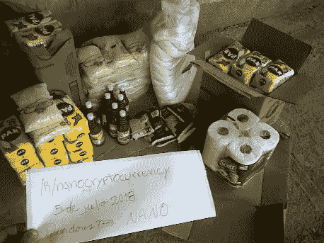
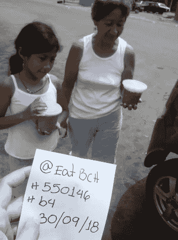
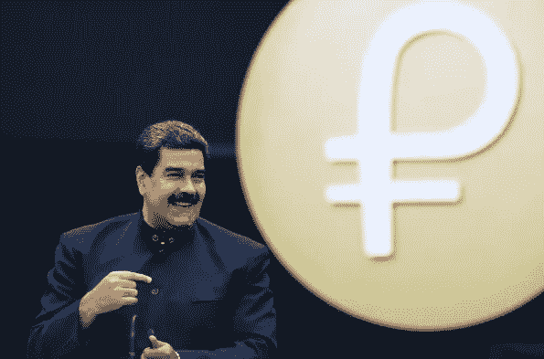

# 秘密慈善机构和企业如何帮助委内瑞拉人战胜恶性通货膨胀

> 原文：<https://medium.com/hackernoon/how-crypto-charities-and-businesses-are-helping-venezuelans-beat-hyperinflation-6e45009e3745>

委内瑞拉对比特币的需求持续上升，2018 年 10 月的交易量达到创纪录的 8.53 亿玻利瓦尔。这种趋势并不新鲜；自 2017 年年中以来，这个拉美国家的比特币交易一直在稳步增长。像 [CoinCola](http://bit.ly/2CyRl3f) 这样的加密货币交易所为当地居民[购买比特币](http://bit.ly/2Pq6kPP)、Dash 和其他替代货币提供了一种快速安全的方式。

是什么导致了密码交易的激增？委内瑞拉经济受到玻利瓦尔急剧通货膨胀的严重影响，国际货币基金组织估计，到 2018 年底，通货膨胀率可能达到 100 万。由于许多委内瑞拉人现在买不起食物和药品，当地居民正在寻找替代的交易方式。加密货币提供相对更稳定的价值储存，并提供更有效的汇款支付方式。

国际慈善机构和企业也一直在尽自己的努力帮助委内瑞拉人度过该国的经济危机。以下是方法。

1.  **慈善组织和志愿者**

几个运动和团体正在通过发送密码帮助委内瑞拉人获得购买必需品所需的资金。

*纳米社区*

Nano 是一种加密货币，宣传即时和零费用交易。在一个故事中，Nano 的 Reddit 社区成员给了一个委内瑞拉用户 230 个 Nano 令牌；大约相当于 500 美元(截至本文撰写时)。这位署名为*windows 7733*的用户用这笔钱中的一部分——29 纳米——为他自己和他的社区购买了 102 公斤的食物。

这开始是一个一次性的故事，但 Windows7733 已经扩大了他的努力，以帮助更多的委内瑞拉家庭。与此同时，其他人正在组建团体，向该国发送比特币和替代币。其中一个叫做 eatBCH。

eatBCH 是一家非营利组织，接受比特币现金捐赠，为有需要的人购买食物、饮料和药品。

委内瑞拉是 eatBCH 的主要目标国家之一。该组织有一个专门针对委内瑞拉的特别频道，他们定期发布当地人通过捐款获得各种必需品的图像。

eatBCH 值得注意的是，他们试图帮助那些最需要的人。委内瑞拉分部每周六向养老院运送食物，并强调帮助有需要的家庭、母亲、老人和儿童。

*浅蓝色粉底*

eatBCH 和 Nano 社区并不是唯一帮助委内瑞拉人度过经济危机的组织。软件工程师 Jonathan Wheeler 正在努力让非盈利基金会“浅蓝基金会(PBF)”起步。PBF 正在开发一款支持闪电网络的应用，该应用将用于促进比特币捐赠。

乔纳森本人离开高盛专注于基金会，这表明他是多么认真——也证明了参与帮助当地人的人的素质。希望在不久的将来，PBF 能提供一个更可控、更系统的慈善解决方案。

这些努力是有益和温暖人心的。不幸的是，它们不太可能为委内瑞拉的恶性通货膨胀提供永久的解决方案。但是并不是所有的希望都破灭了。

**可持续的加密解决方案**

如上所述，玻利瓦尔的通货膨胀率今年可能达到 100 万。因此，大多数加密货币——即使在熊市中——在保值方面也明显优于委内瑞拉的国家货币。

这意味着使用加密代替法定货币可以帮助委内瑞拉人避免恶性通货膨胀。当地人意识到了这个事实。越来越多的商店和品牌——包括赛百味和卡尔文·克莱恩——现在接受加密货币支付。

与此同时，委内瑞拉境外的加密组织正在通过外联努力和有吸引力的提议，帮助委内瑞拉当地公民进入加密经济。

典型的例子: [CoinCola](http://bit.ly/2CyRl3f) ，世界上最大的场外密码交易所之一，让委内瑞拉人:

1.  在 2018 年 10 月 31 日之前，*无任何交易费*地买卖 Dash。
2.  在 2018 年 10 月 31 日之前，在所有场外交易中以 0.5%的折扣交易费(低于 0.7%的正常费用)买卖所有其他硬币(比特币、以太坊、比特币现金、莱特币和系绳)。

CoinCola 还为委内瑞拉人提供了一个慷慨的推荐计划，用户可以获得 50%的推荐交易费；在世界其他地方明显超过 30%。

鉴于这一点以及越来越多的商家愿意接受加密技术，战胜恶性通货膨胀变得越来越容易。

委内瑞拉的下一步是什么？

目前，玻利瓦尔和委内瑞拉经济的未来仍不明朗。

委内瑞拉国家支持的加密货币 Petro 的公开销售将于 2018 年 11 月 5 日开始。尽管推出了 Petro，但比特币的交易量继续创下历史新高。

在经济危机中，加密货币为委内瑞拉公民提供了一种缓解措施，要么作为一种替代的价值储存手段，要么作为一种推动替代货币政策的手段。