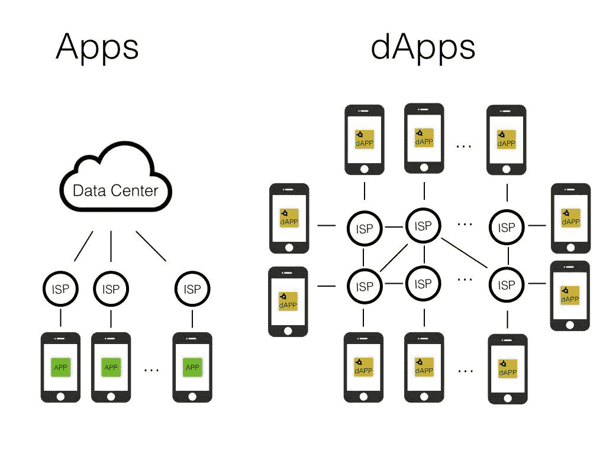
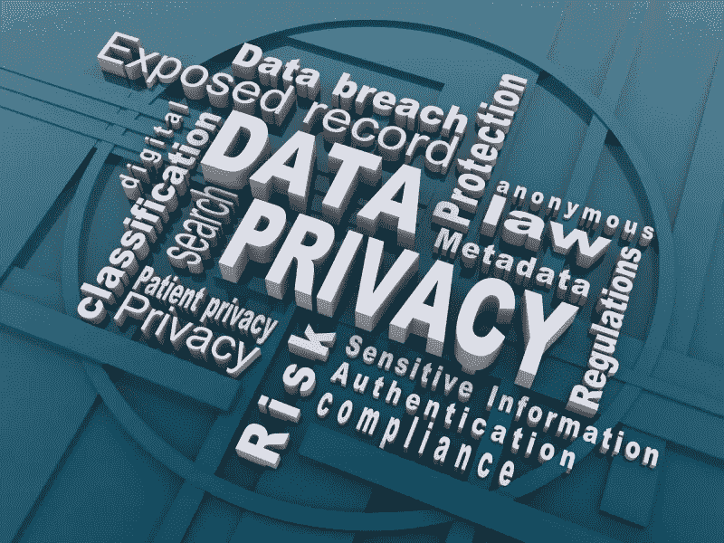

# 加密如何改变网络空间的法律

> 原文：<https://medium.com/hackernoon/how-crypto-is-changing-the-law-of-cyberspace-483c318175e0>

劳伦斯·莱斯格的书《代码和网络空间的其他法律》中说“代码就是法律”，这是指计算机代码已经逐渐成为规范行为的主要方式，与法律代码具有同等程度。

随着区块链技术的引入，代码在人们的交流中扮演着更重要的角色。然而，虽然与法律代码相比，计算机代码能够更有效地执行规则，但它有几个限制。

由于重大的监管影响，**区块链应用**已经提出了许多法律问题，尽管它们继续提供新的功能，以不完全符合当前法律框架的方式从事活动。

# **作为法定货币的加密货币**

比特币是世界上最广为人知的数字货币，它使用加密技术来监管货币单位的生成以及资金转移的验证，独立于中央银行运行。这意味着这笔钱没有通过银行等金融机构，也没有任何政府机构对其进行筛选。

如果你有一笔通常必须报告的重大交易，那就不必报告了。这导致了重大的挑战，主要是关于现有的法律和政府监管机构。

比特币的“货币政策”已被写入其代码:每 10 分钟，新的货币被发行，其供应是有限的，适用类似于金本位制的硬货币规则(货币供应固定于一种商品，而不是由政府控制)。

如果比特币被视为一种商品，那么美国的**商品期货交易**委员会对那里的比特币交易所拥有管辖权。是否是某种立法下的货币，可以决定交易能否吸引税收。

然而，内华达州参议员一致支持一项提案，该提案将阻止地方当局对区块链的使用征收费用或税收。

# **洗钱和其他非法货币交易**

比特币使用的**区块链技术**仍然能够抵御攻击，并支持强大的支付系统。然而，这并不意味着使用它的人总是正直的公民。

区块链行动是自动化的，不属于人类法律行动，这意味着奖金资金(即贿赂)可以匿名自动分散到各种账户中。

2013 年，负责预防金融犯罪的监管机构出台了新条例，旨在将其纳入执法范围。同年晚些时候，约 22 名比特币投资者和公司被纽约金融服务局传唤，最终导致联邦特工关闭了丝绸之路(一个主要由比特币提供的黑市)。

西弗吉尼亚州的立法者最近认为使用比特币等加密货币洗钱是一项重罪，并更新了该州的反洗钱法规。这些法律为加密货币下了定义，加密货币在美国被视为“货币工具”。

然而，在这些新法规中取得适当的平衡是一个持续的挑战。

进行假名交易的能力是比特币在其他虚拟货币**中的关键创新之一。绝大多数虚拟货币交易不需要交易双方互相认识，直接互动，甚至不需要面对面交流价值。**

新的立法要求被控违法的一方有实际的知识和/或意图。当事人之间缺乏直接的沟通是至关重要的，并突出了当前法律变化的狭隘影响。

大多数国家的金融服务必须遵守与[反洗钱(AML)](https://www.investopedia.com/terms/a/aml.asp) 和[了解您的消费者(KYC)](https://complyadvantage.com/knowledgebase/kyc/) 相关的规则。随着时间的推移，区块链和其他新的支付网络将不会免除这些要求，这就是为什么一些国家要么严格限制要么完全禁止加密货币。

# **分散应用的监管**

区块链有时被用来创造代币，而不是设计成现金。例如，以太坊这样的可编程区块链允许用户用自己的令牌创建分散的应用程序。

“分散的”和“分布式的”指的是区块链网络的对等方面，因为没有单一的块中央数据库。网络上的每个节点都可以拥有整个分类帐的副本。

区块链被设计成去中心化的，有“层”，每一层都由一个可互操作的开放协议定义，个人和公司可以用它来构建服务和产品。

比特币等加密货币使新的去中心化金融体系成为可能。然而，如果去掉中间层，事情会简单得多。它可以帮助防范风险，而且由于它允许资金以不同的方式流动，它可以为不同类型的金融产品开辟可能性。

# **隐私法**

兰博古德诺的律师马克·兰博表示，区块链就像任何其他类型的账本一样，成为跟踪交易有效性和历史以及其他信息的官方记录。记录对所有人都是可见的，尽管交易的单个元素是不公开可见的，因为它们是加密的。在这里，区块链对私人和公共的划分特别有趣。

例如，您的身份信息或文档(如护照)可能会被安全加密，但验证证明可能会在区块链上公开使用，以证明该交易是您本人所为，而无需透露任何底层私人数据。

然而，在金融机构有义务遵守一些隐私法律的情况下，区块链可能会提出挑战。

当法院要求时，法律要求一些金融机构永久删除数据。这可能对现有的区块链技术构成挑战，因为就其性质而言，区块链不允许删除数据，而只允许在后续块中更新，这可能不足以确保符合法律。

> 区块链保护的信息的所有权也在争论之中。

亚利桑那州的一项法案目前正在等待批准，该法案规定，使用区块链保护信息的人实际上拥有该信息。其他立法者试图阻止什么可以被跟踪，什么不能被跟踪，其中包括亚利桑那州的另一项法案，该法案将在很大程度上禁止使用区块链技术来跟踪枪支。

# **区块链记录的法律后果**

部分由于他们使用了严格的加密技术，区块链将在法庭上有更多的法律影响力。佛蒙特州最近通过了一项法案，将使用区块链技术验证的记录作为法庭证据。

诸如此类的法律有助于为基于区块链的信息创造某种法律支持。

内华达州的一项法案将区块链签名和智能合同视为州法律下可接受的记录。

随着区块链系统和分类账变得越来越普遍，它们在案件中作为发现和证据的潜在用途更有可能。这意味着律师必须知道此类记录的存在，以及除了需要哪些具体信息之外，如何处理此类证据。