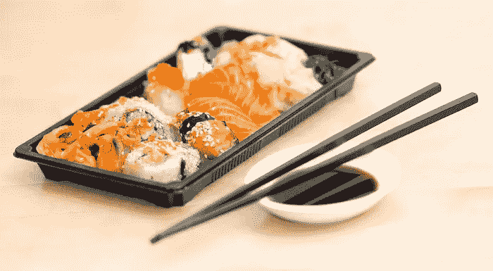
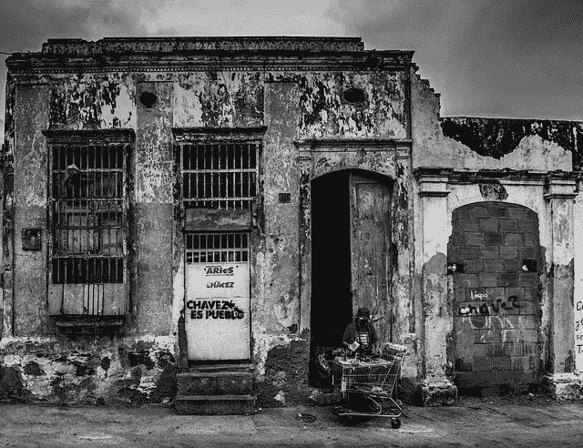
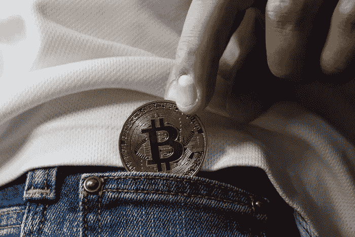

# Crypto 就像一个辣金枪鱼卷

> 原文：<https://medium.com/hackernoon/how-crypto-is-like-a-spicy-tuna-roll-c1bbed4e007a>

sushi platter (image courtesy Pexels)

*BX3 Capital 内容总监 Anne Szustek Talbot*

无知是福。

换句话说，你不能错过你从来不知道的事情。以烹饪传播为例。在 90 年代末，在美国的大多数城市，寿司充其量是一种稀罕物，最糟糕的是，会引起类似“恶……生鱼”的反应大多数大都市地区没有足够的市场来维持多个寿司店，更不用说有相当大的客户群来分辨天妇罗和 T2 寿司了。到了 2018 年，寿司变得如此普遍，以至于你可以在杂货店熟食区、连锁药店，或者对于我们当中更喜欢冒险的人来说，在加油站买到它。

如果像加州卷这样温和的东西需要长达 20 年的时间才能成为大众意识的一部分，那么想象一下非午餐的东西的采用率吧。加密货币还不到 10 岁。然而，它成功地激起了知名资产管理公司的兴趣，占据了新闻头条，并帮助化解了[与家人的紧张节日晚餐](https://www.marketwatch.com/story/how-to-talk-to-your-family-about-bitcoin-at-thanksgiving-dinner-2017-11-20)——以及[一个涉及现实生活新闻主播的轻松情景喜剧笑话](http://siliconvalleyism.com/silicon-valley-quote.php?id=808)的笑柄。加密货币很好地融入了时代精神。不管是出于好奇还是出于嘲笑，它已经成为我们集体谈话的一部分，这很好。

然而，最终，它的产品吸收需要优先于它受欢迎的产品。crypto 面临的主要问题是一种难以接近的感觉，这反过来又阻碍了利益相关者对该产品产生熟悉感和舒适感。

BX3 Capital 的联合创始人兼合伙人凯尔·阿斯曼(Kyle Asman)说:“作为一个活跃在区块链行业的人，我已经有很多人问我如何投资加密货币。“总的来说，人们就是不明白怎么进去买代币。”事实上，除了少数加密的自动柜员机(很大程度上因为其稀有而具有新闻价值)，普通公众无法获得比特币或有形的以太币。对许多人来说，加密仍然是纯理论的东西，与数学定理没有什么不同——而且难以理解。

为什么？

**来自传统利益相关者的不信任**
加密货币被视为异类的瘟疫已经蔓延到了大型资产管理公司。BX3 的联合创始人兼合伙人瑞安·奥巴赫(Ryan Orbach)表示，说服一家大型银行或投资银行进入一种似乎不安全的产品或资产类别几乎是不可能的。“交易所遭黑客攻击和钱包被盗的数量之多，令受托保护客户资产的大型基金经理感到恐惧，”Orbach 表示。

可以说，一个看似不透明的投资工具，再加上一层额外的风险，将不会是一件容易的买卖。那么，为什么会有人想冲进去，更不用说写一些他们为什么应该这么做的思考了？

**新兴市场会引领加密技术的应用吗？具有讽刺意味的是，答案就在人们对加密理解缓慢的原因中:它的新颖性。**

以委内瑞拉为例。20 世纪中期，这个石油国家曾是世界上人均第四富裕的国家。到了 2018 年，在经历了近 20 年的极端经济渎职以及 2010 年代中期的油价暴跌后，委内瑞拉的通货膨胀率高达 100 万%。在货币稳定、坚挺的经济体中，与加密相关的波动性和滞后时间似乎不值得费心。但在一个经济通胀率达到 6 位数的国家，冗长的交易确认可能并不那么糟糕。因此，委内瑞拉采用石油作为法定货币玻利瓦尔的替代品。

“如果金钱一直为你和你周围的每个人服务，很难想象货币体系会出现根本性的失败，”Orbach 继续说道。然而，对现状的厌恶可以成为变革的催化剂，而不是彻底崩溃。

Maracaibo, Venezuela. (image courtesy Pixabay)

**土耳其:在央行低利率的情况下，人们对加密技术产生了新的兴趣**

土耳其最近在里拉问题上也经历了类似的情况。最近的地缘政治风波，加上投资评级机构的负面报告，使人民币兑美元汇率跌至近 7。(去年年初，里拉对美元的汇率约为 4 比 1，与 2000 年代末的 1.4 比 1.8 相比，这被认为是足够低的。)

8 月份，随着里拉的贬值，人们对 crypto 的兴趣越来越大。(在后面的帖子中会有更多关于这方面的内容。在这个月的前两周，本地加密交易所的交易量膨胀了 350%。虽然比特币今年也有波动，但在过去一个月里，它对里拉的价值上涨了 13.4%。该国的通胀率同样保持在令人不安的水平，7 月份的年化通胀率达到 15.85%，在 20 国集团中排名第二，仅次于阿根廷的 31.2%。(作为背景，在世界 20 个最富裕的国家中，排名第二的是南非，为 5.1%。)

土耳其央行已经被束缚住了手脚:总理出身的总统雷杰普·塔伊普·埃尔多安(Recep tay yip erdoan)基本上禁止摆弄利率这一抑制通胀的常用机制，他谴责加息，以免该国落入该国领导人所认为的“[利率游说集团](https://foreignpolicy.com/2018/05/25/erdogan-is-a-mad-economist-and-turkey-is-his-laboratory/)的拇指之下(值得注意的是，根据伊斯兰银行业的原则，收取利息是不允许的；尽管土耳其宪法宣称建立世俗共和国，但埃尔多安的政策根植于政治伊斯兰主义。)

潮汐变化。今年 2 月，现任副总理、前财政部长、埃尔多安核心集团成员穆罕默德·希姆塞克(Mehmet imsek)提出了一个国家加密货币框架。与此同时，土耳其央行在建议谨慎的同时，成立了一个加密货币工作组，指出加密“如果设计得当”可以提振经济。

诚然，土耳其的经济状况远没有委内瑞拉那么糟糕。而在前者，进口商品远远超出家庭预算；在后一种情况下，[一卷卫生纸的价格比一叠同等高度的钞票还要高。然而，如果加密有助于改变任何一个国家的经济风向，发达经济体可能会将这两种情况都视为其宏观经济试验场。](https://qz.com/1364695/the-stacks-of-cash-needed-to-buy-basic-goods-tell-venezuelas-insane-inflation-story/)

cryptocurrency adoption (image courtesy Dreamstime)

**加密:用于经济和日常生活**

在较小的规模上，加密货币服务正在填补零售和机构投资者的不确定性缺口。

“随着比特币基地发布托管解决方案，许多其他服务也紧随其后，看起来我们可能很快就会有机构资金流入市场，”Asman 说。比特币基地还为日常投资者提供了如何购买比特币、以太坊、莱特币和比特币现金的途径。

尽管如此，这个平台似乎让加密新手望而生畏。阿斯曼让他的加密货币发行客户制作视频，指导潜在买家完成代币收购过程，帮助将投资过程通俗易懂。

这就是说，“直到进入加密的入口变得更容易，大规模采用将是非常艰难的，”阿斯曼指出。尽管如此，众所周知的吊桥还是被放下了。创新理论的[扩散表明，早期采纳者需要与另外两个人分享一个新产品或服务](https://www.ou.edu/deptcomm/dodjcc/groups/99A2/theories.htm)才能成为采纳者，因此采纳率会呈指数增长。

**降低加密入口**

回想一下谷歌早期的 Gmail，当时这项服务只接受邀请，或者脸书，当时会员只限于大学生和研究生。现在，这两家公司不仅分别是基于网络的电子邮件和社交媒体的旗手，它们还是科技股的领头羊。密码的市场就在那里；日常使用可以及时到来。

密码终有一天会成功。不过，如果你想速战速决，我肯定街对面的连锁药店有一包放了一天的寿司。