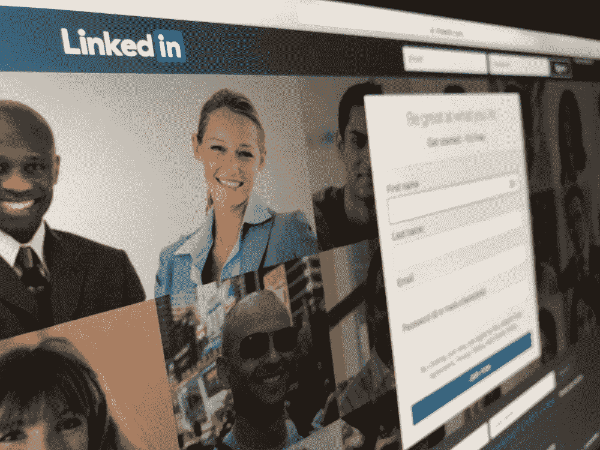

# 加密初创公司如何修正 LinkedIn 式的用户数据处理方式

> 原文：<https://medium.com/hackernoon/how-crypto-startups-are-fixing-the-linkedin-like-approach-to-user-data-feb16c5e6bac>

报名吧。填写一张又一张表格。申请工作。网络。重复一遍。这些是个人在 LinkedIn 等网站上采取的常见步骤。在这个过程中失去的是 LinkedIn 如何使用用户在其网站上上传的个人数据向广告商、数据公司和世界各地的其他公司出售。虽然这让他们受益匪浅，但用户却没有得到任何回报。

# 【LinkedIn 怎么了

使用 LinkedIn 这样的服务的主要原因之一是为用户建立新的网络联系。我们都是这个系统的一部分，亲眼目睹了盲目遵循 LinkedIn 等网站所要求的协议是什么样的。我们不会质疑任何事情，因为至少在一天结束时，我们会得到我们认为需要的东西。

我们认为“公平交易”的回报是获得一张电子名片。在那之后，LinkedIn 和它的用户分道扬镳，没有人会再考虑这个协议，而事实上，用户是吃亏的一方。用户没有意识到后端发生了什么，因为这不是他们的主要关注点。在后端，LinkedIn 通过出售属于你的数据赚了很多钱，但你却没有得到任何经济回报。更不用说免费提供的个人信息的隐私、安全和价值了。

LinkedIn 有三种不同的方式从用户数据中赚钱，从用户点击并填写所有个人信息的那一刻开始。首先，他们利用与数据公司建立的合作关系，这些公司向 LinkedIn 支付用户数据，这样他们就可以把这些数据卖给广告商。大型数据公司 DataSift 就是一个很好的例子，它与 LinkedIn、脸书和 Twitter 等大公司合作。他们是 LinkedIn 最大的数据付费客户之一，愿意为大数据花大价钱。现在，资金漏斗的第一块已经到位，比赛开始了。多米诺骨牌一号在 LinkedIn 过程中倒下了。LinkedIn 和 DataSift 等许多公司从中受益。用户的收益仍然为零。

其次，LinkedIn 知道像 DataSift 这样的公司收到的信息现在将被出售给数百万营销人员，他们将开始在 LinkedIn 上创建广告活动。那是买一送一的交易。他们不仅从需要用户数据的大公司那里获得报酬，还从现在向目标个人付费的营销人员那里获得点滴效应。

第三种方式是通过 LinkedIn 的付费计划。在这里，付费用户可以访问各种不同的客户数据，远没有免费用户资料服务那样受限。

LinkedIn 仅广告收入就超过 4.5 亿美元，而且增长迅速。你会收到一张电子名片。听起来不公平，是吧？

# **Crypto 如何修复 LinkedIn 漏洞**

区块链和加密货币是对抗许多行业建立的老式和中心化现实的工具。与银行业类似，你的储蓄账户只能获得 1%的利息，但信用卡却要支付 25%的利息，LinkedIn 可以对你的个人数据为所欲为，同时不给你任何回报，因为直到最近还没有真正的替代方案。

但是现在有很多加密初创公司使用区块链技术来解决这个问题。以下是他们解决这个问题的方法。

## **奖励用户的数据**

第一个也是最明显的方法就是不要像 LinkedIn 那样，用公平的方式回报用户。这就是即将推出的 [Snovian。太空](https://snovian.space/)项目确实如此。这个新平台为用户分享的信息提供奖励。要使用该系统，用户需要注册并填写技能和联系信息。

一旦他或她同意与对他或她的技能感兴趣的企业联系，项目代币的付款将被发送到用户的 ETH 钱包。

另一个旨在让用户从其信息中获利的项目是[数据](https://datum.org/)。这是一个分散的分布式高性能数据库，由区块链分类账支持，还包括一个市场，用户可以在那里分享或出售他们的数据(但不可能确定某个人)。此类交易的条款可以是单独的。

## **突出最好的，而不是那些付出的**

LinkedIn 赚钱方式的另一个问题是，这项服务突出了选择付费的用户的资料，而不是那些实际上更适合某项工作的用户。

区块链避免了这个问题，并提供了关于潜在员工历史和可信度的可信信息。这就是 MoneyRebel 的工作方式。这是一个市场，它将密码技术顾问和想要探索密码世界的新人聚集在一起。区块链对顾问进行评级，消除了交易对手之间的信任问题。

## **降低用户数据业务成本**

当微软在 2016 年收购 LinkedIn 时，他们为每个个人的数据支付了大约 260 美元。当你有 4.33 亿注册用户时，这是一笔大生意。当你与 LinkedIn 或类似的集中式服务合作时，从用户那里获取主要的、精英特定的数据的代价是非常高的。在找到合适的个人数据之前，你仍然无法避免对数以千计的潜在线索进行仔细研究。

基于区块链的工具可以显著降低这个市场的价格，并使寻找合适档案的整个过程变得更加容易。比如斯诺维安。空间为企业提供了一个机会来创造定制的受众，只有当他们找到他们想要的用户时才支付代币。

# **最终想法**

区块链技术允许创建更好版本的 LinkedIn。为数据付费并免费出售数据的日子很快就要结束了。为他们的用户创造更具吸引力的选择将增加他们快速增长的平台，这意味着企业将有一个更大的候选人池可供选择。虽然这本身对所有相关方来说是一个双赢的局面，但它会变得更好，因为每个人都受益。