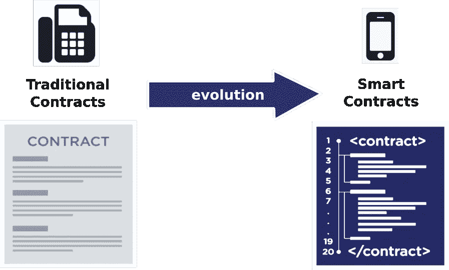
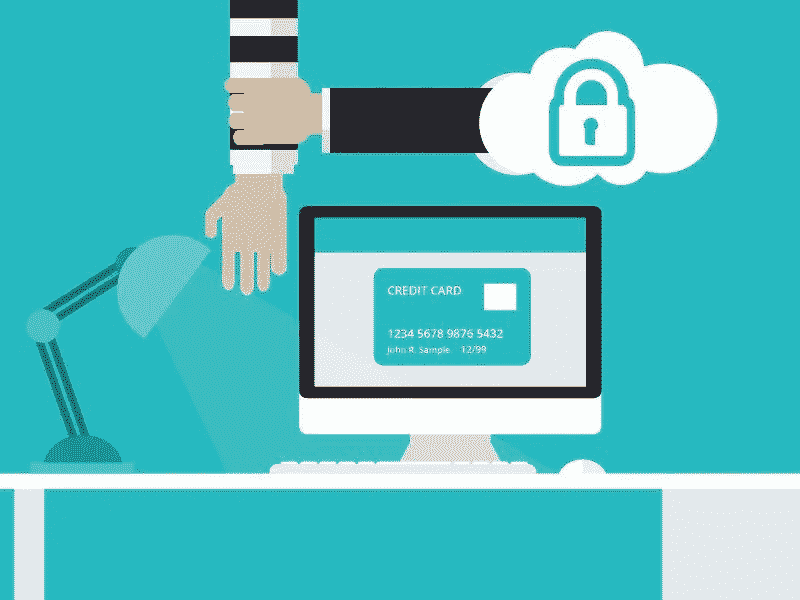

# 加密将如何改变国际贸易

> 原文：<https://medium.com/hackernoon/how-crypto-will-change-international-trade-6329696702a6>

## **终极指南**

找出区块链每天改变国际贸易的六种方式。区块链正在瓦解中央集权的腐败。虽然并非所有的集中化都是负面的，但在许多领域，人们可以利用[区块链技术](https://hackernoon.com/the-blockchain-technology-of-2018-or-not-c375eab5d46a)开展业务、跟踪信息以及相互通信。本文将提供区块链可以帮助以积极方式影响国际贸易的六大方法的信息。

**方法一:即时跨境贸易**

正常的跨境业务支付通常需要几天才能完成，以确保不同银行机构的资金流动没有问题。这是一个缓慢、令人沮丧和昂贵的经历，但在大多数情况下是必要的。然而，区块链现在可以帮助机构将支付时间从几天缩短到几秒钟。这种支付方式安全、快捷且极具成本效益，将促进国际业务，让移民向他们在其他国家的家人汇款变得更加便宜。

此外，区块链通过使用实时交易验证的加密平台，帮助促进快速的国际支付处理服务。区块链的周转时间不到一分钟，与传统的三到五天的等待时间相比，这是一场支付系统的革命。

**方法 2:积木在吃纸**

从字面上看，区块链正在导致纸质合同的消失，并以数字协议取代这些文书工作。纸质文件需要更多的同事来支持，例如文书人员、律师和签字人，以共同确保交易准确地反映在协议中。通过消除文书工作，简化了流程，区块链合同被自动编码到一个由[加密编码保护的可扩展分布式数据库中。](http://csfieldguide.org.nz/en/chapters/coding-encryption.html)

此外，区块链使数字识别能够在一个完全分散和无腐败的登记处进行。因此，区块链将帮助取代文件记录，重新分配财产所有权，并消除任何腐败的土地登记的必要性。

**方法#3:中介的终结**

https://www.at-it-translator.com/的国际翻译 Anthony Teixeira 说，使用区块链的最大好处之一就是消除了“中间人”。区块链研究了分类账的使用——这是一种由经纪人保留记录的昂贵系统，一旦区块链可用，它似乎就没有必要了。清算所和中间商的服务可以随着区块链技术中涉及的点对点商业策略而改变。对经纪人的信任正在被加密、合伙和区块链从属关系所取代。

当使用区块链技术时，作为支付中间人或分类账保管人的一部分而产生的所有费用将被去除或降低到低交易成本。区块链的第三方合同被编程为一旦满足源上的数字要求就自动自动执行。

**方法 4:预防网络犯罪**

[区块链技术](https://blockgeeks.com/guides/what-is-blockchain-technology/)的核心特征之一是其透明性和结论性；从而使其成为去除所有当前在线保护系统的理想技术。随着数字黑客变得越来越老练，区块链架构允许您的公司减少其面对黑客的[漏洞](https://hackernoon.com/motor-vehicle-hacking-a-21st-century-problem-b29a948b2851)。由于其高度加密的编码，分布式分类账保护数据免受任何未经授权的更改或入侵。

区块链技术涉及的安全协议可确保不同位置的所有敏感信息都得到保护，即使系统完全崩溃也是如此。该系统技术将所有数据存储在哈希函数中，保持数据不被篡改和安全。分散式分类账保护用户的身份，因此能够发现第三方黑客试图进入系统的企图。由于有一个分散的基础，区块链技术没有弱点。

**方法 5:防止洗钱**

目前实施的反洗钱立法证明，国际贸易过于薄弱，无法防止国际层面的金融欺诈。目前，反洗钱立法旨在解决中央机构使用文书工作的问题；因此，你所有的信息都在这份文件上。这会增加签发信用证的整体风险和成本，从而阻碍贸易。

区块链技术是有益的，因为它将所有合同数字化，消除了文书工作和检测风险。该技术还保证了对所购商品的安全识别，便于实时接收付款数据。随着金融机构义务的完成，这增加了信息的安全性。

区块链有助于使全球市场更容易进入，以缩小贸易融资差距，并增加投资机会。当被主要参与者接受时，这种新技术可以减少对客户需求的需求并强化已知的东西。

执法人员能够通过追踪数字比特币地址，追踪基于集中交易的平面转换；从而迫使交易所透露机密的消费者信息。不变性或不能被改变是防止洗钱时的一个重要因素，这可以由区块链技术提供。

**方法#6:密码结束**

全球最大的数据桥之一和公司的损失是由弱密码造成的。关于强密码创建的人为限制已经导致了财务损失和支付索赔的缺乏。使用第三方存储密码也增加了虚拟黑客攻击的机会。集中式服务意味着，如果信息遭到黑客攻击，所有数据都可以立即被访问。

区块链技术通过消除组织维护中央服务器来识别信息的需要，避免了制作密码的问题。用户现在能够通过使用公钥来访问数据，类似于加密货币中的公司验证。事务以块的形式存储，正是这种交互防止了对单个服务器的攻击，从而危及数据的安全。

考虑到形成密码的人为错误问题，区块链技术也可以提供安全的密码。这是一个用户需要放弃所有熟悉的密码的任务；如果用户下定决心，这种努力是值得的。