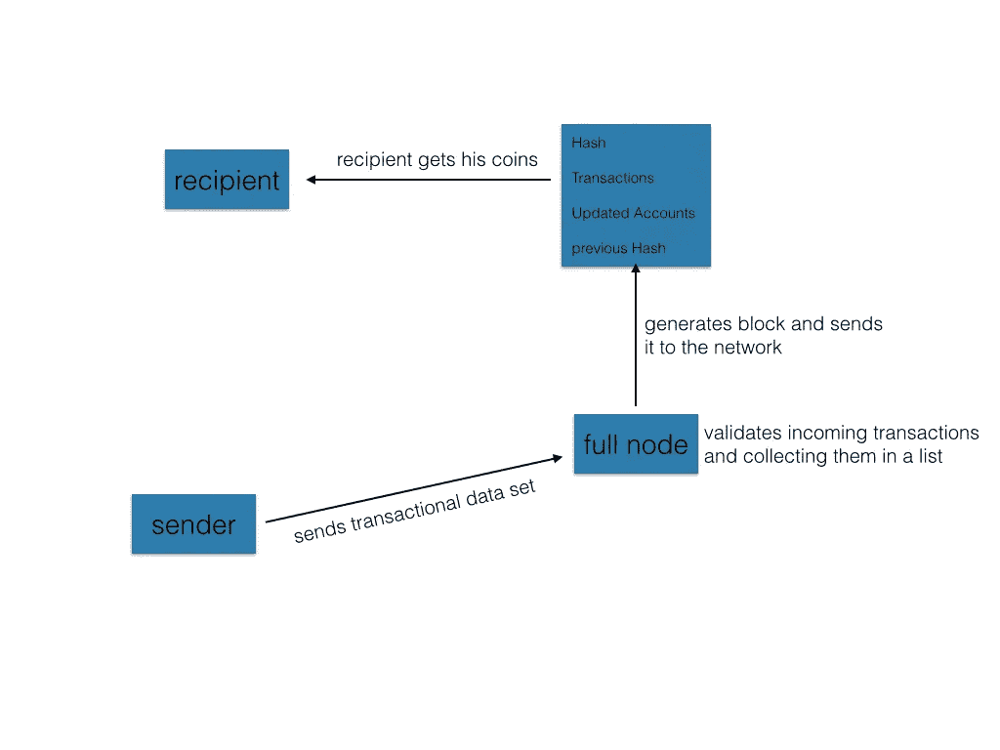

# 加密货币的实际工作原理

> 原文：<https://medium.com/hackernoon/how-cryptocurrencies-actually-work-d802106ed341>

[Image Source](https://www.google.de/search?biw=1363&bih=584&tbm=isch&sa=1&ei=gNKtW7OwJbL0kgXwgrmwDw&q=blockchain+&oq=blockchain+&gs_l=img.3..35i39k1l2j0i67k1j0l7.15689.15689.0.16323.1.1.0.0.0.0.104.104.0j1.1.0....0...1c.1.64.img..0.1.102....0.Xx1hiRGzMTw#imgrc=O3I8TXELA4x0uM:)

## *交易和分类账的简单介绍*

在我的上两篇文章[构建一个简单的区块链](/coinmonks/build-a-simple-blockchain-fe7ee48090d9)和[学习如何编写椭圆曲线密码](/coinmonks/learn-how-to-code-elliptic-curve-cryptography-be646d2c9757)中，我给了你如何实现[区块链](https://hackernoon.com/tagged/blockchain)技术的一些基本功能的一步一步的指导。我善意地建议你在看这篇文章之前先看看那些文章。你可能已经了解到，区块链是一个分散的和密码安全的数据库。在这个分散的网络中，任何参与者都有一个地址，我们称之为*公钥*，它与一个叫做*私钥*的东西紧密相连。存储在区块链中的数据可以是任何东西，但在大多数情况下，这些数据集都是事务。这就是我们得到加密货币的地方——加密货币只是一个区块链网络，其数据是交易。在本文中，我想更深入地挖掘这个领域，并向您展示加密货币的实际工作原理。

## 跟踪资金——基于账户的分类账系统

在区块链技术中，有两种可能的方法来跟踪网络中参与者拥有的资金。比特币网络使用的系统是所谓的*基于交易的分类账*。我将在另一篇文章中重点讨论这个问题。最直观的方法是使用*基于账户的分类账。*在这个系统中，简单来说，每个用户都有一个具有以下属性的账户:

> account = {publicKey，Funds}

所以账户是一个数据集，包含用户的*公钥*和他或她的*资金*。每个存在的帐户都存储在区块链的块中。每生成一个块，资金就会更新。如果用户想要将他的一些硬币转移到另一个公钥，他生成一个交易。事务是包含以下信息的数据集:

> 交易= {发件人、收件人、资金、签名}

变量*发送者*代表资金发送者的公钥，变量*接收者*代表接收硬币者的公钥。变量*资金*是指被转移的硬币数量。签名是使用椭圆曲线加密法生成的，证明私钥确实为发送硬币的人所有。如果你对这个程序不熟悉，再看一下[学习如何编写椭圆曲线密码](/coinmonks/learn-how-to-code-elliptic-curve-cryptography-be646d2c9757)。一旦交易数据集在区块链的最新块中，资金就被正式转移。基于帐户的分类帐系统中的块结构可能如下所示:

Simplified structure of a block in a blockchain used for cryptocurrency purposes.

交易数据是数据集(用{}表示)的列表(用[])表示。每个交易数据集包含*发送方*的公钥、*接收方*的公钥、被转移的*资金*的金额和发送方的*签名*。帐户数据是一个帐户列表，其中每个帐户都是一个数据集，只包含一个公钥和资金量。

## 网络中的交易

在用户生成交易后，他将这个数据集发送到整个网络进行验证。理论上应该是这样的。实际情况是一个由叫做*满节点*和轻节点*组成的网络。这些完整的节点是网络参与者，它们收集事务性数据集，验证它们，并将它们添加到它们正在生成的块中。光节点只是网络的用户，发送和接收资金。因此，生成事务的轻型节点将事务数据集发送到完整节点，然后对其进行验证。*

验证过程要求完整节点查看签名是否有效，以及发送者钱包中实际拥有的资金量是否足以转移硬币。因此，他获得区块链的最后一个块，并寻找具有用户公钥的账户，以检查所拥有的资金的价值是否至少与被转移的资金的价值一样高。如果签名和资金检查产生肯定的结果，则发送者和接收者的账户都被更新，并且交易被添加到最新的块中。在实际生成块的一个网络参与者收集了足够的事务后，他将块发送给区块链中的每个人。其他网络参与者检查块中的数据及其有效性。在被每个节点接受之后，区块链因此被更新并且资金被转移。转移资金的过程如下图所示。

Visualization of how a transaction works in a blockchain network.

因此，现在您可能已经了解了使用区块链技术进行加密货币交易的基本原理。在下面的一篇文章中，我们将编写一个基于账户的分类帐系统。

我希望你喜欢阅读这个关于加密货币实际工作原理的小介绍。如果是的话，在这里留下一些掌声，感谢你的阅读！