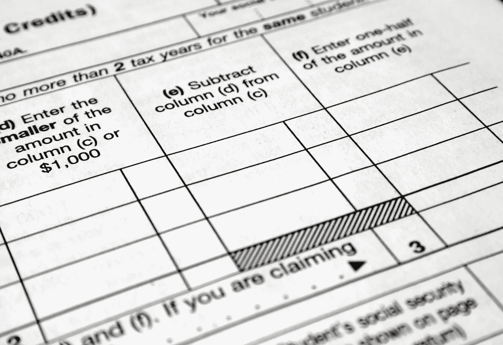

# 加密货币税收监管如何促进经济增长

> 原文：<https://medium.com/hackernoon/how-cryptocurrency-tax-regulation-promotes-economic-growth-14ab4192fb9f>

Photo by David McBee from Pexels

国内税收法的长度引发了激烈的学术争论。它被广泛引用超过 70，000 页。不过，这个数字可能被夸大了至少几万页。除了纯粹的税法之外，该准则还包括相关的解释性文件，如财政部法规、税收规定和国税局通知。然而，无可争议的是关于数字货币的页面数量。

六个。

只有六页关于加密货币的指南。在一个每天都在发展的空间里，这一指导方针正接近它的第五个生日。

少即是多？不一定。这种缺乏指导的情况积聚了一个不确定性的冷池，阻止了许多最优秀和最聪明的人加入进来。作为全球最大资本市场的所在地，美国已准备好部署其强大的资源，但它所做的不过是试探一下，因为美国迟迟未能建立一个诱人的立法框架，让全世界都参与进来；水刚刚好。

在 [BX3 的第一篇监管加密文章](/@bx3capital/its-2018-time-for-a-new-framework-for-cryptocurrency-regulation-967a957443e5)中，我们解决了许多影响证券监管的问题，并提出了一个框架，该框架将使市场对区块链和以加密货币为重点的项目感到兴奋。这篇文章深入探讨了税收框架。

**免责声明:请不要将以下任何信息和评论曲解为法律意见或投资建议；简直就是作者对加密货币和法律的兴趣的个人表达。投资前请咨询律师和/或财务代表。***

ID [4307310](https://www.dreamstime.com/stock-photo-tax-forms-image4307310) Free photo 4307310 © Mary Donovan — Dreamstime.com

打电话给你当地的国会代表，问:“美国应该领导世界发展新技术吗？”再问一次，“美国应该有一个鼓励创新的环境吗？”同样，“难道美国不应该鼓励其公民和居民支持这些创新和技术进步吗？”

当然，这些答案都是“是”获得“是”的一个步骤是通过税收立法来确保我们实现所有这些目标。

美国税收立法与实现特定经济成果的努力密不可分。[电动汽车税收抵免](https://www.irs.gov/credits-deductions/individuals/plug-in-electric-drive-vehicle-credit-section-30d)、[研究抵免](https://www.irs.gov/pub/irs-regs/research_credit_basic_sec41.pdf)、[资本利得优惠税率](https://www.irs.gov/newsroom/helpful-facts-to-know-about-capital-gains-and-losses)——所有这些条款以及更多条款都与推动经济增长的努力有关。并非所有这些都是对纳税人友好的:罚款、逾期余额的利息和视同股息准备金，所有这些也共同推动了行为。

在加密货币的背景下:国会想要推动什么类型的行为？当然，这是一个增加收入的机会，如果“没有真正的政策”政策继续下去，这种机会就会出现。目前，从美国的角度来看，加密货币领域的几乎每笔交易都具有概念性的可征税性。

与此同时，也有机会促进创新、增长和技术进步。假设长期经济增长优于短期税收收入，那么可以采取一些具体措施来支持这一新兴行业的发展。

# 促进增长的立法框架

这一新兴技术的立法应具有以下基本目标:

1.  支持经济扩张
2.  促进创新
3.  鼓励采用技术
4.  公平产生税收
5.  确保充分和有用的披露

幸运的是，我们应该能够通过现有税收规则的演变而不是革命来实现这些目标，主要是在筹资、投资和报告领域。

# 筹款:对待代币要和对待其他筹款工具一致

美国传统的融资方式——通过股权和债务——通常不对发行方征税。例如，股票的首次公开发行(IPOs)允许企业通过允许公众投资于企业的未来潜力来筹集扩张所需的资本，而不会给寻求扩张的公司造成应税事件。

在加密货币领域，税收结果不太明朗。通知 2014–21 提供了臭名昭著的指导，即出于美国税收的目的，加密货币应被视为“财产”。在代币发行或初始硬币发行(ICO)的情况下，发行者通常会用代币来换取某种东西，可能是法币、以太币或比特币。如果没有进一步的指导，这可能是一项应税交易。

考虑到代币产品试图实现的目标，这可能是也可能不是想要的结果。在加密货币产品的当前状态下，一些代币被视为公用事业，一些被视为证券。出于本文的目的，让我们假设一个特定的令牌可以被认为是一个纯粹的实用程序；从本质上来说，它与礼品卡、地铁通行证或狂欢节代币没有什么不同。在这些情况下，代币的首次销售确实应该纳税，这与现有的税收规则一致。在这些情况下，代币没有内在价值，对于发行者来说，它代表着类似于出售预付费服务的东西。

随着代币发行的复杂性增加，更多——坦率地说，大多数——代币发行被恰当地视为证券，并且从税收角度来看，机构群体的许多贡献者已经适当地考虑了它们的相应待遇。如果证券与权益工具非常相似(例如，有股息或投票权，或两者都有)，则该证券的发行应与实际的权益发行一致对待。

**换句话说，首次代币发行不应成为发行人的应税事件，就像首次公开发行不应成为发行人的应税事件一样。**

Photo by Lukas from Pexels

虽然法律倾向于这一结果，但适当的演变将增加必要的清晰度。这可以有多种不同的形式，最明确的形式是将代币确认为一种单独的资产类别，当代币表现出股票工具的性质时，应按照现行规则对待股票的方式对待代币。

在我们的实践中，我们看到许多项目不再发行代币，而是倾向于更传统的融资方式，通常是股权融资，因为规则不够清晰。这是一种不幸且可避免的倒退，主要是因为缺乏清晰性造成了一种焦虑，即新企业无力投入平息危机所需的时间和资源。

# 投资:增加加密货币的同类兑换条款

美国资本资产的长期投资者获得了资本利得的优惠税率，因此针对特定结果调整税收规则的确有先例。因此，真正的问题是长期资本收益规则是否足以鼓励推动加密货币市场有意义增长所需的投资行为。出于多种原因，我认为答案是“不”

在这个新生的市场中，加密货币的长期持有者可能只占少数。许多投资者迅速卖出表现不佳的股票，投资于看似更有前景的项目。如果我们想创造一个最好的项目生存和发展的市场，我们希望这样的事情发生！要做到这一点，现有的资本利得规则并不是实现这一目标的适当机制。

2017 年税收改革的一个牺牲品是在 IRC 第 1031 条的[实物交换条款中的“财产”一词前添加了“不动产”一词。这就限制了类似不动产交换的延期纳税。在这一变化之前，许多加密货币投资者依赖同类交易规则作为道具，以避免对加密货币交易征税。对于这些规则的适用性，这可能是一种过于乐观的看法，特别是就这些投资者是否拥有合格的交易所而言。然而，这并不是说，这些规则不能被修改成鼓励投资者进入这一领域的优秀工具。冒着过于简单化的风险,“真实”一词应该从第 1031 条中删除。](https://www.irs.gov/newsroom/like-kind-exchanges-under-irc-code-section-1031)

让投资者能够推迟对加密货币之间的交易征税，可能会向该领域部署大量资本。此外，这可能会产生避免市场季节性波动的效果，因为许多人将 Q1 和 Q2 市场早期的下跌很大一部分归因于加密货币销售，投资者需要加密货币销售来产生足够的法定货币来支付 2017 年的收益税。

是的，这将背离传统的同类交换规则，即证券交换(例如，苹果股票换微软股票)不是合格的类似财产交换。加密货币的这种区分是有意的，为此目的将不同的加密货币视为“相似的”，因为这是为了促进市场增长，将投资资本吸引到新生企业和技术平台。

基本税收原则应继续适用。例如，从加密货币到法定货币的转移应该是应税交易。利用加密货币支付商品或服务也应该是应税交易。此外，同类交易的复兴或许应该是一种暂时的变化，以允许加密货币市场发展和稳定。

当市场达到投资者选择证券代币作为企业长期股权或债务投资的替代选择时，可能是时候重新评估修改后的同类交易规则，并考虑恢复资本收益规则，以确保税收规则反映市场现实。

Free photo 83062976 © creativecommonsstockphotos — Dreamstime.com

# 报告:要求发行人和投资者报告；增强交易报告

数据是政府评估处理加密货币的正确长期方法的关键组成部分。投资者和发行者的数据对于确定税收立法的预期目标是否实现至关重要。这种类型的报告至少应包括以下内容:

**1。发布者报告**。对于任何发行代币的美国人，应该有一个关于代币发行细节的披露要求。这些详细信息至少应包括筹集的金额和募集资金的特征(符合安全与公用事业概念)。此外，应该有年度报告来跟踪这些募集资金的状态，包括:

1.  支出资金的核算(即费用明细:营销、员工薪酬、技术等。)
2.  如果交易记录等市场数据可用，代币的价值
3.  针对证券代币的代币债务的执行(如股息、利息等。)
4.  针对公用设施代币的代币债务的执行(例如，用于交换商品或服务的代币)

**2。投资者报告**。任何在一个纳税年度持有超过*小额*数量的加密货币的美国人都应该被要求披露这些持有的性质和数量，以及这些持有中每一项的总体变动。*小额*水平应设定在一个将大多数新手投资者排除在外的水平，比如说，相当于 2 万美元，以捕捉市场最大驱动者的活动，并将报告交给最有能力承担其经济负担的人。理想情况下，该报告应包括最有利于政府分析市场和投资者行为的要素，包括以下内容，以及交易所需的任何报告:

1.  令牌名称
2.  交易的交易所(如有)
3.  持有的令牌数
4.  收购日期
5.  基础
6.  报告日的价值

除了这些信息披露之外，纳税人还需要报告导致应税销售(例如，处置一种加密货币以换取商品、服务或法定货币)或延期纳税(例如，处置一种加密货币以换取另一种加密货币)的交易。

**3。交易报告**。如果加密货币被用作货币，或被用于交换商品或服务，则应继续要求使用现有的报告框架进行交易报告。1099 和 W-2 等表格充分描述了这些交易的美元等值，但应加强披露用于执行这些交易的加密货币的类型和金额。

# 结论

区块链的前景和加密货币的兴起可能会改变全球经济。世界上最具革命性的创新的历史领导人已经并将继续把美国称为他们的家。此外，美国拥有世界上最大、最活跃的资本市场，显然拥有领导全球经济转型的所有关键资源。税收政策应该支持和鼓励这些资源的配置，而不是增长的障碍。