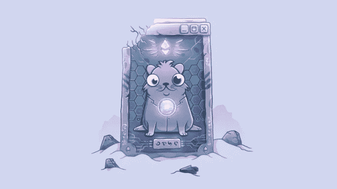
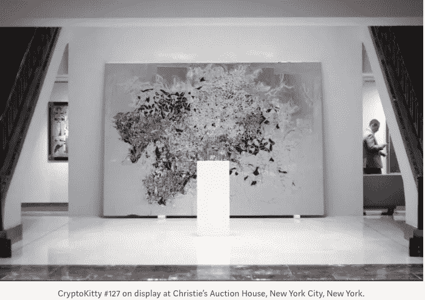
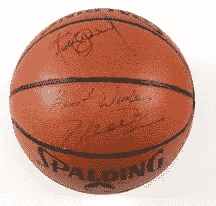
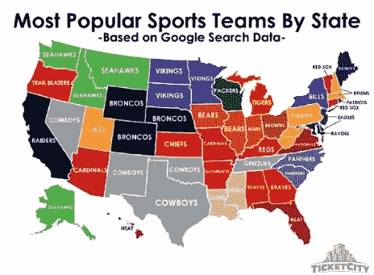

# Cryptokitties 如何在体育领域找到一些最大的用例:资产支持证券的新世界

> 原文：<https://medium.com/hackernoon/how-cryptokitties-found-some-biggest-use-cases-in-sports-a-new-world-of-asset-backed-securities-dfe7638e45f9>

欢迎来到数字收藏品的世界，在这里你可以饲养、出售和购买虚拟的猫。“哦，太可爱了”的因素加上以娱乐游戏为中心的不可替代的“独一无二”的象征，使大多数区块链爱好者成为新的“疯狂的猫女士”。

## *新的‘疯猫女士’*

*由四个口袋妖怪爱好者密码开发者在 [ETHWaterloo 黑客马拉松](https://bitcoinmagazine.com/articles/how-hackathon-birthed-cryptokitties-origin-story1/)开发的 Cryptokitties，现在已经变成了一个由 Union Square Ventures 和[分布在 630 个不同的钱包地址](https://medium.com/u/df45fd4a749d#balances)*

*   *🥇根据 [DappRadar](https://dappradar.com/) 的说法，在以太坊上排名第一的收藏品应用**   *🔒在我们的智能合同中没有发现漏洞- **这在加密世界中是巨大的。***

*你可以在这里阅读更多关于这个项目的信息。*

## ***不可替代代币实物体育商品:***

**

***Basketball Autographed by Michael Jordan & Michael Jackson from the music video “Jam”**
Sold for: $294,000*

*《果酱》可能是有史以来制作的最奇怪的八分钟长的音乐视频之一，但这个特色篮球现在是一件珍贵的财产。有两位美国偶像的亲笔签名，迈克尔·杰克逊和迈克尔·乔丹签名篮球对任何收藏来说都是一个奇怪但极其有价值的附加品。-[https://www . sports memoria . com/news/贵-迈克尔-乔丹-大事记-曾经售出/](https://www.sportsmemorabilia.com/news/expensive-michael-jordan-memorabilia-ever-sold/)*

*与现有商品挂钩的不可替代的代币作为代币化证券在交易所交易的有价商品创造了巨大的投资机会和自己的新市场。这种体育和昂贵艺术的数字收藏品已经有了一个稀缺和忠实买家的生态系统。实物收藏品的全球市场规模为 2000 亿美元。想象一下一个令牌化证券的世界，其中一项数字资产可以由多个所有者拥有，可以作为 NFT 商品在市场上轻松交易，并通过民主化和公平参与带来更多的资本部署。这种令牌化资产的一个重要因素是通过市场升值和投资组合扩张为所有者带来流动性。*

*不可替代的代币特征也有能力带来游戏内资产所有权的创新。*

**

*Courtsey: TicketCity*

*拥有你最喜欢的运动队:拥有你最喜欢的运动队**的一部分是多么酷啊。**体育投资向来头重脚轻。令牌化的私人所有权为其投资者提供了早期流动性，以及信任较少的所有权验证，带来了将粉丝参与度和忠诚度转化为资本部署的新机会。NFL 喜欢吹捧绿湾包装工队是一个公共拥有的专营权，虽然这在技术上是正确的，但这种结构并没有以区块链可以允许的方式为球迷提供真正的所有权。个人体育爱好者能够投资全球体育特许经营权的能力已经在证券化代币中萌芽，旨在彻底改变全球体育生态系统。*

*自从 Cryptokitties 出现以来，人们开始质疑它们的用例，我就一直想写这篇文章。令人欣慰的是，才华横溢的加密开发人员已经在这个新的市场创造和吸引粉丝，希望我们能在这个领域投入更多的资金。我估计这个数字收藏品市场将会成为一个独立的华尔街，并且在未来可能成为一个潜在的万亿美元的生态系统。如果我们的下一代从事由证券化或高度发展的令牌化资产支持的数字收藏品的交易，我不会感到惊讶。*

****注:*** *本文不应被视为金融或法律建议，仅是作者的观点。**

**Gayatri Sarkar 是基于区块链的风险投资基金*[*sport vest*](https://medium.com/u/4ca52e004aa?source=post_page-----dfe7638e45f9--------------------------------)*的普通合伙人，专注于投资体育的未来。**

# *SPORTVEST 风险投资基金:*

**有关 SportVEST 私人销售的更多信息，请联系我们:*[*hello @ sport vest . io*](https://scorum.com/hello@sportvest.io)*或访问我们的网站:*[*sport vest . io*](https://sportvest.io/)*。别忘了加入我们的* [*电报*](https://scorum.com/telegram.me/sportvestico) *和关注我们的* [*推特*](https://twitter.com/SportVESTico) *。**