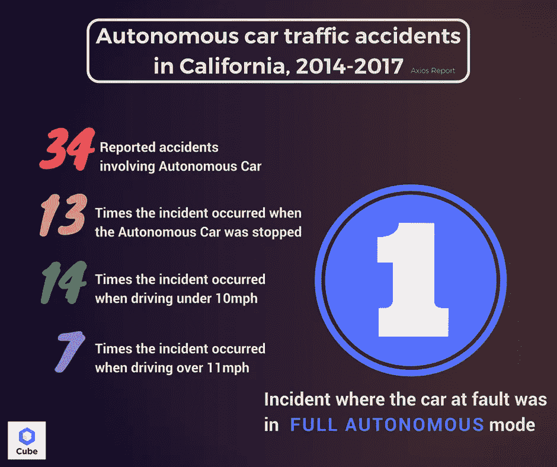
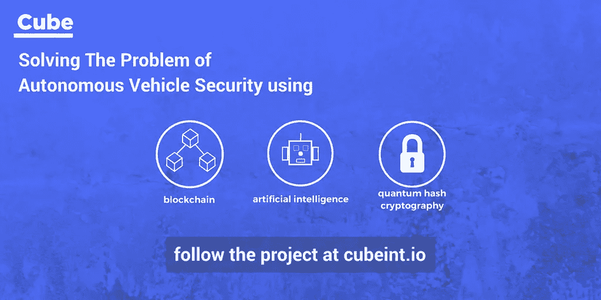

# Cube Intelligence 计划如何确保汽车安全

> 原文：<https://medium.com/hackernoon/how-cube-intelligence-plan-to-make-our-cars-secure-34e4a5df7177>

Cube Intelligence 是一家希望站在使用区块链技术确保自动驾驶汽车安全的前沿的公司。他们的 ICO 在短短几个小时内就销售一空，我们想探索一下为什么人们对 Cube 如此感兴趣，以及在未来几年里我们可以从他们那里期待什么。

我们大多数人都已经知道，全自动汽车的实现不再是一个“如果”而是“何时”的问题。谷歌、优步、特斯拉和(更悄悄的)亚马逊等大公司都在开发这项技术，竞相成为第一家将自动驾驶汽车技术纳入主流的公司。目前正在进行定期测试，例如登布斯的自动驾驶卡车和加利福尼亚州的许多公司在美国进行了 2400 英里的旅行，加利福尼亚州已经修改了道路法律，允许测试和使用完全自动驾驶的车辆。

对于无人驾驶未来的倡导者来说，汽车乘客的安全是这项技术背后的驱动力(请原谅这个双关语)。Axios 的一份报告研究了 2014 年至 2017 年间加州涉及自动驾驶汽车的交通事故，发现在发生的 34 起事故中，只有一起事故发现自动驾驶汽车存在故障。随着越来越多的数据显示这些车辆将使道路变得更加安全，人们现在将注意力转向确保这些车辆安全的问题。

市场上已经有许多具有自主功能的汽车，例如自停车或自主制动系统，但是，这些车辆功能不是在无线管理的网络上执行的，因此还不容易受到恶意攻击。很快，这种情况将不复存在。

过去几年进行的多次测试表明，黑客进入自动驾驶汽车是多么容易，例如，控制一辆时速 70 英里的吉普车。虽然在未来几年，高水平的车辆自动化不太可能在道路上普遍存在，但越来越多的自主功能将会出现，这为黑客窃取驾驶数据、上传病毒、更改汽车 GPS 以及在道路上大肆破坏提供了机会。

Cube Intelligence 正在利用区块链开发一项技术，该技术将确保自动驾驶汽车能够安全地相互通信以及与它们的枢纽通信。他们的短期目标是发布 OTA(空中市场)技术，允许公司远程提供安全的软件诊断、安装、升级和漏洞修补。目前，司机将不得不把他们的车带到制造商那里进行这种行为，通常他们自己要付出代价，这是 Cube 试图否定的。

他们的 OTA 1.0 版本将于今年在 Q2 发布。这只是 Cube 计划的开始，预计很快将使用区块链完成他们的自动驾驶汽车安全平台的开发。但是为什么就此打住呢？为全自动驾驶汽车创建一个更智能、因此更安全的网络是下一个发展阶段。黑客会入侵，所以自动驾驶汽车安全系统将需要保持领先地位。人工智能层将赋予安全系统学习和适应黑客不断变化的威胁的能力。这一层的安全性已经在研究中，预计将在 2020 年实现商业化。

似乎这个项目不能再有趣了，Cube 还创造了一种加密货币，他们希望有一天它能成为汽车行业使用的主要加密货币。他们希望将 Cube Token 用于提供汽车服务的附属机构，如加油站、机械师、汽车保险提供商和汽车经销商，这些供应商为 Cube Token 持有者提供折扣服务。汽车公司、保险公司和交通信息公司等大数据消费者也将向同意向他们提供由 OTA 软件收集的驾驶和车辆信息的司机支付立方体令牌。

这无疑是一个雄心勃勃的项目，它涉及许多令人兴奋的新技术，并且旨在以一种独特的方式将它们结合起来。我们将满怀兴趣和期待地观看！