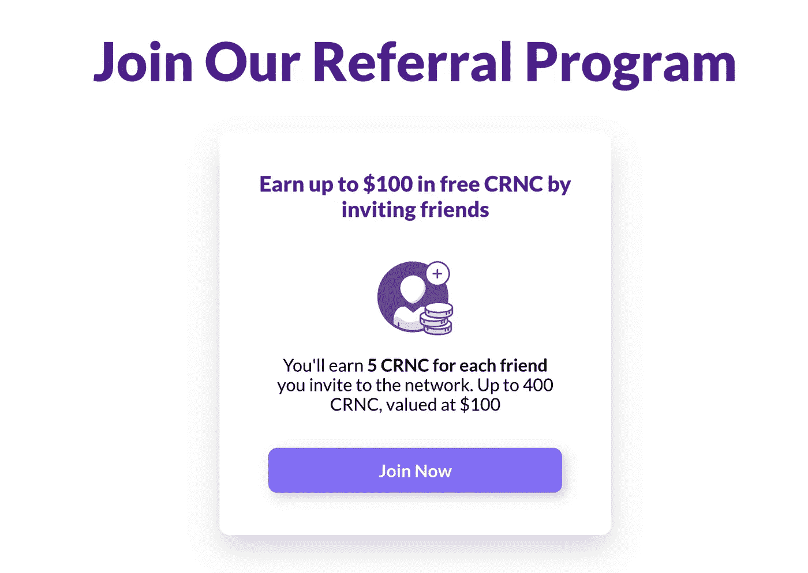
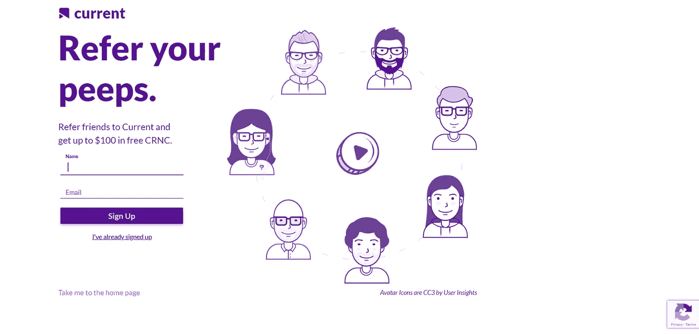
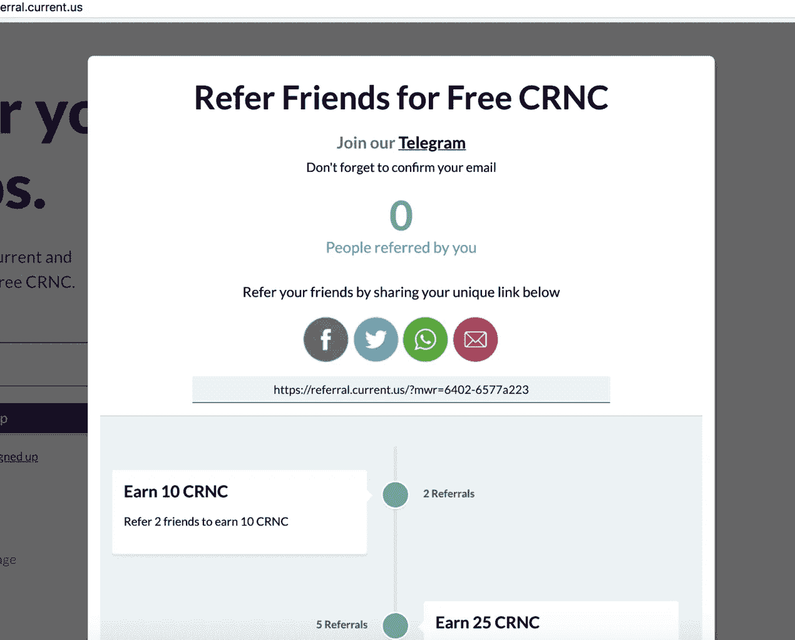
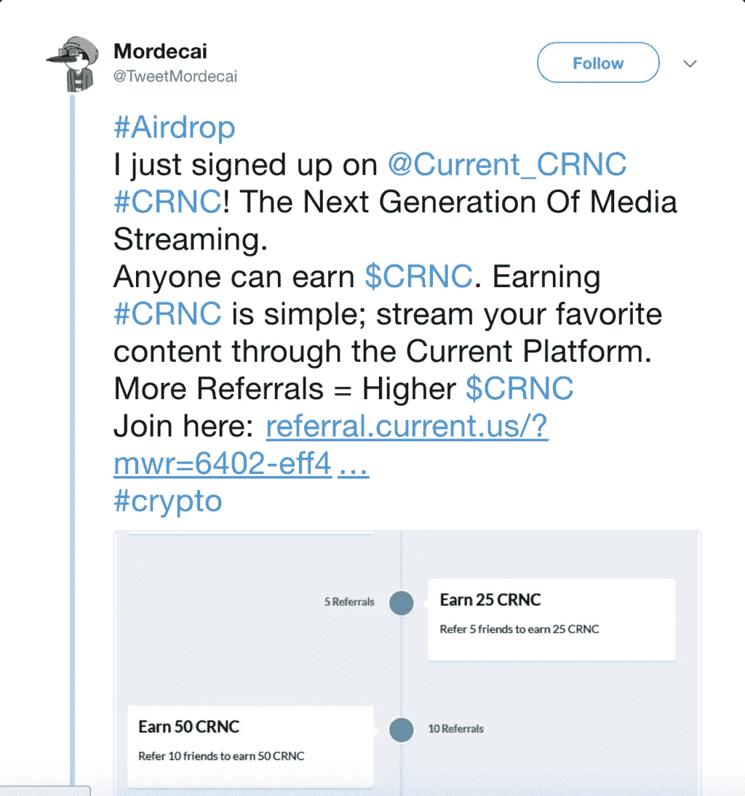
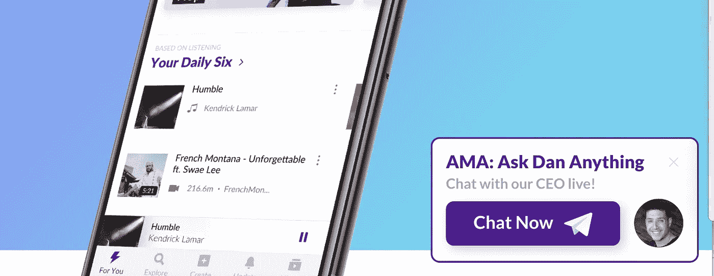
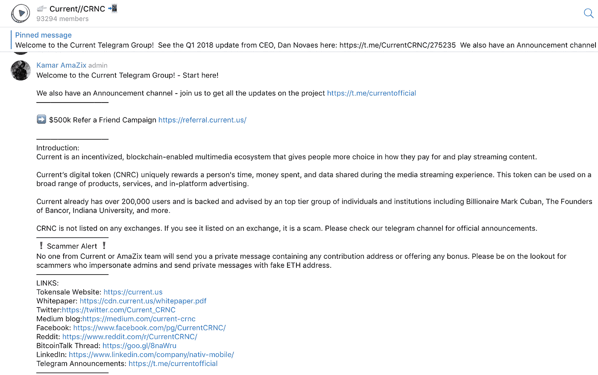

# 当前媒体如何实现 600，000 次推荐+36，000，000 美元的首次发行

> 原文：<https://medium.com/hackernoon/how-current-media-achieved-600-000-referrals-36-000-000-initial-coin-offering-9d440dcec825>

# 了解推荐如何使 Current 成为 2018 年最热门的首次公开募股(ICO)。

[Current](https://current.us/) 是一款新应用，用户可以从同一个地方访问他们最喜欢的流媒体服务。它采用一种名为“CRNC”的加密货币令牌，奖励通过 Spotify、Apple Music、YouTube 和其他流行服务观看流媒体的会员。作为对他们的时间、金钱和数据共享的回报，用户可以在付费流媒体订阅服务上花费金钱。

到 2 月 7 日 ICO 结束时， **Current 已经达到销售 3.5 亿 CRNC 代币的目标**。在这个过程中，它**筹集了 3600 万美元**，并在 ICO Drops 上获得了“非常高”的炒作评级。

正如我们将看到的，由 matre 的病毒式销售线索磁铁驱动的推荐计划在实现这一目标的过程中发挥了核心作用。

# 从你的投资者那里获得 60 万的推荐

让代币在 ICO 中热销是为了制造声势和赢得信任。同时做这两件事的最好方法之一是推荐营销。通过让粉丝谈论你的 ICO，你可以同时接触到更多的投资者，并向 cypto 投资者公开展示对 ICO 的信任。

这些目标是 Current 在建立其 ICO 推荐计划时的首要战略。直到今天，这种方法为他们赢得了 636，000 名令牌销售用户(还在增加)。

更令人印象深刻的是，这些用户中有 91%是被推荐的！！

让我们来看看实现这一目标的工艺电流。

# 完美的登录页面

从[主页](https://current.us/)你会得到一个清晰的行动号召(CTA)，它简单而诱人。

一旦用户点击“立即加入”,他们将被带到网站的另一个页面。

简单是这个登录页面成功的关键，我们可以在使用的副本和注册过程中看到它的工作。潜在投资者可以清楚地看到，初始注册将非常简单，在他们点击注册按钮之前，只需填写两个字段(姓名和电子邮件)。这增加了他们完成注册的可能性。

页面上清楚地解释了价值主张。“推荐朋友，在 CRNC 赢取 100 美元”

他们还在报名表下面加了一个部分，列出了当前是下一件大事的原因。

*专家提示:另一种方法是列出推荐朋友的奖励明细*

# 钩子

它以最直白的方式销售产品:“推荐朋友到当前网站，并获得高达 100 美元的免费信用点数”。

简单易懂是该活动最重要的元素之一，因为大多数人没有时间去想他们到底需要做什么。

请记住，任何推荐计划登录页面的首要目标都是让他们执行第一个操作，即注册。由此，我们现在有办法直接联系他们，开始推送更多的营销信息，比如，推荐更多的朋友，获得 x。

# 病毒共享屏幕

一旦潜在客户签约，当前的推荐计划将使用 matre viral lead magnet 中的开箱即用功能向用户展示他们可以从活动中获得的确切信息。

在这种观点中，有许多不同的因素结合在一起，使得销售线索更有可能开始进行推荐。让我们来分解一下:

**简单行动号召(CTA)** —这是整个活动中最重要的元素，也是您的注册用户进行首次推荐的关键。

**推荐积分** —当代销商再次访问他们的推荐账户时，他们将能够在这里看到他们的实时推荐积分。

**Telegram group link** —看一下显示推荐链接和优惠视图的截屏顶部。你会注意到标题下面有一个 Current's Telegram group 的链接。这是 Current 如何围绕他们的推荐方案建立社区意识并将有用的反馈放在他们的附属机构可及的范围内的重要部分。当前的附属组织目前是 Telegram 平台上排名第一的组织，这是其成功的有力信号。

**社交分享按钮** — Telegram、脸书、Twitter、电子邮件和 WhatsApp 按钮让用户只需点击两下，就能在社交网站上分享丰富的会员链接。一次点击就在相关社交账号上加载了该链接的帖子；第二次点击发送帖子。

**独特的定制推荐链接** —这是推荐流程的关键机制。每个分支机构获得一个独特的推荐链接，与他们的网络共享。每当有人在使用它后注册，附属机构就朝着赚取加密货币奖励的方向前进。为了鼓励分享，我们让代销商尽可能容易地将链接复制到他们的剪贴板。只需单击一下鼠标左键。

下面是一家代销商通过 Twitter 分享其独特推荐链接的例子:

**推荐奖励** —当前通过提供奖励来激励他们的分支机构进行推荐，奖励形式为各种数量的他们自己的加密货币 [CRNC](https://hackernoon.com/tagged/crnc) 。代销商可以看到他们需要推荐多少人才能获得每个级别的奖励，他们工作越努力，奖励越大。所代表的推荐级别范围——从 2 到 80——[的设计吸引了从临时用户到全职代销商的广泛人群。](https://hackernoon.com/tagged/designed)

以下是 Current 的推荐活动经理，1860 年的 Shadi 对他们的策略说的话:

> *“明确传达激励措施并链接到我们的 Telegram 社区意味着我们成功建立了世界上最大的 Telegram 社区！”。*

# 参与整个活动

尽可能多地自动化您的参与对于推荐计划的成功至关重要。当前投资者一注册，就会收到一系列电子邮件，告诉他们如果把朋友推荐给 ICO，他们会取得什么样的成就。如果他们成功推荐某人或达到当前团队设定的里程碑，他们还会收到自动发送的电子邮件。电报组也是如此，新加入者会收到欢迎信息(见下文)。

# 建立网上最大的电报频道

Current 活动的一个关键组成部分是将用户吸引到他们的 Telegram 组，这样他们就能够给用户发消息，推广他们的空投，并与投资者建立信任。

他们通过上图所示的病毒式分享界面，以及让人们登陆他们的网站，来吸引人们加入这个群体。

# 24/7 社区管理(差不多)

新加入者希望他们的问题能马上得到解答。在 ICO 世界里，骗局是一大恐惧，因此有人立即回答问题将有助于消除任何认为你是骗子的人。

这是人们加入社区后的样子。

当涉及直接沟通时，人们倾向于一遍又一遍地问同样的问题。像“我如何收到我的 CRNC”这样的问题，要么确保你手边有一个复制粘贴的答案，以节省时间。

你会想要欢迎新的加入者，并保持社区的参与，所以我会通过使用机器人的[自动广播消息。](https://hackernoon.com/how-to-create-and-deploy-a-telegram-bot-2addd8aec6b4)

使用社区经理进行社区出现的问题所需的日常联系。如果你总是被问到同样的问题，比如‘我如何获得 CRNC 奖？’**然后同样自动化。**

# 如何复制 Current 成功的 ICO 推荐计划

效仿 Current 的推荐营销技术需要大量的计划和/或咨询。你将如何激励推荐人？你会使用 Telegram 这样的社区工具来支持这个过程吗？你将如何优化社交媒体的推荐链接内容？

一旦你制定了细节，使用 matre 的病毒式销售线索磁铁，你的网站的技术执行可以在几分钟内完成。

要了解如何操作，[请在此](https://calendly.com/sparklink/customers?embed_domain=http%3A%2F%2Fsparklink.io&embed_type=PopupText)预订会议时段。