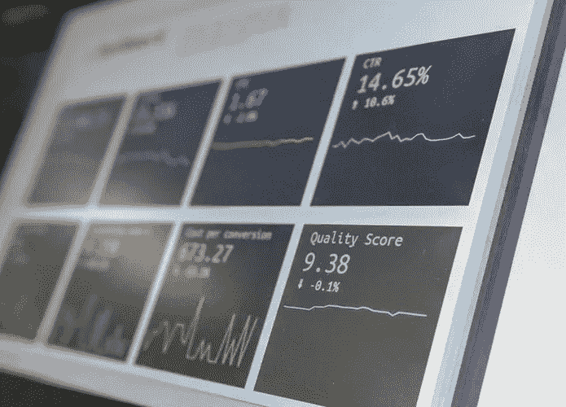
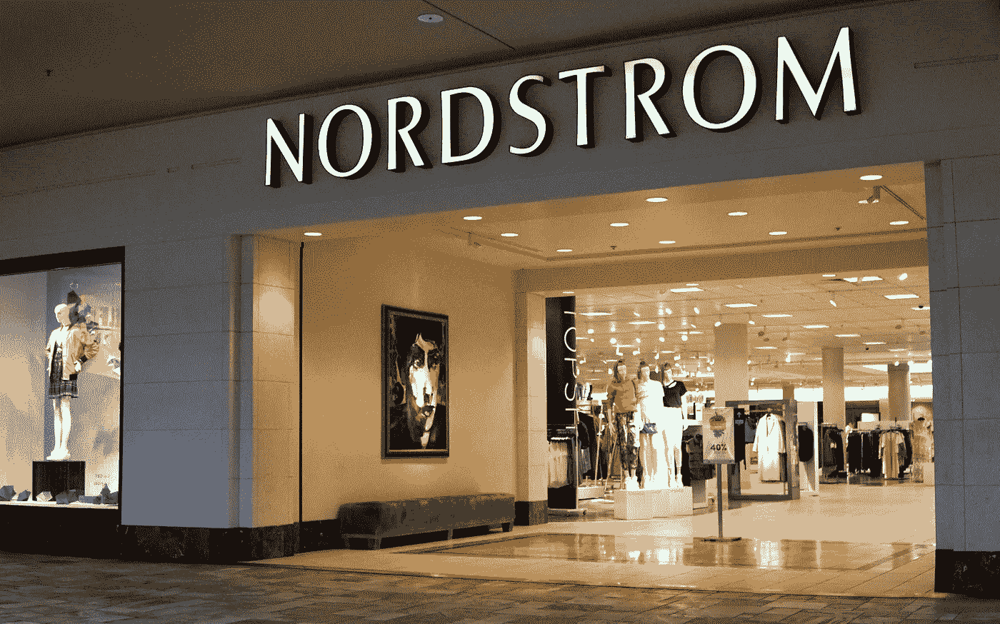

# 数据分析如何革新您的业务战略并开启成功之门

> 原文：<https://medium.com/hackernoon/how-data-analytics-can-revolutionize-your-business-strategy-and-unlock-success-f6c00d11808e>

[https://images.unsplash.com/photo-1526628953301-3e589a6a8b74?ixlib=rb-0.3.5&ixid=eyJhcHBfaWQiOjEyMDd9&s=dc483803225649c63ce880b4ccab2a27&auto=format&fit=crop&w=695&q=80](https://images.unsplash.com/photo-1526628953301-3e589a6a8b74?ixlib=rb-0.3.5&ixid=eyJhcHBfaWQiOjEyMDd9&s=dc483803225649c63ce880b4ccab2a27&auto=format&fit=crop&w=695&q=80)

如今，分析大数据已经成为一种重要的商业工具。它不断改变着各个领域和行业的品牌运营和营销方式。事实上，今天的每个公司，无论大小，在某种程度上都被认为是数据业务。

因此，拥有一个经过深思熟虑的数据策略是非常重要的，如果你想取得成功的话。因此，如果你仍然沉浸在试图收集尽可能多的信息的统计数据中，停止吧。这里有一些关于如何利用数据分析的基本指导方针，帮助你的企业蓬勃发展。

# 升级用户体验

有数百种方法可以帮助你创造最好的 UX。但是任何公司可以用来增强用户体验的最有效和最容易使用的工具之一是数据。

这都是因为它可以建立更好的消费者档案。从你的网站上收集信息，分析脸书网页或任何其他基于网络的内容，瞧！你可以全面了解你的客户是谁，他们喜欢什么，他们何时加入你的平台，更重要的是，他们如何看待你的品牌。

当然，并没有看起来那么简单。因为——令人惊讶的是——除非你学会提取影响用户体验的客户行为的特定模式，否则这些信息是绝对无用的。但一旦你找到他们，你就很棒，拥有出色的数据驱动的迷人 UX，可以轻松赢得客户忠诚度。

# 提供一流的客户服务

实时处理信息对于顶级服务至关重要。在大数据的帮助下，一旦客户进入商场，您就可以发送产品通知，将他们导航到商店，甚至只需一次点击即可确定他们的偏好。

[http://fortune.com/2017/06/08/nordstrom-weighs-going-private/](http://fortune.com/2017/06/08/nordstrom-weighs-going-private/)

如果这听起来太超前，对你来说不可行，看看像 Nordstrom 这样的品牌。这家时尚零售商[已经将数据洞察](https://datafloq.com/read/how-fashion-retailer-nordstrom-drives-with-innovat/398)整合到他们的商业战略中。例如，他们的商店配备了数字设备，可以根据客户在线和离线的购买历史提供建议，实际上取代了真人购物。

# 优化价格

在数据分析的帮助下，您可以根据当前情况不断调整价格。它帮助你监控竞争对手的定价、需求的增长或下降、客户兴趣、市场趋势等等。

例子不胜枚举:电子商务商店在最后一刻给予折扣以避免顾客离开购物车，航空公司根据目的地的受欢迎程度改变机票价格，或者酒店在风暴中降低价格。所有这些操作不仅有助于收入最大化，还能发现对公司未来有重要影响的购买模式。

# 防止客户流失

[https://blog.rjmetrics.com/2013/01/08/ecommerce-churn-rate/](https://blog.rjmetrics.com/2013/01/08/ecommerce-churn-rate/)

失去客户？使用预测性流失模型，找出哪些客户将与您的公司断绝关系，以及原因。这种技术处理丢失客户的历史购买和行为数据，将其排列成一个模式，并搜索匹配项。

如果发现了一些对应关系，该工具会指明处于风险中的客户，从而为公司提供采取补救措施的机会。此外，它还帮助企业主理解流失的主要原因，在某些情况下，这可能非常难以定义。

# 个性化和定制

虽然大多数竞争对手采用“一刀切”的商业策略，但您可以根据消费者的需求和兴趣创造完美定制的体验。处理大数据分析不仅可以让您个性化服务和沟通，还可以提供独特的定制产品。

正如第一家人工智能定制珠宝公司[的创始人兼首席执行官吉姆·弗农和世界第一位数字钻石专家](https://www.rockher.com/)[罗西](https://www.rockher.com/about-rosi/)所说:“顾客厌倦了去零售商那里简单地从货架上挑选现成的订婚戒指，对他们来说几乎是一种反气候的感觉；他们想要一些特别的东西专门为他们制作。”

# 更准确地预测需求

多亏了数据分析，如今的公司可以远远超越过时的需求预测技术。与其使用建立在古老格言基础上的过时方法，不如应用大数据高级分析，从根本上提高预测的准确性。对于大型供应链和大型零售商来说，这尤其有用，因为他们需要准确决定库存中应该储存多少、何时以及哪些产品。

# 优化交付和分销

[https://images.unsplash.com/photo-1494412685616-a5d310fbb07d?ixlib=rb-1.2.1&ixid=eyJhcHBfaWQiOjEyMDd9&auto=format&fit=crop&w=750&q=80](https://images.unsplash.com/photo-1494412685616-a5d310fbb07d?ixlib=rb-1.2.1&ixid=eyJhcHBfaWQiOjEyMDd9&auto=format&fit=crop&w=750&q=80)

通过监控 GPS 和遥测数据以及实时交通和天气情况，您可以提高送货服务的质量。例如，找到最佳路线，缩短订单交付时间，甚至预见即将到来的订单。

“怎么可能？”，你会问。好吧，仔细看看亚马逊的预期运输系统，他们在四年前申请了专利。一旦你意识到大品牌已经在使用它并从中受益，在产品被订购之前就发货的想法对你来说就不再是什么新鲜事了。

# 提高广告效果

大数据分析还可以帮助企业主分析营销渠道，并相应地分配财务资源。所以不要把预算浪费在无效的广告上。取而代之的是，分析每个消费者的行为，并使用点击数据来确定你的客户对哪些广告有更好的反应。

如果你知道有三分之一的客户忽略了网页横幅，但阅读了关于同一产品的个性化通知，你肯定会在再次花钱购买这些横幅之前三思而行。

# 总结一下

使用数据分析是一个杀手级的商业策略。尽管要花时间和精力去搞清楚它，但它给了你无价的洞察力和机会，让你比以往任何时候都更快地实现你的商业目标。

我们都明白，做生意靠直觉的日子已经过去了。“直觉是我所需要的一切”的时代已经结束，今天没有什么比数据驱动的策略和分析更有效了。

所以不要害怕尝试，走出你的舒适区。当其他人把头埋在沙子里的时候，使用数据分析来为自己的利益和革新你的业务。