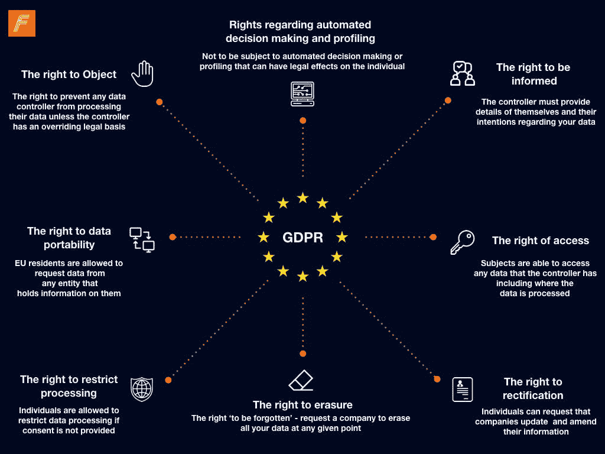
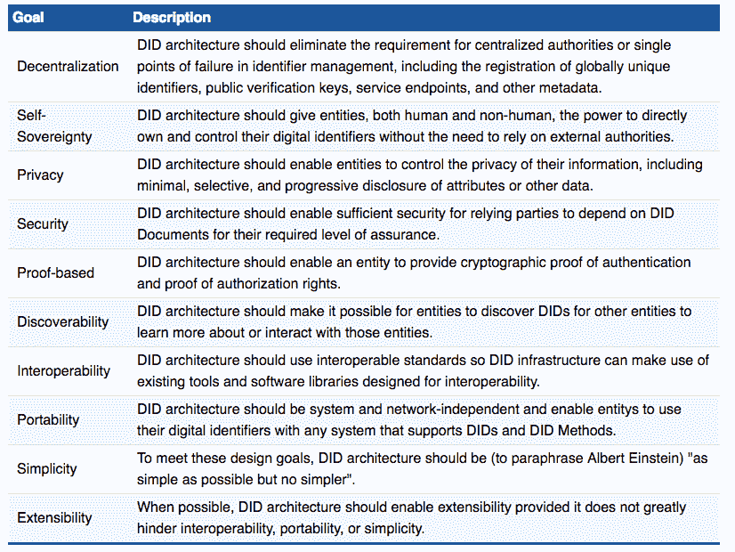
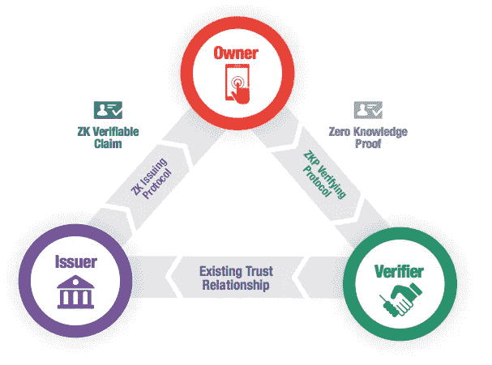

# 分散身份协议(DID)将如何彻底改变同意。

> 原文：<https://medium.com/hackernoon/how-decentralised-identity-protocols-dids-will-revolutionise-consent-969e3b46e1f4>

*有关 DID 协议的完整列表，请参见* [***此处***](https://docs.google.com/spreadsheets/d/17_QnvGZdVAvQMjPNKtqNsRsUGxlf5PgbsbWcjNx9SwI/edit?usp=sharing)**(如有遗漏，可随意添加)**

**

*鉴于最近的剑桥分析公司丑闻，人们对个人数据处理提出了重要的问题，并对大型企业集团如 facebook 自我监管提出了质疑。目睹马克·扎克伯格(Mark Zuckerberg)最近的法庭证词，有趣的是看到了自我监管带来的好处:无责任，当企业需要一张快速出狱卡时，这就派上了用场。但让我们来看看参议院和扎克伯格反复调查的一个更紧迫的问题，即数据安全和迫在眉睫的数据治理问题。蒙大拿州参议员乔恩·特斯告诉扎克伯格…*

> ***“你一年赚了大约 400 亿美元，而我没有赚到任何钱——感觉就像是你拥有这些数据，”***

*当然，向用户索取数据是脸书的特权，这样他们就可以销售广告，推动业务发展。然而，当用户同意 facebook 使用他们的数据时，人们通常希望他们的个人数据受到保护，不会落入侵犯个人数据以左右选举的可疑第三方手中。
那么，我们能做些什么来规范数据隐私并解决数据治理的问题呢？*

*把权力还给人民。欧盟的 GDPR 倡议(**2018 年 5 月 25 日**)是朝着正确方向迈出的一步，该倡议扩大了欧盟居民的个人数据权利。*

**

*Get to know your rights!*

*到目前为止，大多数处理欧盟消费者数据的企业或实体都在朝着完全符合 GDPR 标准的方向发展。
*为了更全面地了解你作为数据主体的权利，你可以查看 GDPR 官方文件* [*这里*](https://gdpr-info.eu/) *。**

*在深入去中心化的身份之前，我想补充一点，GDPR 的创建原则是一个非常需要和受欢迎的解决方案，可以解决个人在处理个人数据时遇到的一些问题。它们最终赋予消费者进一步的权力，来监管他们提供给中央实体和第三方的数据……
但问题就在这里——如果你想“免费”使用通过广告赚钱的平台或应用*，你别无选择**，只能**交出你的数据作为替代付款。此外，我们大多数人都不知道我们为使用谷歌、脸书或 Linkedin 的服务而提供的集中服务中有多少不必要的数据——只要在脸书上进行一次数据请求，看看他们在你身上存储了多少 GB 的不必要数据，毫无疑问你会感到惊讶。
***“如果你不付费，你就是产品”*** 也可以理解为 ***“如果你不付费，你的数据就是产品”。但是，如果我们的数据由外部机构管理和货币化，我们难道不应该有权力这样做吗？我的意思是这是我们的数据。*****

## ***下一步。***

*幸运的是，分布式分类账的最新发展提供了颠覆性的解决方案，将改变我们作为个人控制和管理数据的方式。让我来解释一下。我上面提到的 GDPR 官方文件使用了术语“*数据控制者*”来指代出于合法或盈利目的处理和处理我们的数据的机构或实体。
**但是如果数据主体(个人)同样可以充当数据控制者呢……..？首先，我们将拥有对自己信息的最终控制权和所有权。我们决定由谁来处理我们的哪些数据。
此外，**我们**可以*从中获利*…我们已经见证了诸如 [Datawallet](https://datawallet.com/) 、 [Madana](https://www.madana.io/) 和 [Sovrin](https://sovrin.org/) 之类的倡议，它们为建立基于激励协议的共享数据经济铺平了道路，这些协议允许个人从自己的数据中获利(就像脸书对我们的数据所做的那样)。当然，这意味着更高的责任，但这就是自我管理——个人责任。
想象一个世界，在这个世界里，我们不需要依靠中央集权来管理我们的个人数据或访问我们的敏感信息来验证我们的身份。通过真正拥有我们的数据，我们可以选择谁可以在线访问这些数据，并允许集中管理机构只访问使用其服务所需的必要数据。两个问题需要考虑:***

***1)** 鉴于我们目前如此依赖谷歌/脸书等大型数据驱动型企业的服务，它们甚至需要遵守“数据的个人治理”吗？—可能不会。在 GPDPR 的案例中，他们被要求遵守欧盟法律，所以也许游说立法**个人数据协议可能是答案。***

***2)** 个人数据治理怎么可能行得通？*

## ***输入分散(自我主权)身份- DID 的***

*由于加密“密封”分类账的不变性和 DID 提供的架构，我们能够以比以前更加安全和*便携*的方式增强我们管理个人数据的能力。
例如:目前的数字身份，如护照，主要依赖于一个集中的过程，其中涉及由证据(有效文件)支持的个人声明(个人主张)，然后由一个在中央服务器上存储或拥有你的个人数据副本的外部机构进行验证。每次我们提交数据时，我们习惯性地将我们的敏感信息存储在多个中央数据库中，这使得跟踪和更新变得困难，更不用说容易受到侵犯。
**分散式身份旨在实现个体全球唯一性，而无需中央注册机构。***

*克里斯托弗·艾伦对此做了很好的总结:*

****“用户必须是身份管理的核心。这不仅需要在用户同意的情况下跨多个位置的用户身份的互操作性，还需要用户对该数字身份的真正控制，从而创造用户自主权。”****

*提供这种自主性的部分原因是允许个人实质上创建和请求对他们的身份和其他数据的“声明”,如驾驶执照或分布式分类帐上的声誉，这些数据可由他们与之通信的外部方进行加密验证。通过使用“可证实的声明”,我们实际上根本不需要与任何人分享我们的个人数据。我将在下面更深入地研究这个问题，但是首先，让我们更好地理解下面 W3C [分散标识符](https://w3c-ccg.github.io/did-spec/#dfn-did)设计目标指定的 DID 目标。(建立在克里斯托弗·艾伦[活泼的生活](http://www.lifewithalacrity.com/2016/04/the-path-to-self-soverereign-identity.html)*

**

*Integral components of DID’s and what they aim to achieve.*

*值得注意的是，分散身份的概念是 13 年发展的产物。直到现在，由于大量的技术进步、精炼的原则、分散的协议和 W3C 社区的努力工作，我们才开始看到现实世界中的应用程序的出现。(列表见[此处](https://docs.google.com/spreadsheets/d/1OdYnFo4zEsco3M90Hz6FNyr-AjD4GF5Hli-gx3lMA8w/edit?usp=sharing)*

## *GDPR 效应。*

*在我们探索 DID 的架构之前，快速调查 GDPR 对分布式分类账的影响是很重要的。
令人恼火的是，自从欧盟委员会在 2009 年初开始制定 GDPR 立法以来，*区块链技术的*全球应用仍处于起步阶段，并未被视为数据隐私问题的解决方案。因此，它购买了一些关于 GDPR 和链上数据存储的矛盾问题。
主要问题是 GDPR 的“被遗忘权”法案(删除数据)。由于存储在链上的数据的不变性，不可能擦除已经写入数据块的数据。正如安德烈斯·范·亨贝克在他的文章中出色地总结的那样:[区块链 GDPR 悖论:](/wearetheledger/the-blockchain-gdpr-paradox-fc51e663d047)*

**“由于丢弃您的加密密钥并不等同于‘删除数据’，GDPR 禁止我们在区块链级别存储个人数据。* ***从而失去增强控制自己个人数据的能力。”****

*Humbeeck 继续争辩说，与中央服务器相比，区块链是一个更安全、更易访问的个人数据存储系统。然而，量子计算机已经开始对我们目前使用的标准密钥加密协议构成威胁，有人预测它将在未来十年内过时。
有趣的是， [W3C DID 规范](https://w3c-ccg.github.io/did-spec/#delete-revoke)也在第 5.4 节中考虑了 GDPR:*

**“虽然分布式分类帐的核心特性是不变性，但 DID 方法规范必须规定客户如何撤销目标系统上的 DID 记录，包括建立撤销证据所需的所有加密操作。”* ( *注*:使用 [*CL 证明*](http://groups.csail.mit.edu/cis/pubs/lysyanskaya/cl02b.pdf) *)* 撤销现在实际上是可能的*

*那么，我们如何解决“被删除的权利”这个难题呢？简单的答案是:不要把你的数据存储在链上，而是存储一个“声明”..*

## ***进入自主架构。***

*一些公司，如 [Sovrin](https://sovrin.org/wp-content/uploads/2018/03/Sovrin-Protocol-and-Token-White-Paper.pdf) (由 Evernym 建造)已经在使用提供链上“可验证声明”(证明)的协议，这些协议在不透露*实际*数据的情况下，向质疑当局验证个人数据。
它通过以哈希的形式存储链上加密的验证声明(个人声明)来实现这一点，哈希还可以作为公钥来加密验证用户数据。为了有助于澄清，以下是使自我主权发挥作用的一些基本原则。*

**

*Source: Image provided by Soverin’s white-paper*

*1: **零知识证明(ZK 证明)** —质询机构可以使用发行者/商家密钥来验证您的*声明*是否为真，使用数学证明等式来证明所提供的数据确实有效，而无需向任何人透露实际数据。*

*2.**公钥和私钥** —它们允许用户使用一组数学上相关的数字/散列安全地解密彼此之间的消息。服务提供商使用并存储多密钥共识，以防止密钥丢失或被盗。*

*3. **DID** **描述符对象(DDO 的)——**它们是公钥的链上“容器”，通过存储证明账本所需的时间戳和数字签名来证明个人的治理。*

*一个简单的用例可能是:如果我需要建立一个帐户来购买一个在线产品，这是目前非常常见的，我需要提供银行帐户的详细信息…公司也可以使用这些信息来营销进一步的产品。然而，如果我出示了我的身份证，他们只需要核实索赔，以确保信息是真实的，而不是我的银行数据。*

*因此，我们似乎有一个健壮的解决方案，它考虑到了 GDPR，同时还利用了区块链的安全性和可访问性来提供一个可互操作的身份，该身份可以颁发给外部方进行验证，而不会危及用户数据。*

## *同意的问题。*

*目前，只要得到同意，任何人都可以向任何人索取数据。
迄今为止，当事人之间的个人同意和信任问题在过去一直通过书面文件、签名和立法来解决。
相比之下，上述协议利用数学的真理成功绕过了污染数据经济中的同意问题。信任被交到可靠的数学手里。*

*更多参考文件和致谢:
w3C 社区组织—[https://w3c-ccg.github.io/did-spec/#dfn-did](https://w3c-ccg.github.io/did-spec/#dfn-did)[https://ICO . org . uk/media/for-organizations/documents/1068/data _ sharing _ code _ of _ practice . pdf](https://ico.org.uk/media/for-organisations/documents/1068/data_sharing_code_of_practice.pdf)—ICO 指出了数据共享的推荐行为准则*

*感谢凯达·德什潘德和儒利奥·桑托斯。*

*Zeff 是分形区块链的社区和营销专家:我们相信通过倡导透明和信任的自我管理和自由选择来提高加密社区的地位。*

*加入我们的前瞻性社区，接收有关我们的合作伙伴项目、最新区块链开发和解决现实问题的独家令牌发布的实时更新。
www.trustfractal.com*