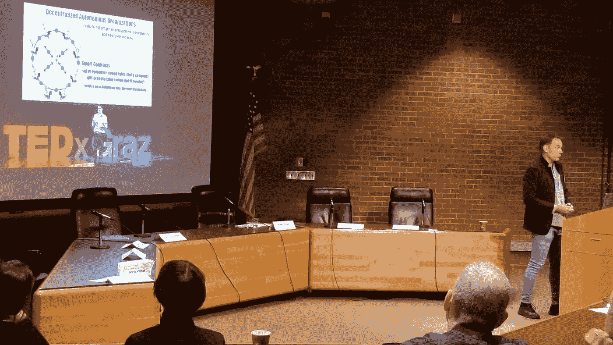

# 为什么数字技术能激发创造力

> 原文：<https://medium.com/hackernoon/how-digital-technologies-help-us-be-more-creative-innovative-b5e264ef3749>

## 关于技术的“集中”与“分散”思维

Bob Dylan mural in Minneapolis (21 April 2018)

数字技术现在很热门。每个人都在谈论他们。

我的同事和学生都对人工智能、机器人和区块链感兴趣。如果你不把“技术”融入到你正在做的任何事情中，你就跟不上时代的步伐。

然而，让我担心的是，我最近听到的许多“技术谈话”都集中在自动化和简化现有的程序、过程和实践上。重点是将技术集成到旧的、集中的层级和法规遵从性世界中。

我真的认为这是一个错误。

相反，我们应该关注的是数字技术如何创造一个更加开放、包容和“去中心化”的新世界，让每个人都有机会变得更有创造力和创业精神。

这里我指的不是简单使用新技术工具的创造力，比如 3D 打印或数字内容创作。

> 我指的是数字技术改变我们社会的潜力。

这就是为什么我们需要更清楚地了解权力下放如何有助于刺激创造力、企业家精神和创新。

# 集中的方法

但并不是每个人都这样看待新技术。对许多人来说，新技术被视为建立更强大的等级制度和强化传统做事方式的一种手段。

这里的想法是，数字技术可以加强中央系统。

我的许多同事将技术视为确保和监控合规性的手段，从而使社会“机器人化”(从某种意义上说，人工智能将帮助企业主和企业领导人决定什么是“好”或“坏”的行为，谁应该被雇用、晋升或解雇)。他们认为技术可以帮助解决典型的层级问题(主要是信息和参与问题)。

然而，我最近注意到，以这种方式思考技术的人在出现问题时会很快放弃它。

或者，当事情变得真正具有破坏性时，技术发展被视为泡沫、神话或空洞的科幻小说。人们可以在最近关于自动驾驶汽车、超级智能人工智能或大规模采用/接受加密货币或区块链应用的讨论中看到这种怀疑态度。

# 分散的方法

我们需要更加明智地对待新的颠覆性技术。

我们不能强化“集中和传统”的系统和预定义的结构，我们必须理解和欣赏技术能够“分散”社会，创造更公平的竞争环境(为那些在既定实践和声誉之外运作的人创造更多机会)。

这反过来将刺激创业精神，促进分享和鼓励合作性的创造性活动。

## 企业家精神

在一个去中心化和“以技术为中心”的社会中，个人不再满足于成为更大组织或公司机器中的无名小卒。

相反，技术有能力将控制权从组织和机构转移回个人手中。个人有能力通过建立一种生活方式和一种围绕做他们热情关心的事情的认同感来最大化他们的个人潜力。科技让这成为可能。

这种机会的逐渐扩大所带来的数字转型创造了前所未有的选择范围，因为个人寻求以他们认为最适合自己独特兴趣和才能的方式表达自己。想想 YouTube，Medium，Instagram。

个人表达的新平台无处不在。

对一些人来说，这可能包括成为一名开发人员，对其他人来说，是一名设计师，当然，对一些人来说，这包括建立一个企业，成为一名连续的企业家。有无限的可能性。

人们渴望成为什么样的人并不重要，关键是数字技术提供了比以往任何时候都更广泛的机会，让人们通过“工作”来从事有意义的生活项目。

> 这是“机会的时代”。

## 共享

技术还允许以“分散的”方式共享想法，减少障碍(首先需要被现任者或其他传统“权威”接受)。

但它不仅仅是分享信息(信息从一方到另一方的单向传播)。分享是指与其他人建立持续的建设性对话，从而对未来的机会产生重大影响。

我们需要认识到分享带来的物质利益。通过分享，可以与他人建立更包容、更有意义的关系。分享培养了归属感，扩大了潜在合作者的范围和多样性。

## 合作

技术也促进了“协作”。

我所说的“合作”指的是任何通过共同创造的过程来一起构建东西的项目。

数字技术在促进这种有意义的合作活动中起着至关重要的作用。

我喜欢数字时代的原因是可以和我不认识的人互动，而且可能永远不会真正认识。这为协作“共同创造”创造了许多机会，这是我以前从未经历过的。

# 还有一件事

我上周在明尼阿波利斯的一次会议上发言，会上我清楚地认识到，重要的是要认识到，数字技术提供的这些分散化的机会并没有向所有人开放，而且还产生了新形式的社会排斥。讨论的重点是“基本收入”的需要。

然而，我们不应该对数字技术引发的社会变革的程度和重要性过于轻视或怀疑。

但是，我们也不应该沾沾自喜，认为技术会带来一个更美好的世界。我们需要制定策略来确保技术能够兑现它们的承诺。

例如，当今最具创新性的公司都明白，从长远来看，创新产品和服务的交付需要多个参与者和利益相关者之间更大程度的合作。产品开发需要将不同的元素(硬件和软件)收集在一起，并将它们集成到一个连贯的产品中，从而提供与消费者相关的价值主张。

将不同的元素收集、识别、协调并组合成一个连贯的包，这一任务需要公司内部(即公司不同“部门”之间)以及与“外部”合作伙伴(如开发者、创造者、大学、创业公司)进行前所未有的合作。

一个公司建立和维持包容关系的能力在未来只会变得更加重要，在这种关系中，所有的合作伙伴一起协作。

根据这种方法，等级制度或“筒仓”的存在是反生产的，那些未能接受更加分散和开放的组织形式的公司将难以创新(并最终生存)。

> 有趣的是，权力下放的一个重要部分涉及“回馈”社会或当地社区，以改善该社区。

越“开放”的公司越明白融入当地社区的重要性，这是促进(直接*和*间接)合作的一种方式。这可能意味着公司支持在不同经济领域经营的“本地”创业公司，这些公司可能与公司的主营业务无关。

至少，这种对社区建设的兴趣存在于最具创新精神的公司中。例如，在会议期间，安德玛的创始人兼首席执行官凯文普兰克的例子被使用。

凯文·普兰克(通过他的基金 Sagamore Ventures)在巴尔的摩地区投资了许多初创公司和项目，并因此赢得了声誉。一些获得这种支持的公司，比如一家鲜花递送公司，并不一定在安德玛能够进行商业开发的领域。

通过鼓励这些公司搬迁到巴尔的摩，Kevin Plank 正确地认识到了他的公司在社区建设和创造商业和社会环境方面的潜在价值，这使得某个特定地区对最优秀的人才更具吸引力。

Presentation at the University of Minnesota (20 April 2018)

*感谢您的阅读！请点击*👏*下面，还是留下评论吧。*

每周都有一个新故事。因此，如果你关注我，你不会错过我关于数字时代如何改变我们生活和工作方式的最新见解。