# 分布式账本技术如何颠覆世界货币体系

> 原文：<https://medium.com/hackernoon/how-distributed-ledger-technologies-are-set-to-disrupt-the-worlds-monetary-system-3078ce96ef94>

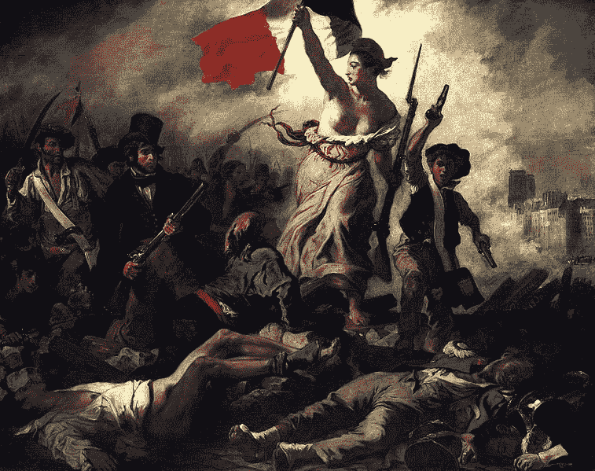

[Liberty Leading the People](https://en.wikipedia.org/wiki/Liberty_Leading_the_People), Eugène Delacroix

在加密货币诞生之初，参与者的意图是扰乱货币体系，并为人们提供摆脱国家和机构控制的机会。如今，比特币、Ripple、Dash 和其他工具同时提供价值转移和存储。加密货币继续获得动力，揭示了货币的数字未来:现在普遍采用是在地平线上。

中央银行和政府已经密切关注分布式账本技术:包括区块链、直接无环图账本等。)自其创建以来，但是，随着 2017 年开始的大肆宣传，机构不仅被迫认真对待加密货币，还被迫对其未来进行判断和评论。然而，官方立场倾向于支持现状。

本文的目的是尽可能客观地调查加密货币和 DLT 在未来货币体系中发挥作用的潜力。我们将首先简要回顾导致当前系统的历史，了解其挑战，并探索比特币起源的替代思想。在评估可能永远改变我们全球货币体系的分布式分类账的一些潜在用途之前，我们将看看加密货币自身的局限性。

一篇关于货币体系混乱的文章:在如此沉重的话题上，这是一项多么雄心勃勃的任务啊！我们开始吧。

# 一.货币制度；简史

Richard Nixon announcing end of gold convertibility of US dollar

截至 21 世纪初，我们在这个美丽的蓝色星球上有趣的货币体系可以被视为一个有问题的遗产。我们今天所面临的，是美国总统尼克松在 1971 年单方面决定取消美元与黄金兑换的后果。这一具有哲学意义的事件是货币体系历史上的一场革命。一个故事有多长？好吧，让我们通过一个(过于简单！)版本来了解我们是如何走到这一步的。

很久以前，当我们是快乐的、幸福的猎人和采集者时，我们只是出去得到我们需要的东西。然而，我们并没有完全缺乏复杂的宏观经济意识，互换交易开始出现，汇率异常(五把豆子换一只兔子……)。很快，我们想要的超过了我们能猎取或收集的。这增加了存储和转移价值的需求，因为单次交易并不总能获得你所需要的东西。因此，具有内在价值的物品，如海螺壳或陶器开始被保存和交换。

我们像这样生活了很长一段时间，交换依赖于或多或少抽象的对象，这些对象或多或少是稀有的、漂亮的，并且很难(耗时)生产。最终，人们对某些不可氧化的金属产生了特别的兴趣，并认为这是一种储存和交换价值的便利方式，因此金/银被广泛接受。

但后来事情开始变得一团糟。当社会开始组织起来时，它们很快被国王、苏丹、沙皇或诸如此类的人所统治。这些统治者意识到，控制价值交换和储存系统是获得更大权力的重要手段。他们开始为自己保留发行货币的特权。农民还必须用统治者铸造的硬币纳税或纳贡，否则他们将面临统治者用自己发行的硬币支付的民兵。

事实证明，这种封建制度在接下来的几千年里相当稳定。但是它有一个小缺陷；工人们在工作中努力纳税。至少，它不是最平等的系统，在某个时间点，人们开始要求更公平的待遇。更多“现代”的民主国家出现了，他们自然继承了王子发行货币的特权。

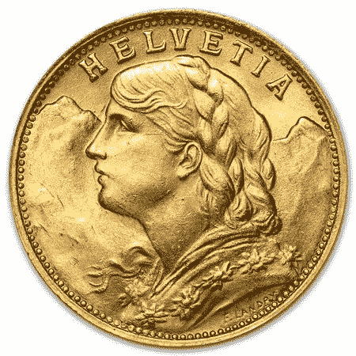

[Swiss 20 Franc Coin](https://www.apmex.com/product/19/swiss-gold-20-francs-helvetia-au-random)

在这个历史时刻，每个国家的中央银行都在发行自己的贵金属代币，用于日常贸易。那时，“钱”仍有“内在”价值。但是，使用金币有几个缺点:它容易受到物理侵蚀；亏损；最重要的是，它的供应量有限。这里特别关注的是经济平稳运行所需的货币供应的动态调整。在整个 19 世纪，每当黄金稀缺时，中央银行无法发行足够的硬币供企业发展，这导致了反复的衰退，每当发现黄金时，经济扩张就会交替出现——就像在[佐治亚州(1830 年)](https://en.wikipedia.org/wiki/Georgia_Gold_Rush)、[加利福尼亚州(1848 年)](https://en.wikipedia.org/wiki/California_Gold_Rush)、[澳洲(1851 年)](https://en.wikipedia.org/wiki/Australian_gold_rushes)、德兰士瓦(1873 年)、育空(1897 年)、...

Gold ruch in California, 1850s

所以，显而易见的解决办法是推广纸币。纸币是阿拉伯人的发明——支票这个词来自阿拉伯语中国王的意思。在西方，银行在中世纪就开始从金融机构发行 *I-owe-you (IOU)* 可以在以后和/或在其他地方方便地偿还。为了让央行在不受贵金属供应限制的情况下调整货币供应量，他们决定也发行借据。这些纸币可以以名义汇率兑换成黄金——当然，渐渐地，央行储存的黄金不足以支付印刷纸币的总面值……

[Inside Fort Knox](https://roadtrippers.com/stories/discover-the-secrets-that-are-stashed-at-fort-knox)

接下来发生的是欧洲国家在两次世界大战中自杀，这让“旧世界”在向美国提供战争物资后破产，这些物资以黄金支付。二战后的几个月里，诺克斯堡拥有世界上大多数的黄金储备。西方国家的财政部长聚集在美国[布雷顿森林](https://en.wikipedia.org/wiki/Bretton_Woods_Conference)，讨论并签署了同名协议。它表示，美元将与黄金挂钩，其他货币将与美元挂钩。

在我们的好朋友尼克松介入之前，这一协议控制着货币体系。

# 二。**质疑和批评当前的货币体系**

所以。50 年前，美国决定烧毁布雷顿森林体系。我们每天用来购买商品和服务的钱突然失去了抵押品支持，正式成为一种惯例。因为我们已经习惯了纸币，所以我们并没有感觉到有什么变化。

但改变的是央行手中的宏观经济工具及其影响经济的行为。我们进入了一个时代，在这个时代，他们能够随心所欲地改变货币供应，而很少关心他们资产负债表的“资产”方面(例如，在买入垃圾证券的好价格时)。由于不需要用任何东西来支撑货币，宏观经济基本面发生了变化。我们的中央银行得到了前所未有的权力来控制货币供应以控制通货膨胀。

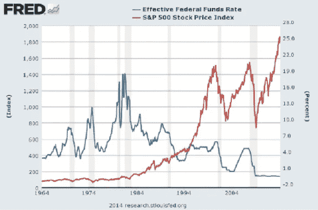

Evolution of stock prices and central bank interest rates during the last 50 years

让我们试着清楚地理解央行和货币体系所面临的批评。

**#1 法定货币没有任何抵押品**

正如我们刚刚看到的，法定货币现在是纸币，要么依赖于每个人都愿意使用它的信念，要么由法律强制执行。今天，所有官方货币相互之间以及与贵金属之间都有波动。

在这里，也许我们应该做一个重要的转移，以便我们有进一步讨论的基础。我们需要理解*央行货币*和*商业银行货币*的区别。我们中的许多人可能甚至没有意识到这种区别…

你记得，从中世纪商人开始使用借条的第一天起，货币供应量就开始增加。商业白条显然是有面值的，可以兑换；它们有助于货币流通总量，但不直接涉及中央银行。它们是商业银行的钱:你的银行账户余额本质上是银行给你的借据。然后，当在银行 A 有银行业务的个人 A 想要向在银行 B 有银行业务的个人 B 支付 10€时，由于赎回银行不同于发行银行，所以两家银行都需要调节它们的账户；在这种情况下，银行 a 必须补偿银行 b 赎回给 b 的借据。银行之间的支付以*中央银行货币*完成。

那么*央行货币*到底是什么？毫无疑问，这是大量的硬币和纸币，此外，这也是一家持牌商业银行用来支付另一家商业银行赎回的借据的货币。他们通常只是周期性地补偿增量。根据法律，*商业银行的货币*完全可以兑换*中央银行的货币*，但是公众可以获得的*中央银行货币*的唯一形式是硬币和纸币；“央行借据”是留给金融机构使用的。

请注意，有趣的是，所有的*商业银行资金*都来源于贷款业务。因此，商业债务的增加会增加货币供应量(当然，偿还贷款会减少货币供应量)。而通过银行连续贷出存款来减少货币供应量，最终导致商业银行的货币占了当前货币供应量的绝大部分。

其结果是，无论何时央行决定发行更多的央行货币，影响都不是直接的；这是一种通过固定个人在央行的存款利率来影响个人行为者的手段。只有当私人银行同意向家庭和公司发放更多贷款时，对货币供应的影响才会真正显现。

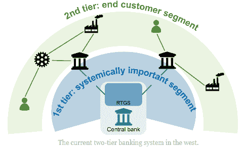

现在回到批评者的话题:不仅法定货币没有抵押品，而且它的产生和存在仅仅来自于对私人金融机构的信任。这个系统只能靠我们的自信(和习惯)来维持。)在商业银行网点。

**#2 货币扩张政策不受约束**

这是下面的逻辑。由于不需要支持法定货币，与经济体过去所习惯的相比，货币供应可能变得过于流动。2009 年，当许多大型银行显然会因为无所作为而破产时，美联储决定介入并回购所谓的“有毒资产”，这样私人银行就不会违约。这一量化宽松的辉煌发明最终导致市场流动性泛滥，经济得以反弹，而利率已经接近于零。

[source](https://markmartinezshow.blogspot.com/2014/05/why-quantitative-easing-isnt-working.html)

可悲的是神圣的奇迹并不存在，物理学总是把事情搞砸。在这种情况下，实际上必须有人付出代价。当美联储开始发行免费货币拯救银行时，他们稀释了我们储蓄和退休账户中的法定货币。

让我们澄清一下，我们没有要求美国政府降低我们法定货币的价值。我们没有投赞成票！现在，美国人和非美国人都面临着同样的后果。

如果央行继续使用这种不受约束的货币政策，不仅很难决定在哪个水平停止，而且会产生哲学上的影响，因为储蓄行为在历史上第一次受到了人为的惩罚。

三大强国滥用他们的货币来推进他们唯一的利益

官方货币是不平等的，国家继续使用他们作为对自己有利的工具。以下是描述这一挑战的几幅插图:

*   几十年来，当中国人通过购买美国国债为美国的贸易赤字融资时，他们将自己暴露在了美国印钞的风险之下。因此，在 2009 年，中国能做的只有哭泣。

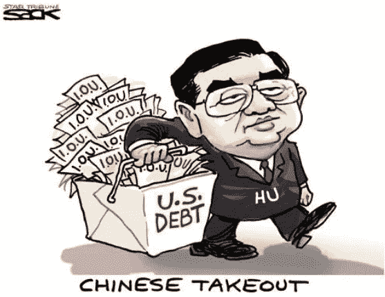

[source](https://shu0shushu.wordpress.com/tag/writings/)

*   当法国巴黎银行(BNP)希望与苏丹做生意，而苏丹只用美元支付时，美国声称他们的法律适用治外法权并提起诉讼(因为苏丹处于美国的禁运之下)。法国巴黎银行被罚款 90 亿美元。你可以称之为经济战争。
*   在对外贸易中使用本国货币总是一种优势。你避免了交换费，也不需要对冲汇率。还有:当日本从沙特阿拉伯购买石油时；嗯，这里有一个提示；日元和里亚尔都没有参与。再说一次，美元仍然是王道。
*   当欧元在 21 世纪初建立时，德国坚持其德国央行原则单方面适用。因此，欧洲采用了低通胀的强势货币，非常适合出口导向型国家。然而，习惯于通过通胀偿还债务的南欧国家再也无法这样做了(同时仍被要求支付高风险溢价)。这导致了希腊的破产以及西班牙和意大利的衰弱，而德国显然保持了其出色的对外贸易平衡。

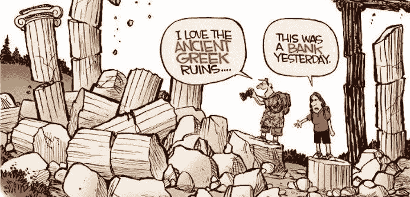

[source](http://www.pappaspost.com/ancient-greece-and-the-modern-greek-debt-crisis/)

货币比以往任何时候都更是一个国家用来维护自身利益的有力工具。显然，这样做的总是最有影响力的国家。

政府有时会利用货币控制来控制人口

所谓的法定货币强迫公民接受和使用国家发行的货币。一些国家出于或多或少的正当理由，通过禁止在本国境外使用本国货币来限制公民个人投资海外。

**总之**，今天的货币体系是技术-社会-经济的大杂烩，是几个世纪的历史、失败和修补的结果。这为央行行长们的操纵大开方便之门，而在我们所处的环境中，强大的国家不公平地使用自己的货币来推进自己的利益并控制自己的人口。

哦，对了，还有你的记录:一旦尼克松的法令墨迹未干，美国就保留了它所坐拥的黄金——金手指潜伏在其中。

[From movie “Goldfinger”, Opus #3 of James Bond series](https://me.me/i/your-plan-wont-work-goldfinger-there-is-no-no-gold-18814767)

# 三。**通往比特币的路上的替代品**

对替代性货币体系的研究已经进行了很长时间，确定了一些或多或少成功的解决方案，特别是在 1971 年后，因为后布雷顿森林体系合法强加的浮动制度提出了问题。

连续的经济学家、学者和活动家一直在倡导我们通常所说的“竞争性的、去中心化的、基于市场的货币体系，这一体系能够最优地产生一种具有充足供给和合理稳定价值的交换手段”。

弗里德里希·哈耶克就是这样一个冠军。著名的奥地利经济学家和哲学家，他在《货币的选择》(1976 年)和《货币的非国有化》(1978 年)中提出了自由银行系统(T8)和银行可以自由发行不可赎回的纸币(即没有任何抵押品)。根据他的观点，货币供应将通过良性竞争机制进行自我调节。社区将不必依赖单一货币发行者，私人银行将必须保持其货币的价值，以避免破产的风险。

这些替代货币体系对政府来说仍然有些挑衅，事实上它们很少在实体经济中得到检验。

但有趣的是，在美国，从 1837 年到 1864 年的经济时期被称为自由银行时代。然后，“自由银行”被允许发行自己的钞票。

[Two dollars banknote from the Bank of De Soto](https://www.beastcoins.com/Banknotes/Obsolete/Nebraska/Nebraska.htm)

与哈耶克的体系相反，这种纸币严格来说是一种承诺，可以用一些资产(黄金或国债)来赎回。因此，法律要求“自由银行”持有一美元的政府债券作为每发行一美元的抵押品。但有一个问题:州债券也可以在二级市场上以不同于面值的价格购买——通常价格更低，更好地反映了美国州的财政健康状况。

你看到它来了吗？

[source](http://tenor.com/search/)

所以…该发生的发生了！

当私人发行的纸币的强制抵押品暴跌时，银行实际上失去了赎回纸币的能力。而且，基本上，每当经济衰退来临时，“自由银行”纸币的使用者都会残酷地意识到他们的钱一文不值。他们对系统失去了信心，去“自由银行”柜台排队取回硬资产。而且，由于金库里几乎没有东西可以返还，这导致了破产和自由银行时代的彻底终结…

最近，在 20 世纪 80 年代，活动家们将互联网的出现视为一种新的方式，以创建一个不受政府影响的全球货币体系。出现了几项倡议。

*   1985 年，李尚义·乔姆在他的文章《[无需身份识别的安全性》中提出了一种加密货币；让老大哥过时的交易系统](https://www.cs.ru.nl/~jhh/pub/secsem/chaum1985bigbrother.pdf)“包括导致比特币的大部分技术基础。
*   金银储备公司在 1996 年创造了[电子黄金](https://en.wikipedia.org/wiki/E-gold)，这是一种由黄金支持的数字货币，但由于法律问题，该公司在 2009 年被迫停止运营。该公司承认“经营未经许可的汇款业务”和“共谋洗钱”。挑战货币体系并不容易…
*   Paralelly 在 1992 年至 2001 年，出现了一个名为 Cypherpunk 的激进运动，通过使用加密技术来促进社会和政治变革。这场运动由黑客和隐私支持者组成，如《加密无政府主义者宣言》的作者蒂莫西·梅和直到 2005 年才提出数字货币概念的尼克·萨博，这种货币被称为“T2 比特黄金”，它是分散的，基于有限可用资源的概念。总的来说，密码术作为摆脱政府或大公司影响和控制的最佳方式获得了动力；所有的因素都是为了取得突破。

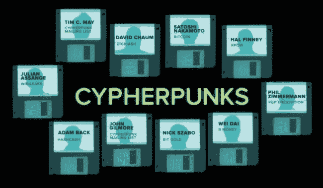

[Cypherpunks main members](https://cryptomasterycourse.com/history)

接下来的故事你很清楚。2009 年，中本聪创造了第一个可行的“[点对点电子现金系统](https://bitcoin.org/bitcoin.pdf)，名为比特币。2009 年 2 月 11 日，[他发表了](http://p2pfoundation.ning.com/forum/topics/bitcoin-open-source)一篇文章，宣布比特币概念的首次实施。他表达了对当前体系缺陷的分析，类似于塞弗朋克的分析，并通过建立一种中立的全球货币来捍卫个人自由和自由市场的价值观。

> “传统货币的根本问题是它运转所需的所有信任。必须相信央行不会让货币贬值，但法定货币的历史充满了对这种信任的违背。我们必须信任银行持有我们的钱，并以电子方式转移，但它们在信贷泡沫的浪潮中放贷，几乎没有一部分储备。”

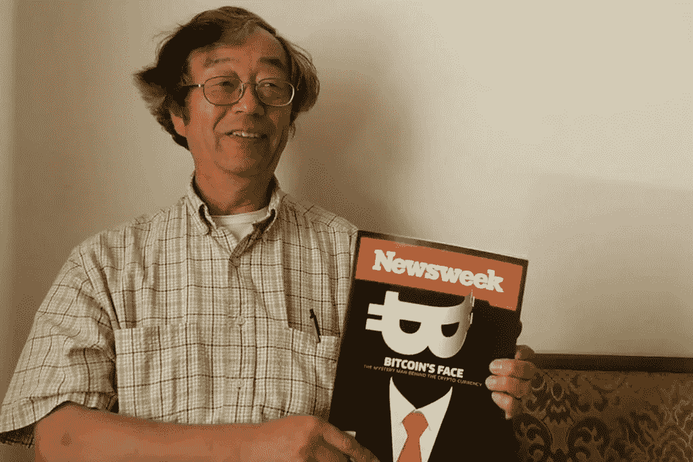

Satoshi pretending to the Satoshi who created Bitcoin

我们在这里；从那以后，比特币受到了巨大的热情，从最初的极客到 2017 年的普通公众，以及随后推出的一系列其他加密货币。

现在，关于加密货币，尤其是比特币，已经引发了很多争论，关于它们的技术，它们的合法性，它们的未来等等。脾气甚至已经爆发，特别是在 2017 年不断升级的炒作之后。最好的例子是摩根大通首席执行官杰米·戴蒙(Jamie Dimon)，他称比特币为“欺诈”，并表示将解雇任何交易比特币的员工，因为他们愚蠢。他补充道:

> “货币不会起作用。你不可能有一个企业，人们可以凭空发明一种货币，并认为购买这种货币的人真的很聪明。”

The crypto community didn’t take long to react to Dimon

今天，区块链的密码社区匿名发起了反对控制的斗争。零知识协议的研究和实施正是这场持续战斗的表现——而 KYC 的强制措施和对 Monero/ZCash 的批评是监管机构的回应。

这一段的主要观点是展示加密货币是如何发展起来的，其目的是为当前的货币体系提供一种替代方案。我的观点是，这是长久以来提出的最有趣的想法！

# 四。**加密货币系统的利弊**

一些人认为，如果加密货币设法被广泛接受，法定货币的当前价值可以很容易地转移到这些新的代币上。事实上，它们的引入不仅创造了有资格成为货币体系的体系，还进一步开启了前所未有的可能性。

*   首先，DLTs 提供了一个适合点对点转移资产的系统，这意味着它完美地支持从一个人到另一个人的直接支付，与中国微信转账用户已经获得的用户体验相同。这不仅适用于面对面的互动，也适用于远距离的互动，不受国界的限制。
*   其次，DLTs 上的 smartcontracting 开启了可编程价值转移的时代。Vitalik Buterin 创建以太坊的天才之处在于，他提出了在交易条目的分布式分类账上附加一个状态机的想法。最终，您将拥有一台分布式计算机，它根据事务和区块链上传递的消息来确定性地更新状态。这允许编码，然后直接在区块链内执行逻辑，根据标准自动执行支付作为双方合同的结果。DLTs 由此开启了被合理吹捧为“货币互联网”的驱动层。
*   第三，同样，没有任何官方机构能够控制该协议。特别是，硬币的发射(膨胀)模式在代码中是固定的，不可能有人干预，因此避免了任何篡改的风险。按照制度，人人平等。

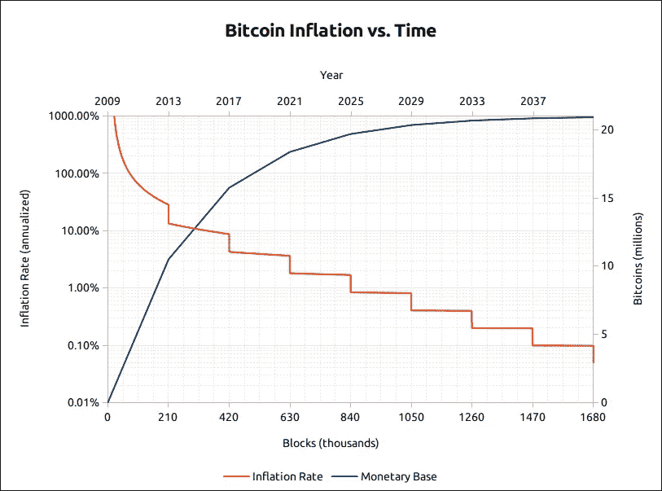

[source](http://startusingbitcoin.com/blog/1-what-is-bitcoin/)

*   第四，从每个人的角度来看，公共分布式分类帐系统在构造和默认情况下是可审计的。或者，如果需要，交换也可以匿名化。技术允许你选择透明-可检查性或匿名-不可追踪性，这两种方式肯定都有处理价值转移的空间。此外，DLT 上的令牌可以被设计成可替换的或不可替换的*【如果两个令牌无法区分，则加密资产是可替换的；否则，如果所有硬币都有序列号]* ，则它是不可替代的。

简而言之，加密货币是开启新货币时代的候选者。

然而，加密货币系统并非没有它们的顾虑和局限性。我们稍后将深入探讨 DLTs 带来的巨大新可能性，但让我们先来看看比特币公司面临的困难是什么。

**#1 缺乏合法性**

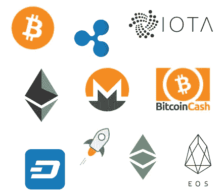

加密货币存在合法性问题，至少目前如此。为什么我们都同意比特币应该是世界上占主导地位的货币，而不是具有几乎相同特征的比特币现金？为什么不是以太？其实有那么多；我们将如何从中选择？可以根据速度、可扩展性、能耗、安全性来选择标准。目前，最受欢迎的加密货币是最初被最广泛采用的货币。

此外，如果你想想象一个替代品，新加坡元+俄罗斯卢布+巴西雷亚尔+等等。根据单一的加密货币惯例，你最好想确定如何在全球范围内以公平的方式进行初始分配。相反，接受比特币作为标准将意味着早期的矿工/投机者将已经拥有大部分财富。

最后关于合法性，纯加密货币几乎没有任何基础资产来获取其价值(就像菲亚特一样)，这至少部分解释了它们的高价格波动性。

**#2 技术极限**

加密货币系统面临技术瓶颈，目前正在研究。

**有效的去中心化:**任何在区块链网络中获得超过 50%股份的实体都可以实际控制该网络( [51%攻击](https://www.investopedia.com/terms/1/51-attack.asp))。康奈尔大学研究人员的一篇论文甚至显示，一个仅拥有 25%股份的实体就可以发起经济攻击。如今，加密货币挖掘倾向于显著集中，未成年人的重新组合定期导致大约 10%的哈希能力池。

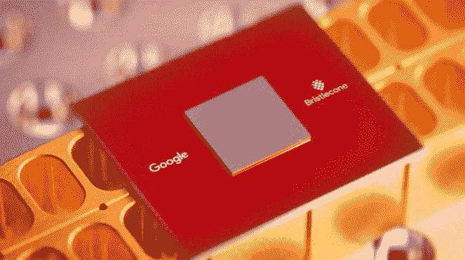

Researchers are actively working on the development of quantum computers; one of the last releases is Google’s [Bristelcone](https://ai.googleblog.com/2018/03/a-preview-of-bristlecone-googles-new.html) operating with 72 qubits

**加密漏洞:**如果计算能力继续按照摩尔定律扩张，今天的 DLT 所使用的加密技术将不够灵活。比特币和以太坊中用于签名的加密技术的安全性是基于这样一个事实，即目前没有已知的算法可以在合理的时间内解决大数的离散对数问题。但是可以用量子计算机计算的新算法会威胁到这种安全性:它们可以“在合理的时间内”从公钥生成私钥。到那时，DLTs 协议使用的加密技术将需要发展以保持相关性。

**可伸缩性:**DLT 具有[可伸缩性三难困境](/loom-network/scalability-tradeoffs-why-the-ethereum-killer-hasnt-arrived-yet-8f60a88e46c0):在可伸缩性、去中心化和安全性之外，只能实现两个属性。事实上，如果您想增加每秒的事务数量，您就要牺牲分散性，因为只有很少的验证者能够跟上步伐并参与网络以确保网络安全。到目前为止，[因为它们是必不可少的](/@cdixon/why-decentralization-matters-5e3f79f7638e)，区块链系统选择了安全性和分散性而不是可扩展性。因此，当 visa 可以处理高达 [47000 tx/s](https://www.coindesk.com/1mb-block-size-today-bitcoin/) 时，比特币只能处理最高 [10tx/s](https://en.bitcoin.it/wiki/Maximum_transaction_rate) 的速度，而其他性能更好的区块链只能通过在去中心化上妥协(使用各种形式的股权或权威证明)来达到更高的速度。

**隐私:**顾名思义，在区块链公共网络上，所有信息都是公开的。隐私原本是通过数学假名来保证的，但今天这种安全性并不充分，通过分析[重新识别假名](https://99bitcoins.com/know-more-top-seven-ways-your-identity-can-be-linked-to-your-bitcoin-address/)已经变得简单。联邦调查局表示，他们对罪犯使用比特币感到高兴，因为这让他们的工作变得容易得多。

**价格波动:**看你选择哪个参照物；一些人可能会声称，当以加密货币报价时，法定货币非常不稳定。但事实是，一个基于区块链的货币体系无法很好地应对消费品价格如此巨大而快速的变化。在有任何用处之前，它需要稳定下来。

[source](http://tenor.com/search/)

当然，不断增长的密码社区正在积极解决技术问题，例如第二层可扩展性解决方案，ZK 的隐私保护，后量子密码，T21。网络的发展也不是一天之内发生的——但是 crypto 还有很多工作要做。

**#3 治理问题**

加密货币协议就是这样；协议，成员(节点)运行兼容的客户端。加密团体可以直接决定修改未完成的协议以更新特征。但是他们需要同意所有的更新同时进行，否则这会导致分叉，而一个“硬”的分叉会导致与不会实现变更的参与者不兼容。如果出现分叉，社区和货币就会一分为二，我们都会同意，这将是货币体系中的一个混乱！只记得以太坊继[以太坊经典](https://en.wikipedia.org/wiki/Ethereum_Classic)硬岔道的刀客之后，关于以太坊的艰难讨论。

因此，至少可以说，要让一种以 DLT 为基础的货币变得严肃，就必须防止两个衍生链上的代币重复；换句话说，开发者需要适当的协调。

但这不是唯一的问题。本质上，有一部分人参与了共识机制，无论他们是利益攸关者还是矿工；这些人可能会根据他们的利益行事，例如最大化他们的报酬，这可能不是主要集中在使货币体系公平或稳定。货币的使用者和主要持有者也可能希望影响他们的决策，可能是为了限制通货膨胀(即每一个新货币创造的货币量)。

因此，要让一个社区管理的公共区块链适合作为一种可靠的货币，一个有效的治理是一件实实在在的事情。

所以这里我们有一个很好的悖论！密码朋克的主要目的是创造一些可以独立于任何控制机构的东西，但不知何故实现的协议很难好到永远保持不变，因此它需要一些有效的机制来决定它需要如何以及何时发展。

今天，尽管加密货币传达了平等的形象，但它们一点也不中立，它们是一个相当不稳定和棘手的自我监管环境。这里的信息是，如果加密货币要在货币系统中发挥核心作用，它们可能会变得太重要，以至于不能把它们交给它们的无政府主义者父亲。

# **V .具体的前瞻性——三个开放的方向将打乱我们的货币体系**

所以现在，一方面，我们有一个远非最佳的遗留货币体系。另一方面，我们有分布式账本技术，这些技术似乎适合于支持替代系统的想象，即使它们还没有完全成熟，即使我们可以预期它们的管理将是棘手的。

从这里开始，让我们试着描绘出一些目前大开的道路会通向哪里。我在此选择发展 3 个想法，而不是阻止进一步的发展。

**#1 令牌化资产作为支付手段的潜在推广**

一个新奇之处在于，区块链允许对任何事情进行象征性的修饰，这既容易又高效。你可以在分布式账本上用一个代币虚拟地**代表任何物品或商品。然后，这些代币具有我们当前货币系统的传统资产难以想象的属性:通过设计，分类账将从那时起一直记录所有所有权转移的可证明记录(除非您决定使用匿名协议)。**

如果你愿意，这个令牌对象可以被分割并由几个人共同拥有，并且仍然有一个内置的公证人来注册所有权，这比等待几个月之后你的官方公证人同意从你那里收取百分之几的费用来记录你想做的事情要容易得多…

**可能性是无限的**。你可以用谷歌股票的一小部分来买咖啡，用法航忠诚计划里的一些里程来换取郊区火车票，用收集旧玻璃瓶换来啤酒，或者用大卫·鲍依第一把吉他的一小部分来卖掉你刚刚读完的一本书。

你可以认为这是史前互换的伟大回归！

事实上，只要我们能够发明一个系统/过程来正确评估资产的价值(可能用几个统一的参考资产来表示)，一个人或一家公司的遗产的任何部分都有可能被分割和交易，这使得可能性真正无限。因此，肯定需要某种支持框架，例如统一的资产识别系统、参考方就估值达成一致的便捷方式、相关资产市场的充足流动性，以及让中介参与的环境(例如，如果你有一枚硬币 A，而你的对手想要硬币 b)

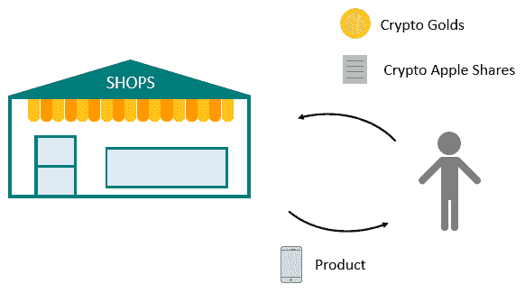

**#2 在分布式账本上管理央行法定货币**

我们看到今天的货币体系有一些严重的缺陷。在我们画了上面的图之后，我最热心的读者可能会开始声称他们一直都知道；当前的货币体系就像一个会自行崩溃的僵尸，面对即将到来的、抢占其位置的漂亮的有效竞争，它显得软弱无力。

但是**没有**。我的建议；别做梦了。这一切都不会那么容易。因为正如你所理解的，总体而言，各州面临的风险太大了。他们失去的太多了，不会轻易放弃。

此外，我听到一些人说，“世界货币体系实际上运转得并没有那么糟糕。”的确，它设法让我们的经济或多或少成功地经历了扩张和衰退。故意调整货币供应，以便在经济信心疲弱时融资变得更容易，在经济信心好转时提高利率，这是一种值得怀疑的预防和应对危机的方法，但这仍然是一种方法。至少有人在驾驶飞机——显然，没有人知道如果没有这种“量化宽松”，2008-2011 年会发生什么。如果你考虑到在经济低迷时期没有人被拒绝动用他们的储蓄，这种方法不知何故奏效了。【嗯，是的，除了在塞浦路斯……！]

[Central](https://markmartinezshow.blogspot.com/2014/05/why-quantitative-easing-isnt-working.html) bankers taking responsibilities

因此，转向一个尚待设计的、全新的、去中心化的资金管理系统，无论它是什么，都将消除央行“试点”所提供的那种安全性。

实际上，与其宣布我们当前的系统过时，为什么不用 DLT 来使它更有效率呢？

事实上，与法定货币挂钩的加密货币(某种“加密美元”)的想法正在形成势头。这种代币将是传统法定货币的延续，并有一种新的处理方式。它就相当于迄今为止发行的纸币和硬币，这两种同质的支付手段可以并行流通。这些“数字”美元可能会更受公司和个人的青睐，因为它们几乎不可能被伪造。

到目前为止，对于哪个实体应该创建它们还存在一些困惑。虽然有些人认为[的中央银行应该为排放](https://cointelegraph.com/news/bank-of-england-issues-working-paper-on-central-bank-digital-currencies)负责，但其他人认为[的私人金融机构也可以排放](https://www.cnbc.com/2018/05/15/goldman-sachs-backed-start-up-circle-introducing-a-crypto-us-dollar.html)，就像今天的情况一样。

不管是央行还是商业银行承担责任，法定排放都将大不相同。正如我们之前看到的，目前我们日常使用的货币中只有大约 10%是央行发行的，而大多数交易都是通过商业银行发行的货币进行的。我们都容易忘记，我们在银行账户中看到的钱不是美元或欧元，而仅仅是一个会计分录，在某种程度上是以我们银行自己的货币计价的，只要它可以兑换央行的货币，我们就同意使用它。在通常情况下，我们可以随时提取这笔钱，但请记住，每家银行大约只有 10%的客户资金是央行货币(央行的现金和存款)。

[When everyone tries to withdraw its money at the same time](https://startsat60.com/opinion/blogs/greek-banks-shut-today-as-financial-crisis-deepens) (Greece)

因此，类似于当前的系统，由私人银行铸造的加密法定代币将本质上不同于由中央银行制造的加密法定代币，并且如果要将私人发行货币供应的原则转化为基于区块链的货币系统，则需要发明适当的系统。

首先，让我们考虑一下一种加密法定货币对中央银行意味着什么。

开始设想这一切，首先需要建立一个区块链。例如，这个区块链可以是私有的，可能由中央银行自己(单方面)在授权证明中执行块验证。好了，一项待办事项完成了。然后呢？那么，谁将拥有这个由中央银行操作的区块链账户的问题马上就出现了。它可以局限于银行和非银行金融机构，也可以直接扩展到非金融企业和家庭。

如果访问仅限于银行和非银行金融机构，中央银行的加密法定令牌将只是；中央银行法定货币今天同样的实体可以获得，并以同样的方式使用。它将比现金轻，可快速兑换，安全可靠，而且很可能很快被用作储存价值和缓解银行间转账的首选手段，使全球转账几乎是即时和免费的。这个概念甚至超越了 T2 瑞波 T3 目前提供的东西，加密法定代币将直接成为 T4 T5 法定代币，因此银行可以完全信任它们。

但是下一个问题是。为什么不在同一个区块链向个人和非金融企业开放央行账户呢？这实际上不是一个新的想法，不管区块链是不是；直到今天，这一点仍被阻止的原因正是为了保护商业金融机构的角色，以竞争的方式向民众提供最好的债务排放服务，这比中央银行确保的公共服务更有效率。

然而，DLTs 开启了新的可能性如果我们都有一个中央银行区块链账户，里面有中央银行的钱:

*   我们都可以使用同一个核心支付系统，直接处理我们的现金，无需中介。这将导致个人直接持有的财富膨胀，而没有容易违约的银行作为中介。进而稳定整个货币体系，使其更加稳健。

This could one day really happen!

*   此外，一些人认为，这将使央行创造的货币得到更公平的分配成为可能。最直接、最“有趣”的可实现特性可能是臭名昭著的“[直升机撒钱](http://money.cnn.com/2016/05/04/investing/bill-gross-helicopter-money-qe-robots/index.html)”。事实上，上次危机中的一个问题是，借给银行的钱几乎没有流入实体经济。如果央行行长现在有可能直接向每个公民的账户存款，那么他们就可以直接向那些更迫切需要消费流动性的人的口袋里注入流动性，从而有可能抵消金融危机对无知人群的影响。外推，我们甚至会触及普遍收入逻辑(即使在这里我们肯定偏离到一个更政治的辩论！).

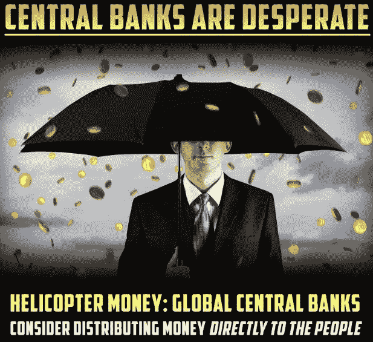

Maybe you can then turn your umbrella upside down?

当然，在区块链上管理个人账户会带来许多挑战:

*   隐私和匿名权将是一个主要问题:想象一个独裁政权能够利用这一点…
*   加密帐户的管理是另一个问题。每个人都觉得自己有资格管理自己的账户密钥吗？万一被抢或者被黑了怎么办？更有可能的是，虽然有些人会决定自己管理他们的加密账户(就像今天有些人把钱存放在金库里一样)，但大多数加密银行账户将由专业金融公司管理。

The bank of tomorrow, storing their client private keys

**现在让我们考虑一下私人银行如何发行加密法定货币**

你猜怎么着这已经发生了！没有什么禁止它，而且私人倡议已经开始在这个问题上。 [Circle](https://www.circle.com/) ，高盛支持的初创公司宣布了一种与美元同质的新加密货币。据他们的首席执行官说；“许多银行对此感到兴奋，并将予以支持”。

如果高盛创造了自己的加密美元并获得成功，很可能其他银行也想分一杯羹，并跟随创造自己的加密美元。

喘息！等等，但这是 19 世纪 30 年代的免费银行，重新加载！

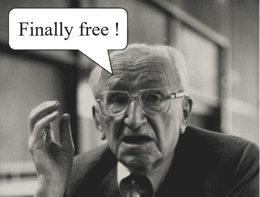

Herr Doktor Professor Friedrich Hayek had seen it all coming!

正如哈耶克所解释的，在这样一个竞争环境中，货币发行者会有保持其货币价值的动机。然而，可信发行人也有一个重要的激励因素，那就是创造比他们拥有的美元更多的加密美元，由于银行已经在当前的系统中这样做了，我看不出他们为什么不继续下去。

真正的问题是，最后，如果有几个来自不同银行的加密美元，它们的价值相等吗？他们应该这样做，因为今天我们在银行账户上看到的来自汇丰和富国银行的美元之间没有任何价值差异。不然多乱啊！因此，在未来，我们可能不会对由两家受信任的银行在不同的区块链管理的两种加密美元进行任何区分。他们将设计一个系统，以便仅仅是他们的会计改变对 DLT 的支持。在这种情况下，相对于现在没有什么变化；仍然会有金融危机的时候，我们会看到持有央行储备资金的银行和不持有央行储备资金的银行之间的区别。

另一个可以研究的可能性是，一个司法管辖区内的所有私人银行组成辛迪加，共享一个共同的分布式分类账，它们可以在这个分类账上发行货币——所有这些都是同一个可互换的代币。该系统将由智能合约提供支持，允许参与者根据参与金融机构在央行账本上的存款比例发行货币(通过债务创造)。这个想法还有待发展，但至少显示了区块链在货币发行管理方面的潜力！

**#3 贵金属抵押代币特例**

我们讨论了标记化。因此，特别是，任何贵金属都可以作为(加密)货币来表现和交换。

有了区块链，我们有办法以可分割、可替代和简单的方式处理黄金、白银或任何其他传统的贵重商品。黄金、铜、油桶和可可豆，就像任何加密代币一样，将在交易平台上或直接在买方和卖方之间对等的情况下进行交换。

如果一种这样的支持资产得到推广，那么人们将最感兴趣的是将其用作价值单位，包括在智能合约中，而不是使用纯加密货币(没有抵押品，目前不稳定)，而不是令牌化的法定货币，事实上，除了对公共和私人金融机构的信心之外，法定货币并没有真正得到任何东西的支持。

也就是说，你明白了。作为现代货币体系的一部分，黄金有充分的理由在日常交易中回归。不再像过去那样是金本位制，而是一种象征性的黄金，其价值相对于其他任何东西不断波动。

当然，这实际上很难做到，并且最终在某种程度上违背了许多加密领域的人所珍视的去中介化——去中心化的思想。事实上，要做到这一点，某种“信托机构”将需要购买黄金并储存(安全！非常安全！)在将令牌发放给任何想要使用它们的人之前。这个房子或这些房子也将需要提供黄金金属给任何想要退出系统的人，同时销毁相关的代币。这项业务可以由一家经过审计的银行作为私人倡议发起(如果一些国家限制这种倡议，那么它可以在一个加密友好的国家自由建立，可以点对点，仍然可以在世界范围内轻松使用)。

许多计划已经开始尝试将黄金象征化:

*   OneGram 是一项举措，将黄金存放在迪拜自由机场区的金库中。ZenGold 是一个类似的项目，金属储存在上海。
*   Digix 看起来是最致力于将黄金重新作为一种通用交换媒介的项目，一克黄金和代币之间直接等价。

所以如果用法还远未成为主流，我们可以说价值提议差不多准备好了:区块链解决了贵金属作为日常生活中支付方式的流动性和可分性问题。

事实是，黄金和其他贵金属有潜力在抵押证券中脱颖而出，具有以下优势:

*   黄金具有真正的国际价值。此外，世界范围内已经存在黄金和其他商品交易所的规则/条例。
*   黄金也传达了信任，因为它已经被长期接受，并且是一种可以长期依赖的传统存在。
*   黄金和白银具有工业和装饰/珠宝用途，可产生或增加相关的内在价值。
*   这是一个自由开放的流动性市场，任何政府都无法控制，因此从技术上讲，几乎没有货币通胀可言，也不存在任何央行操纵货币供应的问题。

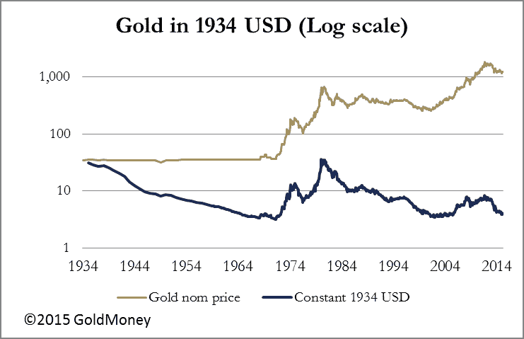

Gold is free floating only since 1971

# **结论**

使用加密货币来交换和储存价值已经成为现实。自比特币诞生以来，区块链代币上代表的财富数量(总硬币市值……)已呈指数级增长，此类资金的点对点转账量也逐年稳步增长。显然，波动性很高，要找到一个对应方在你需要的地方出售你需要的东西仍然很复杂，但很明显，在支持硬币的司法管辖区，区块链货币的使用将会普及。

传统的货币体系虽然可以批评，但有理由以这种方式运行。它们根深蒂固，人们可以打赌，大多数国家绝不会自己放松对货币控制的控制。与此同时，为了让分布式分类账硬币在货币体系中赢得潜在空间，它们首先需要解决技术问题，并证明它们的治理是站得住脚的:在我们每天早上都用 Monero 或丰田股票支付面包之前，可能还需要很长时间。

但最后，我喜欢想象未来可能是本文中强调的所有可能性的组合。传统国有货币可能以 DLT 格式持有；无抵押的比特币和莱特币由于其安全性和分布式的特点，可能会获得长期的价值储存的认可；一个优化的区块链令牌尚未设计可能会赢得比赛，并成为最广泛的认可和使用；而一些或其他资产担保的代币将或多或少地进行流动性交换；令牌化的贵金属肯定也会在游戏中回归。

我们会看到的！

托马斯亚历山大公司

非常感谢凯文、恩迪、克利斯朵夫、久林的同行评议。