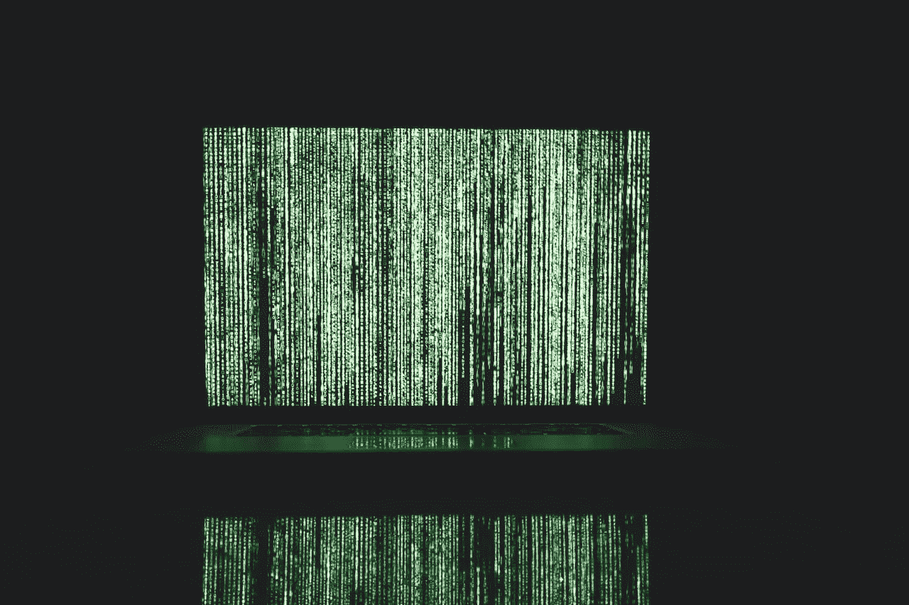

# 公司如何知道他们是否在使用窃取的数据？

> 原文：<https://medium.com/hackernoon/how-do-companies-know-if-theyre-using-stolen-data-42d7b7b7951c>

网络犯罪给全球社会带来的总成本为 5000 亿美元，而且还在不断攀升，而一次数据泄露平均会让一家公司[损失约 380 万美元](https://www.microsoft.com/en-us/cloud-platform/advanced-threat-analytics)。我们不需要告诉你这是一大笔利润损失。

或许更令人担忧的事实是，勒索软件攻击[在 2017 年](https://www.symantec.com/security-center/threat-report)增加了 36%。

如果你还不知道的话，勒索软件是一种特别令人讨厌的恶意软件，它会夺取系统及其数据的控制权，声称只有在支付一小笔钱后才能提供访问。

不幸的是，支付赎金后，很少会归还使用权。肆无忌惮的当事人通常会带着泄露的数据逃跑，并在黑市上出售，以获取额外的利润。

这带来了一个非常惊人的启示:所有被窃取的数据最终都会被出售给某人。

一家合法的公司完全有可能无意中获得被盗数据或在第三方市场上购买被盗数据。这是一个令人恐惧的前景，但却是现实中的现实。

您如何确定您没有使用、购买或获取从您的某个来源窃取的数据？

## 1.做研究

不幸的是，我们生活在一个数字化的环境中，这意味着无止境的数据流入和流出几乎每一个人、每一个组织和每一个离线或在线系统。

这使得很难确定哪些数据集可能被盗，哪些可能未被盗，尤其是当它们与附加内容捆绑在一起时。毕竟，当你从市场上购买数据时，你通常会批量购买。

要确定你正在处理的数据是否被盗，最好也是唯一的方法就是做研究。有工具和服务可以帮助你参考这类事情。

例如，Hold [Security](https://hackernoon.com/tagged/security) 为[提供深度网络监控服务](https://holdsecurity.com/services/deep-web-monitoring/)，该服务也可用于检查被盗数据。当然，还有各种其他工具供您使用。

## 2.如果你必须购买，只从合法来源购买

与你在网上看到的廉价商品和服务类似，一组潜在有利可图的数据可能看起来很诱人，但只有在你能验证来源和卖家的完整性时，你才应该购买。

不要使用暗网和类似的平台购买稀有或非常抢手的数据。这不仅仅是个坏主意，而且极其危险。

这并不意味着你必须与所有的主要提供商合作，因为有很多不知名的数据市场。只要确保你选择的渠道是可信和合法的。

最后，不言而喻，不要购买缺少属性或来源信息的数据存储。

## 3.管理、维护和反应

如果你真的意外获得了被盗的数据，在你做了初步研究后，它可能会浮出水面。信不信由你，数据泄露和攻击通常在一段时间内不会被组织报告。

这就是为什么掌握您所拥有的数据并持续检查和验证您将使用的数据的完整性非常重要。

请确保将其作为数据管理流程的一部分，以免影响性能或工作效率。如果这是你日常工作的一部分，你就不太可能因为使用窃取的数据而受到打击，至少在很长一段时间内。

您可以快速识别受损数据，并更快采取措施，这对每个人都有好处。

数据维护的一个很好的例子是获取一份陌生来电清单，并[将其与已知的数据库](https://www.telephonelists.biz/blog/cold-calling/buy-quality-leads-lists/)如国家拒收讯息登记处进行比较。如果您定期这样做，您应该能够相当早地查明受损的数据。这可以让您验证该列表是否可信，并决定将来是否应该避开该卖家。

## 4.坚持自己的内容

是的—有时获取外部或第三方数据是绝对必要的。这可能是也可能不是因为你无法接触到相同的客户、系统或分析工具。

不管是哪种情况，关键是不要完全减少第三方服务的使用。相反，我们的目标是尽可能多地使用自己的内容和资源。

如果你有资源和时间自己收集必要的数据，为什么不这样做，而不是获取别人无法核实的内容呢？

这种简单快捷的方式很吸引人，但不一定是最好或最安全的路线。在今后处理备用数据源和第三方内容时，请记住这一点。

## 唯一的防御是一个聪明的过程

数据泄露时有发生，被盗数据的传播比任何人愿意承认的都要频繁，从外部来源获取受损数据的可能性是真实存在的。

处理这类问题的最好方法是不要掩盖它们。相反，要活在当下，保持警惕，最重要的是，要聪明。

在部署一组新数据之前，请进行研究。事后继续维护，验证真伪。不要从不合法的来源或你不信任的一方购买。

最后，即使只是为了你自己的数据，也要确保时常搜索黑暗的网络，寻找被盗内容的迹象。

只要您将这些方法作为常规数据管理和安全流程的一部分，您应该就没问题了。

*图片由* [*马库斯·斯皮斯克*](https://www.pexels.com/photo/green-water-fountain-225769/)