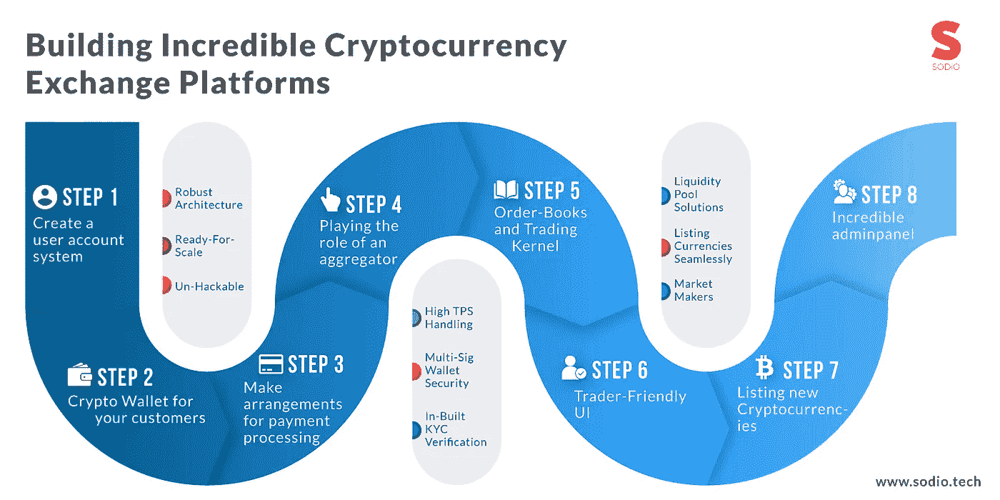
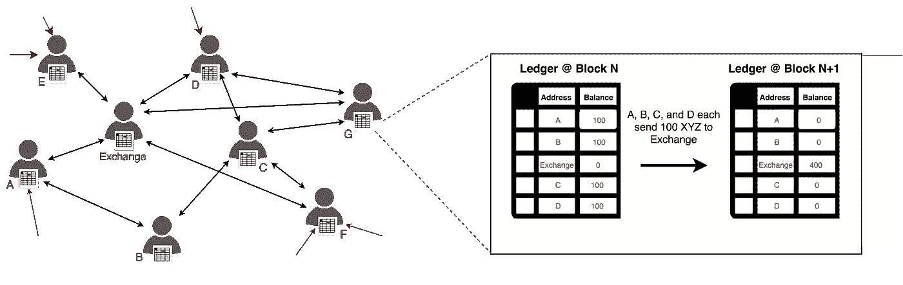
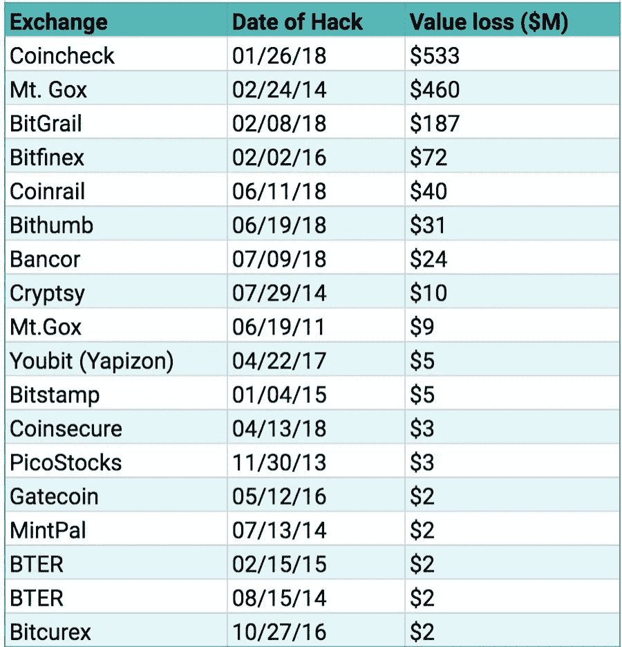
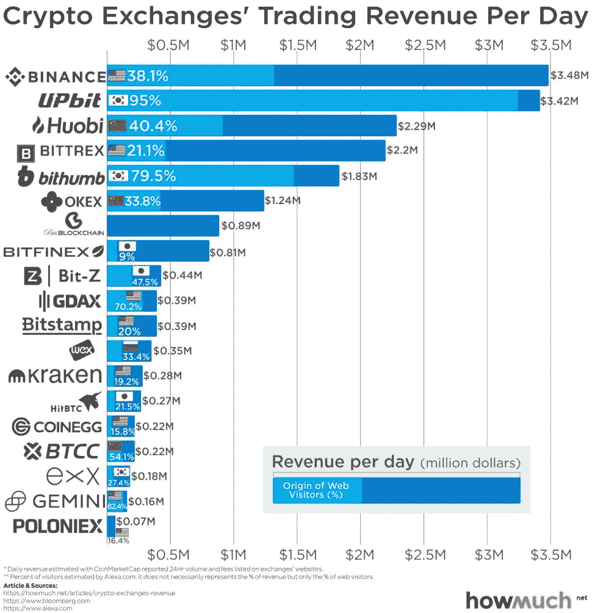
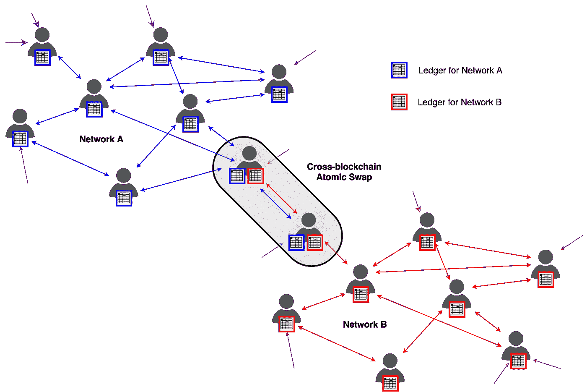
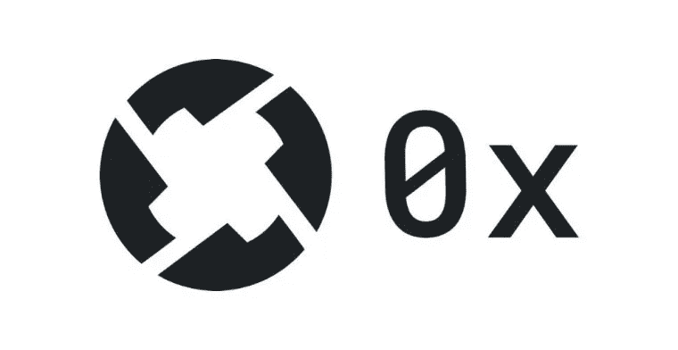
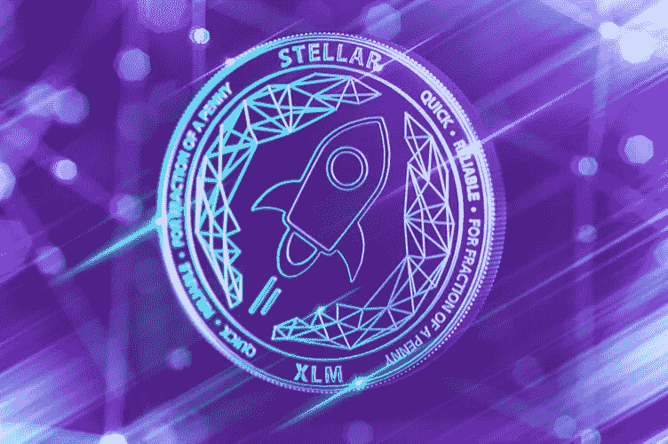
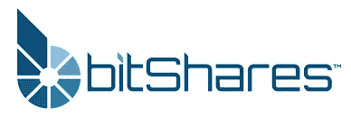

# 加密货币交易所是如何运作的？以及哪些技术正在推动颠覆。

> 原文：<https://medium.com/hackernoon/how-do-cryptocurrency-exchanges-work-and-what-technologies-are-driving-disruption-33d0007eb018>

Source: [SodioTech](https://sodio.tech/)

[分散的加密货币交易所](https://en.wikipedia.org/wiki/Decentralized_exchange)在加密社区获得了巨大的关注，或者我们喜欢称之为**——*加密圈*** 。我们的团队一直在不懈地努力构建稳健且随时可扩展的分散式[加密货币交易所](https://en.wikipedia.org/wiki/Cryptocurrency_exchange)解决方案，以满足加密货币交易商甚至普通加密爱好者的需求。我们甚至建立了一个白色标签的加密货币交换解决方案(集中/分散)，受到了许多专家的称赞。

在 Hackernoon 的上一篇文章中，我讨论了实施[区块链](https://hackernoon.com/tagged/blockchain)解决方案来解决任何给定问题的整个过程。从用例分析到区块链商业价值的商业化，所有内容都在那篇文章中讨论过。然而，在这篇文章中，我将讨论一个更接近我的团队的话题——加密货币交易所，什么是加密货币交易所？加密货币交易所的建立，以及加密货币交易所是如何工作的？以下是我打算在这篇文章中涉及的一些事情:

> 为什么我们需要加密货币交易所？
> 
> 什么是加密货币交易所？以及他们的类型。
> 
> 加密货币兑换是如何进行的？

所以，不再闲聊，让我们言归正传。

# **为什么我们甚至需要加密货币交易所？**

那是 2009 年。

中本聪正在努力编写世界上第一种加密货币的代码。为了简单起见，让我们称中本聪为盖伊，因为我们不知道这个名字代表什么。他在创造比特币的时候，不会想到他创造的货币会在未来几年里当着所有人的面爆炸。

在这个过程中，他还创建了世界上第一个区块链数据库，正如今天所设想的那样。平心而论，中本聪可以被认为是加密货币和区块链之父。当然，这是一个有争议的说法，最近出现了像 Vitalik Buterin 和他的以太坊项目这样的人，该项目即将进入第二阶段，即以太坊 2.0。

尽管如此，加密货币的世界仍然是一个非常有趣的研究领域，甚至更有趣的是参与其中。为了完全理解加密货币交易所是如何工作的，你需要对这些事情有一个背景知识。

每种货币都有交易的需求。无论是为了盈利还是为了获得其他有用的货币，交易总是与货币联系在一起，通常被称为外汇(forex)。

由于货币的地理限制，外汇一词被用来指代货币交易的所有这些方面。当然，比特币和所有其他加密货币也不例外。交易也发生在这里，尽管方式和过程完全不同。

理解交易的基础也将有助于理解加密货币交易所是如何工作的。交易也可以发生在法定货币和加密货币之间，这不是问题。但加密货币的本质要求一个特殊的平台来交易它们，一些不同的东西，只是为了纪念加密货币所代表的遗产而建造的。

一旦你理解了资产数字化的概念和加密货币是如何变得相关的，理解数字货币交易所的工作将是你的茶。

# **进入加密货币交易所。**

Source: Coincenter.org

如前所述，货币带来了交易的需求。基于传统交易所的想法，加密货币的先驱们建立了交易加密货币的平台，并对其进行了修改和优化，以帮助他们以最快和最有效的方式进行交易。

既然你将会读到加密货币交易是如何工作的，分散的和集中的，有一些事情你必须知道。Bitfinex 和 Mt. Gox 是最近几个流行的加密货币交易所。

我们的团队一直在努力打造稳健的大规模加密货币交换解决方案。如果你对加密货币交易所的工作原理有一些清晰的概念，你可以看看一些更具技术性的帖子，比如这篇关于[开发分散式加密货币交易所](https://blog.sodio.tech/how-to-make-a-decentralized-cryptocurrency-exchange/)的帖子。

交易所主要有两种类型，根据其性质分类。存在集中的和分散的交换，两者在操作和管理的等级上是不同的。在适当的时候，我们会谈到什么是集中和分散交易的本质，但首先，让我们多谈一点这个概念。

作为一个在线平台，加密货币交易所是最简单的加密-法定和加密-加密配对交易方式。这些交易所的配对在很大程度上决定了加密货币交易所的工作方式。

在机场或证券交易所的常规货币兑换处，这些通常被视为整个加密网络的在线市场。在本帖中，我们将讨论关于加密货币交易所的一切。从加密货币交易所的分类到创建加密货币交易所的全过程。我们还将讨论加密货币交易所是如何工作的。

比如加密货币交易所的黑客？看一看:

# **加密货币交易所的分类**

根据其组织层级和总体控制机构，加密货币交易所通常分为两类，如前所述。让我们深入其中的每一个，并发现加密货币交易所的秘密。

## **集中式交换——这些加密交换是如何工作的？**

顾名思义，集中式交易所是由第三方或某个机构来运营的，即委托别人来管理你的资金。就像你相信银行会处理你的法定货币一样，集中交易也是由同样的意识形态组成的。术语集中，我们的意思是一个中间人负责在网络上交易的任何资产。从传统意义上说，人们认为这比自己处理所有的钱更安全。在许多方面都是如此，因为这些组织由训练有素的专业人员组成，他们有能力处理大量资金。贷款和储蓄等其他服务也让人们选择集中式架构。现在，您已经了解了集中式加密货币交易所及其基本原理，让我们来讨论各种类型的集中式加密货币交易所。

就集中交易所而言，它们可以进一步分为两种类型的交易所。

**同步交换**是指客户的请求通过单笔交易获得批准。它们是小规模的交易所，因此在执行大量交易时容易出现故障和规模扩大问题。

异步交换由接收用户请求并将它们添加到队列中的接口组成。然后使用不同的层独立处理这些请求，然后将请求的状态传递给接口。与同步交换不同，这种交换没有伸缩问题，可以处理大量事务。

中央加密货币交易所与传统意义上的银行没有什么不同。将他们的钱存储在交易所，使用双因素认证等安全功能登录，以及其他服务使加密货币交易所在大众中流行起来。然而，这里需要注意的一点是，所有的加密货币交易所都不提供法定加密配对，只有少数受欢迎的交易所提供法定加密配对。其中包括双子座，比特币基地，罗宾汉和北海巨妖。

## **集中交易所的成交量。**

在了解加密货币交易所的工作原理及其背后的[技术](https://hackernoon.com/tagged/technology)之后，了解这些交易所的交易量动态是非常重要的。一个普遍的事实是，交易所的交易量越大，波动和市场操纵的可能性就越小。在低交易量的网站上，购买将导致吃掉所有的卖单，从而使加密货币的价格上涨，并使人失去他们的钱。因此，高交易量对于保持交易所正常运转和交易者利润滚滚而来至关重要。看看一些交易量大、配对数量多的热门交易所，我们有-

a.币安-去年才推出，[币安](https://coingape.com/binance-targets-institutional-money-institutions/)现在的交易量是所有交易所中最高的。它们提供两个级别的验证，级别 1 提供每天 2 BTC 的取款阈值，而级别 2 将赌注提高到每天 100 BTC 的取款能力。

b.GDAX-它代表全球数字资产交易所。作为比特币基地的延伸，它现在是世界上最受欢迎的交易所之一。独特的是，美国联邦存款保险公司为用户投保高达 25 万美元。专注于服务专业和老练的客户，可能不适合新手。然而，它被证明是保证金交易和加密-法定和加密-加密配对交易的一个非常好的选择。

相关:[加密货币交易所开发](https://blog.sodio.tech/cryptocurrency-exchange-development-company/)

## **集中式加密货币交易的安全方面。**

没有一家集中式交易所能免受黑客攻击。事实上，由于它们的结构，它们比分散的交易所更容易受到黑客和诈骗的影响，这一点我们将进一步讨论。说到截至目前的集中兑换，有恶意的人攻破网络的安全，盗取所有用户的钱的可能性相当高。例如，一名以太坊黑客从比特币基地加密货币交易所窃取了约 20000 以太坊，价值约 1700 万美元。虽然黑客后来全额返还了款项，但这显示了集中交易所的脆弱性。由于他们的本质，他们最容易被盗窃和黑客攻击。

由于数据存储在一个单一的中央数据中心，黑客只需要渗透到网络的这一层就可以获得访问权限。在个人方面，也有报道称用户的密码和钱包的私人钥匙被盗，因此无法访问他们在网上存储的所有资金。这些安全问题虽然令人担忧，但非常罕见。如今，所有集中式交易所都拥有高安全性的交易、数据存储和其他服务，交易所被黑客攻击或人们丢失金钱的事件大幅减少。Bitfinex 和 Mt. Gox 被诈骗数亿美元的日子已经一去不复返了，现在，交易所能够更好地应对这种攻击。

## cex 适合初学者——因为这些加密货币交易所的工作方式非常简单！

集中式加密货币交易所是新手和不太了解这项业务的投资者进行交易的最佳选择。它仍然是经验丰富的交易者的首选，但如果你是加密货币交易领域的新手，你绝对应该去一个集中的加密货币交易所。在为自己选择最好的交易所时，请记住不同的因素，如在交易所交易的货币对、安全措施和交易量。所有这些对你决定选择一个集中的加密交换都是至关重要的。

如果集中式交易所如此美妙、安全、可靠，那么创造一种全新的加密货币交易所又有什么必要呢？

## **对分散交易的需求**

老实说，集中式交易所并不符合加密货币的全部本质，而是一种去中心化的虚拟货币。当加密货币的最大目的之一是消除中间人，消除管理，中央机构，那么为什么要使用中央交易所？为什么不创造一些遵循加密货币构成概念的东西呢？

因此，加密产业催生了分散式加密货币交易所。交易所正是建立在加密货币所代表的原则之上——没有中间人，将信任带回系统。与其相信一家公司会保护你的资金安全，你不如自己去做。你所有的钱都在你手中，只要你愿意。交易和其他交易都是由你完成的，而且只由你完成，这使得分散式交易可能是加密货币交易中最个性化的体验。

# **这些分散的数字货币交易所是如何运作的？**

Atomic Swaps

在过去的几个月里，我们的团队一直致力于为[分散式交易所](https://coincenter.org/entry/what-is-a-decentralized-exchange)构建解决方案。基于 0X 协议、Stellar 和 Bitshares 的解决方案已准备好实施，我将只解释这些方案的工作原理。在本帖的未来更新中，我可能会向读者更新基于 EOS 区块链的 DEX。因此，让我们讨论一下基于 0X 和位份额的索引:

# 使用 [0X 协议](https://0xproject.com/)进行链外订单和链上结算

The 0X Protocol

这可能是构建 DEX 最流行的协议/栈。基于这一协议已经制造了许多继电器。这包括 [Paradex 和雷达继电器](https://blog.0xproject.com/latest)。这些交易基于以太坊智能合约。这意味着上市的 ERC-20 代币将被简化。在基于以太坊区块链建立的交易所中，所有的订单功能和交易都发生在智能合约中，用户将始终拥有他们的代币。然而，这也意味着，无论是将资金存入交易所的智能合约，还是下单、取消或执行订单，交易员甚至普通用户每次想要管理资金时，都必须在区块链上执行交易。

然而，通过在 0X 上建立分散的加密货币交易所，使用链外订单簿和使用交易逻辑的链上结算，它可以被修复。这使得使用这些分散交易所的 P2P 支付过程变得极其简化，因为除了实际转账之外的所有事情都发生在链外。这将以太坊指数中的“汽油成本”降低到了一个极低的水平，并使代币交易过程极快。现在，让我们来看看 0X 协议中使用的一些常用术语。

**Relayers** : 0x 使用它所谓的“Relayers”。转播员负责通过公共或私人订单簿广播订单。它们通过托管订单簿为网络带来流动性，有效地充当了交易所的角色。但与交易所不同的是，它不能进行任何交易，而是在网络上发布做市商指令，

**制单者**:制单者是产生买卖订单的地址，并利用中继器的帮助，而不是在收取气价的链上推动订单，它在网络上列出订单，供合适的接受者提出请求。

接受者:接受者是一个被允许完成制造商列出的订单的地址。对于要执行的交易，接受者必须向 DEX 的智能合约提交创建者的签名以及他自己的签名。为了促进交易，需要向转播者支付费用，作为对 0x 的本国货币 ZRX 的补偿。

**点对点订单:** 0x 也支持**点对点订单**，这是制造商发送给特定接收人的订单。理解点对点订单的概念对该协议的开发和理解加密货币交换如何工作非常有帮助。这些订单允许两个用户通过各种消息媒介甚至在社交媒体上直接转移资金。当出票人地址发送订单中继时，只有指定的收款人地址才能履行订单中继，从而保护资金不被恶意第三方劫持。

# 借助 Stellar 区块链，交易变得更快、更具成本效益。

Stellar Blockchain

在这一部分，我们将讨论基于恒星区块链建立指数的考虑因素。恒星区块链和建立去中心化交换的协议是一个由非营利组织开发的开源互联网协议，旨在使人们能够更快更便宜地转移资金。它的工作方式与电子邮件的工作方式非常相似，协议基于简单邮件传输协议。由于该网络是开源的，它允许在 3-5 秒的莫名其妙的交易持续时间内从一方到另一方进行无摩擦的资金转移，交易费用低至 0.000005 美元。鉴于恒星区块链和基于它们的 dApps 的流行，理解在恒星区块链之上建立的加密货币交易所如何工作可能是有帮助的。

Stellar DEX 协议将区块链的去中心化特性提升到了一个全新的水平。带有容错系统的独立服务器参与网络，[为整个网络增加了安全性](https://courses.csail.mit.edu/6.857/2018/project/Hao-Chang-Lu-Zhang-CCExch.pdf)。Stellar DEX 本质上充当了一个数据库，用于存储网络上每个帐户的数据，并在网络上的每个节点上托管一份完整的副本。为了便于货币之间的转换，恒星有自己的货币，流明。它充当其他货币之间的桥梁，以帮助转换过程。这是你继续在恒星区块链进行加密货币交易的另一个令人信服的原因。

# 通过 [Bitshares](https://bitshares.org/technology/decentralized-asset-exchange) 加速资产数字化

Bitshares

这是一个金融智能合同平台，旨在使数字资产的转移更简单、更顺畅。Bitshares 可以用来创建一个资产支持的令牌，并在市场上上市，供任何用户交易。这有可能成为令牌化经济的案例，因为它使资产的令牌化变得轻而易举。

[bitshares 平台](https://www.fairfieldcurrent.com/2018/11/25/bitshares-bts-reaches-one-day-trading-volume-of-15-12-million.html)提供了一个接口，普通用户可以使用该接口来创建自己的资产支持令牌，或者开发公司可以使用其石墨烯技术的 bitshares API 来创建自己的交易所，方法是创建令牌并在 bitshares 市场上市交易。在 Bitshares exchange 上发行的资产与其本机令牌 BTS 挂钩，因此，如果您想要运行 Bitshares 客户端的完整节点并交易多个 BTS 挂钩的资产，您可以像任何其他区块链一样利用 Bitshares 网络的互操作性。

# 总结。

在这篇文章中，我试图解释加密货币交易所是如何工作的，并讨论了分散式加密货币交易所所基于的各种协议的工作原理。如果你想进一步讨论加密货币交易所，请随时通过 LinkedIn 或以下任何方式与我联系。

> 与我们联系:
> 
> 电子邮件:contact@sodio.tech
> 
> 推特: [Sodiotech](https://twitter.com/sodiotech)
> 
> 网址:[索迪欧科技](https://sodio.tech)