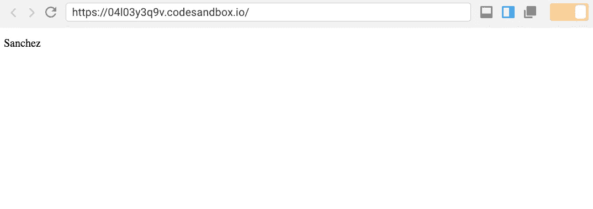

# 如何使用新的 React 上下文 API

> 原文：<https://medium.com/hackernoon/how-do-i-use-react-context-3eeb879169a2>


谣言满天飞！语境能代替 redux 吗？是不是让道具钻灭绝了？就算语境！==世界和平， [React](https://hackernoon.com/tagged/react) 团队引入了一个奇妙的工具来简化前端开发人员日常处理的最困难的问题之一:状态管理。

在过去的六个月里，有很多关于新的[背景](https://reactjs.org/docs/context.html#when-to-use-context)的炒作。在这篇文章的最后，你会知道它是什么，是否以及何时应该使用它，以及如何在你的应用中实现它。


Redux? Is that you?

# 什么是语境？

把 React 想象成一个工具箱。在 React 15 中，开发人员只能使用适当的钻探来管理他们的应用程序的状态。(如果你还不知道道具钻探，去读这篇[帖子](/@MCapoz/passing-data-in-react-with-prop-drilling-904aeb3cb5e)。我等)。

开发人员开始使用其他工具箱，如 [redux](https://redux.js.org/) 和 [MobX](https://github.com/mobxjs/mobx) 来帮助更复杂的状态管理。它们提供了管理状态的替代解决方案，但是它们引入了复杂性，增加了包的大小，并且除了 React 之外还需要学习另一个库。

像所有的抽象一样，这些工具带来了权衡，对于大型应用程序来说这是值得的，但是对于中小型应用程序来说似乎是多余的。


‘Sup. It’s me, Context.

# 什么时候应该使用上下文？

我建议，当你发现自己在组件树中向下传递三层或更多层时，去寻找上下文。您可能会注意到，您已经重命名了您的道具，这使得确定数据的来源变得很困难。如果你的组件知道不相关的数据，你可以考虑实现上下文。

> 经验法则:如果你开始对确定数据来源所花费的时间感到恼火，那么引入上下文。

不要犹豫，仍然使用其他工具，如道具钻井和 redux。虽然上下文可以在某些场景中更容易地传递道具，但它不能让您获得 redux 提供的一些好处，并且它是比道具训练更复杂的抽象。

(如果你对 redux 提供的更多好处感兴趣，可以看看丹·阿布拉莫夫的[你可能不需要 Redux](/@dan_abramov/you-might-not-need-redux-be46360cf367) )。

# 我如何使用上下文？

现在你知道什么是上下文，以及什么时候使用它！我相信您已经迫不及待地想知道如何在您的应用程序中实现它了。我创建了一个示例来展示随着应用程序的增长，如何用上下文来代替适当的钻探。

如果你喜欢交互性，我已经创建了一个[代码沙箱](https://codesandbox.io/s/04l03y3q9v)供你探索！我还将一步一步地向您介绍我的示例。

## 支柱钻井

我构建了一个应用程序，将一个家族的姓氏存储在一个`<Grandmother />`组件中。然后，`<Child />`组件显示姓氏。

这个应用程序的华丽结果如下所示:



#stunning

我们使用道具钻取将`lastName`道具从`<Grandmother />`组件通过`<Mother />`组件传递到`<Child />`组件，后者显示姓氏。

## 语境

我们可以重构这个例子来使用上下文。使用上下文意味着我们不需要通过`<Mother />`组件传递`lastName`。我们避开不需要知道`lastName`属性的组件，只与需要知道的组件共享该状态。

首先，我们需要创建我们的环境。

我们使用`createContext()`并传递一个空对象作为默认值:

```
const FamilyContext = React.createContext({});
```

然后，我们创建一个`Provider`和一个`Consumer`组件，并导出它们，以便应用程序中的其他组件可以使用它们。

```
export const FamilyProvider = FamilyContext.Provider;
export const FamilyConsumer = FamilyContext.Consumer;
```

下面是我们将如何使用提供者和消费者的完整示例:

现在，我们已经用`<FamilyProvider />`包装了`<Mother />`组件，因为它包含了需要访问`lastName`属性的`<Child />`组件。

```
<FamilyProvider value={this.state.lastName}>
  <Mother />
</FamilyProvider>
```

请注意，提供者有一个值属性。传递你想分享的任何状态。在我们的例子中，我们想要共享`lastName`，所以我们传入`this.state.lastName`。

为了实际访问`lastName`，我们还在`<FamilyConsumer />`组件的第 27 行包装了`<p>`标签，这样它就可以访问`context`。

让我们更深入地了解一下`<FamilyConsumer />`！

起初，如果你不熟悉 render prop 模式，它可能看起来有点混乱，但是稍微解释一下，我想你可能会发现这是一个相当简单的实现。你不需要知道如何构建一个渲染道具来使用上下文，但是这是一个非常强大的抽象！

## 什么是渲染道具？

渲染道具是在 React 中编写组件的一种方式，以便它们可以重用，并且可以接受 *n* 个任何类型的子元素。渲染道具以几种不同的伪装出现。Context 实现了一个函数作为子模式，它只是一个名为`children`的渲染道具。如果你想了解更多关于渲染道具的知识，你可以阅读 Kent C. Dodds 的[When Not Use Render Props](https://blog.kentcdodds.com/when-to-not-use-render-props-5397bbeff746)或者直接进入 [React 关于这个主题的文档](https://reactjs.org/docs/render-props.html)。

`<FamilyConsumer />`使用渲染道具将`context`对象暴露给其子对象(在本例中是一个`<p />`标签，但它可以是任何东西)。

最终，上下文是添加到 React 工具箱中的一个很好的工具。当您发现正确钻探变得太复杂，但是您的应用程序不够大，无法保证像 MobX 或 redux 这样的第三方解决方案时，可以使用它。

🌟 ***如果你喜欢这个帖子，*** ***一定要在中上*** [***关注我***](/@MCapoz) ***，*** [***在 twitter 上关注我***](https://twitter.com/MCapoz) ***，在*** [***上支持我*🌟**](https://www.patreon.com/maecapozzi)