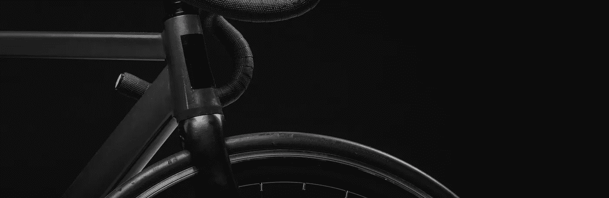
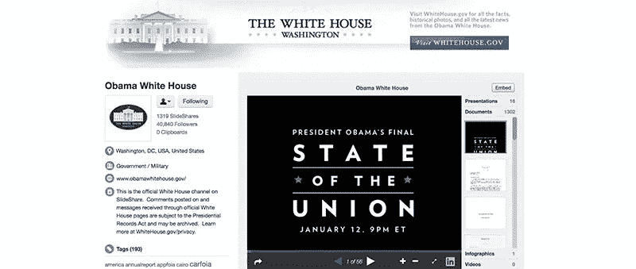
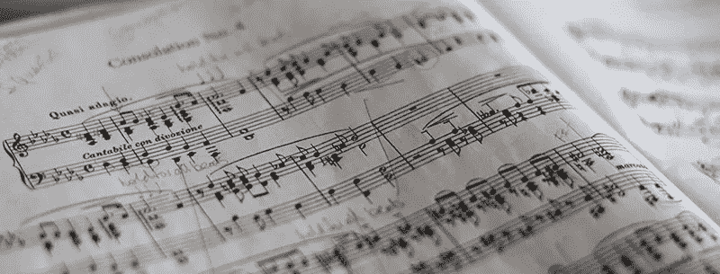
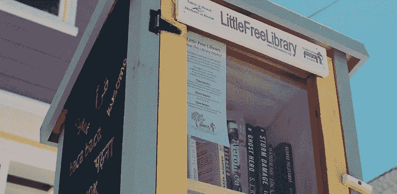
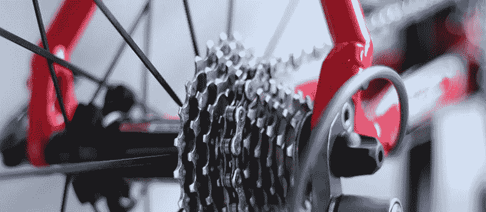
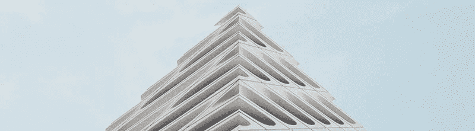

# 规模化搜索引擎优化的设计思路

> 原文：<https://medium.com/hackernoon/how-do-you-build-a-powerful-sustainable-seo-machine-c2a2b19cc1e5>

## 你如何创建一个强大的和可持续的搜索引擎优化机器

SlideShare 是一个 SEO 发电站，但是有多少人知道呢？十个用户中有九个是通过搜索引擎到达的，它仍然是世界上排名前 100 的[网站](https://moz.com/top500)，领先于易贝、*、*、必应等等。

**TL；博士:深思熟虑的、可持续的设计=杀手级 SEO**

作为 SlideShare 的首席设计师，我的重点是*所有*用户体验。

那是什么意思？这意味着不仅仅是为普通用户设计，而是为每一个用户——包括人类和机器人——将可访问性原则作为首要考虑。这意味着有视觉障碍的用户可以访问幻灯片的内容，甚至是屏幕阅读工具不能直接解释的图像。我们显示文本副本和替代文本，并以语义上有意义的方式组织所有页面上的内容。

这对人类和搜索引擎机器人都很有价值。前端质量很重要。引用 Wordpress 的一句话，“代码就是诗歌”。

# 可访问性:绝不是事后的想法

当奥巴马政府选择 SlideShare 作为白宫演示的官方媒体时，一个关键因素是符合第 508 条。SlideShare 本质上是兼容的，因为它关注可访问性原则和我们的标记标准。许多联邦机构，包括国家航空航天局和美国陆军都紧随其后。

# 相关性和参与度

SlideShare 当时的 CEO 拉什米·辛哈(Rashmi Sinha)对我的[设计](https://hackernoon.com/tagged/design)思维和我的产品思维产生了深远的影响。

为 SEO 机器提供动力的一个重要设计方面是“相关内容”。我们展示了与您正在查看的演示相关的演示文稿，并针对可发现性和参与度进行了优化。信息架构在高质量的展示之间建立了强有力的、相关的和有意义的关系。另外，我们在页面标记中以一种易于机器人访问的方式展示了这一点。

# 嵌入和分享价值

SlideShare 本着开放、协作的网络精神，让专业知识更加开放。你可以上传一个演示文稿，并将其嵌入到任何网站上。如果你愿意，任何人都可以嵌入你的演示。嵌入的代码包括一个返回到演示页面的链接，这不仅使内容可以通过脚本访问，还为搜索引擎提供了有价值的信号。随着越来越多的用户嵌入优质内容，我们产生了更多的反向链接。很简单。

Rand Fishkin 在西雅图 MozCon 2016 的主题演讲中引用了这句名言。然而，SlideShare 与众不同的一点是，这个小工具具有内在价值，不仅仅是一个 SEO 游戏。如果用户愿意，这个链接是完全可以删除的，它允许人类和机器人查看完整的演示文稿。

# 专注于你的飞轮

我们的人工编辑在 SlideShare 主页上展示了最好的内容。这有助于管理高质量的内容，鼓励用户为重视质量的生态系统做出贡献，它被设计为从该领域最高权威页面分配 SEO 权益的杠杆。

这样做的另一面是剔除任何垃圾邮件和盗版内容，规范重复内容，并为低质量内容制定无索引规则。

SEO 使我们的用户能够获得真实、切实的内容分发。这创造了商业价值，整个公司都是基于它创造的生态系统而建立的。上传者认识到了它给他们带来的价值，并创建了更好的在线演示，包括如何创建更好的演示。我们无意中影响了一种最无聊的媒体形式，使其变得有趣。不再有*死于幻灯片*。

# 信息架构

在内部，该产品的核心信息架构中有三个简单的节点。它是三位一体的，在身份、内容和主页之间有着清晰的关系。

对外，互联网上最好的网站链接到 SlideShare 上最好的内容，在高质量的节点之间创造强大的链接公平流。

引用雷德·霍夫曼，*“关系很重要”*——即使对于 SEO 也是如此。任何信息体系结构中节点之间的关系都是至关重要的。

> ***设计就是 SEO。***

照片由乔希·纳托尔、[马里乌斯·马萨拉尔](https://unsplash.com/photos/rPOmLGwai2w?utm_source=unsplash&utm_medium=referral&utm_content=creditCopyText)、[埃利奥特·佩珀](https://unsplash.com/photos/9KVEC-R8gFM?utm_source=unsplash&utm_medium=referral&utm_content=creditCopyText)、[韦恩·毕晓普](https://unsplash.com/photos/7YUW7fvIYoQ?utm_source=unsplash&utm_medium=referral&utm_content=creditCopyText)、[朱利安·莫罗](https://unsplash.com/photos/688Fna1pwOQ?utm_source=unsplash&utm_medium=referral&utm_content=creditCopyText)拍摄。