# 区块链技术是如何工作的？

> 原文：<https://medium.com/hackernoon/how-does-blockchain-technology-work-ceeeee47eaba>

第一个区块链是由一个叫中本聪的人(或一群人)在 2008 年概念化的。

它于次年 2009 年 1 月由 Nakamoto 推出，作为加密货币比特币的核心组件，作为网络上所有交易的公共账本。

通过使用区块链，比特币成为第一种无需可信机构就能解决双重支出问题的数字货币，并成为许多其他应用的灵感来源。

我相信一百年后，区块链会像今天的电一样普遍和必要。它们将是经济的基本组成部分，几乎每个人都会在日常生活中与之打交道。他们将如此正常，以至于我们会忘记他们的存在。

我们应该预计，在未来几十年，我们将看到区块链应用程序和组织的寒武纪大爆发，就像过去几十年的互联网或 20 世纪初的电气化所发生的那样。

如果这是真的，那就有必要对区块链有一个基本的了解，包括它们为什么重要以及它们是如何工作的。

# 为什么区块链很重要

> “我们应该培养思考我们正在做的事情的习惯，这是一个极其错误的真理，所有的教科书和知名人士在演讲时都重复了这一点。情况恰恰相反。文明的进步是通过增加我们无需思考就能完成的重要操作的数量。”— [阿尔弗雷德·诺斯·怀特海](https://en.wikipedia.org/wiki/Alfred_North_Whitehead)

在区块链中，每次交易发生时，比如一方直接向另一方发送比特币，交易的细节——包括来源、目的地和日期/时间戳——都会被添加到所谓的块中。

通过使用加密技术，区块链极大地提高了[的社会可扩展性](http://unenumerated.blogspot.com/2017/02/money-blockchains-and-social-scalability.html)，即人类与越来越多的其他人合作的能力，这是文明的必要特征。

历史上，人类只与一个小部落的成员交易，通常仅仅基于血缘关系，因为他们没有办法信任该群体之外的个人。

在过去的几千年里，各种各样的创新通过允许人类在更大的群体中合作，增加了社会的可扩展性。

现代法律体系降低了暴力、盗窃和欺诈的可能性，允许没有预先存在关系的各方或个人进行互动。

互联网，特别是通过评级系统，促进了很少或没有社会关系的个人之间的交易。

区块链有潜力将社会的可扩展性提高到以前的技术无法达到的水平。这是第一次，我们有办法让一个互联网用户安全可靠地向另一个互联网用户传输独一无二的数字财产，而无需依赖可信的第三方。很难夸大这是一件多么重要的事情。

想想数字合同、数字钥匙(物理锁或在线锁)，以及包括汽车、房屋、股票、债券，当然还有数字货币在内的物理资产的数字所有权。

注:关于区块链的重要性，还有很多要说的。为了不把这篇文章写得太长，我将主要关注“如何”而不是“为什么”如果你想了解更多关于为什么区块链技术如此重要的信息，请查看 [*为什么比特币和加密货币技术如此有价值？*](https://taylorpearson.me/why-is-bitcoin-valuable/)*[*【金钱】【区块链】*](https://unenumerated.blogspot.com/2017/02/money-blockchains-and-social-scalability.html)*[*给杰米·戴蒙的一封信*](https://blog.chain.com/a-letter-to-jamie-dimon-de89d417cb80)*[*超越比特币泡沫*](https://www.nytimes.com/2018/01/16/magazine/beyond-the-bitcoin-bubble.html)*[*为什么放权事关重大*](/@cdixon/why-decentralization-matters-5e3f79f7638e) *。*****

**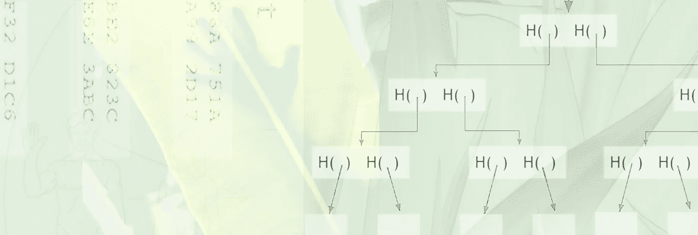**

# **Blockchan 技术是如何工作的？**

**下面是简短的行话版本:**

***区块链是一种分类账，它使用加密技术和激励机制以防篡改的方式记录交易。这允许假名方之间的信任最小化的交易，而不需要可信的中介。***

**现在，让我们把这些部分拆开，这样到文章结束时，你会觉得很有意义。**

# **基元**

**在深入研究区块链之前，我们需要建立一些基本概念。原语就像建筑材料。如果你想建一个棚子，你需要一些木头，一些螺丝钉，一个钻头和一把锯子。在开始构建之前，最好能简单了解一下它们是如何工作的。这就是我们在这里要做的。**

**区块链的构建模块是——惊奇，惊奇——[密码](https://en.wikipedia.org/wiki/Cryptography)原语。**

**密码学是研究在第三方(也就是对手)面前安全通信的技术。**

**历史上，军方进行了大量的密码研究，以确保他们能够安全地通信，而不让他们的敌人能够读取他们的电报或无线电信息。**

**现代密码术被用于每一个受欢迎的网站、信用卡芯片和计算机密码中。在所有这些情况下，它试图保持第三方(阅读:黑客，小偷等。)窃取敏感数据，如您的信用卡信息。**

**我们将开始的第一个构建块是散列函数。**

## **哈希函数**

**哈希函数是一种数学函数，可以用来加密数据。[1]**

**哈希函数有三个属性:**

*   **它的输入可以是任何大小。**

**例如，我可以使用短语“我喜欢冰淇淋”作为输入，或者我可以使用*战争与和平*的整个文本，两者都可以。**

*   ****使用任何大小的输入，它都会产生一个固定大小的输出，这是由所使用的特定哈希算法决定的。为了简单起见，我们将使用 256 位输出，因为这是第一个区块链比特币使用的。****

**无论我输入短语“我喜欢冰淇淋”作为输入，还是使用整个文本 *War and Peace* 作为输入，都会产生相同大小的输出。**

**[使用比特币使用的 SHA 256 算法](http://passwordsgenerator.net/sha256-hash-generator/)，短语“我喜欢冰淇淋”(无引号)会产生以下输出:**

**138 f 4504 a 873 c 01d 0864343 fad 3027 f 03 ca 9 bea 2 f 0109005 fa 4 fc 8 c 7 DCC 12634**

**从古腾堡计划复制的整个 [*战争与和平*](https://www.gutenberg.org/files/2600/2600-h/2600-h.htm) (全部 587，287 个单词)产生输出:**

**57027 f5b 3877 abbe 43 ACB 101d 59 e 963 BC 2c 0 e 86 a 6 ebccc 34 DFD 035 bbf 83 b 096**

**即使输入是 146，821 倍长，您也可以得到相同大小的输出。非常酷，而且，事实证明，非常有用。稍后会详细介绍。**

*   ****是高效可计算的。对于任何给定的输入字符串，您都可以在合理的时间内计算出输出。****

**即使我想使用《战争与和平》的整个文本作为我的输入，它仍然可以在合理的时间内将其转换为输出。**

**以上属性是针对一般哈希函数的。通用哈希函数允许您将大空间的内容映射到小空间，这有助于存储和处理不同类型的数据。**

**然而，我们将把重点放在加密散列函数上，因为区块链使用的就是这些函数。**

**加密哈希函数需要三个附加属性:**

1.  **耐碰撞性**
2.  **确定性隐藏**
3.  **谜题友好度**

# **加密哈希函数**

## **耐碰撞性**

**冲突是指两个不同的输入产生相同的输出。虽然输出大小相同，但输出本身不会与其他输出完全相同。“我喜欢冰淇淋”和*战争与和平*的整个文本产生的输出大小相同，但人物不同。**

**如果它们产生完全相同的输出，我把加密文本发给你，你解密它，你不会知道我是在告诉你我喜欢冰淇淋，还是告诉你应该读读*战争与和平*。**

**同样值得注意的是，两个“邻近”的输入不会产生邻近的输出。*战争与和平*的杂凑和改变了 1 个角色的战争与和平的杂凑完全不同。**

**使用 SHA256，整个 [*战争与和平*](https://www.gutenberg.org/files/2600/2600-h/2600-h.htm) 产生散列:**

**57027 f5b 3877 abbe 43 ACB 101d 59 e 963 BC 2c 0 e 86 a 6 ebccc 34 DFD 035 bbf 83 b 096**

**如果我删除最后一个句点，但其他所有内容保持不变，它会生成哈希:**

**e 2e 4 ffd 582 e 20474 f 0310 c 2132 ea E5 f 2d 766 c6a 253 C1 BC 4 af 57861095 b 30 fa**

**这非常类似于一个[混沌系统](https://taylorpearson.me/complexity-science/)中两个“邻近”的起点如何非常迅速地导致两个完全不同的未来轨迹。正是哈希函数的这种“混沌加扰”特性产生了抗冲突性。输出看起来是随机的，因此不太可能发生冲突，但是能够将无限空间映射到有限空间，这允许我们压缩数据。**

**如果你在四处寄钱，这一点尤其重要。钱包的公钥是使用加密哈希函数从私钥生成的。你不希望别人能够通过逆向工程得到你的公钥，从而破解你的私钥(因为他们可能会窃取你的所有资金)。**

**如果没有人能发现冲突，散列函数被认为是抗冲突的。理论上，我们知道它们的存在，因为输入的数量是无限的，但输出的数量是有限的——排列 64 个字符的方式就只有这么多。**

**然而实际上，加密散列函数 SHA 256 是抗碰撞的，因为没有人发现过碰撞，而发生碰撞的几率是天文数字。如果自宇宙诞生以来，人类制造的每一台计算机都在试图寻找一次碰撞，那么它发生的几率比地球在接下来的两秒钟内被一颗巨大的流星摧毁的几率还要低。**

**所以，这是可能的，但是还有很多其他更大的问题我们应该首先担心。**

## **确定性隐藏**

**散列看起来是随机的，但实际上是确定的。因此它们的输出是可重复的，所以只要你使用相同的输入，你总是得到相同的输出。这意味着知道输入的两个不同方可以通过向另一方展示他们的散列来验证另一方也知道输入。**

**我们想要的加密散列函数的第二个属性是隐藏。隐藏意味着，如果给定了输出，就没有可行的方法来找出输入是什么。**

**也就是第三方观察者没有办法知道 138 f 4504 a 873 c 01d 0864343 fad 3027 f 03 ca 9 bea 2 f 0109005 fa 4 fc 8 c 7 DCC 12634 的意思是“我喜欢冰淇淋。”**

**然而，如果我知道输入是“我喜欢冰淇淋”，那么我可以很容易地通过检查您的散列来验证您是否知道。**

**但是，如果其他人看到了这个散列，他们就不能用它来计算输入。这使得那些知道输入的人可以使用散列输出在公共信道中安全地进行通信，而不用担心第三方观察者会发现它。**

## **谜题友好度**

**我们需要的第三个特性是它们对拼图友好。这意味着，如果有人想生成一个与“我喜欢冰淇淋”输出相同的散列，那么很难找到另一个正好符合这个目标的值。**

**生成散列的算法是尝试每个可能的字符串，先按长度排序，然后按字母顺序排序，直到得到散列值相同的字符串。有一个非常大的干草堆来寻找一个非常小的针，所以我们得到的概率表明，小行星毁灭地球上的所有生命是一个更紧迫的问题。**

**另一种说法是*加密哈希函数很难逆转*。与数据结构或压缩算法中使用的散列相比，这是产生加密散列的主要原因。**

**这也是区块链军备竞赛的一部分——黑客们总是越来越擅长逆转哈希函数，所以密码学家总是不得不提出更好的哈希函数。**

**拥有这种品质是很重要的，因为区块链是一个“防篡改账本”，一个防篡改的交易记录。**

**谜题友好属性使其显而易见。如果我想替换像“我喜欢冰淇淋”这样的条目，我不可能在其他参与者不知道的情况下这样做。**

**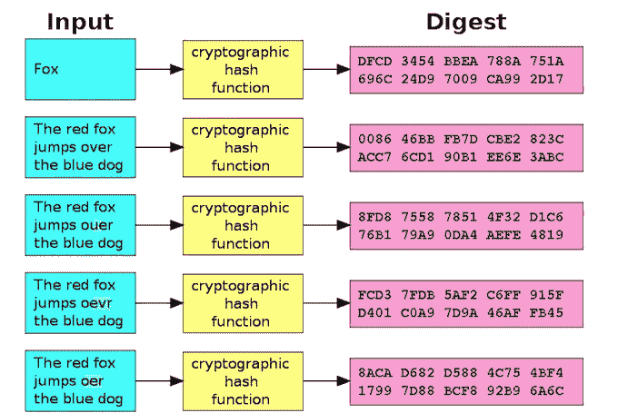**

***Using a good cryptographic hash function, even slight changes in the input will results in dramatically different outputs making the input tamper-resistant.***

**加密哈希函数看起来是随机的(因此没有冲突)，不可逆转，并隐藏输入，但同时，是完全确定的。这就是它们有用的地方！**

**这涵盖了加密哈希函数的基础知识。在下一节中，我们将看看如何使用这些散列函数来构建区块链。**

## **区块链内的可传递哈希函数**

**上面关于散列函数的前一节实际上只是对如何散列像书中的单词或密码这样的单个信息的一个大的介绍。**

**如果您想散列数据集合，比如一堆文档或一系列事务，该怎么办？**

**让我们从你可能想要连续散列的线性序列开始。你从一段数据开始，A，你散列它得到 A#。**

**现在你想“混合”B。所以你只需将 B 加到它上面(A# + B)并取整个东西的散列。现在你有了一个新的 hash (B#)，它包含了关于 A(来自你使用的 hash A#和 B)的一些信息。**

**你需要的是一个散列函数，对于它来说，改变 A 或 B 的任何东西都会导致不同的最终散列。这是一个**传递散列函数**。**

**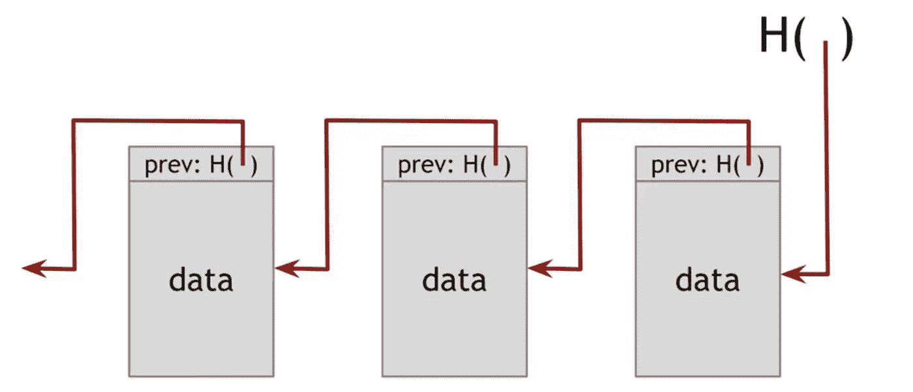**

***A blockchain is a chain of hashes.***

**当人们谈论区块链时，其中一个经常被抛出的词是“信任最小化”**

**一般的散列，特别是*散列指针*，是区块链信任最小化属性的核心组件。哈希指针就是指向其他数据结构的哈希，比如前面的块。**

**这是一件大事，因为它很容易看出是否有人篡改了数据。**

**如果我们有一个 100 块的区块链，第十个块包含整个手稿的散列到*战争与和平*，并且我改变了手稿中的一个字母，它将改变该块和所有后续块中的散列指针。[2]**

**哈希指针确保分类帐的完整性(即它没有被修改)。区块链被称为[三重分录会计](https://hackernoon.com/why-everyone-missed-the-most-important-invention-in-the-last-500-years-c90b0151c169),因为这种哈希指针数据结构是另一种更难伪造的确保分类账反映现实的方式。**

**例如，如果有两个人在一个项目上合作，其中一个人试图回去修改一些东西，这样他们可以赚更多的钱，他们的合作伙伴很快就会发现他们试图作弊——他们最终会得到一个不同的散列。**

## **Merkle 树**

**现在，如果你想散列的不仅仅是一个线性序列，而是一个集合序列，就像比特币在其区块序列中的一组交易。您需要的新东西是如何遍历每组数据的规则，将问题再次简化为加密连续的一系列内容(A#、B#等)。)**

**Merkle 树就是这样。它允许您将数据块分组，并将它们散列到一个结构中，这个结构看起来就像一个有叶子的树枝。**

**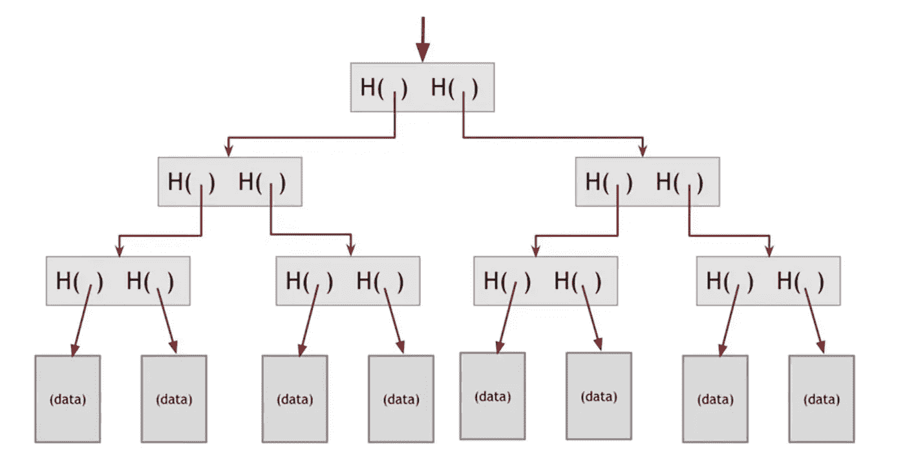**

**与区块链一样，只要我们知道树的“根”上的散列点，就可以知道树中的数据没有被篡改。**

**如果一个事务中的一个位被更改，那么它会更改每个后续散列，篡改就会暴露。**

**使用 Merkle 树比所有事务的摘要更可取，因为它允许更快更简单地测试特定事务是否包含在所有事务的集合中。**

****

**如果你在寻找更多关于区块链和商业加密货币的信息，[点击这里寻找我发现的其他一些有价值的资源](https://taylorpearson.me/blockchainoptin/)(以及未来文章的更新)**

# **区块链**

**我们从哈希函数开始。**

**然后，我们看到了如何添加三个属性:抗冲突性、确定性隐藏和谜题友好性，以使哈希函数成为加密哈希函数。**

**然后，我们看到了如何将加密哈希函数连接在一起，以创建一个可传递的加密哈希函数。**

**当我们将 Merkle 树添加到可传递的加密散列函数时，我们得到一个区块链。每个块包含一组“合并的”事务，并且这些块被链接在一起。**

**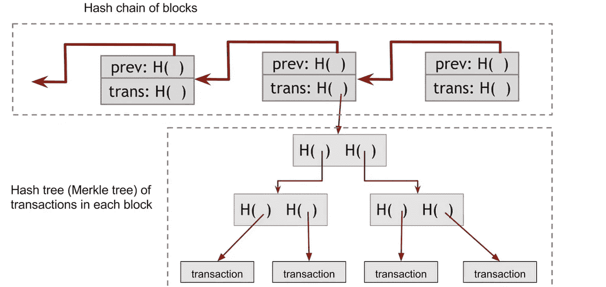**

## **工作证明区块链**

**比特币的匿名创造者 Satoshi Nakomoto 的创新是多制定了一条规则。当您将一组新的事务(也称为块)添加到现有的链中时，您必须解决一个困难且无法解决的问题。**

**这就是所谓的“矿工”所做的。他们试图解决一个非常困难的数学问题，当他们这样做时，他们会得到奖励，并将问题的难度加入到链中。这个困难的杂凑是一个“工作证明”，它证明了在试图解决这个问题时投入了多少计算能量。**

**在密码学家中，这种“工作证明区块链”的发明是中本聪最大的突破。**

**作为工作的证明，区块链像比特币一样变得更有价值，矿工赚更多的钱，这刺激更多的矿工参与网络，这增加了问题的难度。**

**任何人都可以在他们的计算机上下载区块链，并且:**

1.  **连续验证每个块在前一个块的基础上进行正确的传递散列。**

**和**

1.  **他们可以通过读取每个区块的难度并验证矿工的解决方案来计算产生该数据所需的计算总数。**

**积累的作品证明最多(即制作难度最大、成本最高)的区块链被认为是真正的区块链。**

**如果有人把今天的比特币区块链放在磁盘上交给你，你可以很快估算出构建这些数据所投入的巨大能量。**

**这样做的好处是，如果不花费同样多的计算能量，没有人能以同样的难度将比特币大小的区块链“伪造”成其块。**

**截至 2018 年年中，[将花费数十亿美元购买足够的计算机和电力](https://gobitcoin.io/tools/cost-51-attack/)来从头重写比特币区块链。**

***注意:(采矿、工作证明、利益证明和其他共识算法值得一个完全不同的职位，但我想至少在区块链的背景下提到它们。)***

# **数字签名(又名私钥/公钥加密)**

**数字签名是区块链的最终原型。一个成功的数字签名方案的工作原理或多或少与具有两个核心属性的手写签名相同。**

**首先是可核查性。如果我用我的私钥签署一个事务，其他人必须能够用我的公钥验证它。同样，只有你可以写你自己的签名，但任何人都可以看到这是你的。**

**私钥和公钥一起形成密钥对。私钥是你不与任何人分享的东西，但用来签署交易证明它是你的。**

**这有点像哈利波特人物用来在信件上贴蜡封，以证明他们发送了一封信，并且没有被篡改。你不会想和任何人分享印章，因为这样他们就可以冒充你发送信息。**

****

**公钥是你可以给每个人的东西，这样他们就可以验证这是你的签名，而不需要他们签名。这就像收件人有一幅你的印章的画，他们可以确认匹配正确，但实际上不能用它来盖章。**

**您的公钥是您的私钥的散列。你的地址，比如“你的比特币地址是什么，我可以付钱给你？”是您的公钥的散列。**

**私钥==哈希== >公钥= =哈希= = >地址**

**由于加密哈希函数的属性，这意味着你可以在任何地方公布你的地址，这样人们就可以向你发送比特币、以太坊或任何其他加密货币，而无法对其进行反向工程，以找出你的私钥。**

**第二个属性是不可伪造性。你的签名与一份特殊的文件有关。你不希望有人能够将你的签名从一份文件上“剪下”并粘贴到另一份文件的底部(就像有人说你欠他们钱！).**

**比特币使用一种称为椭圆曲线数字签名算法的数字签名方案来实现这两种属性。其他区块链和加密货币使用不同的数字签名方案，但都具有可验证性和不可伪造性这两个相同的属性。**

## **区块链就像书…**

**我发现的思考区块链的最简单的方法之一就是像一本书的书页。一本书是一系列页面，包括:**

1.  **每页上的数据(也称为文本)。**
2.  **元数据-元数据是关于自身的信息。在每页的顶部或底部，有一些关于这本书的信息，如书名、章节名和页码。**

**区块链是一串积木**

*   **数据—块的内容**
*   **元数据—关于块的数据，包括对前一个块的引用和该块中包含的数据的哈希。**

**如果你把一本书的所有页面都撕下来，你可以用页码把它们按故事的顺序放回去。**

**同样，在区块链中，每个块都引用前一个块的散列，这使得验证事务发生的顺序成为可能。如果有人把它们弄乱了，你会知道，就像你知道有人把一本书的书页弄乱了一样。**

**散列实际上比页码更好，因为它包含页面上所有数据的散列。理论上，有人可以从一本书上撕下几页，涂掉并更改页码，而你不会知道。**

**如果有人试图在我们的区块链“书”中做同样的事情，这将是显而易见的，因为改变一页上的一个字母将会改变散列。这归结为一个事实，即区块链是一个传递散列数据序列。改变过去任何地方的任何一点都会以一种混乱且容易察觉的方式改变之后的一切。**

# **区块链讲解:区块链技术的演变**

**现在，让我们来看看这些原语，并看看如何使用它们来构建一个简单的区块链。**

**这些类型的区块链是比特币和以太坊等加密货币的基础。通过理解它们是如何工作的，你将有一个理解所有不同的区块链和加密货币项目的基础。**

## **高飞硬币**

**古菲科恩是我们能想象到的最简单的区块链。**

**搞笑有三个规则。**

*   **高飞可以在任何时候创造新的硬币，这些新创造的硬币属于他。这枚硬币有一个唯一的硬币 ID，高飞用他的钥匙在上面签名，这样任何人都可以用高飞的公钥来确认这枚硬币是一枚有效的硬币。**

**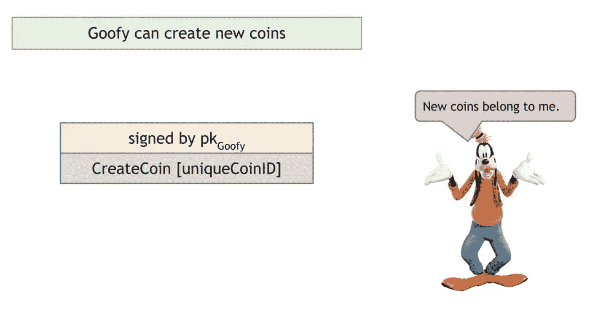**

***“signed by pkGoofy” means Goofy signed the transaction (in this case the creation of a new coin) using his public/private keypair.***

*   ****任何拥有一枚硬币的人都可以通过密码操作将它转让给其他人。**如果高飞想把一枚硬币转给爱丽丝，他创建一个交易，说“把这枚硬币付给爱丽丝”。因为硬币只能通过加密操作发送，“this”是一个指向有问题的硬币的散列指针。高飞然后用他的秘密密钥签署这个交易，使它成为一个有效的交易。任何人都可以通过确认高飞的签名来检查这是一次有效的交易。**

**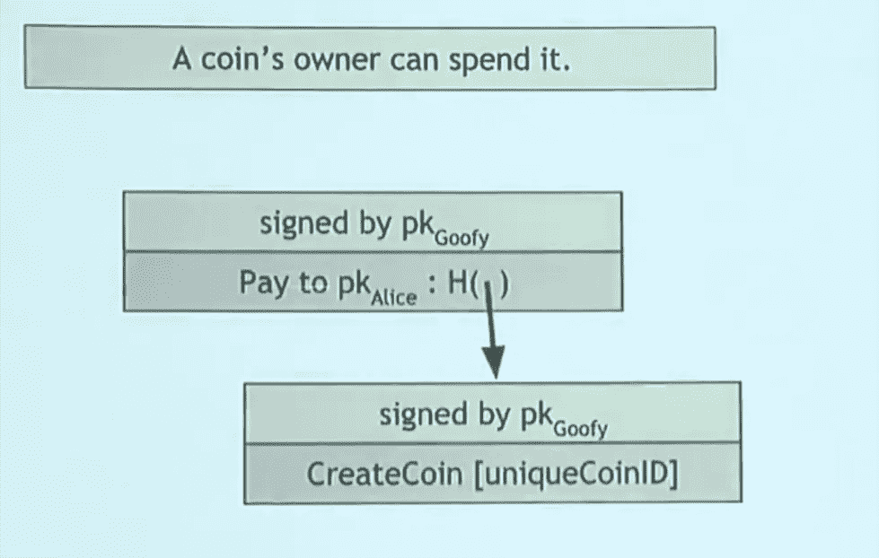**

*   ****任何人都可以通过跟随哈希指针链(区块链)追溯到高飞创造的硬币，确认所有哈希都是正确的，来验证硬币的有效性和所有者。在上面的例子中，任何人都可以证实高飞创造了一枚有效的硬币，并且他向爱丽丝进行了有效的转账。然而，GoofyCoin 有一个安全问题。让我们看一个例子。有了新的 GoofyCoin，Alice 可以签署一项交易，向 Bob 支付一份三明治。****

**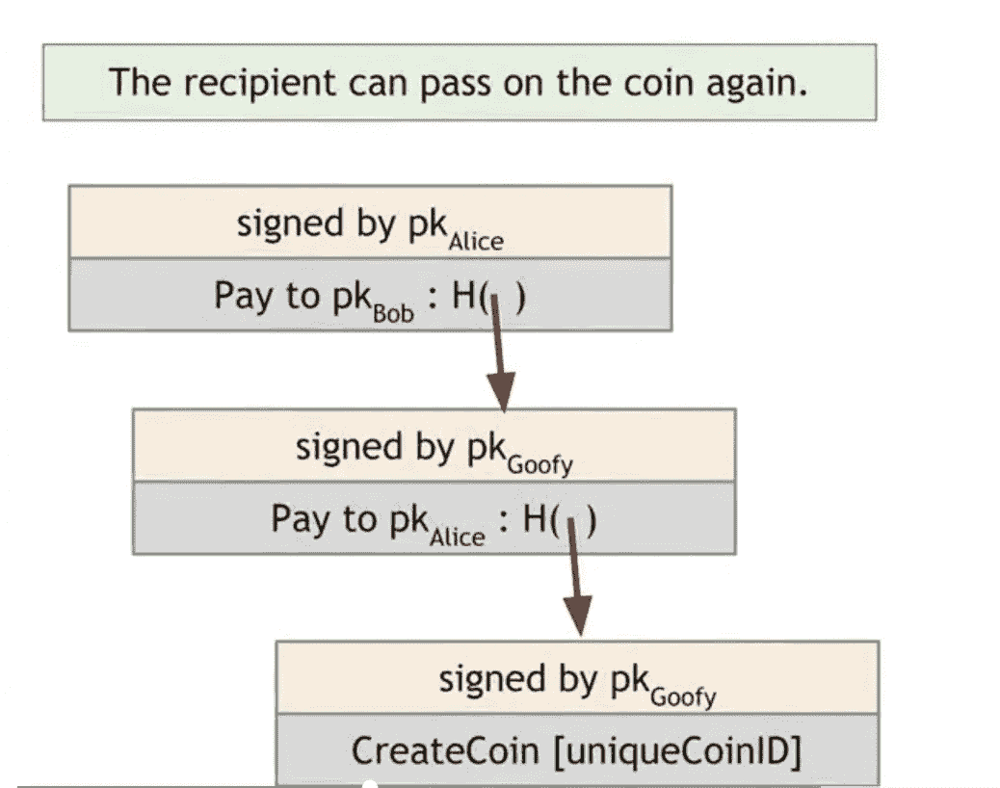**

**看起来不错吧？任何人都可以进来看到这些交易都是有效的。**

**但是，如果爱丽丝用同样的硬币给查克买奶昔呢？**

**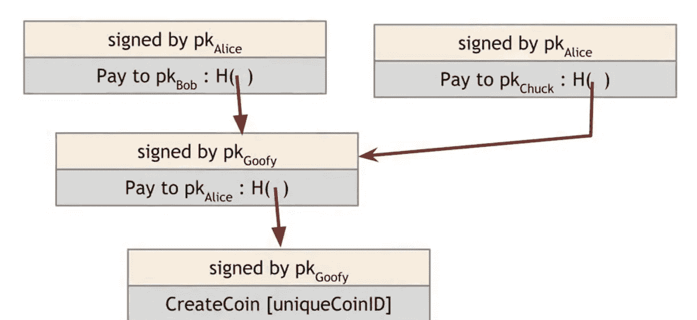**

**鲍勃和查克都认为他们现在拥有一个傻瓜蛋。这看起来像一个有效的交易，因为 Chuck 和 Bob 都可以看到 Alice 签署了它，并跟踪它回到区块链，看到高飞创建了它作为一个有效的硬币。**

**这被称为双重支出攻击。爱丽丝花了同一个硬币两次，这不是我们想要的钱的工作方式。你不能给一个人 10 美元买三明治，给另一个人 10 美元买奶昔。**

**双重消费攻击是功能加密货币要防范的主要问题之一。**

**为了解决双重消费的问题，我们需要创造一种新的硬币叫做 ScroogeCoin。**

## **ScroogeCoin**

**ScroogeCoin 的工作方式和 GoofyCoin 一样，只是做了一些不同的调整。**

**与《高飞硬币》不同的是，Scrooge 发布了一份包含所有交易历史的区块链。**

**Scrooge 将签署区块链中每个块的散列指针。然后，任何人都可以通过检查 Scrooge 在记录交易的块上的签名来验证交易是否有效。**

**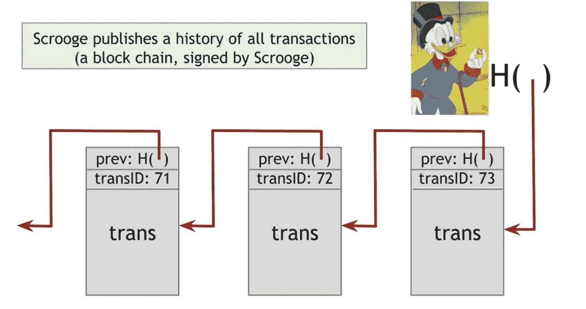**

**因为斯克罗吉正在检查每一笔交易，他可以确保没有人重复消费。如果 Alice 用一枚硬币从 Bob 那里买了一个三明治，Scrooge 将通过拒绝验证该交易来确保她不能用同一枚硬币从 Chuck 那里买奶昔。**

**因为所有的块都通过散列指针连接成一个区块链，Alice、Bob、Chuck 和其他任何使用 ScroogeCoin 的人都可以监视到 Scrooge 不会返回去更改任何数据。虽然他们不能阻止斯克罗吉这么做，因为他是控制区块链的人，但他们至少知道是他干的。**

**如果一年前，Alice 为一个三明治向 Bob 支付了 1 个 ScroogeCoin，而 Scrooge 返回并将其更改为她支付了 10 个 Scrooge coin，这将改变每个单独的后续块的散列指针，从而很容易知道 Scrooge 篡改了数据。这就是我们之前看到的适合解谜的属性。**

**这使得更容易相信数据是正确的，而不是这些只是保存在一个仅由 Scrooge 控制的大型电子表格中的记录，在该电子表格中，他可以返回并更改以前的条目之一以给自己更多的钱。[3]**

**ScroogeCoin 的工作原理是每个人都可以看到哪些硬币是有效的。而且，只要 Scrooge 监控所有的交易并拒绝重复消费的企图，就不存在重复消费的问题。所有的参与者都可以通过查看区块链来确认所有的交易都是有效的并且没有硬币被花费两次，从而确认 Scrooge 正在防止双重花费。**

**ScroogeCoin 的潜在问题是 Scrooge 本人。如果斯克罗吉想的话，他可以通过要求每一个进行交易的人向他支付一大笔交易费来使自己变得富有，或者他可以为自己创造一堆斯克罗吉硬币，或者他可以只是感到无聊并停止验证交易。**

**简而言之，问题在于集权。虽然 Scrooge 对这个系统很满意，但是用户可能不满意。这个系统与我们今天的系统没有什么不同。**

****

**你可以用“花旗银行”来代替“吝啬鬼”，这与现有银行体系的运作方式并无不同。我们相信银行或其他金融中介不会在交易上撒谎。在大多数情况下，这种方法非常有效。这些机构由联邦当局监管，并受到来自其他公司的某种程度的竞争，这鼓励他们诚实和高效。许多人，尤其是那些在发达国家生活了一辈子的人，看不到区块链有多大价值，因为现有的体系运转得相当好。**

**我们有一个法律体系，旨在起诉任何违反合同的人，企业也受到激励，通过诚实的行为来保护自己的声誉。**

**然而，在某些情况下，这种方法会失效。恶性通货膨胀，即一个国家印刷新的货币，摧毁其现有的货币供应，在历史上已经发生过多次，包括 20 世纪 30 年代的魏玛德国，21 世纪初的阿根廷和津巴布韦，以及 21 世纪初的委内瑞拉。**

**在所有这些情况下，这相当于斯克罗吉决定为自己制造更多的斯克罗吉硬币。**

**同样的场景也可能发生在其他类型的协调场景中。例如，您的公司正在与其他四家公司进行一个联合建设项目，其中一家公司试图谎报他们做了多少工作，以获得更大比例的合同。**

**这些都是分散的区块链有潜力提供帮助的情况。**

**分散的区块链意味着不是由一个政党来控制，而是由不同的政党来管理。每一方都有自己的分类账副本。由于我们上面谈到的密码特性，如果一方试图篡改分类账，所有其他方将立即清楚有人试图耍花招和欺骗。**

**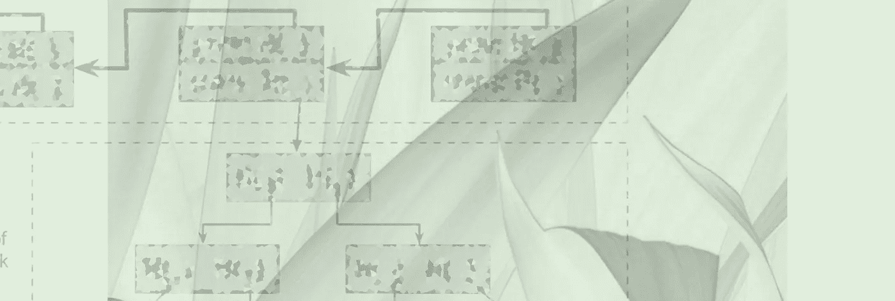**

# **区块链如何实现去中心化:公共(即无许可)与私人(即有许可)区块链**

**区块链从集中式(例如 ScroogeCoin)到分散式有两种主要方式。**

1.  **二等兵区块链(又名特许区块链)**
2.  **公共区块链(又名无许可区块链)**

**公共和私有区块链之间的区别与谁被允许加入网络有关。**

**区块链公共网络是完全开放的，任何人都可以加入和参与。比特币和以太坊就是区块链的例子。**

**私人区块链网络需要邀请。它是一个许可的网络，对谁被允许参与网络和哪些交易进行限制。私有区块链的一些例子是多链、R3 的 Corda、Hyperledger 结构和链芯。**

**谁被允许参与的区别很重要，因为它影响到如何实现分权。在我们的 ScroogeCoin 的例子中，它遇到了同样的问题，即单一的[可信的第三方](http://nakamotoinstitute.org/trusted-third-parties/)控制事情。**

**通过加密经济学和加密货币挖掘来保护公共区块链。(行话对此的解释是，他们使用经济激励、博弈论、密码学和计算机科学的组合来就账本的当前状态达成一致——这些是未来文章的主题)。**

**许可或私人区块链是一种区块链，其中共识过程(即 Scrooge 的工作)由一组预先选择的参与者(如个人、公司、财团成员)控制。例如，您可能有 15 家银行，每家银行都有权限写入分类帐，并且每家银行都必须签署每个块，以使块有效。**

**这比让一方负责验证所有交易更加分散，这有几个优点。**

## **私立区块链的优势和例子**

**公司选择使用私有区块链的主要原因是为了增加其流程的透明度和对网络中合作伙伴的信任。因为区块链的功能是防篡改日志，所以每家公司(例如一组 15 家银行)都可以相信没有人篡改过预先存在的数据。**

**与他们的公立同行相比，私立区块链也更具可扩展性。你可能听说过比特币和以太坊等公共区块链的[可扩展性](https://multicoin.capital/2018/02/23/models-scaling-trustless-computation/) [问题](https://hackernoon.com/blockchains-dont-scale-not-today-at-least-but-there-s-hope-2cb43946551a)。这是尝试扩展区块链的结果，同时在任何人都可以加入的开放环境中保持其分散性和安全性。**

**因为私有区块链发生在封闭的环境中，他们可以通过控制谁可以加入网络来防止攻击。**

**作为一个私人区块链的例子，让我们看看 Everledger，它正在与钻石行业合作，以帮助减少欺诈和改善保险。**

**因为钻石很小，所以钻石业的盗窃率很高。由于篡改文件(谎报钻石的质量或大小)和用人造钻石代替真钻石，也有许多欺诈行为。**

**所谓的“血钻”也存在道德问题，客户希望知道他们购买的是真实的、无冲突的宝石。**

**每年约有 20 亿美元因珠宝欺诈而损失，因此这是一个需要解决的重大问题。**

**Everledger 与认证钻石的认证机构合作。每颗钻石都经过四十种不同标准的测量，然后被赋予一个独特的标识符。**

**该信息随后被插入区块链，在那里它是显而易见的。[4]每次钻石被出售或转让给供应链中的另一个参与者(例如，从采矿公司到切割和抛光公司)，该项转让同样在区块链记录在案。**

**这使得最终消费者能够确切知道他们的钻石是在哪里开采的，以及供应链上接触过钻石的每一家公司。**

**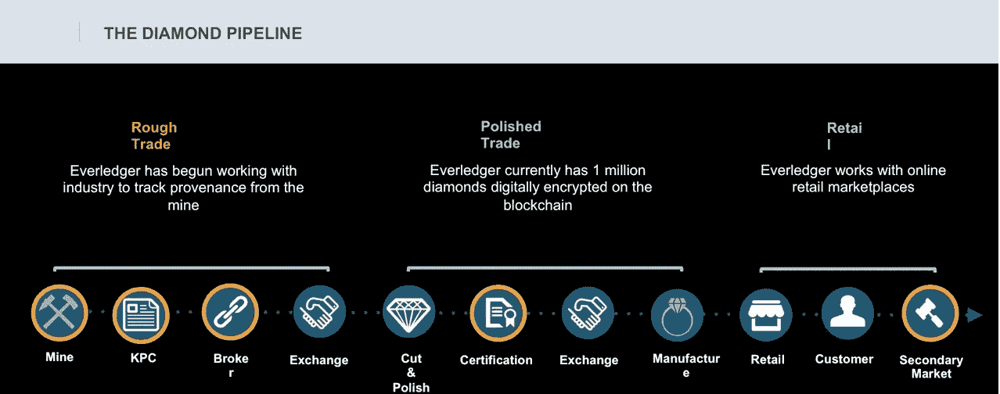**

***There can be more than a dozen different stakeholders through the life of a diamond. If you want more details, You can* [*watch Leanne explain Everledger’s business in detail*](https://www.youtube.com/watch?v=7Bnitb-HAko)*.***

**这也使得保险公司知道他们支付的是合法的索赔成为可能。**

**另一个私有区块链的例子是 Construtivo，这是一家巴西软件公司，在过去的 15 年里，它一直为大型基础设施建设项目管理项目数据。它们有助于确保所有利益相关者对项目的状态和进度有一致的看法。**

**为了满足客户对更高透明度和可审计性的需求，Construtivo 使用了一个私人区块链，每个利益相关者都保留一份自己的账本，这样每个利益相关者都可以确保没有其他公司欺骗他们。**

## **起诉二等兵区块链的案子**

**对私有区块链的一个常见批评是它们“只是共享的数据库”**

**也就是说，一个私人的区块链基本上就像有一个共享的谷歌文档电子表格，你不相信任何其他人会回去修改输入的数据。**

**私人区块链声称通过控制谁可以加入网络来保护数据，但他们仍然容易受到我们在像雅虎和 T2 的 Equifax 这样的私人公司身上看到的同样类型的网络攻击。**

**公共区块链没有这个问题，因为一切都是公开的，这意味着没有网络可以侵入。共识不是由进入网络的能力驱动的；这是由谁以不可能伪造的方式花费真实世界的能量所驱动的，这使得“入侵”区块链更加昂贵(如上面的工作证明部分所讨论的)。**

**区块链，无论是公共的还是私有的，都苦于用户需要保护他们的私钥。用户经常无法正确操作，这就是为什么个人会被黑客攻击——许多人的比特币被盗——即使系统没有被盗。**

**因此，反对私人区块链的论点是，他们依靠网络安全来限制坏人加入网络。批评者认为，这用最糟糕的部分(用户保护他们的私钥)取代了区块链安全性中最好、最新颖的部分(工作证明)。**

## **区块链的优点和例子**

**公共区块链可能是你听说得最多的，包括比特币和以太坊等网络。**

**公共区块链的最大优势之一与开放(也称为私有，也称为许可)网络相对于封闭(也称为公共，也称为无许可)网络的价值有关。**

**最简单的比较是封闭网络与 90 年代的互联网。起初，有许多公司经营封闭/许可网络，如 Compuserve 和 Prodigy。他们把电脑连接到一个中央服务器，上面有新闻和其他信息，但没有连接到更广阔的互联网。**

**这个想法对大公司更有吸引力，因为它看起来更安全。公司不会暴露在整个互联网中，但可以保留对网络内容的控制权。**

**互联网战胜了像 Compuserve 和 Prodigy 这样的封闭系统，因为有 100 多倍的开发人员在互联网上进行开发。**

**今天，世界上可能有 2000 万优秀的开发人员，而最大的公司(脸书、谷歌和亚马逊)最多雇佣几万人。这意味着世界上 99%最好的开发人员总是为别人工作。**

**最好是创造一个生态系统，让全世界最聪明的人都为你的目标而努力。如果你仅仅依靠你自己的员工，你永远不会解决所有顾客的需求。**

**公共区块链的另一个主要优势(至少在理论上)是他们更加分散，因此更加抵制审查。**

**ScroogeCoin 是你能想到的最不抵制审查的系统。如果 Scrooge 决定他不想让你使用网络，他可以这样做。**

**二等兵区块链更加抵制审查。如果你有一个私人区块链，那里有 5 个验证者，那么你需要他们中的三个来合谋撒谎，这比一个人更难。**

**如果你有一个有 5000 个验证器的公共区块链，那么他们很难串通起来。你必须贿赂、胁迫或说服 2501 名演员勾结，这比说服一个人或一小群人更具挑战性。**

**公共区块链的性质允许任何人加入到网络的安全中来，这就产生了[世界上最大的超级计算机](https://blockchain.info/charts/hash-rate?timespan=all)。**

**因为它们是上市公司，许多不同的公司都在它们的基础上制造产品，这使得[的产品更有价值。](https://taylorpearson.me/fat-thin/)**

**2017 年，以太坊区块链上推出了一波其他加密网络。这些网络不需要向以太坊团队请求在以太坊上发布的许可。他们只需要建立自己的网络，并将其连接到开放以太坊协议。**

**这使得以太坊网络的价值增加了 100 多倍。如果以太坊是一个私人区块链，每个项目都需要获得个人许可，这种创新浪潮是不可能的。**

**其中一个项目叫做 OmiseGO，它试图帮助人们汇款。对于在一个国家工作并向另一个国家的家人寄钱的人来说，目前的解决方案可能非常昂贵。**

**因为奥米塞戈知道以太坊是一个公共区块链，他们可以放心地在以太坊上投资建设，因为他们知道以太坊没有在未来关闭的风险。这与建在私人区块链上不同，在私人上更容易受到审查。**

****

**如果你在寻找更多关于区块链和商业加密货币的信息，[点击这里寻找我发现的其他一些有价值的资源](https://taylorpearson.me/blockchainoptin/)(以及未来文章的更新)**

# **结论**

**我们首先从为什么区块链如此重要开始:他们有能力让大量的个人团体相互协作。**

**然后，我们探讨了区块链原语，或加密哈希函数，它有三个重要的属性:**

1.  **抗冲突性—两个相似的文本字符串产生非常不同的输出。如果你仅仅改变《T2 战争与和平》手稿中的一个字符，你会得到截然不同的结果**
2.  **确定性隐藏——第三方观察者没有办法知道 138 f 4504 a 873 c 01d 0864343 fad 3027 f 03 ca 9 bea 2 f 0109005 fa 4 fc 8 c 7 DCC 12634 的意思是“我喜欢冰淇淋。”**
3.  **谜题友好性——如果有人想生成一个与“我喜欢冰淇淋”输出相同的哈希值，那么很难找到另一个正好符合这个目标的值。**

**然后，我们研究了如何将散列函数串成一个可传递的散列函数。当我们将 Merkle 树添加到可传递的加密散列函数时，我们得到一个区块链。每个块包含一组“合并的”事务，并且这些块被链接在一起。**

**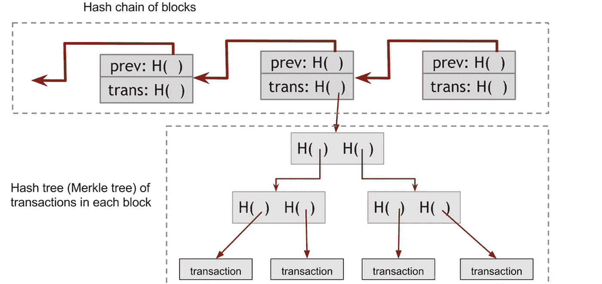**

**然后我们看到比特币如何使用一种叫做工作证明的技术来保护区块链，这种方法是不可能伪造的。**

**接下来，我们调查了 Goofycoin 和 Scroogecoin，看看区块链技术是如何随着时间的推移解决重复支出问题的**

**最后，我们看了看区块链的公共和私人是如何试图实现权力下放的。**

**区块链仍然是一项非常年轻的技术。它们从 2009 年才出现，我们应该预计在未来几十年，我们将看到不同区块链应用和网络的爆炸式增长。**

**已经有数千个不同的项目致力于修改这项技术，看看是否以及如何针对特定的用例进行改进或调整。**

**现在，您已经了解了区块链技术背后的基本原理以及区块链的工作方式。**

**下一代区块链技术中的大部分(如果不是全部的话)重大创新还没有发生。历史上再也没有比这更好的时机来开始学习和参与了。**

**如果你有兴趣了解更多，请注册我的时事通讯，我会给你发送一份我的 10 大资源列表，以了解更多关于区块链的信息，一个区块链资源工具包，以及关于我将来在区块链技术上发表文章的通知。**

***鸣谢:本文中的许多图片和观点来自 Arvind Narayanan 开发并免费提供的 Coursera 课程* [*比特币和加密货币技术*](https://www.coursera.org/learn/cryptocurrency/) *。我建议。我也阅读并推荐* [*配套教材*](https://www.amazon.com/Bitcoin-Cryptocurrency-Technologies-Comprehensive-Introduction/dp/0691171696) *。除非另有说明，所有图片也归功于他们。感谢加里·贝辛、德鲁夫·班萨尔、乔·凯利和朱沃尼·贝克福德对初稿的广泛反馈。***

## ***脚注***

***[1]另一种说法是，这只是将一个文本 A 映射到另一个文本 B 的一种方式，如果只有 B，则很难重新驱动 A，并且很少有不同的文本 C、D、E 等在通过同一函数时会生成相同的输出(产生“冲突”的可能性极小)***

***[2](因为哈希是抗冲突的——两个不同的输入实际上永远不会产生相同的输出)***

***[3]为简单起见，ScroogeCoin 中的每个块只有一个交易，但实际上你可以将多个交易放在一个块中，Scrooge 会拒绝该块中的任何双重消费尝试。***

**当你处理追踪现实世界的事件或物品而不是数字世界的事件或物品时，你必然会再次引入吝啬鬼问题。在 Everledger 的例子中，我们依赖于某个类似 Scrooge 的实体在整个过程中的每一步输入数据(这被称为 oracle 问题，您需要信任某个“oracle”来获得“链上”数据))然而，一旦数据进入链中，就变得显而易见了。)**

> ***泰勒·皮尔森是《T1[*乔布斯的终结*](http://theendofjobsbook.com/) *的作者，并在*[*Taylor Pearson . me*](http://taylorpearson.me/)*撰写了关于创业、历史、复杂性和区块链技术的文章。* [*报名接收他的热门简讯和更新*](https://taylorpearson.me/newsletter/) *。****